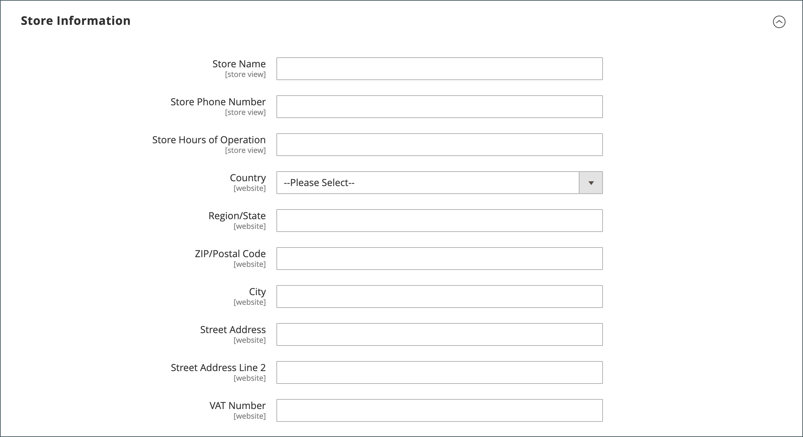
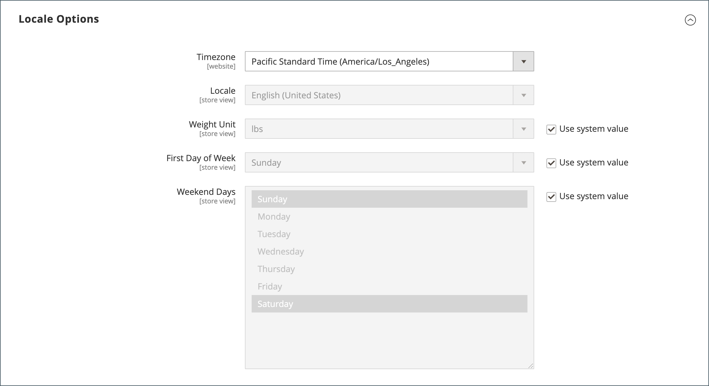
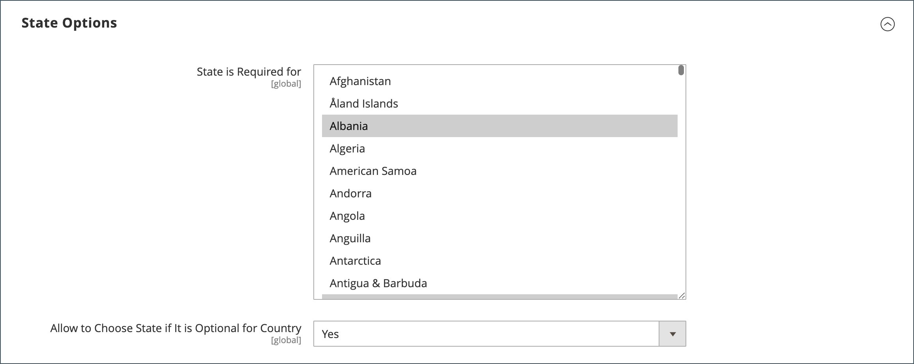
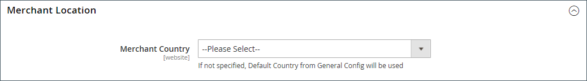
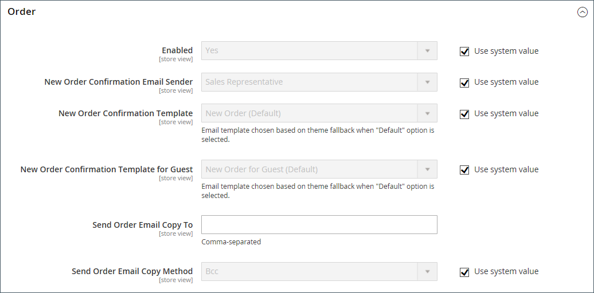
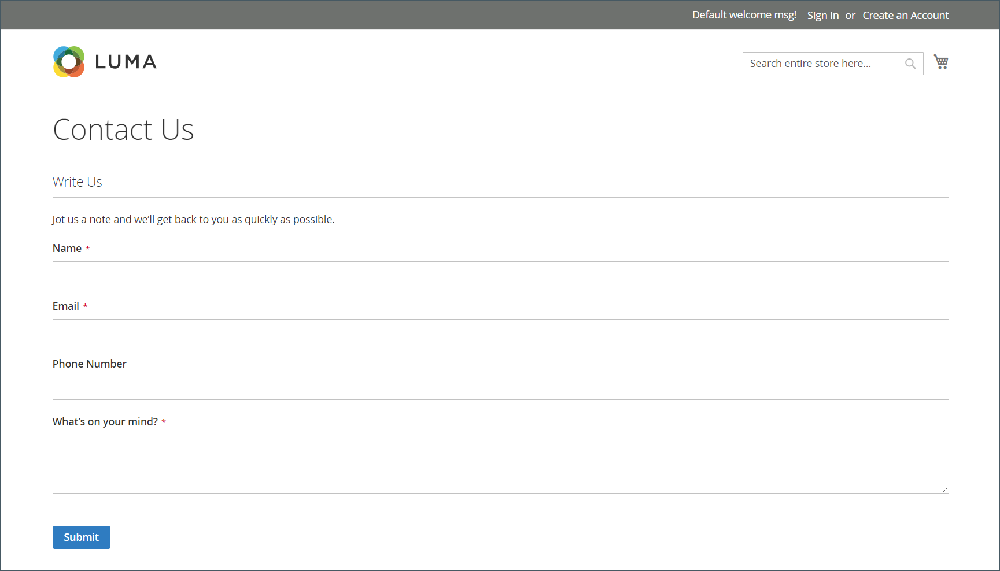
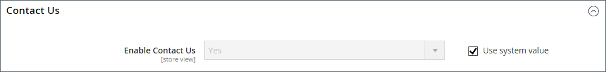
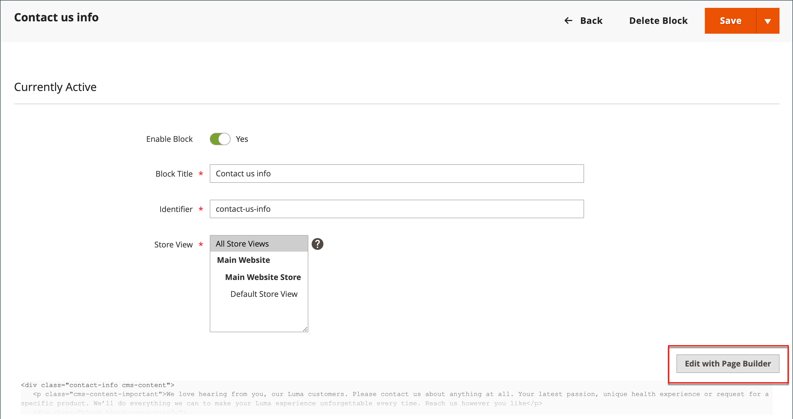

# 세부 정보 저장

매장의 기본 정보에는 매장 이름과 주소, 전화 번호 및 이메일 주소가 포함되어 있으며 이메일 메시지, 인보이스 및 고객에게 보낸 기타 통신에 표시됩니다.

{width="900" zoomable="yes"}

## [!UICONTROL Store Information]

_[!UICONTROL Store Information]_&#x200B;섹션은 판매 문서 및 기타 통신에 나타나는 기본 정보를 제공합니다.

1. _관리자_ 사이드바에서 **[!UICONTROL Stores]** > _[!UICONTROL Settings]_>**[!UICONTROL Configuration]**(으)로 이동합니다.

1. 왼쪽 탐색 패널의 **[!UICONTROL General]**&#x200B;에서 **[!UICONTROL General]**&#x200B;을(를) 선택합니다.

1. 확장 선택기&#x200B;**[!UICONTROL Store Information]**&#x200B;를 확장합니다.

   {width="700"}

1. 스토어 세부 정보에 따라 옵션을 설정합니다.

   - 모든 통신에 사용할 **[!UICONTROL Store Name]**&#x200B;을(를) 입력하십시오.

   - 표시할 형식의 **[!UICONTROL Store Phone Number]**&#x200B;을(를) 입력하십시오.

   - **[!UICONTROL Store Hours of Operation]**&#x200B;의 경우 스토어가 비즈니스를 위해 열려 있는 시간을 입력하십시오. 예: `Mon - Fri, 9-5, Sat 9-noon PST`.

   - 비즈니스가 있는 **[!UICONTROL Country]**&#x200B;을(를) 선택하십시오.

   - 국가가 있는 **[!UICONTROL Region/State]**&#x200B;을(를) 선택하십시오.

   - **[!UICONTROL Store Address]** 입력. 주소가 길면 **주소 줄 저장**&#x200B;에서 주소를 계속합니다.

   - 해당하는 경우 스토어의 **[!UICONTROL VAT Number]**&#x200B;을(를) 입력하십시오.

     번호를 확인하려면 **[!UICONTROL Validate VAT Number]** 단추를 클릭하세요. 자세한 내용은 [VAT ID 유효성 검사](../stores-purchase/vat.md#vat-id-validation)를 참조하세요.

1. 완료되면 **[!UICONTROL Save Config]**&#x200B;을(를) 클릭합니다.

저장소 정보 구성 옵션에 대한 자세한 내용은 [_구성 참조 안내서_](../configuration-reference/general/general.md#store-information)&#x200B;를 참조하십시오.

## [!UICONTROL Locale Options]

로케일은 저장소 전체에서 사용되는 여러 설정을 결정합니다. 그 중 일부는 다음과 같습니다.

- 언어
- 국가
- 세율
- 통화
- 가격
- 숫자 형식

로케일 설정은 각 스토어에 사용되는 시간대와 언어를 결정하고 해당 영역의 작업 요일 을 식별합니다.

1. _관리자_ 사이드바에서 **[!UICONTROL Stores]** > _[!UICONTROL Settings]_>**[!UICONTROL Configuration]**(으)로 이동합니다.

1. **[!UICONTROL General]** 아래의 왼쪽 탐색 패널에서 **[!UICONTROL General]**&#x200B;을(를) 선택합니다.

1. 확장 선택기&#x200B;**[!UICONTROL Locale Options]**&#x200B;를 확장합니다.

   {width="700"}

1. 목록에서 **[!UICONTROL Timezone]**&#x200B;을(를) 선택합니다.

1. **[!UICONTROL Locale]**&#x200B;을(를) 스토어 언어로 설정합니다.

1. 일반적으로 로케일에서 발송하는 데 사용되는 측정 단위로 **[!UICONTROL Weight Unit]**&#x200B;을(를) 설정하십시오.

1. **[!UICONTROL First Day of the Week]**&#x200B;을(를) 영역에 있는 주의 첫 번째 날로 간주되는 날로 설정합니다.

1. **[!UICONTROL Weekend Days]** 목록에서 해당 지역의 주말 날짜를 선택합니다.

   여러 날을 선택하려면 Ctrl 키(PC) 또는 Command 키(Mac)를 누른 채 각 항목을 클릭합니다.

1. 완료되면 **[!UICONTROL Save Config]**&#x200B;을(를) 클릭합니다.

로케일 구성 옵션에 대한 자세한 내용은 [구성 참조 안내서](../configuration-reference/general/general.md#locale-options)를 참조하십시오.

## [!UICONTROL State Options]

많은 국가에서 주, 시/도 또는 지역은 우편 주소의 필수 부분입니다. 이 정보는 배송 및 청구 정보, 세율 계산 등에 사용됩니다. 주가 필요하지 않은 국가의 경우, 필드에서 완전히 주소에서 생략하거나 선택 필드로 포함할 수 있습니다.

표준 주소 포맷은 국가마다 다르기 때문에 송장, 포장 명세서 및 운송 라벨에 대한 주소 포맷을 지정하는 데 사용되는 템플리트를 편집할 수도 있습니다.

1. _관리자_ 사이드바에서 **[!UICONTROL Stores]** > _[!UICONTROL Settings]_>**[!UICONTROL Configuration]**(으)로 이동합니다.

1. 왼쪽 탐색 패널의 **[!UICONTROL General]**&#x200B;에서 **[!UICONTROL General]**&#x200B;을(를) 선택합니다.

1. 확장 선택기&#x200B;**[!UICONTROL State Options]**&#x200B;를 확장합니다.

   {width="700"}

1. **[!UICONTROL State is required for]** 목록을 사용하여 지역/주가 필수 항목인 각 국가를 선택하십시오.

1. **[!UICONTROL Allow to Choose State if it is Optional for Country]**&#x200B;을(를) 다음 중 하나로 설정합니다.

   `Yes` - 상태 필드가 필요하지 않은 국가에서는 상태 필드를 선택적 항목으로 포함합니다.

   `No` - 상태 필드가 필요하지 않은 국가에서는 상태 필드를 생략합니다.

1. 완료되면 **[!UICONTROL Save Config]**&#x200B;을(를) 클릭합니다.

상태 구성 옵션에 대한 자세한 내용은 [구성 참조 안내서](../configuration-reference/general/general.md#state-options)를 참조하십시오.

## [!UICONTROL Country Options]

국가 옵션은 비즈니스가 위치한 국가와 지불을 수락하는 국가를 식별합니다.

### 스토어의 국가 옵션을 설정합니다.

1. _관리자_ 사이드바에서 **[!UICONTROL Stores]** > _[!UICONTROL Settings]_>**[!UICONTROL Configuration]**(으)로 이동합니다.

1. **[!UICONTROL General]** 아래의 왼쪽 탐색 패널에서 **[!UICONTROL General]**&#x200B;을(를) 선택합니다.

1. 확장 선택기&#x200B;**[!UICONTROL Country Options]**&#x200B;를 확장합니다.

   >[!NOTE]
   >
   >필요한 경우 변경할 각 설정에 대해 **[!UICONTROL Use system value]** 확인란의 선택을 취소합니다.

   {width="700"}

1. 비즈니스가 있는 **[!UICONTROL Default Country]**&#x200B;을(를) 선택하십시오.

1. **[!UICONTROL Allow Countries]** 목록에서 주문을 수락할 각 국가를 선택합니다.

   기본적으로 목록에 있는 모든 국가가 선택됩니다. 여러 국가를 선택하려면 Ctrl 키(PC) 또는 Command 키(Mac)를 누른 채 각 항목을 클릭합니다.

1. **[!UICONTROL Zip/Postal Code is Optional for]** 목록을 사용하여 우편 번호를 거리 주소의 일부로 포함할 필요가 없는 비즈니스를 수행하는 각 국가를 선택하십시오.

1. **[!UICONTROL European Union Countries]** 목록에서 비즈니스를 수행하는 EU의 각 국가를 선택합니다.

   기본적으로 모든 EU 국가가 선택됩니다. 필요한 국가를 선택하려면 Ctrl 키(PC) 또는 Command 키(Mac)를 누른 채 각 항목을 클릭합니다.

1. **[!UICONTROL Top Destinations]** 목록에서 판매를 대상으로 하는 기본 국가를 선택합니다.

1. 완료되면 **[!UICONTROL Save Config]**&#x200B;을(를) 클릭합니다.

### 특정 게재 방법에 대한 국가 옵션 설정

사용 가능한 각 [배달 방법](../stores-purchase/delivery.md)(UPS, FedEx 등)에 대해 특정 국가로의 배달을 구성할 수도 있습니다.

1. _관리자_ 사이드바에서 **[!UICONTROL Stores]** > _[!UICONTROL Settings]_>**[!UICONTROL Configuration]**(으)로 이동합니다.

1. 왼쪽 탐색 패널에서 **[!UICONTROL Sales]**&#x200B;을(를) 확장하고 **[!UICONTROL Delivery Methods]**&#x200B;을(를) 선택합니다.

1. 특정 국가를 적용할 운송 회사를 선택합니다.

1. **[!UICONTROL Ship to Applicable Countries]**&#x200B;의 경우 **[!UICONTROL Use system value]** 확인란을 선택 취소하고 **[!UICONTROL Specific Countries]** 옵션을 선택하십시오.

1. **[!UICONTROL Top Destinations]** 목록에서 배송을 대상으로 하는 기본 국가를 선택합니다.

   {width="700"}

1. 완료되면 **[!UICONTROL Save Config]**&#x200B;을(를) 클릭합니다.

### 리소스 문제 해결

국가 구성 문제를 해결하는 데 대한 도움말을 보려면 다음 [!DNL Commerce] 지원 기술 문서를 참조하십시오.

- [국가를 추가하는 방법](https://experienceleague.adobe.com/docs/commerce-knowledge-base/kb/how-to/how-to-add-a-new-country-to-magento-2.html)

## [!UICONTROL Merchant Location]

[!BADGE PaaS만]{type=Informative url="https://experienceleague.adobe.com/en/docs/commerce/user-guides/product-solutions" tooltip="Adobe Commerce 온 클라우드 프로젝트(Adobe 관리 PaaS 인프라) 및 온프레미스 프로젝트에만 적용됩니다."}

판매자 위치 설정은 [결제 방법](../stores-purchase/payments.md)을 구성하는 데 사용됩니다. 이 설정에 대한 값이 없으면 [기본 국가](#uicontrol-country-options) 설정이 사용됩니다.

1. _관리자_ 사이드바에서 **[!UICONTROL Stores]** > _[!UICONTROL Settings]_>**[!UICONTROL Configuration]**(으)로 이동합니다.

1. 왼쪽 탐색 패널에서 **[!UICONTROL Sales]**&#x200B;을(를) 확장하고 **[!UICONTROL Payment Methods]**&#x200B;을(를) 선택합니다.

1.  섹션에서 **확장 선택기**&#x200B;를 확장하고 **[!UICONTROL Merchant Country]**&#x200B;을(를) 선택합니다.

   {width="600"}

1. 완료되면 **[!UICONTROL Save Config]**&#x200B;을(를) 클릭합니다.

결제 방법 구성 옵션에 대한 자세한 내용은 [구성 참조 안내서](../configuration-reference/sales/payment-methods.md)를 참조하십시오.

## 통화

통화 설정 - 기본 [통화](../stores-purchase/currency-configuration.md) 및 지불로 허용되는 추가 통화를 정의합니다. 또한 통화 환율을 자동으로 업데이트하는 데 사용되는 가져오기 연결 및 일정을 설정합니다.

통화 기호 - 제품 가격 및 판매 문서(예: 주문 및 송장)에 표시되는 [통화 기호](../stores-purchase/currency-configuration.md#step-5-customize-currency-symbols-optional)를 정의합니다. [!DNL Commerce]은(는) 전 세계 200여 개국의 통화를 지원합니다.

환율 업데이트 - 환율은 수동으로 [업데이트](../stores-purchase/currency-update.md)하거나 필요에 따라 또는 사전 정의된 일정에 따라 스토어로 가져올 수 있습니다.

통화 선택기 - 여러 통화를 사용할 수 있는 경우 [통화 선택기](../stores-purchase/currency.md)를 상점의 헤더에서 사용할 수 있습니다.

## [!UICONTROL Store Email Addresses]

각 스토어 또는 보기에 대해 서로 다른 기능 또는 부서를 나타내는 최대 5개의 서로 다른 이메일 주소를 가질 수 있습니다. 사전 정의된 다음의 이메일 ID 외에도 필요에 따라 설정할 수 있는 몇 가지 사용자 정의 ID가 있습니다.

- 일반 연락처
- 영업 담당자
- 고객 지원

각 ID 및 관련 이메일 주소는 특정 자동 이메일 메시지와 연결될 수 있으며 스토어에서 보낸 이메일 메시지의 발신자로 표시됩니다.

### 1단계: 도메인에 대한 이메일 주소 설정

스토어에 대한 이메일 주소를 구성하려면 먼저 각 주소를 도메인에 대한 유효한 이메일 주소로 설정해야 합니다. 필요한 각 이메일 주소를 만들려면 서버 관리자 또는 이메일 호스팅 공급자의 지침을 따르십시오.

### 2단계: 생성된 링크에 대한 기본 URL 설정

[!BADGE SaaS만]{type=Positive url="https://experienceleague.adobe.com/en/docs/commerce/user-guides/product-solutions" tooltip="Adobe Commerce as a Cloud Service 프로젝트에만 적용됩니다(Adobe 관리 SaaS 인프라)."}

일부 고객 응대 이메일에는 고객이 암호를 재설정하는 데 도움이 되는 링크 등 스토어에 대한 링크가 포함되어 있습니다. Storefront 링크가 작동하도록 하려면 storefront의 기본 URL을 정의해야 합니다.

1. _관리자_ 사이드바에서 **[!UICONTROL Stores]** > _[!UICONTROL Settings]_>**[!UICONTROL Configuration]**(으)로 이동합니다.

1. 왼쪽 탐색 패널의 **[!UICONTROL General]**&#x200B;에서 **[!UICONTROL Store Email Addresses]**&#x200B;을(를) 선택합니다.

1. **[!UICONTROL Storefront Base URL]** 필드 **[!UICONTROL General]** 섹션에서 저장소의 루트 URL(예: `https://www.example.com/`)을 입력하십시오. URL은 슬래시로 끝나야 합니다.

   {width="600"}

### 3단계: 스토어의 이메일 주소 구성

인스턴스가 프로비저닝될 때 [!BADGE SaaS만]{type=Positive url="https://experienceleague.adobe.com/en/docs/commerce/user-guides/product-solutions" tooltip="Adobe Commerce as a Cloud Service 및 Adobe Commerce Optimizer 프로젝트에만 적용됩니다(Adobe 관리 SaaS 인프라)."}개의 보낸 사람 전자 메일 주소가 구성됩니다. 이러한 주소를 변경해야 하는 경우 지원 티켓을 만드십시오.

1. _관리자_ 사이드바에서 **[!UICONTROL Stores]** > _[!UICONTROL Settings]_>**[!UICONTROL Configuration]**(으)로 이동합니다.

1. 왼쪽 탐색 패널의 **[!UICONTROL General]**&#x200B;에서 **[!UICONTROL Store Email Addresses]**&#x200B;을(를) 선택합니다.

1. 확장 선택기&#x200B;**[!UICONTROL General Contact]**&#x200B;를 확장하고 다음을 수행합니다.

   {width="600"}

   - **[!UICONTROL Sender Name]**&#x200B;의 경우 일반 연락처 ID와 연결된 사람의 이름을 입력하여 전자 메일 메시지를 보낸 사람으로 표시하십시오.

   - **[!UICONTROL Sender Email]**&#x200B;의 경우 연결된 전자 메일 주소를 입력하십시오.

1. 사용할 각 저장소 이메일 주소에 대해 이 프로세스를 반복합니다.

1. 완료되면 **[!UICONTROL Save Config]**&#x200B;을(를) 클릭합니다.

### 4단계: 판매 이메일 구성 업데이트

사용자 정의 이메일 주소를 사용하는 경우 올바른 ID가 발신자로 표시되도록 관련 이메일 메시지의 구성을 업데이트해야 합니다.

1. 왼쪽 탐색 패널에서 **[!UICONTROL Sales]**&#x200B;을(를) 확장하고 **[!UICONTROL Sales Emails]**&#x200B;을(를) 선택합니다.

   페이지에는 다음 각 항목에 대한 별도의 섹션이 있습니다.

   - 주문 및 주문 주석
   - 송장 및 송장 주석
   - 선적 및 선적 주석
   - 대변 메모 및 대변 메모 주석
   - RMA, RMA 인증, RMA 관리자 댓글 및 RMA 고객 댓글 (Adobe Commerce만 해당)

1. **[!UICONTROL Order]**&#x200B;부터 각 메시지의 섹션을 확장하고 올바른 보낸 사람을 선택했는지 확인하십시오.

   {width="600"}

1. 완료되면 **[!UICONTROL Save Config]**&#x200B;을(를) 클릭합니다.

판매 전자 메일 구성 옵션에 대한 자세한 내용은 [_구성 참조 안내서_](../configuration-reference/sales/sales-emails.md)&#x200B;를 참조하십시오.

## 연락처 양식

매장 바닥글에 있는 _연락처_ 링크를 사용하면 고객이 쉽게 연락할 수 있습니다. 고객은 양식을 작성하여 스토어에 메시지를 보낼 수 있습니다. 표준 [!DNL Commerce] 설치 시 기본 _연락처_ 양식이 표시됩니다. 양식을 제출하면 감사 메시지가 나타납니다

기본 연락처 양식이 CMS 페이지가 아닌 코드에서 직접 렌더링된다는 것을 이해하는 것이 중요합니다.

{width="700"}

스토어 바닥글에는 스토어 전체에서 사용할 수 있는 연락처 페이지에 대한 링크가 포함되어 있습니다.

{width="700"}

Luma 샘플 데이터에는 스토어에 대해 페이지를 사용자 지정하는 방법을 보여 주는 연락처 페이지에 대한 추가 정보가 포함되어 있습니다.

{width="700"}

### 연락처 양식 구성

1. _관리자_ 사이드바에서 **[!UICONTROL Stores]** > _[!UICONTROL Settings]_>**[!UICONTROL Configuration]**(으)로 이동합니다.

1. **[!UICONTROL General]** 아래의 왼쪽 탐색 패널에서 **[!UICONTROL Contacts]**&#x200B;을(를) 선택합니다.

1. 확장 선택기&#x200B;**[!UICONTROL Contact Us]**&#x200B;을(를) 확장하고 **[!UICONTROL Enable Contact Us]**&#x200B;을(를) `Yes`(으)로 설정합니다.

   {width="600"}

1. 확장 선택기&#x200B;**[!UICONTROL Email Options]**&#x200B;를 확장하고 전자 메일 연락처 옵션을 설정합니다.

   {width="600"}

   - **[!UICONTROL Send Emails to]**&#x200B;의 경우 연락처 양식에서 보낸 메시지를 받을 전자 메일 주소를 입력하십시오.

   - **[!UICONTROL Email Sender]**&#x200B;을(를) 연락처 양식에서 메시지를 보낸 사람으로 표시되는 스토어 ID로 설정합니다. 예: 사용자 정의 이메일 2.

   - **[!UICONTROL Email Template]**&#x200B;을(를) 연락처 양식에서 보낸 메시지에 사용하는 템플릿으로 설정하십시오.

1. 경쟁할 때는 **[!UICONTROL Save Config]**&#x200B;을(를) 클릭합니다.

### 콘텐츠 사용자 정의

상점 및 고객 서비스 정책에 맞게 _연락처_ 양식의 콘텐츠를 사용자 지정할 수 있습니다.

### 방법 1: 샘플 데이터 사용

Luma 샘플 데이터에는 스토어에 대해 사용자 지정할 수 있는 _연락처 정보_ 블록이 포함되어 있습니다. `contact-us-info` [블록](../content-design/blocks.md)을(를) 쉽게 수정하여 연락처 페이지에 자신의 콘텐츠를 추가할 수 있습니다.

1. _관리자_ 사이드바에서 **[!UICONTROL Content]** > _[!UICONTROL Elements]_>**[!UICONTROL Blocks]**(으)로 이동합니다.

1. 목록에서 **[!UICONTROL Contact Us Info]** 블록을 찾아 **[!UICONTROL Edit]** 모드로 엽니다.

   {width="700"}

1. 블록 페이지 하단에서 **[!UICONTROL Edit with Page Builder]**&#x200B;을(를) 클릭합니다.

   {width="700"}

   >[!NOTE]
   >
   >[[!DNL Page Builder] 사용 안 함](../page-builder/setup.md#disable-dnl-page-builder)이 있는 경우 편집기 [도구 모음](../content-design/editor.md)을 사용하여 텍스트 서식을 지정하고 [이미지](../content-design/editor-insert-image.md) 및 [링크](../content-design/editor-insert-link.md)를 추가할 수 있습니다.

1. 도구 상자를 표시하고 _설정_(  ) 아이콘을 선택하려면 HTML 컨테이너 위로 마우스를 가져갑니다.

1. 스토어에 대한 연락처 정보를 제공하는 대로 HTML 코드를 편집하고 **[!UICONTROL Save]**&#x200B;을(를) 클릭합니다.

   {width="700"}

1. [!DNL Page Builder] 단계를 종료하고 **[!UICONTROL Save Block]**&#x200B;을(를) 클릭합니다.

### 방법 2: 샘플 데이터 없음

>[!IMPORTANT]
>
>2.4.0 릴리스부터 연락처 양식은 더 이상 CMS 블록 또는 CMS 페이지 내에서 호출할 수 없습니다. 연락처 양식의 모든 사용자 지정은 레이아웃 xml 또는 사용자 지정 테마 템플릿을 사용하여 수행해야 합니다.

기본적으로 쇼핑객은 상점 첫 페이지의 바닥글에 있는 _연락처 링크_&#x200B;를 사용하여 연락처 양식에 액세스합니다. 연락처 페이지 사용자 지정에 대한 자세한 내용은 [프론트엔드 개발자 안내서](https://developer.adobe.com/commerce/frontend-core/guide/themes/)를 참조하세요.
