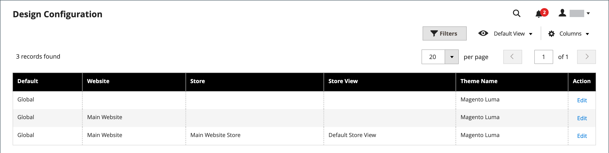
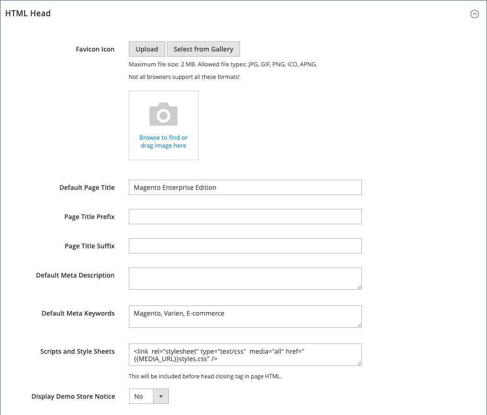
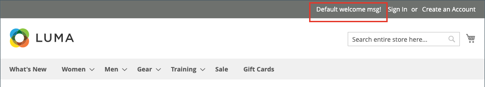

# 상점 첫 브랜딩

가장 먼저 하고 싶은 일 중 하나는 [로고 변경](#upload-your-logo) 헤더 및 [favicon 업로드](#add-a-favicon) 브라우저용입니다. 다음으로, 다음을 수행합니다. [환영 메시지 추가](#change-the-welcome-message) 및 [저작권 공지 업데이트](#change-the-copyright-notice) 바닥글에서. 이러한 작업은 즉시 처리할 수 있는 몇 가지 간단한 디자인 요소입니다. 스토어가 개발 중인 동안 다음을 수행할 수 있습니다. [스토어 데모 알림 켜기](#set-the-store-demo-notice)를 클릭한 다음 시작할 준비가 되면 제거합니다.

{width="600" zoomable="yes"}

## 로고 업로드

머리글에서 로고의 크기와 위치는 스토어 테마에 의해 결정됩니다. 로고는 GIF, PNG 또는 JPG(JPEG) 파일 형식으로 저장하고 스토어 관리자로부터 업로드할 수 있습니다.

{width="600"}

로고 이미지가 서버의 다음 위치에 있습니다. 이름이 인 모든 이미지 파일 `logo.svg` 는 기본 테마 로고로 사용됩니다.

전체 경로 - `app/design/frontend/[vendor]/[theme]/web/images/logo.svg`

상대 경로 -  `images/logo.svg`

로고나 테마에 사용된 다른 이미지의 크기를 모를 경우 브라우저에서 페이지를 열고 이미지를 마우스 오른쪽 단추로 클릭한 다음 요소를 검사합니다.

>[!NOTE]
>
>머리글에 있는 로고 외에도 로고가 [이메일 템플릿](../systems/email-templates.md#prepare-your-email-logo) 및 [PDF 송장](../stores-purchase/sales-documents.md) 및 기타 판매 문서. 이메일 템플릿과 송장에 사용되는 로고는 크기 요구 사항이 다르므로 별도로 업로드해야 합니다.

지원되는 로고 파일 형식:

| 파일 형식 | 설명 |
|--- |--- |
| PNG | (Portable Network Graphics) GIF 형식에 대한 이 새로운 대안은 최대 1,600만 색상(24비트)을 지원합니다. 무손실 압축 형식은 텍스트가 선명하지만 일부 형식보다 파일 크기가 큰 고품질 비트맵 이미지를 생성합니다. PNG 형식은 투명 레이어를 지원하며 온라인 보기 및 스트리밍을 위해 설계되었습니다. |
| GIF | (Graphics Interchange Format) 256색(8비트)으로 제한된 널리 지원되는 이전 비트맵 형식입니다. GIF 형식은 간단한 애니메이션 및 투명 레이어를 지원합니다. |
| JPG(JPEG) | (Joint Photographic Expert Group) 대부분의 디지털 카메라에서 사용하는 압축된 비트맵 형식입니다. 손실 압축은 일부 데이터 손실을 발생시키며, 이는 때때로 텍스트의 흐릿한 점으로 두드러집니다. |

{style="table-layout:auto"}

1. 다음에서 _관리자_ 사이드바, 이동 **[!UICONTROL Content]** > _[!UICONTROL Design]_>**[!UICONTROL Configuration]**.

   {width="700"}

1. 구성할 스토어 보기를 찾아 다음을 클릭합니다. **[!UICONTROL Edit]** 다음에서 _[!UICONTROL Action]_열.

1. 확장  다음 **[!UICONTROL Header]** 섹션.

   {width="600"}

1. 새 로고를 업로드하려면 **[!UICONTROL Upload]** 시스템에서 파일을 선택합니다.

1. 다음을 입력합니다. **[!UICONTROL Logo Image Width]** 및 **[!UICONTROL Logo Image Height]** 픽셀 단위.

1. 대상 **[!UICONTROL Logo Image Alt]**&#x200B;이미지를 마우스로 가리킬 때 표시할 텍스트를 입력합니다.

1. 완료되면 다음을 클릭하십시오. **[!UICONTROL Save Configuration]**.

## favicon 추가

_파비콘_ 다음에 대해 짧음 _즐겨찾기 아이콘_ 각 브라우저 페이지의 탭에 있는 작은 아이콘을 나타냅니다. 브라우저에 따라 파비콘이 URL 바로 앞의 주소 표시줄에도 표시됩니다.

파비콘은 일반적으로 크기가 16 x 16픽셀 또는 32 x 32픽셀입니다. [!DNL Commerce] 모든 브라우저가 이러한 형식을 지원하는 것은 아니지만 ICO, PNG, APNG, GIF 및 JPG(JPEG) 파일 형식을 허용합니다. 파비콘에 사용할 수 있는 가장 널리 지원되는 파일 형식은 ICO입니다. 다른 이미지 파일 형식을 사용할 수는 있지만 모든 브라우저에서 지원되지 않는 형식일 수 있습니다. 온라인에는 ICO 이미지를 생성하거나 이미지를 해당 형식으로 변환하는 데 사용할 수 있는 많은 무료 도구가 있습니다.

{width="600"}

[!DNL Commerce] 는 favicon으로 다음 파일 형식을 지원합니다.

| 파일 형식 | 설명 |
|--- |--- |
| ICO | 이 이미지 파일 형식은 작은 크기의 컴퓨터 아이콘 이미지를 위해 설계되었습니다. Microsoft® Windows OS에서 주로 사용되는 ICO 포맷은 최대 256 x 256 픽셀 및 8비트 투명도의 1,600만 색상 (24비트)의 이미지를 포함할 수 있습니다. |
| PNG | (Portable Network Graphics) GIF 형식에 대한 이 새로운 대안은 최대 1,600만 색상(24비트)을 지원합니다. 무손실 압축 형식은 텍스트가 선명하지만 일부 형식보다 파일 크기가 큰 고품질 비트맵 이미지를 생성합니다. PNG 형식은 투명 레이어를 지원하며 온라인 보기 및 스트리밍을 위해 설계되었습니다. |
| APNG | (Animated Portable Network Graphics) 단순 애니메이션을 지원하는 PNG와 유사한 파일 형식입니다. |
| GIF | (Graphics Interchange Format) 256색(8비트)으로 제한된 널리 지원되는 이전 비트맵 형식입니다. GIF 형식은 간단한 애니메이션 및 투명 레이어를 지원합니다. |
| JPG(JPEG) | (Joint Photographic Expert Group) 대부분의 디지털 카메라에서 사용하는 압축된 비트맵 형식입니다. 손실 압축은 일부 데이터 손실을 발생시키며, 이는 때때로 텍스트의 흐릿한 점으로 두드러집니다. |

{style="table-layout:auto"}

### 1단계: favicon 만들기

1. 원하는 이미지 편집기를 사용하여 16 x 16 또는 32 x 32 그래픽 로고 이미지를 만듭니다.

1. (선택 사항) 사용 가능한 온라인 도구 중 하나를 사용하여 파일을 .ico 형식으로 변환하고 파일을 컴퓨터에 저장합니다.

### 2단계: favicon을 스토어에 업로드

1. 다음에서 _관리자_ 사이드바, 이동 **[!UICONTROL Content]** > _[!UICONTROL Design]_>**[!UICONTROL Configuration]**.

1. 격자에서 구성할 저장소 보기를 찾아 를 클릭합니다 **[!UICONTROL Edit]** 다음에서 _[!UICONTROL Action]_열.

1. 아래 _[!UICONTROL Other Settings]_, 확장  다음&#x200B;**[!UICONTROL HTML Head]**섹션.

   {width="600"}

1. 현재 favicon을 제거하려면 _삭제_ ()을 클릭하여 제품에서 사용할 수 있습니다.

1. 클릭 **[!UICONTROL Upload]** 당신이 준비한 파비콘 파일을 열어보세요.

   {width="400"}

1. 완료되면 다음을 클릭하십시오. **[!UICONTROL Save Configuration]**.

### 3단계: 캐시 새로 고침

1. 캐시를 새로 고치라는 메시지가 나타나면 **[!UICONTROL Cache Management]** 작업 영역 맨 위에 있는 메시지의 링크.

1. 목록에서 **[!UICONTROL Page Cache]** 표시된 확인란 `Invalidated`.

1. 설정 **[!UICONTROL Actions]** 끝 `Refresh` 및 클릭 **[!UICONTROL Submit]**.

1. 새 favicon을 보려면 상점으로 돌아가 브라우저를 새로 고치십시오.

## 시작 메시지 변경

헤더에 시작 메시지가 확장되어 로그인한 고객의 이름이 포함됩니다. 스토어를 시작하기 전에 반드시 기본값을 변경하십시오 _시작_ 각 스토어 보기에 대한 텍스트입니다.

{width="600"}

1. 다음에서 _관리자_ 사이드바, 이동 **[!UICONTROL Content]** > _[!UICONTROL Design]_>**[!UICONTROL Configuration]**.

1. 격자에서 구성할 저장소 보기를 찾아 를 클릭합니다 **[!UICONTROL Edit]** 다음에서 _[!UICONTROL Action]_열.

1. 아래 _[!UICONTROL Other Settings]_, 확장  다음&#x200B;**[!UICONTROL Header]**섹션.

1. 대상 **[!UICONTROL Welcome Text]**: 스토어의 헤더에 표시할 시작 메시지 텍스트를 입력합니다.

   {width="600"}

1. 완료되면 다음을 클릭하십시오. **[!UICONTROL Save Configuration]**.

1. 페이지 캐시를 업데이트하라는 메시지가 표시되면 **[!UICONTROL Cache Management]** 작업 영역 상단에 연결하고 지침에 따라 캐시를 새로 고칩니다.

## 저작권 공지 변경

스토어에서 각 페이지의 바닥글에 저작권 공지가 표시됩니다. 가장 좋은 방법은 저작권 고지에 올해 연도가 포함되어야 하며, 귀사를 사이트의 콘텐츠 법적 소유자로 식별하는 것입니다.

{width="600"}

다음 `&copy;` 문자 코드는 다음 예제와 같이 저작권 기호를 삽입하는 데 사용됩니다.

- 긴 형식 예

  `Copyright &copy; 2013-present Luma, Inc. All rights reserved.`

- 짧은 형식 예

  `&copy; 2021 Luma, Inc. All rights reserved.`

**_저작권 알림을 업데이트하려면:_**

1. 다음에서 _관리자_ 사이드바, 이동 **[!UICONTROL Content]** > _[!UICONTROL Design]_>**[!UICONTROL Configuration]**.

1. 격자에서 구성할 저장소 보기를 찾아 를 클릭합니다 **[!UICONTROL Edit]** 다음에서 _[!UICONTROL Action]_열.

1. 아래 _기타 설정_, 확장 다음 **[!UICONTROL Footer]** 섹션.

   {width="600"}

1. 대상 **[!UICONTROL Copyright]**&#x200B;각 페이지의 바닥글에 표시할 저작권 표시를 입력합니다.

   사용 `&copy;` 저작권 기호를 삽입하는 문자 코드.

1. 완료되면 다음을 클릭하십시오. **[!UICONTROL Save Configuration]**.

## 스토어 데모 알림 설정

스토어가 온라인이지만 아직 제작 중인 경우 페이지 상단에 스토어 데모 알림을 표시하여 스토어가 아직 영업에 열리지 않았음을 알릴 수 있습니다. 준비 완료 시 _실행_&#x200B;를 클릭하여 메시지를 제거합니다. 이것은 창에 걸려 있는 표지판을 뒤집는 것과 비슷하다 _종료됨_ 끝 _열기_. 데모 알림의 형식은 스토어의 테마에 따라 결정됩니다.

{width="600"}

1. 다음에서 _관리자_ 사이드바, 이동 **[!UICONTROL Content]** > _[!UICONTROL Design]_>**[!UICONTROL Configuration]**.

1. 격자에서 구성할 저장소 보기를 찾아 를 클릭합니다 **[!UICONTROL Edit]** 다음에서 _[!UICONTROL Action]_열.

1. 아래 _[!UICONTROL Other Settings]_, 확장  다음&#x200B;**[!UICONTROL HTML Head]**섹션.

   {width="600"}

1. 아래로 스크롤하여 을 설정합니다. **[!UICONTROL Display Demo Store Notice]** 원하는 대로 사용하십시오.

1. 완료되면 다음을 클릭하십시오. **[!UICONTROL Save Configuration]**.

1. 캐시를 업데이트하라는 메시지가 나타나면 를 클릭합니다 **[!UICONTROL Cache Management]** 시스템 메시지에서 지침에 따라 캐시를 새로 고칩니다.
