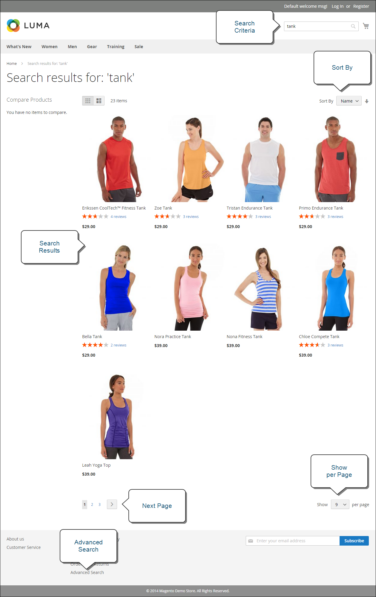

# 가게 앞이 뭐죠?

Adobe Commerce 또는 Magento Open Source 구현 내에서 상점 전면은 상점의 외부 공개 부분입니다. 고객이 쇼핑하고 구매하는 데 사용하는 콘텐츠 및 기능 구성 요소를 제공합니다.

고객이 판매에 도달하는 경로를 라고 하는 경우도 있습니다. _구매 경로_, 그리고 상점에는 고객이 이 경로를 완료할 수 있도록 하는 구성 요소가 포함되어 있습니다. 다음 섹션에서는 전략적 가치를 제공하는 기본 페이지 유형(고객이 스토어에서 쇼핑하는 동안 주로 방문하는 위치)에 대한 개요를 제공합니다. 이를 검토할 때 고객 여정의 각 단계에서 사용할 수 있는 다양한 스토어 기능을 고려하십시오.

## 홈 페이지

대부분의 사람들이 다른 곳에 머무르거나 다른 곳으로 이동하기 전에 페이지에서 몇 초만 보내는 것을 알고 계십니까? 인상을 남기는 것은 그리 길지 않다. 연구에 따르면 사람들은 또한 특히 다른 사람들의 사진을 좋아한다고 합니다. 어떤 디자인을 선택하든 홈 페이지의 모든 것은 방문자를 판매 프로세스의 다음 단계로 이동시킵니다. 이 아이디어는 관심의 한 지점에서 다음 지점으로 집중적인 흐름으로 그들의 주의를 유도하는 것이다.

{width="700"}

## 카탈로그 페이지

카탈로그 페이지 목록에는 일반적으로 작은 제품 이미지와 간단한 설명이 있으며 목록 또는 격자로 서식을 지정할 수 있습니다. 블록, 비디오 및 키워드가 풍부한 설명을 추가하고 프로모션 또는 시즌을 위한 특별한 디자인을 만들 수도 있습니다. 다양한 카테고리의 제품을 선별한 컬렉션인 라이프스타일 또는 브랜드를 특징으로 하는 특별한 카테고리를 만들 수 있습니다.

초기 제품 설명은 보통 쇼핑객에게 더 자세히 살펴볼 수 있을 만큼 충분한 정보를 제공합니다. 본인이 원하는 것을 알고 있는 사람은 장바구니에 제품을 추가해 가지고 갈 수 있다. 계정에 로그인한 상태에서 쇼핑하는 고객은 개인화된 쇼핑 경험을 즐깁니다.

{width="700"}

## 검색 결과

탐색 기능만 사용하는 사람보다 검색을 사용하는 사람이 구매 가능성이 거의 두 배 높다는 사실을 알고 계십니까? 이 쇼핑객들을 다음과 같이 생각할 수 있습니다 _사전 적격_.

### [!DNL Live Search]

포함 [[!DNL Live Search]](https://experienceleague.adobe.com/docs/commerce-merchant-services/live-search/overview.html) Adobe Commerce의 경우 스토어에서 빠르고, 관련성이 높고, 직관적인 검색 경험을 제공할 수 있으며, Adobe Commerce에서 추가 비용 없이 사용할 수 있습니다.

{width="700"}

### 표준 카탈로그 검색

포함 [표준 카탈로그 검색](../catalog/search.md), 스토어의 오른쪽 상단 모서리에 검색 상자가 있고, 바닥글에 고급 검색에 대한 링크가 있습니다. 구매자가 제출하는 모든 검색어가 저장되므로 고객이 찾고 있는 항목을 정확하게 확인할 수 있습니다. 제안을 제공하고 동의어와 일반적인 철자를 입력할 수 있습니다. 그런 다음 검색어를 입력할 때 특정 페이지를 표시합니다.

{width="700"}

## 제품 페이지

제품 페이지에는 많은 작업이 진행 중입니다. 제품 페이지에서 가장 먼저 눈길을 끄는 것은 고해상도 줌과 썸네일 갤러리가 돋보이는 메인 이미지다. 가격 및 가용성 외에도 자세한 정보와 관련 제품 목록이 포함된 탭 섹션이 있습니다.

{width="700"}

## 장바구니

장바구니는 할인 쿠폰 및 예상 배송과 세금과 함께 주문 총액을 결정할 수 있는 곳이며, 신탁 배지와 도장을 표시할 수 있는 좋은 장소입니다. 마지막 1개 항목을 제공할 수 있는 이상적인 기회이기도 합니다. 크로스셀에서는 특정 품목이 장바구니에 표시될 때마다 충동 구매로 제공할 특정 품목을 선택할 수 있습니다.

{width="700"}

## 체크아웃 페이지

체크아웃 프로세스는 다음 두 단계로 구성됩니다.

1. 배송 정보

   체크아웃 프로세스의 첫 단계는 고객이 배송 주소 정보를 완성하고 배송 방법을 선택하는 것입니다. 고객이 계정을 보유한 경우 배송 주소가 자동으로 입력되지만 필요한 경우 변경할 수 있습니다.

   {width="700"}

1. 검토 및 지급 정보

   체크아웃 프로세스의 두 번째 단계는 고객이 결제 방법을 선택하고 선택적으로 할인 코드를 적용하는 것입니다.

   >[!NOTE]
   >
   >그러나 [!DNL Commerce] 여러 쿠폰 코드를 구성할 수 있으므로 고객은 하나의 쿠폰 코드만 장바구니에 적용할 수 있습니다. (다음을 참조하십시오. [쿠폰 코드](../merchandising-promotions/price-rules-cart-coupon.md#coupon-codes) 을 참조하십시오.)

   {width="700"}

페이지 맨 위에 있는 진행률 표시줄은 체크아웃 프로세스의 각 단계와 _주문 요약_ 이 시점까지 입력된 정보를 표시합니다.

>[!NOTE]
>
>2단계 체크아웃 예외 사항은 가상 및/또는 다운로드 가능한 제품에 적용됩니다. 장바구니에 이러한 유형의 제품만 있는 경우, 배송 정보가 필요하지 않으므로 체크아웃이 자동으로 한 단계 절차로 변환됩니다.
