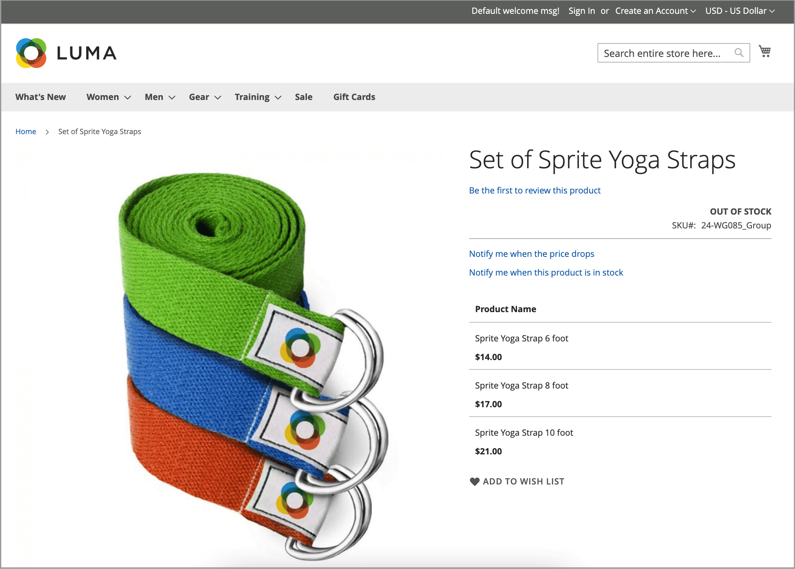
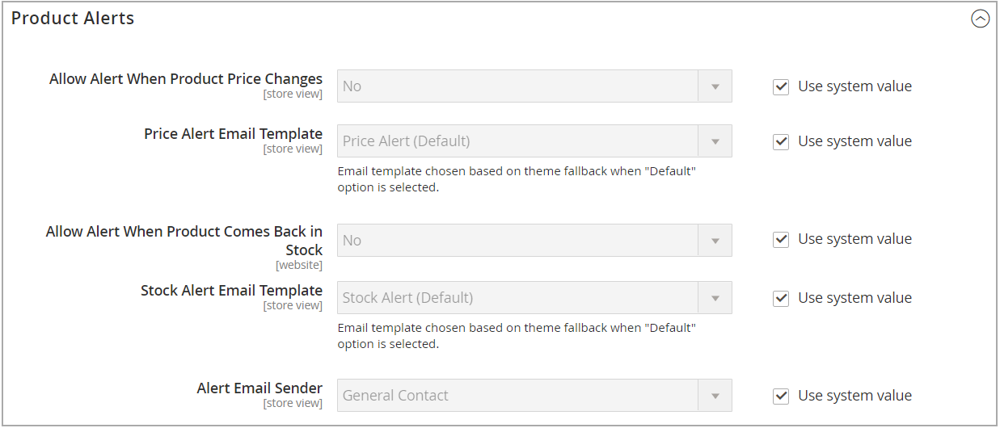
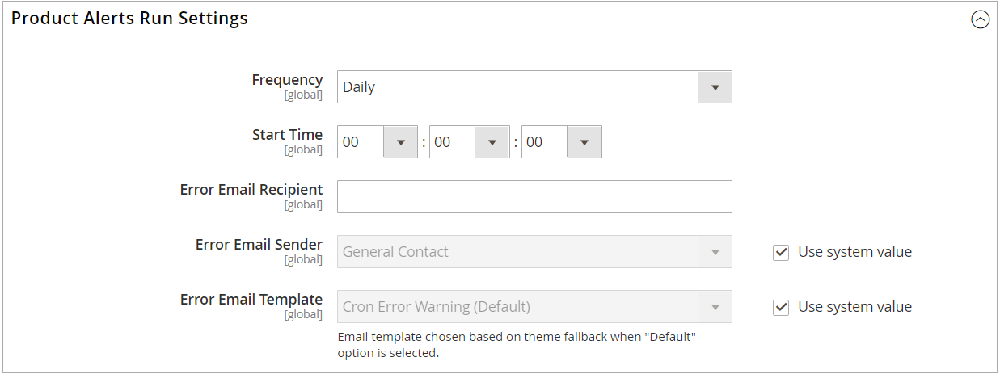

# 제품 경고

고객은 이메일로 가격 변경 경고와 재고 경고, 이렇게 두 가지 유형의 경고를 구독할 수 있습니다. 각 경고 유형에 대해 고객이 구독할 수 있는지 확인하고, 사용된 이메일 템플릿을 선택하고, 이메일 발신자를 식별할 수 있습니다.

{width="600" zoomable="yes"}

## 가격 변경 경고

가격 변경 경고가 활성화된 경우 _가격이 하락하면 알림_ 모든 제품 페이지에 링크가 표시됩니다. 고객은 링크를 클릭하여 제품과 관련된 경고를 구독할 수 있습니다. 스토어에 계정을 만들라는 메시지가 나타납니다. 가격이 변경되거나 제품이 특별 광고될 때마다 경고를 구독한 모든 사용자에게 이메일 알림이 전송됩니다.

## 재고 내 경고

재고 경고는 라는 링크를 만듭니다. _이 제품의 재고가 있을 때 알림_ 품절된 모든 제품에 대해. 고객은 링크를 클릭하여 경고를 구독할 수 있습니다. 제품이 재입고되면 고객은 제품을 사용할 수 있다는 이메일 알림을 받게 됩니다. 경고가 있는 제품은 _제품 경고_ 제품 정보 패널의 탭에 경고에 가입한 고객이 나열됩니다.

{width="600" zoomable="yes"}

## 제품 경고 설정

1. 다음에서 _관리자_ 사이드바, 이동 **[!UICONTROL Stores]** > _[!UICONTROL Settings]_>**[!UICONTROL Configuration]**.

1. 왼쪽 패널에서 를 확장합니다. **[!UICONTROL Catalog]** 및 선택 **[!UICONTROL Catalog]** 밑에.

1. 를 클릭하여 확장합니다. _[!UICONTROL Product Alerts]_섹션을 참조하고 다음을 수행합니다.

   {width="600" zoomable="yes"}

   - 고객에게 가격 변경 경고를 제공하려면 다음을 설정하십시오. **[!UICONTROL Allow Alert When Product Price Changes]** 끝 `Yes`.

   - 설정 **[!UICONTROL Price Alert Email Template]** 가격 경고 통지에 사용할 템플리트에 대한 것입니다.

   - 품절된 제품을 다시 사용할 수 있게 될 때 경고를 제공하려면 을 설정합니다. **[!UICONTROL Allow Alert When Product Comes Back in Stock]** 끝 `Yes`.

     >[!NOTE]
     >
     >다음 _이 제품의 재고가 있을 때 알림_ 메시지는 다음과 같은 경우에만 나타납니다. **[!UICONTROL Display Out of Stock Products]** 이(가) (으)로 설정됨 `Yes` (다음 위치의 구성에서) [!UICONTROL Catalog] > [!UICONTROL Inventory]).

   - 설정 **[!UICONTROL Stock Alert Email Template]** 제품 스톡 경고에 사용할 템플릿으로 바꿉니다.

   - 설정 **[!UICONTROL Alert Email Sender]** (으)로 [저장소 연락처](../getting-started/store-details.md#store-email-addresses){target="_blank"} that you want to appear as the sender of the email alert. Learn more about [store email addresses](../configuration-reference/general/store-email-addresses.md){target="_blank"} ( 핵심 사용 안내서)를 참조하십시오.

1. 완료되면 다음을 클릭하십시오. **[!UICONTROL Save Config]**.

## 제품 경고 이메일 템플릿 구성

다음으로, 가격 알림에 대한 이메일 템플릿을 구성, 추가 또는 수정합니다. 추가 템플릿을 만든 후 가격 경고 구성을 편집할 수 있습니다.

이메일 메시지 사용에 대한 자세한 내용은 [메시지 템플릿](../systems/email-template-custom.md#message-templates) 다음에서 _관리 시스템 안내서_.

1. 다음에서 _관리자_ 사이드바, 이동 **[!UICONTROL Marketing]** > _[!UICONTROL Communications]_>**[!UICONTROL Email Templates]**.

1. 클릭 **[!UICONTROL Add New Template]**.

1. 아래 _기본 템플릿 로드_, 을(를) 선택합니다. **[!UICONTROL Template]** 사용자 지정할 수 있습니다.

   테마에 포함된 경고 템플릿을 선택할 수 있습니다. 또는 다음을 선택할 수 있습니다 `Price Alert` 또는 `Stock Alert` 템플릿 _[!UICONTROL Magento_PriceAlert]_.

1. 클릭 **[!UICONTROL Load Template]**.

1. 입력 **[!UICONTROL Template Name]**.

   다음에서 이 이름을 선택할 수 있습니다. _가격 경고_ 구성.

1. 기존 콘텐츠를 읽고 필요에 따라 다음 사항을 변경합니다.

   | 필드 | 설명 |
   | ----- | ----- |
   | [!UICONTROL Template Subject] | 이 텍스트는 이메일의 제목 줄에 표시됩니다. |
   | [!UICONTROL Template Content] | 이 텍스트는 보낸 이메일의 전체 콘텐츠에 표시됩니다. |

1. 에서 생성된 정보를 추가하려면 [!DNL Commerce] 데이터, 사용 **[!UICONTROL Insert Variable]** 사용 가능한 변수 목록을 사용하는 옵션입니다.

1. 클릭 **[!UICONTROL Save Template]**.

## 제품 경고 실행 설정

이러한 설정을 통해 빈도 선택 [!DNL Commerce] 경고를 전송해야 하는 변경 사항을 확인합니다. 경고 전송이 실패하면 전송되는 이메일의 수신자, 발신자 및 템플릿을 선택할 수도 있습니다.

{width="600" zoomable="yes"}

1. 다음에서 _관리자_ 사이드바, 이동 **[!UICONTROL Stores]** > _[!UICONTROL Settings]_>**[!UICONTROL Configuration]**.

1. 왼쪽 패널에서 를 확장합니다. **[!UICONTROL Catalog]** 및 선택 **[!UICONTROL Catalog]** 밑에.

1. 확장  다음 **[!UICONTROL Product Alerts Run Settings]** 섹션.

1. 제품 경고가 전송되는 빈도를 확인하려면 다음을 설정하십시오. **[!UICONTROL Frequency]** 다음 중 하나를 수행합니다.

   - `Daily`
   - `Weekly`
   - `Monthly`

1. 제품 경고가 전송되는 시간을 결정하려면 을(를) 설정합니다. **[!UICONTROL Start Time]** 시간, 분, 초로.

   >[!NOTE]
   >
   >제품 경고는 &quot;product_alert&quot; 소비자가 전송합니다.

1. 대상 **[!UICONTROL Error Email Recipient]**&#x200B;오류가 발생하는 경우 연락할 대상자의 이메일을 입력합니다.

1. 의 경우 **[!UICONTROL Error Email Sender]**&#x200B;오류 알림의 발신자로 표시되는 스토어 id를 선택합니다.

1. 설정 **[!UICONTROL Error Email Template]** 오류 알림에 사용할 트랜잭션 이메일 템플릿입니다.

1. 완료되면 다음을 클릭하십시오. **[!UICONTROL Save Config]**.
