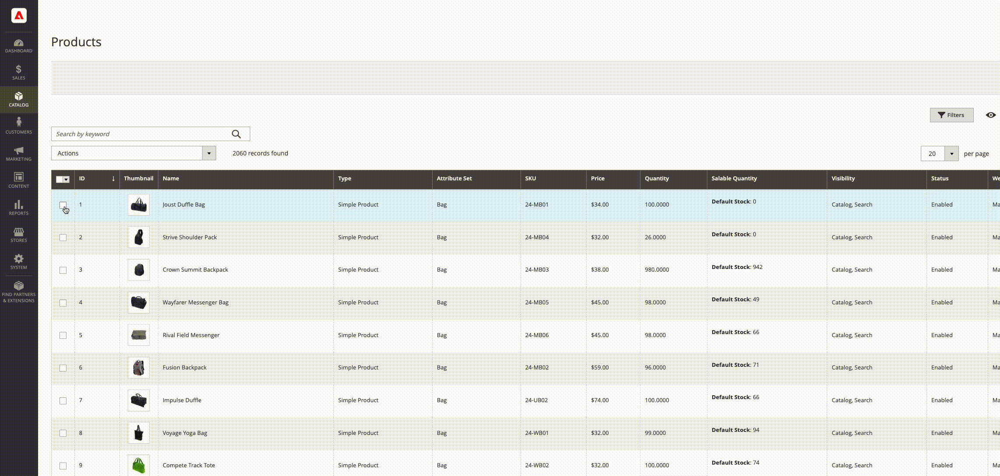
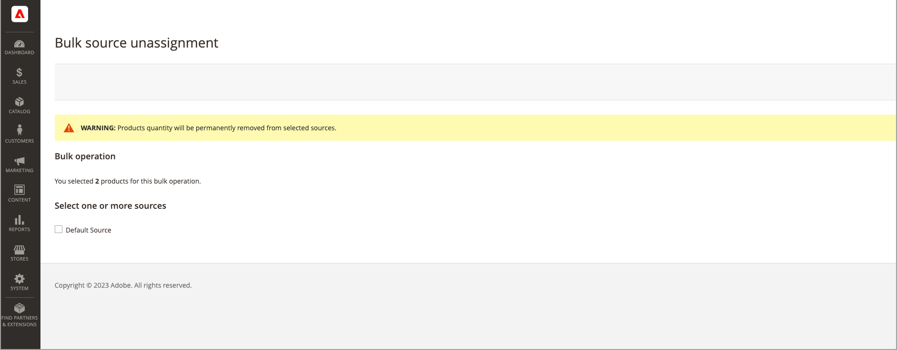

# 일괄 소스 할당 및 할당 해제

_소스 할당_ 도구를 사용하여 제품에 하나 이상의 소스를 추가하십시오. 이 도구는 사용자 지정 소스를 만들고 기본 재고 또는 사용자 지정 재고에 할당하고 새 위치와 재고를 준비할 때 도움이 됩니다.

새 사용자 지정 소스를 추가한 후 관리자를 통해 또는 [가져오기 기능](inventory-import-export.md)을 사용하여 제품당 [재고 수량](quantities-assign-per-product.md) 또는 여러 제품에 대한 재고 수량을 추가할 수 있습니다.

## 출처 및 수량 지정

1. _관리자_ 사이드바에서 **[!UICONTROL Catalog]** > **[!UICONTROL Products]**(으)로 이동합니다.

1. 소스를 수정할 제품을 선택합니다.

   제품을 찾아보거나 검색하여 찾은 후 해당 확인란을 선택합니다.

1. 맨 위에 있는 **[!UICONTROL Actions]** 메뉴를 클릭하고 **[!UICONTROL Assign Inventory Source]**&#x200B;을(를) 선택합니다.

1. 확인 대화 상자에서 **[!UICONTROL OK]**&#x200B;을(를) 클릭합니다.

1. 제품에 추가할 모든 소스에 대해 확인란을 선택합니다.

1. **[!UICONTROL Assign Sources]**&#x200B;을(를) 클릭합니다.

   {width="600" zoomable="yes"}

소스는 재고 수량이 0인 제품에 추가됩니다. 소스당 [재고 수량](quantities-assign-per-product.md)을 추가할 수 있습니다.

## 출처 및 수량 지정 취소

제품에서 출처의 지정을 취소할 때 해당 위치에 더 이상 제품이 입고되지 않음을 나타냅니다. 이 프로세스는 현재 제품에 지정된 소스에 대한 모든 재고 데이터를 완전히 지웁니다. 기존 인벤토리를 새 위치로 이동하려면 _인벤토리 전송_ 옵션을 사용하는 것이 좋습니다.

{{$include /help/_includes/unassign-source.md}}

출처를 제거하기 전에 해당 제품에 대한 모든 주문 및 출하를 완료하는 것이 좋습니다.

1. _관리자_ 사이드바에서 **[!UICONTROL Catalog]** > **[!UICONTROL Products]**(으)로 이동합니다.

1. 소스를 수정할 제품을 선택합니다.

   제품을 찾아보거나 검색하여 찾은 후 해당 확인란을 선택합니다.

1. 맨 위에 있는 **[!UICONTROL Actions]** 메뉴를 클릭하고 **[!UICONTROL Unassign Inventory Source]**&#x200B;을(를) 선택합니다.

1. 확인 대화 상자에서 **[!UICONTROL OK]**&#x200B;을(를) 클릭합니다.

1. 제품에서 제거할 소스를 선택합니다.

   이 페이지에는 지정을 취소하면 제품에서 모든 특정 출처 및 수량 데이터가 제거된다는 경고가 표시됩니다.

1. **[!UICONTROL Unassign Sources]**&#x200B;을(를) 클릭합니다.

   {width="600" zoomable="yes"}

<!-- Last updated from includes: 2022-08-30 15:36:09 -->
