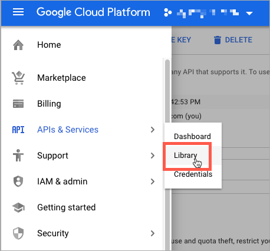
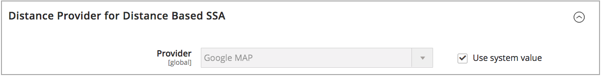

# 거리 우선순위 알고리즘 구성

거리 우선순위 알고리즘은 출하 목적지 주소의 위치를 출처 위치와 비교하여 출하를 이행할 가장 가까운 출처를 결정합니다. 거리는 데이터베이스 데이터 또는 주행, 보행 또는 자전거 방향을 사용하여 한 위치에서 다른 위치로 이동하는 물리적 거리 또는 체류 시간에 의해 결정될 수 있다. 사용 [소스 선택 알고리즘](selection-reservations.md) 배송 대상 주소와 가장 가까운 소스를 추천합니다.

>[!NOTE]
>
>거리 우선순위 알고리즘을 사용하는 경우 전체 거리 주소 및 GPS 좌표를 입력합니다. [소스](sources-add.md) 권장됩니다.

운송 이행에 가장 가까운 출처를 찾기 위한 거리 및 시간을 계산하는 두 가지 옵션이 있습니다.

- **Google 맵** - 사용 [Google 지도 플랫폼][1] 배송 대상 주소와 원본 위치 간의 거리 및 시간을 계산하는 서비스. 이 옵션은 소스의 위도와 경도(GPS 좌표)를 사용하며 계산 모드에 따라 거리 주소를 사용할 수 있습니다. Google API 키는에 필요합니다. [Geocoding API][2] 및 [거리 매트릭스 API][3] 활성화하면 Google을 통해 요금이 발생할 수 있습니다.

- **오프라인 계산** - 우편 번호 및 GPS 좌표를 사용하여 다운로드 및 가져온 지오코드 데이터를 사용하여 거리를 계산하여 배송 대상 주소와 가장 가까운 소스를 결정합니다. 이 옵션을 구성하려면 명령줄 지침을 사용하여 지오코드를 처음 다운로드하고 가져올 수 있도록 개발자 지원이 필요할 수 있습니다.

>[!NOTE]
>
>여러 국가가 있는 다중 스토어 웹 사이트의 경우 [기본 세금 대상](../stores-purchase/tax-class.md#default-tax-destination){target="_blank"} 각 국가마다.

## Google 맵 사용

시작하려면 Google 계정이 필요하지 않습니다. 필요한 경우 이 프로세스에는 Google 계정 및 프로젝트 생성이 포함됩니다. 이 옵션을 사용하려면 구성을 완료하고 알고리즘을 사용하려면 Google 계정에 청구 계정 및 결제 방법이 추가됩니다.
그러나 Google MAP 거리 기반 알고리즘은 오프라인 계산에 비해 더 발전되고 정밀한 것으로 권장됩니다.

### 1단계: Google API 키 만들기

키는 다음에서 가져옵니다. [Google 지도 플랫폼][1] 및 이 있어야 함 [Geocoding API][2] 및 [거리 매트릭스 API][3] 활성화되었습니다. 자세한 내용은 [거리 우선순위 알고리즘 구성](distance-priority-algorithm.md).

1. 방문 [Google 지도 플랫폼][1] 및 클릭 **[!UICONTROL Get Started]**.

1. 플랫폼을 활성화하려면 다음을 선택합니다. **[!UICONTROL Maps, Routes, and Places]** 및 클릭 **[!UICONTROL Continue]**.

   {width="350" zoomable="yes"}

1. Google 계정으로 로그인하거나 계정을 만듭니다.

1. 프로젝트 설정:

   - 프로젝트를 선택하거나 새 프로젝트 이름을 입력합니다.

   - 약관에 동의하려면 다음을 선택합니다. `Yes`.

   - 클릭 **[!UICONTROL Next]**.

1. 청구 계정을 입력하거나 만드십시오. 건너뛰고 나중에 청구 계정을 추가할 수 있습니다.

   이 서비스를 사용하려면 청구 계정이 필요합니다.

1. Google Cloud Platform 옵션을 열고 구성하려면 **[!UICONTROL Console]**.

   - 프로젝트를 엽니다.

   - 메뉴를 확장하고 **[!UICONTROL APIs & Services]** > **[!UICONTROL Library]**.

     {width="350" zoomable="yes"}

   - 검색 대상 [Geocoding API][2] 및 [거리 매트릭스 API][3]. 각 서비스를 선택하고 활성화합니다.

1. 메뉴를 확장하고 **[!UICONTROL APIs & Services]** > **[!UICONTROL Credentials]**&#x200B;및 Google API 키를 복사합니다.

   {width="350" zoomable="yes"}

### 2단계: Google MAP 공급자 구성

1. 다음에서 _관리자_ 사이드바, 이동 **[!UICONTROL Stores]** > _[!UICONTROL Settings]_>**[!UICONTROL Configuration]**.

1. 왼쪽 패널에서 를 확장합니다. **[!UICONTROL Catalog]** 및 선택 **[!UICONTROL Inventory]**.

1. 확장  다음 _[!UICONTROL Distance Provider for Distance Based SSA]_섹션 및 세트&#x200B;**[!UICONTROL Provider]**끝 `Google MAP`.

   {width="350" zoomable="yes"}

1. 확장  다음 _[!UICONTROL Google Distance Provider]_섹션을 만들고 설정을 구성합니다.

   - 대상 **[!UICONTROL Google API Key]**, Google 계정에서 복사한 키를 입력합니다.

   - 대상 **[!UICONTROL Computation mode]**&#x200B;구성을 선택합니다.

     >[!NOTE]
     >
     >배송에 이 알고리즘을 사용할 때 경로 및 데이터가 배송에 대해 선택한 계산 모드(주행, 자전거 타기 또는 걷기)에 대해 반환되지 않으면 SSA는 기본적으로 소스 우선 순위 사용으로 설정됩니다. 설정 [종목별 소스에 대한 우선 순위](stocks-prioritize-sources.md) 권장됩니다.

     | 옵션 | 설명 |
     | ----- | ----- |
     | `Driving` | (기본값) 도로 네트워크를 사용하여 표준 주행 방향을 요청합니다. |
     | `Walking` | 보행자 경로 및 보도를 사용하여 보행 방향을 요청합니다(가능한 경우). |
     | `Bicycling` | 자전거 도로 및 기본 설정 거리(가능한 경우)를 사용하여 자전거 방향을 요청합니다. 다음 [거리 매트릭스 서비스][4] 는 미국 및 일부 캐나다 도시에서만 사용할 수 있습니다. |

   - 대상 **[!UICONTROL Value]**, 값 유형 선택:

     | 옵션 | 설명 |
     | ----- | ----- |
     | `Distance` | (기본값) 지표(킬로미터 및 미터) 또는 임페리얼(마일 및 피트) 단위의 점 사이의 거리를 반환합니다. |
     | `Time to Destination` | 원본 위치에서 배송 주소까지 이동하는 데 필요한 시간을 시간 및 분 단위로 반환합니다. |

   {width="350" zoomable="yes"}

1. 완료되면 다음을 클릭하십시오. **[!UICONTROL Save Config]**.

## 오프라인 계산 사용

오프라인 계산에서는 국가 코드를 사용하여 배송지와 소스 주소 간의 거리를 결정합니다. 이 옵션을 구성하려면 개발자 지원이 필요할 수 있습니다. 사용 [!DNL Inventory Management] 데이터를 다운로드하고 가져올 CLI 명령 [geonames.org][5].

>[!NOTE]
>
>가져온 지역 코드 [geonames.org][5] 캐나다와 아일랜드와 같은 일부 국가에는 제한이 있습니다. 을(를) 참조하십시오 [GeoNames 우편 번호 파일][6] 추가 정보.

### 1단계: 지오코드 다운로드 및 가져오기

명령줄 구성을 완료하여 배송할 및 의 소스 위치가 있는 geocode 국가를 다운로드하고 가져옵니다. 이 단계에는 명령줄 작업에 대한 개발자 지원이 필요할 수 있습니다. 을(를) 참조하십시오 [지역 코드 가져오기](cli.md#import-geocodes).

지오코드를 더 추가하려면 언제든지 이 명령을 완료하십시오.

### 2단계: 계산 설정

1. 다음에서 _관리자_ 사이드바, 이동 **[!UICONTROL Stores]** > _[!UICONTROL Settings]_>**[!UICONTROL Configuration]**.

1. 왼쪽 패널에서 를 확장합니다. **[!UICONTROL Catalog]** 및 선택 **[!UICONTROL Inventory]**.

1. 확장  다음 _[!UICONTROL Distance Provider for Distance Based SSA]_섹션.

1. 선택 취소 **[!UICONTROL Use system value]** 확인란 및 설정 **[!UICONTROL Provider]** 끝 `Offline Calculation`.

   {width="350" zoomable="yes"}

1. 완료되면 다음을 클릭하십시오. **[!UICONTROL Save Config]**.

[1]: https://cloud.google.com/maps-platform/
[2]: https://developers.google.com/maps/documentation/geocoding/start
[3]: https://developers.google.com/maps/documentation/distance-matrix/start
[4]: https://developers.google.com/maps/documentation/javascript/distancematrix#travel_modes
[5]: https://www.geonames.org/
[6]: https://download.geonames.org/export/zip/readme.txt
