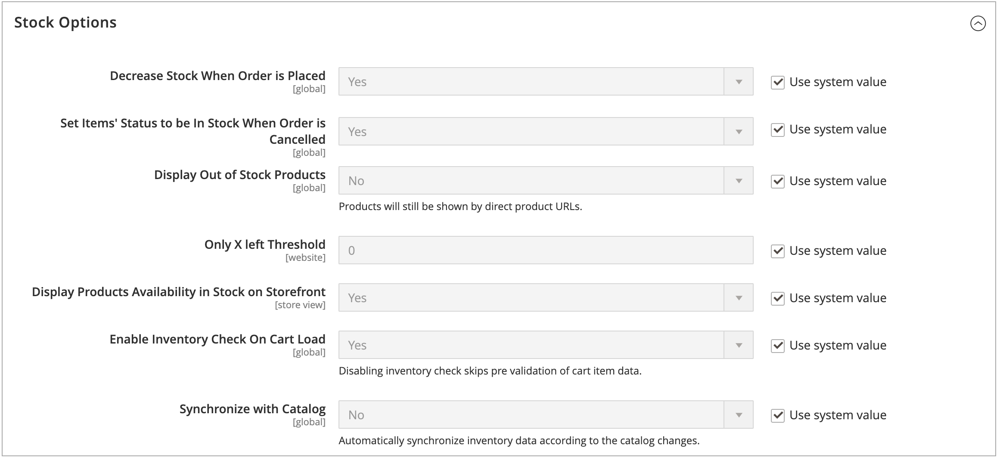

# [!DNL Inventory Management] 전역 옵션 구성

웹 사이트의 제품 및 재고에 대한 기본 구성 옵션을 구성합니다. 이러한 설정 중 일부는 [제품 옵션 구성](product-options.md)을 통해 제품별로 재정의할 수 있습니다. 거리 우선 순위 설정을 구성하려면 [거리 우선 순위 알고리즘 구성](distance-priority-algorithm.md)을 참조하십시오.

## 전 세계적으로 제품 및 스톡 옵션 구성

1. _관리자_ 사이드바에서 **[!UICONTROL Stores]** > _[!UICONTROL Settings]_>**[!UICONTROL Configuration]**(으)로 이동합니다.

1. 왼쪽 패널에서 **[!UICONTROL Catalog]**&#x200B;을(를) 확장하고 **[!UICONTROL Inventory]**&#x200B;을(를) 선택합니다.

1. **[!UICONTROL Stock Options]** 섹션에서 를 확장하고 옵션을 설정합니다.

   {width="600" zoomable="yes"}

   - 주문 시 현재고 수량을 조정하려면 **[!UICONTROL Decrease Stock When Order is Placed]**&#x200B;을(를) `Yes`(으)로 설정합니다.

   - 주문이 취소되면 재고로 반품하려면 **[!UICONTROL Set Items' Status to be in Stock When Order in Cancelled]**&#x200B;에서 `Yes`(으)로 이동하십시오.

   - 더 이상 재고가 없는 제품을 카탈로그에 계속 표시하려면 **[!UICONTROL Display Out of Stock Products]**&#x200B;을(를) `Yes`(으)로 설정하십시오.

   - [가격 알림](alert-setup.md)이 활성화된 경우 고객이 등록하여 제품이 재입고될 때 알림을 받을 수 있습니다.

   - 제품 페이지에 남은 마지막 재고 금액을 표시하는 시작을 설정하려면 **[!UICONTROL Only X left Threshold]**&#x200B;의 금액을 입력하십시오.

     재고 수량이 임계값에 도달하면 메시지가 나타나기 시작합니다. 예를 들어 `3`(으)로 설정하면 재고 수량이 3개에 도달하면 `Only 3 left` 메시지가 나타납니다. 메시지가 수량이 0이 될 때까지 재고 수량을 반영하도록 조정됩니다.

   - 제품 페이지에 &quot;재고&quot; 또는 &quot;재고 부족&quot; 메시지를 표시하려면 **[!UICONTROL Display Products Availability In Stock on Storefront]**&#x200B;을(를) `Yes`(으)로 설정하십시오.

   - 장바구니에서 제품을 로드할 때 인벤토리를 확인하려면 **[!UICONTROL Enable Inventory Check On Cart Load]**&#x200B;을(를) `Yes`(으)로 설정하십시오. 이 옵션이 비활성화되면 인벤토리 검사를 건너뜁니다. 이 옵션을 비활성화하면 특히 장바구니에 많은 항목이 있는 경우 체크아웃 속도가 빨라집니다. 그러나 사전 유효성 검사를 건너뛸 경우 나중에 체크아웃 프로세스에서 &quot;재고 부족&quot; 오류가 표시될 수 있습니다.

   - 인벤토리와 카탈로그 간의 일관성을 유지하려면 **[!UICONTROL Synchronize with Catalog]**&#x200B;을(를) `Yes`(으)로 설정하십시오. 이 옵션이 활성화되면 카탈로그 변경 사항(예: 제품 제거, 제품 SKU 변경 및 제품 유형 변경)에 따라 인벤토리 데이터가 조정됩니다.

1. **[!UICONTROL Product Stock Options]** 섹션에서 를 확장하고 옵션을 설정합니다.

   - 카탈로그에 대해 [인벤토리 제어](enable.md)를 활성화하려면 **[!UICONTROL Manage Stock]**&#x200B;을(를) `Yes`(으)로 설정하십시오.

     {width="600" zoomable="yes"}

   - **[!UICONTROL Backorders]**&#x200B;을(를) 다음 중 하나로 설정합니다.

     | 옵션 | 설명 |
     | ----- | ----- |
     | `No Backorders` | 제품이 품절되면 [미납주문](backorders.md)이 허용되지 않습니다. |
     | `Allow Qty Below 0` | 수량이 영(0) 아래로 떨어질 때 미납주문을 받습니다. |
     | `Allow Qty Below 0 and Notify Customer` | 수량이 영(0) 아래로 떨어질 때 미납주문이 수락되며 시스템은 여전히 주문을 할 수 있음을 고객에게 알립니다. |

   - **[!UICONTROL Maximum Qty Allowed in Shopping Cart]** 입력.

   - **[!UICONTROL Out-of-Stock Threshold]**&#x200B;에 대한 금액 입력:

     | 값 | 설명 |
     | ----- |-----|
     | 양수 | 미납주문을 사용불능으로 설정한 상태에서 양수 금액을 입력합니다. |
     | 0 | 미납주문을 활성화한 상태에서 `0`을(를) 입력하면 무제한으로 미납주문을 할 수 있습니다. |
     | 음수 금액 | 미납주문을 사용할 수 있는 경우 음수 금액을 입력하는 것이 좋습니다. 금액은 판매 가능 수량에 추가됩니다. 예를 들어 `-50`을(를) 입력하여 이 수량까지 주문을 허용합니다. |

   - 선택한 그룹 및 금액에 대한 **[!UICONTROL Minimum Qty Allowed in Shopping Cart]**&#x200B;을(를) 입력하십시오.

   - **[!UICONTROL Notify for Quantity Below]**&#x200B;의 경우 항목이 품절되었음을 알리는 재고 수준을 입력합니다.

   - 제품에 대한 수량 증분을 활성화하려면 **[!UICONTROL Enable Qty Increments]**&#x200B;을(를) `Yes`(으)로 설정하십시오. **[!UICONTROL Qty Increments]**&#x200B;에 대해 요구 사항을 충족하기 위해 구매해야 하는 항목의 수를 입력합니다.

     예를 들어, 6씩 늘려 판매하는 항목은 `6`, `12`, `18` 등의 수량으로 구매할 수 있습니다.

   - [!DNL Inventory Management]의 경우 **[!UICONTROL Automatically Return Credit Memo Item to Stock]**&#x200B;이(가) `No`(으)로 설정되어 있습니다. 대변 메모를 실행할 때 주식을 출처로 반품하려면 을 입력하고 선택합니다.

1. **[!UICONTROL Admin bulk operations]** 섹션에서 를 확장하고 옵션을 설정합니다.

   {width="600" zoomable="yes"}

   - 대량 제품 작업에 대해 일괄 작업을 비동기적으로 실행하도록 **[!UICONTROL Run asynchronously]**&#x200B;을(를) 설정합니다.

     이러한 작업에는 일괄 [원본 할당 및 할당 해제](bulk-assignment.md) 및 [원본을 원본으로 전송](inventory-transfer.md)이 포함됩니다. 비동기 배치 크기까지의 벌크 작업을 수집한 다음, 해당 작업을 실행합니다. 이 옵션은 기본적으로 비활성화되어 있습니다. 활성화하기 전에 일괄 작업으로 성능을 검토하는 것이 좋습니다.

     >[!NOTE]
     >
     >_비동기 큐 관리자_&#x200B;를 구성하고 지원하려면 명령줄을 사용하여 명령을 실행해야 합니다. 이 단계에는 개발자 지원이 필요할 수 있습니다. _구성 가이드_&#x200B;에서 [메시지 큐 소비자 시작](https://experienceleague.adobe.com/docs/commerce-operations/configuration-guide/cli/start-message-queues.html)을 참조하세요.

   - 활성화된 경우 **[!UICONTROL Asynchronous batch size]**&#x200B;을(를) 설정합니다. 기본 배치 크기는 100입니다. 벌크 프로세스가 이 양에 도달하면 시스템이 이를 트리거합니다.

1. 완료되면 **[!UICONTROL Save Config]**&#x200B;을(를) 클릭합니다.
