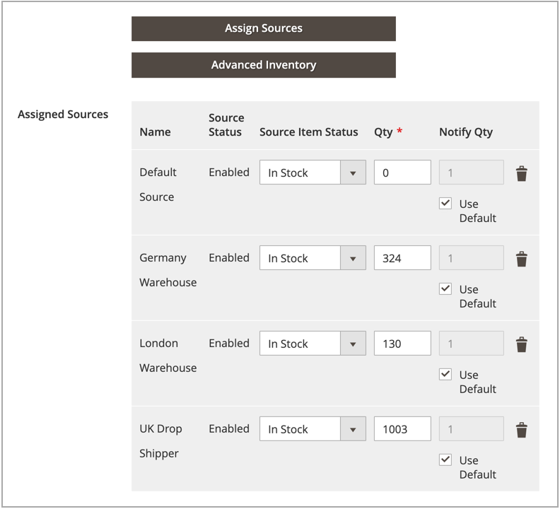

# [!DNL Inventory Management] 제품 옵션 구성

이러한 구성은 편집된 제품에만 적용되며, 전역 웹 사이트 수준에서 모든 구성을 재정의합니다. 제품을 편집할 때 _[!UICONTROL Sources]_&#x200B;섹션 및&#x200B;_[!UICONTROL Advanced Inventory]_ 페이지를 통해 이러한 설정을 수정합니다.

- 소스별 제품 옵션 구성
- 고급 인벤토리에 대한 제품 옵션 구성

## 소스별 제품 옵션

제품에 대해 [추가된 원본](sources-add.md)당 수량 및 추가 설정을 구성하십시오.

1. _관리자_ 사이드바에서 **[!UICONTROL Catalog]** > **[!UICONTROL Products]**(으)로 이동합니다.

1. 제품을 편집 모드로 엽니다.

1. **[!UICONTROL Sources]** 섹션에서 를 확장하고 각 소스에 대한 제품 설정을 구성합니다.

   - **[!UICONTROL Qty]**(수량) 금액을 입력하십시오.

   - **[!UICONTROL Source Item Status]**&#x200B;을(를) `In Stock` 또는 `Out of Stock`(으)로 설정합니다.

   - 소스당 아래 수량에 대한 알림을 수정하려면 **[!UICONTROL Notify Quantity Use Default]** 확인란의 선택을 취소하거나 선택합니다.

     정산된 경우, 품목의 재고 부족 통지를 트리거하는 재고 레벨 금액을 입력합니다. 입력한 금액은 재고 레벨에서 품목의 판매 가능 수량에서 뺍니다.

     `Select to use Default` - [!DNL Commerce]이(가) 구성 설정에 대한 제품 고급 인벤토리 옵션을 확인합니다.
     `Clear to Modify` - [알림 수량]에 대한 값을 입력하여 고급 인벤토리 및 저장소 구성 설정을 재정의합니다.

   제품에 대한 {width="350" zoomable="yes"}

1. 완료되면 **[!UICONTROL Done]**&#x200B;을(를) 클릭한 다음 **[!UICONTROL Save]**&#x200B;을(를) 클릭합니다.

### 필드 설명

| 필드 | 범위 | 설명 |
|--|--|--|
| [!UICONTROL Source Code] | 글로벌 | [source](sources-manage.md)에 대한 고유 코드입니다. |
| [!UICONTROL Name] | 글로벌 | 소스의 고유 이름입니다. |
| [!UICONTROL Status] | 글로벌 | 카탈로그에서 제품이 활성화 또는 비활성화되었습니다. |
| [!UICONTROL Source Item Status] | 글로벌 | 제품의 현재 가용성을 결정합니다. 옵션: `In Stock` - 제품을 구매할 수 있도록 설정합니다. `Out of Stock` - 미납주문을 활성화하지 않으면 제품을 구매할 수 없게 하고 카탈로그에서 목록을 제거합니다. |
| [!UICONTROL Qty] | 글로벌 | 각 출처 또는 위치에 대한 현재고 금액. |
| [!UICONTROL Notify Quantity] | 글로벌 | _[!UICONTROL Notify Quantity Use Default]_&#x200B;을(를) 선택하지 않은 경우 이 특정 원본의&#x200B;_[!UICONTROL Notify for Quantity Below]_&#x200B;에 대한 양입니다. |
| [!UICONTROL Notify Quantity Use Default] | 글로벌 | 제품 _[!UICONTROL Advanced Inventory]_&#x200B;의&#x200B;_[!UICONTROL Notify for Quantity Below]_&#x200B;에 대한 기본 설정 또는 저장소 구성의 전역 설정을 사용함을 나타냅니다. |

## 고급 제품 옵션

1. _관리자_ 사이드바에서 **[!UICONTROL Catalog]** > **[!UICONTROL Products]**(으)로 이동합니다.

1. 제품을 편집 모드로 엽니다.

1. **[!UICONTROL Sources]** 섹션에서 를 확장하고 **[!UICONTROL Advanced Inventory]**&#x200B;을(를) 클릭합니다.

1. 카탈로그에 대해 [인벤토리 제어](enable.md)를 사용하려면 **[!UICONTROL Manage Stock]**&#x200B;을(를) `Yes`(으)로 설정하십시오.

   >[!NOTE]
   >
   >하위 제품의 [!UICONTROL Manage Stock] 설정은 구성 가능한 제품을 재정의합니다.

   {width="600" zoomable="yes"}

1. **[!UICONTROL Out-of-Stock Threshold]**&#x200B;에 대한 금액 입력:

   | 값 | 설명 |
   | ----- | ----- |
   | 양수 | _[!UICONTROL Backorders]_&#x200B;을(를) 사용하지 않도록 설정한 상태에서 양수 값을 입력하십시오. |
   | 0 | _[!UICONTROL Backorders]_&#x200B;이(가) 활성화된 상태에서 `0`을(를) 입력하면 무한 미납주문을 허용합니다. |
   | 음수 금액 | _[!UICONTROL Backorders]_&#x200B;이(가) 활성화된 경우 음수 값을 입력하는 것이 좋습니다. 금액은 판매 가능 수량에 추가됩니다. 예를 들어 `-50`을(를) 입력하여 이 수량까지 주문을 허용합니다. |

1. **[!UICONTROL Minimum Qty Allowed in Shopping Cart]** 입력.

1. **[!UICONTROL Maximum Qty Allowed in Shopping Cart]** 입력.

1. 고객이 주문한 수량을 입력할 때 정수가 아닌 소수점 값을 사용할 수 있는 경우 **[!UICONTROL Qty uses Decimals]**&#x200B;을(를) `Yes`(으)로 설정하십시오.

1. 제품을 여러 상자에서 별도로 판매할 수 있는 경우 **[!UICONTROL Allow Multiple Boxes for Shipping]**&#x200B;을(를) `Yes`(으)로 설정합니다. 이 옵션은 **[!UICONTROL Qty Uses Decimals]**&#x200B;이(가) `Yes`(으)로 설정된 경우에만 표시됩니다.

1. **[!UICONTROL Backorders]**&#x200B;을(를) 다음 중 하나로 설정합니다.

   | 옵션 | 설명 |
   | ----- | ----- |
   | `No Backorders` | 제품이 품절되었을 때 미납주문을 수락하지 않습니다. |
   | `Allow Qty Below 0` | 수량이 영(0) 아래로 떨어질 때 미납주문을 수락합니다. |
   | `Allow Qty Below 0 and Notify Customer` | 수량이 영(0) 아래로 떨어질 때 미납주문을 수락하고 고객에게 주문을 계속 진행할 수 있음을 알립니다. |

   자세한 내용은 [미납 주문 구성](backorders.md)을 참조하십시오.

1. 제품에 대한 수량 증분을 활성화하려면 **[!UICONTROL Enable Qty Increments]**&#x200B;을(를) `Yes`(으)로 설정하고 **[!UICONTROL Qty Increments]** 필드에 요구 사항을 충족하기 위해 구매해야 하는 항목 수를 입력합니다.

   예를 들어, 6개 단위로 판매되는 품목의 수량은 6, 12, 18 등으로 구매할 수 있습니다.

   **[!UICONTROL Qty Increments]** 필드는 구성, 그룹화 및 번들 제품의 하위 항목으로서 단일 제품으로 구매해야 하는 제품 항목의 수를 설정합니다.

1. 완료되면 **[!UICONTROL Done]**&#x200B;을(를) 클릭한 다음 **[!UICONTROL Save]**&#x200B;을(를) 클릭합니다.

### 필드 설명

| 필드 | 범위 | 설명 |
|--|--|--|
| [!UICONTROL Manage Stock] | 글로벌 | 카탈로그에서 이 제품을 관리하는 데 재고 관리를 사용하는지 여부를 결정합니다. 모든 [!DNL Inventory Management] 기능을 활성화하거나 비활성화하도록 설정하십시오. 반품 또는 대변 메모를 완료하면 제품 수량이 영향을 받는 출처 수량으로 자동 반환됩니다. 타사 ERP 시스템을 사용하는 경우 비활성화할 수 있습니다. |
| [!UICONTROL Out-of-Stock Threshold] | 글로벌 | 제품이 품절된 것으로 간주되는 재고 수준을 결정합니다. 옵션: 양수 값 - 미납주문을 사용하지 않도록 설정한 경우 양수를 입력합니다. 영(0) - 미납주문을 사용할 수 있는 경우 0을 입력하면 무제한으로 미납주문을 할 수 있습니다. 음수 값 - 미납주문을 사용할 수 있는 경우 음수 금액을 입력하는 것이 좋습니다. 금액은 판매 가능 수량에 추가됩니다. 예를 들어 `-50`을(를) 입력하여 이 수량까지 주문을 허용합니다. |
| [!UICONTROL Minimum Qty Allowed in Shopping Cart] | 글로벌 | 단일 주문으로 구매할 수 있는 제품의 최소 수를 결정합니다. |
| [!UICONTROL Maximum Qty Allowed in Shopping Cart] | 글로벌 | 단일 주문으로 구매할 수 있는 제품의 최대 수를 결정합니다. |
| [!UICONTROL Qty Uses Decimals] | 글로벌 | 고객이 주문 수량을 입력할 때 정수가 아닌 소수점 값을 사용할 수 있는지 여부를 결정합니다. 옵션: `Yes` - 값을 정수가 아닌 소수로 입력할 수 있습니다. 소수점 이하 자리수는 중량, 부피 또는 길이로 판매되는 제품에 적합합니다. `No` - 수량 값을 정수로 입력해야 합니다. |
| [!UICONTROL Allow Multiple Boxes for Shipping] | 글로벌 | 제품의 부품을 별도로 배송할 수 있는지 여부를 결정합니다. 이 옵션은 **[!UICONTROL Qty Uses Decimals]** = `Yes`일 때 표시됩니다. |
| [!UICONTROL Backorders] | 글로벌 | 미납주문 관리 방법을 결정합니다. 미납주문은 주문의 처리 상태를 변경하지 않습니다. 상품은 재고가 있는지 여부와 관계없이 주문 즉시 펀드가 승인 또는 포착된다. 제품은 출시될 때 발송됩니다. 활성화된 경우 재고 부족 임계값에 대해 음수를 입력하는 것이 좋습니다. 옵션: `No Backorders` - 제품 재고가 없을 때 미납주문을 허용하지 않습니다. `Allow Qty Below 0` - 수량이 0보다 작을 때 미납주문을 허용합니다. `Allow Qty Below 0 and Notify Customer` - 수량이 영(0) 이하로 떨어지면 미납주문을 수락하지만, 주문을 계속 할 수 있음을 고객에게 알립니다. |
| [!UICONTROL Enable Qty Increments] | 글로벌 | 제품이 수량 단위로 판매될 수 있는지 여부를 결정합니다. 증분 은 단일 제품으로 구매해야 하는 제품 항목 수를 구성, 그룹화 및 번들 제품의 하위 항목으로 설정합니다. |

>[!NOTE]
>
>단순 제품 구성은 특정 제품에 대해 구성 가능한 제품 구성을 무시합니다.
