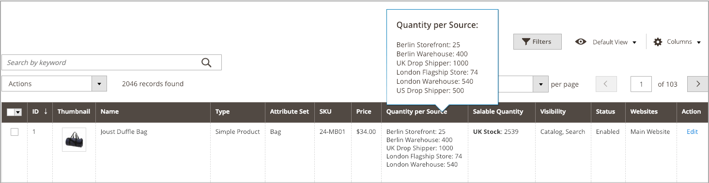

# 제품당 수량 지정

[소스](sources-assign-per-product.md)를 추가한 후 제품에 대한 재고 수량을 업데이트하십시오. 이 값은 현재고 가용 재고 금액을 추적합니다.

원본을 제거하지 않고 원본의 인벤토리를 발송에서 숨기려면 _[!UICONTROL Source Item Status]_&#x200B;을(를) `Out of Stock`(으)로 설정합니다. SSA 및 배송 옵션은 재고 수량이 있는 `In Stock`(으)로 나열된 소스에만 액세스합니다.

업데이트된 모든 수량 및 출처는 제품 그리드에 표시됩니다.

## 수량 업데이트

1. _관리자_ 사이드바에서 **[!UICONTROL Catalog]** > **[!UICONTROL Products]**(으)로 이동합니다.

1. 편집 모드에서 제품을 찾아 엽니다.

1. **[!UICONTROL Sources]** 섹션에서 를 확장합니다.

1. **[!UICONTROL Source Item Status]**&#x200B;을(를) `In Stock`(으)로 설정합니다.

1. 현재고 수량을 업데이트하려면 **[!UICONTROL Qty]**&#x200B;의 금액을 입력하십시오.

1. 재고 수량에 대한 통지를 설정하려면 다음 중 하나를 수행합니다.

   - 사용자 지정 알림 수량 - **[!UICONTROL Use Default]** 확인란의 선택을 취소하고 **[!UICONTROL Notify Qty]**&#x200B;에 금액을 입력하십시오.
   - 기본 알림 수량 - **[!UICONTROL Use Default]** 확인란을 선택합니다. [!DNL Commerce]이(가) _[!UICONTROL Advanced Inventory]_&#x200B;또는 전역 저장소 구성의 설정을 확인하고 사용합니다.

   {width="350" zoomable="yes"}

1. 다음 중 하나를 수행하여 저장합니다.

   - **[!UICONTROL Save]**&#x200B;을(를) 클릭합니다.

   - **[!UICONTROL Save]**() 메뉴에서 **[!UICONTROL Save & Close]**&#x200B;을(를) 선택합니다.

제품 그리드는 모든 소스 및 관련 수량의 목록으로 업데이트됩니다. 소스가 5개 이상 할당된 제품의 경우 _[!UICONTROL Quantity per Source]_&#x200B;열 위로 마우스를 가져가면 전체 목록이 표시됩니다.

{width="600" zoomable="yes"}
