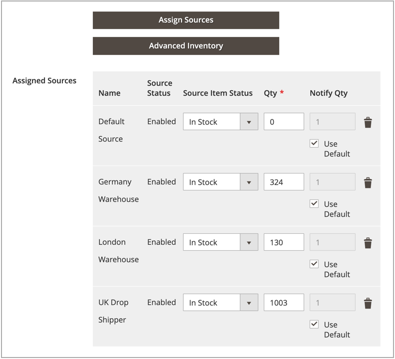

# 제품당 수량 지정

추가 후 [소스](sources-assign-per-product.md), 제품에 대한 재고 수량을 업데이트합니다. 이 값은 현재고 가용 재고 금액을 추적합니다.

출처를 제거하지 않고 출처의 재고를 출하에서 숨기려면 다음을 설정합니다. _[!UICONTROL Source Item Status]_끝 `Out of Stock`. SSA 및 배송 옵션은 다음과 같이 나열된 소스에만 액세스합니다. `In Stock` (사용 가능한 재고 수량 포함)

업데이트된 모든 수량 및 출처는 제품 그리드에 표시됩니다.

## 수량 업데이트

1. 다음에서 _관리자_ 사이드바, 이동 **[!UICONTROL Catalog]** > **[!UICONTROL Products]**.

1. 편집 모드에서 제품을 찾아 엽니다.

1. 확장  다음 **[!UICONTROL Sources]** 섹션.

1. 설정 **[!UICONTROL Source Item Status]** 끝 `In Stock`.

1. 현재고에 대한 수량을 갱신하려면 다음에 대한 금액을 입력합니다. **[!UICONTROL Qty]**.

1. 재고 수량에 대한 통지를 설정하려면 다음 중 하나를 수행합니다.

   - 사용자 지정 알림 수량 - 선택을 취소합니다. **[!UICONTROL Use Default]** 확인란을 선택하고 금액을 입력합니다. **[!UICONTROL Notify Qty]**.
   - 기본 알림 수량 - 다음을 선택합니다. **[!UICONTROL Use Default]** 확인란. [!DNL Commerce] 에서 설정을 확인하고 사용합니다. _[!UICONTROL Advanced Inventory]_또는 글로벌 스토어 구성입니다.

   {width="350" zoomable="yes"}

1. 다음 중 하나를 수행하여 저장합니다.

   - 클릭 **[!UICONTROL Save]**.

   - 다음에서 **[!UICONTROL Save]** () 메뉴, 선택 **[!UICONTROL Save & Close]**.

제품 그리드는 모든 소스 및 관련 수량의 목록으로 업데이트됩니다. 소스가 5개 이상 할당된 제품의 경우 _[!UICONTROL Quantity per Source]_전체 목록을 표시하는 열입니다.

{width="600" zoomable="yes"}
