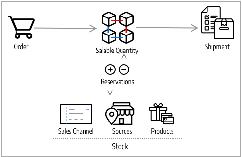
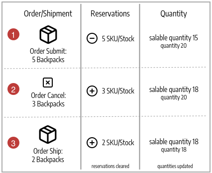

# Source 알고리즘 및 예약

[!DNL Inventory Management]의 핵심은 창고 및 상점에서 사용 가능한 모든 제품을 가상으로 그리고 현재고 상태로 추적합니다. Source 선택 알고리즘 및 예약 시스템은 백그라운드에서 실행되어 판매 가능 수량을 업데이트하고, 충돌을 피할 수 있는 체크아웃 및 배송 옵션을 권장합니다.

>[!NOTE]
>
>프로그래밍 방식으로 [!DNL Inventory Management] 시스템을 사용하는 방법에 대한 자세한 내용은 [개발자 설명서](https://developer.adobe.com/commerce/php/development/framework/inventory-management/)를 참조하세요.

## Source 선택 알고리즘

Source 선택 알고리즘(SSA)은 재고에 구성된 소스의 우선 순위를 사용하여 소스 및 배송에 대한 최상의 일치를 분석하고 결정합니다. 주문 출하 시 알고리즘은 선택된 알고리즘에 따라 소스, 사용 가능한 수량 및 공제할 금액의 권장 목록을 제공합니다. [!DNL Inventory Management]은(는) 우선 순위 알고리즘을 제공하고 새 옵션에 대한 확장을 지원합니다.

여러 출처 위치, 글로벌 고객 및 운송업체가 다양한 배송 옵션과 요금을 보유하고 있어 실제 사용 가능한 재고를 파악하고 최상의 배송 옵션을 찾는 것은 어려울 수 있습니다. SSA는 모든 출처의 재고 판매 가능 수량을 추적하는 것부터 출하에 대한 계산 및 권장 사항까지 귀하를 위해 작업을 수행합니다.

**재고 추적** - 재고 및 원본을 사용하여 SSA가 수신 제품 요청의 판매 채널을 확인하고 사용 가능한 재고를 결정합니다.

- 재고당 할당된 모든 출처의 가상 판매 가능 수량을 집계하여 계산합니다. 출처당 수량 - 재고 부족 임계값
- 과다 판매로부터 보호하기 위해 판매 가능 수량에서 재고 부족 임계값 금액을 뺍니다.
- 주문 처리 및 선적 시 재고 재고에서 공제하여 주문 실행 시 재고 수량을 예약합니다.
- 음수 임계값에 대한 향상된 옵션으로 미납 주문 지원

**배송 관리** - 이 알고리즘은 주문을 처리하고 배송할 때 도움이 됩니다. 알고리즘을 실행하여 제품 배송에 가장 적합한 출처에 대한 추천을 받거나 선택 사항을 무효화하여 다음을 수행할 수 있습니다.

- 부분 선적을 출하하여 특정 위치의 일부 제품만 발송하고 나중에 전체 주문을 완료합니다.
- 하나의 출처에서 전체 주문을 출하합니다.
- 여러 출처의 출하를 다른 금액으로 나누어 모든 창고와 상점에서 균형 잡힌 재고를 유지합니다.

SSA는 타사 지원 및 비용 효율적인 배송 추천을 위한 맞춤형 알고리즘을 위해 확장 가능합니다.

>[!NOTE]
>
>SSA는 가상 및 다운로드 가능 제품에 대해 다르게 작동하며, 이로 인해 배송 비용이 발생하지 않을 수 있습니다. 이 경우 시스템은 송장을 만들 때 알고리즘을 암시적으로 실행하고 제안된 결과를 항상 사용합니다. 가상 및 다운로드 가능한 제품에 대해서는 이러한 결과를 조정할 수 없습니다.

### Source 우선 순위 알고리즘

사용자 정의 재고에는 상점 전면을 통해 사용 가능한 제품 재고를 판매하고 배송할 지정된 소스 목록이 포함됩니다. Source 우선순위 알고리즘은 재고에 지정된 출처의 주문을 사용하여 송장 발부 및 주문 운송 시 출처당 제품 공제를 권장합니다.

실행될 때 알고리즘은 다음과 같습니다.

- 상단에서 시작하는 재고 수준에서 구성된 소스 순서를 통해 작동합니다.
- 목록의 주문, 사용 가능한 수량 및 주문 수량을 기준으로 제품당 출하 및 출고할 수량을 권장합니다.
- 주문 선적이 채워질 때까지 목록 아래로 계속
- 목록에 있는 경우 비활성화된 소스를 건너뜁니다.

사용자 정의 재고에 소스를 구성, 할당 및 주문합니다. [재고 소스 우선 순위 지정](stocks-prioritize-sources.md)을 참조하십시오.

다음 예에서는 맵핑된 출처의 순서, 가용 수량, 공제 및 납품할 권장된 출처 및 금액에 대해 자세히 설명합니다. 상단의 출처는 영국 내 Drop Shipper로 가용 수량은 240대입니다.

{width="600" zoomable="yes"}

### 거리 우선 순위 알고리즘

거리 우선순위 알고리즘은 출하 목적지 주소의 위치를 출처 위치와 비교하여 출하를 이행할 가장 가까운 출처를 결정합니다. 거리는 가져온 데이터베이스 위치 또는 Google 방향(주행, 보행 또는 자전거)을 사용하여 한 위치에서 다른 위치로 이동하는 데 걸린 물리적 거리 또는 시간에 의해 결정될 수 있습니다.

운송 이행에 가장 가까운 출처를 찾기 위한 거리 및 시간을 계산하는 두 가지 옵션이 있습니다.

- **Google 맵** - [Google 맵 플랫폼][1] 서비스를 사용하여 배송 대상 주소와 원본 위치(주소 및 GPS 좌표) 간의 거리 및 시간을 계산합니다. 이 옵션은 소스의 위도와 경도를 사용합니다. [Geocoding API][2] 및 [Distance Matrix API][3]를 사용하려면 Google API 키가 필요합니다. 이 옵션을 사용하려면 Google 결제 플랜이 필요하며 Google을 통해 요금이 발생할 수 있습니다.

- **오프라인 계산** - 다운로드하고 가져온 지오코드 데이터를 사용하여 거리를 계산하여 배송 대상 주소와 가장 가까운 원본을 확인합니다. 이 옵션은 배송 주소 및 출처의 국가 코드를 사용합니다. 이 옵션을 구성하려면 명령줄을 사용하여 지오코드를 처음 다운로드하고 가져오려면 개발자 지원이 필요할 수 있습니다.

구성하려면 구성을 선택하고 Google API 키 또는 전달 데이터 다운로드와 같은 추가 단계를 완료합니다. [거리 우선 순위 알고리즘 구성](distance-priority-algorithm.md)을 참조하십시오.

### 사용자 지정 알고리즘

[!DNL Commerce]은(는) 사용자 지정 개발 및 확장을 지원하여 소스의 우선 순위를 매기기 위한 대체 알고리즘을 추가합니다. 예를 들어 지역을 기반으로 하는 우선 순위 알고리즘과 재고 비용이나 고객 속성을 기반으로 하는 우선 순위 알고리즘이 있을 수 있습니다. 재고 비용이 변경되면 가장 낮은 비용을 보장하기 위해 구현을 통해 알고리즘을 쉽게 변경할 수 있습니다.

## 예약

예약은 제품 재고 수량을 즉시 차감하거나 추가하는 대신 주문이 출하 또는 취소될 때까지 재고 금액을 유지합니다. 예약은 전적으로 백엔드에서 작동하여 재고 레벨에서 판매 가능 수량을 자동으로 업데이트합니다.

>[!NOTE]
>
>예약 기능을 사용하려면 `inventory.reservations.updateSalabilityStatus` 메시지 큐 소비자가 계속 실행해야 합니다. 실행 중인지 확인하려면 `bin/magento queue:consumers:list` 명령을 사용합니다. 메시지 큐 소비자가 나열되지 않은 경우 `bin/magento queue:consumers:start inventory.reservations.updateSalabilityStatus`을(를) 시작합니다.

### 예약 주문

예약은 주문을 실행할 때 판매 가능 수량에서 차감된 재고 수량을 보류합니다. 예약은 재고 수준에서 주문 송장이 발행되고 출하, 취소 등이 될 때까지 수량에 대해 계산됩니다. 주문을 출하할 때 SSA 추천을 사용하거나 출처별 수량 공제를 수동으로 입력할 수 있다. 출고 시 예약이 자동으로 정산되고 수량이 차감된다. 판매 가능 수량은 갱신된 수량과 시스템에 남아 있는 모든 예약 금액으로 재계산됩니다.

다음 다이어그램은 주문 및 선적 시 예약 프로세스를 정의하는 데 도움이 됩니다.

{width="600" zoomable="yes"}

고객이 주문을 제출합니다. [!DNL Commerce]이(가) 현재 재고 판매 가능 수량을 확인합니다. 재고 레벨에서 충분한 재고를 사용할 수 있는 경우, 예약은 제품 SKU(해당 재고에 대해)에 대한 임시 보류를 입력하고 판매 가능 수량을 다시 계산합니다.

주문 송장 발행 후 출처에서 공제하고 출하할 제품 금액을 결정합니다. 선적이 처리되어 하나 이상의 선택된 출처에서 고객에게 발송됩니다. 수량은 출처 재고 수량과 예약을 자동으로 정산합니다. 자세한 내용과 예제는 [주문 상태 및 예약 정보](order-status.md)를 참조하세요.

## 예약 계산

다음 이벤트가 발생하면 각 제품에 대한 예약이 생성됩니다.

- 고객 또는 상인이 주문을 합니다.
- 고객 또는 상인이 주문을 전부 또는 일부 취소합니다.
- 상인은 실제 제품에 대한 선적을 생성합니다.
- 판매자는 가상 또는 다운로드 가능한 제품에 대한 송장을 생성합니다.
- 상인이 대변 메모를 발행한다.

예약은 이벤트 로그와 유사한 추가 전용 작업입니다. 초기 예약에는 음수 수량 값이 지정됩니다. 주문을 처리하는 동안 생성된 모든 후속 예약은 양수 값입니다. 주문이 완료되면 해당 제품에 대한 모든 예약의 합은 0이다.

시스템은 새로운 주문에 대한 응답으로 예약을 발행하기 전에 해당 주문을 이행하기에 충분한 판매 가능 품목이 있는지 여부를 결정합니다. 다음 수량은 계산에 영향을 줍니다.

- **StockItem 수량** StockItem 수량은 현재 판매 채널에 대한 모든 실제 출처의 재고 합계입니다. 볼티모어 소스가 20개의 제품을 갖고, 오스틴 소스가 25개의 동일한 제품을 갖고, 리노 소스가 10개의 제품을 갖는 예를 생각해 보자. 이러한 모든 소스가 Stock A에 연결된 경우 이 제품의 StockItem 수는 55(20 + 25 + 10)입니다. (품목이 출하되면 Inventory Indexer는 각 출처에서 사용 가능한 수량을 갱신합니다.)

- **미해결 예약**. 시스템은 보상되지 않은 모든 초기 예약을 합산합니다. 이 숫자는 항상 음수입니다. 고객 A가 10개 품목을 예약했고 고객 B가 5개 품목을 예약한 경우, 제품에 대한 미결 예약은 총 -15입니다.

따라서, 판매자는 고객이 40 (55 + -15) 단위 미만으로 주문하는 한 들어오는 주문을 이행할 수 있습니다.

주문 처리(완료, 취소됨, 마감됨)를 완료하면 해당 주문 범위의 모든 예약이 `0`(으)로 확인됩니다. 이렇게 하면 판매 가능 수량 보류가 모두 지워집니다.

>[!NOTE]
>
>미납주문(재고 부족 임계값 사용) 및 임계값 미만 수량에 대한 통지 설정도 판매 가능 수량 계산에 영향을 주지만 이 항목의 범위를 벗어납니다. 이러한 설정에 대한 자세한 내용은 [구성 [!DNL Inventory Management]](./configuration.md)을 참조하십시오.

## 예약 오브젝트

예약에는 다음 정보가 포함됩니다.

| 매개 변수 | 데이터 유형 | 설명 |
| --- | --- | --- |
| `reservation_id` | 정수 | 시스템 생성 ID |
| `stock_id` | 정수 | 제품이 지정된 스톡의 ID |
| `sku` | 문자열 | 제품의 SKU |
| `quantity` | 부동 | 이 예약의 항목 수 |
| `metadata` | 문자열 | 해당 예약에 대한 이벤트 유형, 객체 유형 및 객체 ID. For example, `{"event_type":"order_placed","object_type":"order",| "object_id":"8"}` |

{style="table-layout:auto"}

`event_type` 메타데이터에는 다음 값이 있을 수 있습니다.

- `order_placed`
- `order_canceled`
- `shipment_created`
- `creditmemo_created`
- `invoice_created`

현재 메타데이터 개체 형식은 `order`이어야 하며 개체 ID는 주문 ID입니다.

향후 릴리스에서는 고객이 장바구니에 품목을 추가할 때 예약을 만들 수 있습니다. 각 품목은 15분 등 정해진 시간 동안 예약할 수 있어 고객이 쇼핑을 계속하면서 품목을 예약할 수 있도록 했다. 이러한 유형의 예약이 활성화되면 메타데이터에는 추가 유형의 정보가 포함될 수 있습니다.

## 예약 라이프사이클

다음 예제는 단순 주문에 대해 생성된 예약 시퀀스를 보여 줍니다.

1. 고객이 `SKU-1` 제품 25개를 주문합니다. 예약에는 다음 정보가 포함되어 있습니다.

   ```text
   reservation_id = 1
   stock_id = 1
   sku = SKU-1
   quantity = -25
   event_type = order_placed
   ```

1. 고객이 20개 품목에 대해 송장을 보내면 기본적으로 주문된 5개 품목을 취소합니다.

   ```text
   reservation_id = 2
   stock_id = 1
   sku = SKU-1
   quantity = 5
   event_type = order_canceled
   ```

1. 그 상인은 구입한 물건 20개를 선적한다.

   ```text
   reservation_id = 3
   stock_id = 1
   sku = `SKU-1`
   quantity = 20
   event_type = shipment_created
   ```

세 개의 `quantity` 값의 합계는 최대 0(-25 + 5 + 20)입니다. 시스템은 기존 예약을 수정하지 않습니다.

## 처리된 예약 제거

`inventory_cleanup_reservations` cron 작업이 SQL 쿼리를 실행하여 예약 데이터베이스 테이블을 지웁니다. 기본적으로 매일 자정에 실행되지만, 시간과 빈도를 구성할 수 있습니다. cron 작업은 수량 값의 합계가 0인 전체 예약 시퀀스를 찾기 위해 데이터베이스를 쿼리하는 스크립트를 실행합니다. 같은 날(또는 기타 구성된 시간)에 시작된 특정 제품의 모든 예약이 보상되면 cron job은 예약을 한 번에 모두 삭제합니다.

`inventory_reservations_cleanup` cron 작업이 `inventory.reservations.cleanup` 메시지 큐 소비자와 다릅니다. 소비자는 제품이 제거된 후 제품 SKU별로 예약을 비동기적으로 삭제하는 반면, cron 작업은 전체 예약 테이블을 지웁니다. 스토어 구성에서 [**카탈로그와 동기화**](../configuration-reference/catalog/inventory.md) 스톡 옵션을 사용하도록 설정하는 경우 소비자가 필요합니다. _구성 가이드_&#x200B;에서 [메시지 큐 관리](https://experienceleague.adobe.com/docs/commerce-operations/configuration-guide/message-queues/manage-message-queues.html)를 참조하십시오.

단 하루 만에 생성된 모든 최초 예약은 당일 보상이 되지 않는 경우가 많다. 이런 상황은 고객이 크론 작업이 시작되기 직전에 주문을 넣거나 은행 송금 등 오프라인 결제수단으로 구매하는 경우 발생할 수 있다. 보상된 예약 시퀀스들은 그것들이 모두 보상될 때까지 데이터베이스에 남아있다. 이 방법은 각 예약의 합계가 0이기 때문에 예약 계산에 방해가 되지 않습니다.

>[!NOTE]
>
>예약 불일치를 감지하고 관리하는 데 사용할 수 있는 CLI 명령이 있습니다([[!DNL Inventory Management] CLI 참조](cli.md) 참조).

### 예약 업데이트

주문 및 제품 금액이 변경됨에 따라 [!DNL Commerce]이(가) 자동으로 예약 보상을 입력합니다. 이러한 보류를 업데이트하거나 삭제하기 위해 관리자 또는 코드를 통해 보상을 입력할 필요가 없습니다. 예약은 입력된 예약에 의해서만 영향을 받아 수량을 보류하거나 보류 금액을 정산합니다(예약을 보상함).

작동 방식은 다음과 같습니다.

- **주문 제출됨** - 여러 제품에 대한 주문이 제출되면 해당 금액에 대한 예약이 입력됩니다. 예를 들어 미국 웹 사이트에서 5개의 백팩을 주문하면 해당 SKU 및 재고에 대해 `-5` 예약이 입력됩니다. 판매 가능 수량이 5만큼 줄었습니다.

- **주문 취소됨** - 주문이 취소되면 보상 예약이 입력되어 해당 금액이 지워집니다. 예를 들어 세 개의 백팩을 취소하면 해당 SKU 및 재고에 대해 +3 예약이 입력되어 보류가 지워집니다. 판매 가능 수량이 3개 증가되었습니다.

- **배송된 주문** - 주문이 배송될 때(전체 또는 일부) 보상 예약이 입력되어 해당 금액이 지워집니다. 예를 들어 2개의 백팩을 배송하면 해당 SKU 및 재고에 대해 +2 예약이 입력되어 보류가 지워집니다. 선적 시 제품 수량이 직접 2만큼 감소합니다. 계산된 판매 가능 수량도 감소된 재고 금액에 대해 업데이트되지만 더 이상 예약의 영향을 받지 않습니다.

{width="600" zoomable="yes"}

주문 이행 완료, 제품 취소, 대변 메모 발행 등의 경우 모든 예약은 보상으로 정산해야 합니다. 보상으로 예약이 지워지지 않는 경우, 정적 (판매 할 수 없고 배송되지 않음)에서 보유 된 수량을 가질 수 있습니다.

>[!NOTE]
>
>예약을 검토하려면 일련의 명령줄 옵션을 사용할 수 있습니다. 명령줄 인터페이스를 통해서만 예약을 검토할 수 있습니다. CLI 명령을 사용하려면 개발자 지원이 필요할 수 있습니다. [[!DNL Inventory Management] CLI 참조](cli.md)를 참조하십시오.

주문이 보류된 재고에 대해 제품에서 모든 출처를 제거하는 경우 예약이 보류되었을 수 있습니다.

{{$include /help/_includes/unassign-source.md}}

[1]: https://cloud.google.com/maps-platform/
[2]: https://developers.google.com/maps/documentation/geocoding/start
[3]: https://developers.google.com/maps/documentation/distance-matrix/start
