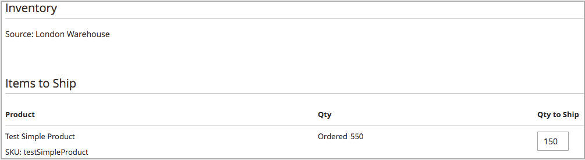

# 복수 출처 출하 생성

포함 [!DNL Inventory Management], 재고가 있는 대로 하나 이상의 선적을 전송합니다. 필요에 따라 추가 납품을 생성하려면 권장되거나 수동으로 입력된 수량 및 출처를 사용하여 이 지시사항을 반복합니다. 이 지시사항은 복수 출처 상인이 납품을 발송하는 방법을 자세히 설명합니다. 단일 소스 판매자는 이러한 추가 단계 없이 납품을 발송합니다(참조) [배송 만들기](../stores-purchase/shipments.md#create-a-shipment){target="_blank"} ( 핵심 사용 안내서)를 참조하십시오.

납품을 생성할 때 계산된 권장 사항에 소스 선택 알고리즘을 사용합니다. 이 권장 사항을 따라 사용하거나 소스당 금액을 설정하여 사용자 정의 선적을 생성합니다. 각 주문에 대해 나가는 재고를 통제하여 공제할 금액을 설정하고, 하나 이상의 납품을 발송하고, 재고를 사용할 수 있을 때 재고 및 미납주문을 납품합니다. 주문의 각 라인 품목에 대해 출처 수량에서 차감할 금액을 입력합니다.

부분 선적을 다음으로 보낼 수 있습니다.

- 재고가 도착하면 미납 주문 이행

- 출처 간 재고 공제 누계

출하를 입력할 때 현재고 수량은 입력된 금액을 차감합니다. 실제로 예약은 실제 수량 공제로 전환됩니다.

## 배송 만들기

1. 다음에서 _관리자_ 사이드바, 이동 **[!UICONTROL Sales]** > **[!UICONTROL Orders]**.

1. 주문을 찾아 보기 모드로 엽니다.

1. 주문이 지불되고 송장이 발행되었으며 배송 준비가 된 경우 다음을 클릭합니다. **[!UICONTROL Ship]**.

1. 소스당 제품 전송을 위한 소스 선택을 완료합니다.

   - 배송 권장 사항을 보려면 **[!UICONTROL Source Selection Algorithm]** 알고리즘을 선택합니다.

     | 알고리즘 | 설명 |
     |--|--|
     | [소스 우선 순위](source-priority-algorithm.md) | 재고에 지정된 출처의 주문에 따라 출처의 납품을 권장합니다. |
     | [거리 우선 순위](distance-priority-algorithm.md) | 실제 거리 또는 납품 최단 시간을 기준으로 운송 주소와 가장 가까운 출처의 납품을 권장합니다. |

     >[!IMPORTANT]
     >
     >배송 및 경로에 거리 우선 순위 알고리즘을 사용할 때 선택한 항목에 대해 데이터가 반환되지 않습니다 [계산 모드](distance-priority-algorithm.md) (운전, 자전거 또는 도보) 배송의 경우 SSA는 기본적으로 소스 우선 순위로 설정됩니다. 을 설정하는 것이 좋습니다. [종목별 소스에 대한 우선 순위](stocks-prioritize-sources.md).

   - 대상  **[!UICONTROL Select a Source to Ship from]**(으)로 발송할 출처를 선택합니다.

   - 각 라인 항목에 대해 권장 금액을 유지하거나 **[!UICONTROL Qty to Deduct]**. 이 값은 선택한 출처의 재고에서 공제되는 금액을 지정합니다.

   - 클릭 **[!UICONTROL Proceed to Shipment]**.

     {width="350" zoomable="yes"}

1. 리뷰 _[!UICONTROL New Shipment]_페이지를 만들고 필요에 따라 추가 변경 사항을 입력합니다.

   다음 _[!UICONTROL Inventory]_섹션에는 출처, 제품 출하, 총 주문 수량 및 납품할 수량이 표시됩니다.

   {width="350" zoomable="yes"}

1. 클릭 **[!UICONTROL Submit Shipment]** 완료를 위해.
