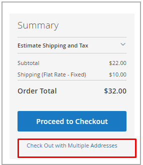

# 주문 및 배송 관리

[!DNL Inventory Management] 출하 프로세스를 통해 재고 수량을 관리하기 위한 추가 기능 및 옵션이 포함되어 있습니다. 납품을 검토 및 이행하고 주문을 취소하며 대변 메모를 발행하면 제품 판매 가능 및 현재고 수량이 자동으로 갱신됩니다.

이 정보에는 다음에 대한 세부 사항이 포함됩니다. [!DNL Inventory Management]. 자세한 내용은 [주문 수](../stores-purchase/orders.md){target="_blank"} 의 주제 _영업 및 구매 경험 안내서_.

## 주문 수

[!DNL Commerce] 는 추가 구성 없이 즉시 사용할 수 있는 단일 주문 및 다중 주소 주문을 지원합니다. 고객이나 직원이 주문을 입력할 때, [!DNL Inventory Management] 송장 발부 및 출하된 제품에 대한 재고 수량에서 제외하고 판매 가능 수량에 대해 예약을 사용하여 재고를 추적합니다.

### 다중 주소 주문

복수 주소 주문의 경우 입력된 각 대상 주소에 대해 하나씩 일련의 단일 주문이 생성됩니다. 체크아웃 시 고객은 체크아웃 시 주소별로 연관된 각 제품 세트를 선택하면 대상 주소에 따라 단일 주문으로 생성됩니다. 각 주문에는 주소별로 연결된 제품이 포함됩니다.

[!DNL Commerce] 단일 주문처럼 여러 주소 주문에 대한 재고를 관리합니다. 출고, 부분 출하, 주문 취소 및 재고 갱신으로 환불 중 출처 선택 알고리즘의 추천 또는 대체를 허용합니다.

{width="350" zoomable="yes"}

### 환불

을(를) 입력할 때 [대변 메모](../stores-purchase/credit-memo-create.md){target="_blank"} 환불하려면 제품 수량을 공제한 출처로 반품하면 됩니다. 주문 정보에는 제품을 출하한 재고 출처가 포함됩니다. 반품된 제품을 수령할 때 대변 메모를 통해 반품된 제품 수량을 낙찰하는 것이 좋습니다.

{width="350" zoomable="yes"}

### 미출하 주문 취소

주문이 출하되지 않고 취소되는 경우(전체 또는 일부), [!DNL Inventory Management] 자동으로 판매 가능한 수량으로 제품 재고를 반환합니다. 송장과 배송까지 구매한 제품은 실제 수량에서 공제되지 않고 판매 가능 수량에 대해 예약됩니다. 송장 발행 및 주문 출하 시점에서 시스템은 예약을 재고 공제로 전환합니다.

배후에서, [!DNL Inventory Management] 제품 수량에 대한 보류를 제거하는 보상 예약을 자동으로 입력합니다. 수량은 집계된 가상 판매 가능 수량으로 반환됩니다.

## 배송

포함 [!DNL Inventory Management] 사용가능으로 하나 이상의 출처에서 부분 또는 전체 납품을 발송하여 주문을 이행할 수 있습니다. 각 주문에 대해 나가는 재고를 통제하여 공제할 금액을 설정하고, 하나 이상의 납품을 발송하고, 재고를 사용할 수 있을 때 재고 및 미납주문을 납품합니다. 주문의 각 라인 품목에 대해 출처 수량에서 차감할 금액을 입력합니다. 전체 주문이 이행될 때까지 재고 재고를 가지고 있는 출처당 납품을 생성합니다.

### 부분 출하

멀티 소스 판매자의 경우 [!DNL Commerce] 선택한 모든 출처에 대해 선적을 생성합니다. 일반 워크플로우에서는 출처를 선택하고, 주문을 이행하기 위해 공제할 제품 수량을 설정하고, 납품을 진행할 수 있습니다. 완료되면 주문을 이행할 때까지 각 출처에 대해 추가 납품을 생성합니다.

단일 출처 판매자는 인기 품목에 대한 주문이 들어올 때 미납주문을 지원하거나 재고 잔고를 위해 부분 선적을 보낼 수도 있습니다.

### Recommendations 및 소스 선택 알고리즘

다음 [소스 선택 알고리즘](selection-reservations.md) (SSA)는 부분 및 전체 배송에 대한 권장 사항을 제공합니다. 주문에 대한 선적 송장을 생성할 때 출처 선택 알고리즘에 액세스할 수 있습니다. 출하 페이지를 통해 언제든지 출처 우선순위 또는 거리 우선순위 알고리즘을 실행하여 주문 수량 및 가용 출처를 대응시키는 최상의 옵션을 결정합니다. 시스템은 하나의 출처에서 전체 주문을 출하하고, 주문을 여러 출처에서 복수 부분 출하로 나눌 수 있도록 지원합니다. 즉시 이행 및 순차적 납품을 위해 이러한 옵션에 액세스하여 시간이 지남에 따라 더 적은 금액을 보낼 수 있습니다.

주문을 완료하고 발송하려면 지급을 완료하고 송장을 발행해야 합니다. 현재, 추천에 대해 SSA를 재실행하고 하나 이상의 출처에서 출하하거나, 출하를 이행하기 위해 출처와 수량을 수동으로 설정하여 SSA 추천을 대체할 수 있습니다.

- 모든 배송에 대한 권장 사항을 검토하려면 SSA를 다시 실행하는 것이 좋습니다.

- 선택사항을 변경하려면 수동 출처 공제로 대체할 수 있습니다.

### 배송 및 예약

배송이 발생함에 따라 제품에 대한 예약이 명확해지고 제품 수량이 차감됩니다. 출하 상세내역을 기반으로 한 재고당 현재고 수량 갱신. 예를 들어, 두 출처에서 10개 제품에 대한 납품을 발송하는 경우, 해당 출처에 대한 수량은 각각 10개를 차감합니다. 판매 가능 수량은 연관된 주식에 대해 자동으로 새로 고침되므로 고객과 직원에게 최신 제품 금액을 제공합니다. 그리고 예약은 완전히 지워지므로 더 이상 판매 가능 수량에 따라 계산되지 않습니다.
