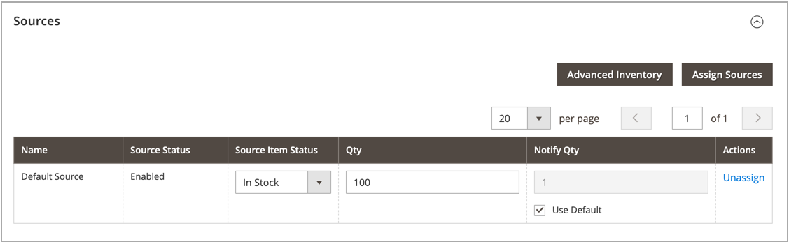

# 제품당 소스 할당

수량 및 설정을 수정하기 전에 제품에 [소스](sources-manage.md)를 할당해야 합니다.

{{$include /help/_includes/unassign-source.md}}

## 제품에 소스 할당

1. _관리자_ 사이드바에서 **[!UICONTROL Catalog]** > **[!UICONTROL Products]**(으)로 이동합니다.

1. _편집_ 모드로 제품을 엽니다.

1. 확장 선택기&#x200B;**[!UICONTROL Sources]**&#x200B;를 확장합니다.

   이 섹션에서는 출처를 수정하고 재고 수량을 업데이트하는 등의 작업을 수행할 수 있습니다.

   >[!NOTE]
   >
   >현재는 단순, 구성 가능, 가상, 다운로드 가능 및 그룹화된 제품만 여러 소스를 지원합니다. 기본 Source 및 Stock만으로 번들 제품을 만들고 관리할 수 있습니다.

   {width="600" zoomable="yes"}

1. 원본을 추가하려면 **[!UICONTROL Assign Sources]**&#x200B;을(를) 클릭하십시오.

1. _[!UICONTROL Assign Sources]_&#x200B;페이지에서 제품에 할당하려는 각 원본 옆의 확인란을 선택합니다.

   {width="600" zoomable="yes"}

1. 소스를 추가하려면 **[!UICONTROL Done]**&#x200B;을(를) 클릭하십시오.

1. 다음 중 하나를 수행하여 저장합니다.

   - **[!UICONTROL Save]**&#x200B;을(를) 클릭합니다.
   - _[!UICONTROL Save]_() 메뉴에서&#x200B;**[!UICONTROL Save & Close]**&#x200B;을(를) 선택합니다.

원본을 할당한 후 각 제품 원본의 [재고 수량](quantities-assign-per-product.md)을(를) 업데이트하세요.

<!-- Last updated from includes: 2022-08-30 15:36:09 -->
