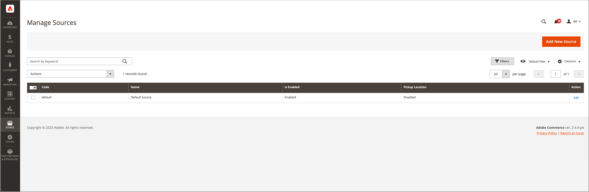

# 소스 관리

출처는 주문 이행을 위해 제품 재고를 관리하고 출하하는 물리적 위치 또는 서비스를 사용할 수 있는 물리적 위치입니다. 이러한 위치에는 창고, 오프라인 매장, 물류 센터, 픽업 위치 및 드롭 화주가 포함될 수 있습니다. 이러한 소스에 재고 수량을 할당하면 [!DNL Commerce]에서 재고에 대한 총 판매 가능 제품을 자동으로 집계합니다. 대기업의 경우 모든 위치에 대해 국가 및 대륙별로 다른 지리적 위치에 서비스를 기반으로 한 인벤토리의 유형에 따라 도시의 위치에 여러 소스를 추가하십시오.

소스를 만들 때 특정 물리적 지리적 위치를 제공하는 것이 좋습니다. 이를 통해 _거리 우선 순위 알고리즘_&#x200B;은(는) 배송 대상 주소의 위치를 사용 가능한 원본 위치와 비교하여 배송을 이행할 가장 가까운 원본을 결정할 수 있습니다. 지리 코드를 사용하는 Google 맵 또는 오프라인 계산을 사용할 수 있습니다. 이 _거리 우선 순위 알고리즘_&#x200B;에 대한 자세한 내용은 [거리 우선 순위 알고리즘 구성](distance-priority-algorithm.md)을 참조하십시오.

업데이트할 수 있지만 비활성화할 수 없는 _기본 Source_(으)로 시작합니다. 이 소스는 단일 소스 판매자가 사용하고 제품 마이그레이션에 사용됩니다. 항상 기본 소스가 필요합니다.

- **위치 정보** - 각 소스에는 이름, 국가, 위치의 실제 주소 및 연락처가 포함됩니다.
- **리소스 사용** - 필요에 따라 소스를 사용하거나 사용하지 않도록 설정할 수 있습니다. 주문과 미납주문을 수락하고 이행하는 경우에만 소스를 사용으로 설정합니다.
- **사용 가능한 재고** - 제품 페이지를 통해 각 소스에 대한 재고 수량을 할당하고 업데이트합니다. 재고 수량은 출처 및 재고 맵핑을 통해 계산, 제공 및 예약됩니다.

다음 다이어그램은 주식이 제공되고 배송을 위해 SSA가 액세스할 수 있는 산악 자전거를 판매하는 자전거 상점 상인의 소스를 설명하는 데 도움이 됩니다.

{width="600" zoomable="yes"}

모든 저장소는 활성화 상태를 유지해야 하는 기본 Source으로 시작합니다.

- [!DNL Commerce] (으)로 가져온 모든 새 제품에는 원본 및 재고가 필요하며, [!DNL Inventory Management]에 즉시 액세스할 수 있도록 자동으로 할당됩니다.
- 단일 소스 판매자는 기본 Source을 단일 재고 위치 및 출하 지점으로 사용합니다.

## 소스 편집

이름, 주소, GPS 위치 및 연락처 정보를 업데이트할 수 있습니다. 소스의 코드는 소스를 제품 수량 및 재고와 연결하는 고유 ID 역할을 하는 보호된 값입니다.

기본 Source을 편집하는 경우 이름 및 코드를 제외한 모든 구성을 편집할 수 있습니다. 단일 소스 판매자의 위치에 일치하는 정보를 추가하는 것이 좋습니다.

_[!UICONTROL Manage Sources]_&#x200B;페이지에는 사용 가능한 모든 인벤토리 위치와 이행 기능이 나열됩니다. 새 인벤토리 소스를 추가하고 기존 위치를 편집할 수 있습니다.

1. _관리자_ 사이드바에서 **[!UICONTROL Stores]** > _[!UICONTROL Inventory]_>**[!UICONTROL Sources]**(으)로 이동합니다.

1. 인벤토리 위치를 추가하려면 [새 Source 추가](sources-add.md)를 참조하세요.

1. 인벤토리 원본을 찾아 _편집_ 모드로 엽니다.

1. 정보를 업데이트하고 변경 사항을 저장합니다.

   {width="600" zoomable="yes"}

## 단추 막대

| 단추 | 설명 |
|--|--|
| [!UICONTROL Add New Source] | 새 재고 출처, 이행 시설 또는 위치를 입력하는 데 사용되는 새 Source 양식을 엽니다. |

## 소스 열 설명 관리

| 열 | 설명 |
|--|--|
| [!UICONTROL Code] | 재고 출처를 식별하기 위해 시스템에서 사용하는 고유한 영숫자 코드입니다. |
| [!UICONTROL Name] | 관리자의 인벤토리 소스를 식별하는 고유한 이름입니다. |
| [!UICONTROL Is Enabled] | 인벤토리 소스가 활성 상태이고 사용할 수 있는지 여부를 나타냅니다. |
| [!UICONTROL Pickup Location] | 원본이 [매장 내 배달](../stores-purchase/shipping-in-store-delivery.md)을 위한 픽업 위치로 활성 상태인지 여부를 나타냅니다. |
| [!UICONTROL Action] | **[!UICONTROL Edit]**&#x200B;을(를) 클릭하면 인벤토리 원본 레코드가 편집 모드로 열립니다. |

## 기타 열

| 열 | 설명 |
|--- |--- |
| [!UICONTROL Latitude] | GPS용 인벤토리 소스의 위도 좌표를 지정합니다. 필요에 따라 더하기 또는 빼기 기호 앞에 숫자로 값을 입력합니다. 차수 기호와 글자는 허용되지 않습니다. 예: `32.7555` |
| [!UICONTROL State/Province] | 소스가 있는 시/도입니다. |
| [!UICONTROL Postcode] | 소스의 ZIP 또는 우편 번호입니다. |
| [!UICONTROL Email] | 기본 연락처의 이메일입니다. |
| [!UICONTROL Longitude] | GPS용 인벤토리 소스의 경도 좌표를 지정합니다. 필요에 따라 더하기 또는 빼기 기호 앞에 숫자로 값을 입력합니다. 차수 기호와 글자는 허용되지 않습니다. 예: 경도 -97.3308 |
| [!UICONTROL City] | 소스가 있는 도시입니다. |
| [!UICONTROL Phone] | 기본 연락처의 전화 번호입니다. |
| [!UICONTROL Country] | 소스가 있는 국가입니다. |
| [!UICONTROL Street] | 소스의 주소. |
| [!UICONTROL Fax] | 기본 연락처의 지역 번호 및 팩스 번호입니다. |
