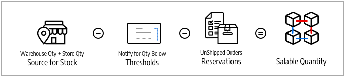

# 재고 및 소스

창고 위치, 제품 또는 서비스 유형 또는 판매 채널에 관계없이 재고를 관리합니다. 균형 잡힌 재고, 운송 비용 등에 중점을 두고 여러 창고, 오프라인 매장, 물류 센터 및 직송 지점에서 주문을 이행하고 제품을 출하하여 주문을 완료할 수 있습니다.

이러한 설명에는 미국과 유럽에서 여러 선적 위치와 웹 사이트를 보유한 자전거 회사의 제품, 소스 및 재고가 포함됩니다.

## 소스

[소스](sources-manage.md) 제품 재고를 관리하고 주문 이행을 위해 배송하는 실제 위치 또는 서비스를 사용할 수 있는 실제 위치입니다. 이러한 위치에는 창고, 오프라인 매장, 물류 센터 및 직송인이 포함될 수 있습니다. [!DNL Commerce] 재고당 수량 및 판매 가능 수량을 사용하고 관리되는 제품 및 주문에 대해 재고 금액을 자동으로 관리합니다. 소스가 하나라면 _단일 소스_ 모드. 소스가 여러 개 있는 경우에서 고려 대상이 됩니다. _다중 소스_ 모드.

출처는 하나의 창고에 있는 주식의 범위에서 우선순위를 가질 수 있지만, 출처가 다른 주식에 재사용될 수 있기 때문에 반드시 모든 창고에 있는 것은 아니다. 주식과 출처의 수는 주문을 이행할 최적의 창고나 매장을 결정하는 복잡성을 가중시킨다. 예를 들어, 창고에 광범위한 재고가 있고 가용성이 제한된 주요 위치에 서비스가 있는 오프라인 위치에서 사용할 수 있는 제품의 수가 제한될 수 있습니다.

이 예에서 판매자는 상점, 창고 및 직송업체에서 출하할 수 있는 산악 자전거를 보유하고 있습니다.

{width="600" zoomable="yes"}

## 재고

[재고](stocks-manage.md) 은 판매 채널(웹 사이트)에 판매할 수 있는 제품의 집계된 가상 인벤토리를 나타냅니다. 각 재고는 판매 채널을 가용 재고 및 판매 가능 수량에 대한 출처와 매핑합니다. 사이트 구성에 따라 재고가 하나 이상의 판매 채널 및 소스에 할당될 수 있습니다.

Sales Channel은 웹 사이트, 스토어 보기, B2B 고객 그룹 등을 포함하여 인벤토리를 판매하는 엔티티를 나타냅니다. 판매 채널은 하나의 Stock에만 연결할 수 있습니다. 각 판매 채널에는 단일 주식만 할당할 수 있으며 단일 주식은 여러 웹 사이트에 할당할 수 있습니다. 재고를 통해 주문 배송 시 사용되는 출처의 우선 순위를 수정할 수 있습니다. [소스 선택 알고리즘](selection-reservations.md).

기본 소스 및 웹 사이트가 지정된 단일 소스 판매자가 가장 잘 사용하는 기본 스톡으로 시작합니다. 기본 출처만 이 재고에 지정할 수 있습니다. 다중 소스 판매자는 필요에 따라 사용자 지정 소스 및 웹 사이트에 대한 사용자 지정 주식을 만듭니다.

{width="600" zoomable="yes"}

## 제품 수량

수량은 구매가 가능한 활성 재고의 제품 수입니다. 출하를 완료하거나 재고를 조정하면 제품의 수량이 증가하거나 감소합니다. 장바구니에 제품을 추가해도 이 금액에는 영향을 주지 않습니다. 판매 가능 수량은 판매 채널에 대한 제품 가용성을 추적하고 이 값을 사용하여 구매 가능 재고를 결정합니다. 소스 수에 따라 다음 중 하나의 제품 수량을 확인하고 관리합니다.

- **수량** - 단일 소스 판매자의 경우 _[!UICONTROL Quantity]_열 및 값은 사용 가능한 현재고 금액을 추적합니다.
- **소스당 수량** - 다중 소스 판매자의 경우 _[!UICONTROL Quantity per Source]_열과 값은 위치별로 사용 가능한 현재고를 추적합니다. 여러 출처를 추가하는 경우 이 값은 수량을 대체하며 모든 출처와 지정된 수량을 나열합니다.

예약은 장바구니에 제품 추가, 체크아웃 완료, 환불 관리 등 전체 쇼핑 프로세스에 대한 재고 요청을 추적합니다. 예약 가능한 재고 및 재고의 경우 예약 시 판매 가능 수량에서 빼서 체크아웃 프로세스를 통해 주문당 재고 금액을 예약합니다. 예약은 송장 발행 및 제품 배송 시 수량 공제로 전환됩니다.

판매 가능 수량은 구성된 임계값, 예약 또는 판매 금액 및 출처당 수량을 사용하여 제품의 가상 재고(또는 가용성)를 계산합니다. 각 주식에 대해, [!DNL Commerce] 지정된 모든 출처에 액세스하고 관련 제품 수량을 집계합니다. 이 기준 값을 사용하여 모든 예약 금액과 _[!UICONTROL Notify for Quantity Below]_임계값.

{width="600" zoomable="yes"}

## 인벤토리 구성

모든 제품, 소스 및 재고에는 글로벌, 소스, 재고 및 제품 수준에서 스토어에 대해 구성할 수 있는 몇 가지 옵션이 포함되어 있습니다. 이러한 옵션의 전체 목록은 다음을 참조하십시오. [Inventory management 구성](configuration.md).

다음에 대해 이해해야 하는 중요한 옵션이 있습니다 [!DNL Inventory Management]:

- **[!UICONTROL Out-of-Stock Threshold]** - 판매 수량에서 뺄 금액을 설정합니다. 미납주문을 사용하는 경우 이 값은 판매 가능 수량에서 공제되지 않습니다.
- **[!UICONTROL Backorders]** - 재입고까지 주문을 저장하여 재고가 없는 상태에서 제품을 판매할 수 있는지 여부를 결정합니다. 미납주문 활성화 시 [!UICONTROL Out-of-Stock Threshold] 권장됩니다.

>[!NOTE]
>
>재고 부족 임계값은 음수 및 양수 금액을 지원합니다. 미납주문을 사용하는 경우 해당 제품이 실제로 품절로 간주되기 전에 미납주문될 수 있는 최대 제품 수에 대해 이 값을 음수로 설정합니다.

## Inventory management 데모

이 비디오를 통해 Inventory management 소스 및 재고에 대해 알아보십시오.

>[!VIDEO](https://video.tv.adobe.com/v/343748?quality=12)
