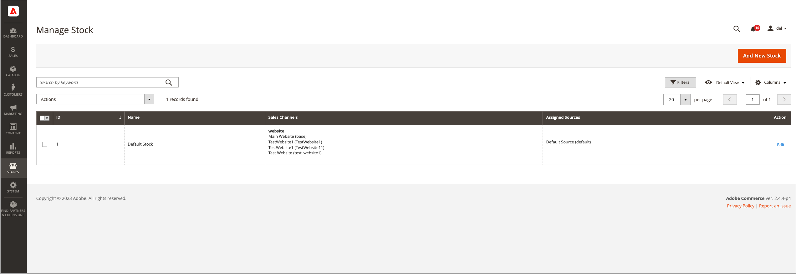

# 재고 관리

재고 는 판매 채널(웹 사이트) 소스에 대한 가상 집계된 제품 재고를 나타냅니다. 사이트 구성에 따라 재고가 하나 이상의 판매 채널에 할당될 수 있습니다. 각 판매 채널에는 단일 주식만 지정될 수 있으며 단일 주식은 여러 판매 채널에 지정될 수 있습니다. 재고를 통해 판매 채널을 통해 주문이 들어올 때 사용되는 소스의 우선 순위를 수정할 수 있습니다.

제거하거나 비활성화할 수 없는 기본 스톡으로 시작합니다. 재고에만 판매 채널을 더 추가할 수 있습니다. 기본 Source 소스만 할당됩니다. 이 재고는 단일 소스 판매자, 서드파티 통합 및 가져온 제품에서 사용됩니다.

Sales Channel은 재고를 판매하는 개체를 나타냅니다. 기본적으로 [!DNL Commerce]은(는) 스토어 웹 사이트를 판매 채널로 제공합니다. 판매 채널을 확장해 B2B 고객 그룹과 매장 조회수 등 추가 채널을 지원할 수 있다. 각 판매 채널은 하나의 Stock에만 연결할 수 있습니다.

- **Sales Channel 지원** - 현재 판매 채널에는 기본 제공 웹 사이트가 포함됩니다. B2B 고객 그룹 및 스토어 보기와 같은 사용자 지정 옵션을 포함하도록 판매 채널을 확장할 수 있습니다. 각 판매 채널에는 단일 주식만 지정할 수 있습니다. 단일 주식을 여러 판매 채널에 할당할 수 있습니다.
- **소스에 매핑** - 각 재고에 하나 이상의 활성화 또는 비활성화 소스가 지정될 수 있으며 제품당 가상 집계된 인벤토리를 계산합니다.
- **우선 순위 주문 이행** - Source 선택 알고리즘의 기본 우선 순위 알고리즘은 주문을 이행할 때 주식의 원본 목록을 위에서 아래로 사용합니다.

다음 다이어그램은 자전거 상점 상인의 소스 및 Sales Channel과 관련하여 Stock이 작동하는 방식을 정의하는 데 도움이 됩니다.

{width="600" zoomable="yes"}

## 산악 자전거 및 상점에 대한 예시 스톡

모든 스토어는 기본 스톡으로 시작합니다. 다음과 같은 이유로 `Enabled` 상태로 유지되어야 합니다.

- 새 제품을 가져올 때 [!DNL Inventory Management]에 즉시 액세스할 수 있도록 기본 원본 및 재고에 제품을 자동으로 할당하는 데 사용됩니다.
- 기본 Source 이외의 소스를 이 스톡에 추가할 수 없습니다.
- 단일 소스 판매자, 번들 제품 및 그룹화된 제품에서 필요하며 사용됩니다.

멀티 소스 판매자의 경우, 스토어와 주문 이행에 가장 적합한 재고를 만들고 구성합니다. 판매 채널에 신규 재고를 지정하면 해당 판매 채널에 있는 기존 재고가 모두 지정 취소됩니다.

다중 스토어 설치의 경우 기본 스톡은 처음에 [기본 웹 사이트](../stores-purchase/stores.md#add-websites){target="_blank"} 및 기본 스토어에 할당됩니다. **[!UICONTROL Products]** 눈금 보기에서 사용 및 사용 안 함 제품에 대한 올바른 재고 및 수량이 표시됩니다.

{width="600" zoomable="yes"}

## 단추 막대

| 단추 | 설명 |
|--|--|
| [!UICONTROL Add New Stock] | 판매 채널에 인벤토리를 매핑하기 위해 새 재고 재고를 입력하는 데 사용되는 _[!UICONTROL New Stock]_양식을 엽니다. |

## Stock 열 설명 관리

| 열 | 설명 |
|--|--|
| [!UICONTROL ID] | 재고 입력에 대해 생성된 고유한 숫자 ID입니다. |
| [!UICONTROL Name] | 재고 재고를 식별하는 고유 이름입니다. |
| [!UICONTROL Sales Channels] | 주식을 특정 웹 사이트에 _판매 채널_(으)로 할당하여 주식의 범위를 정의합니다. |
| [!UICONTROL Assigned sources] | 모든 제품 수량을 공급하는 재고에 지정된 출처. |
| [!UICONTROL Action] | **[!UICONTROL Edit]** - 편집 모드로 재고 기록을 엽니다. |
