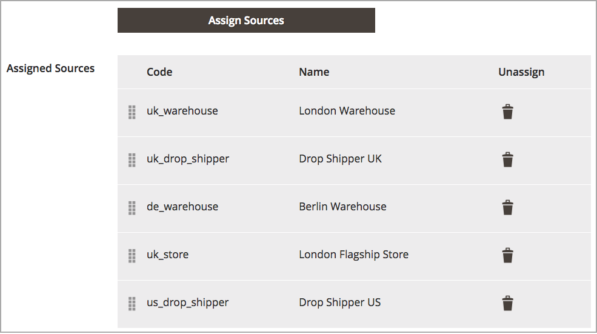

# 재고에 대한 소스 우선 순위 지정

추가 후 [소스](sources-manage.md) (으)로 [stock](stocks-manage.md)을 눌러 주문을 이행하기 위해 해당 소스를 맨 위에서 아래로 정렬합니다. 출처선택알고리즘(SSA)에서는 출고 및 재고 공제를 결정할 때 이 순서를 이용한 알고리즘 우선순위를 제공한다.

재고에 대한 출처 우선순위는 제품 재고를 편집할 때 지정된 출처에 영향을 주지 않습니다.

이 예에서 UK Stock은 London에 한 개의 상점과 두 개의 창고 및 Berlin에 한 개의 창고에 대해 주문되지 않은 소스가 할당되어 있습니다.

{width="350" zoomable="yes"}

상인은 더 큰 베를린 창고에서 우선 출하하는 것을 선호하며, 그 다음으로는 런던 창고, 런던 범람 장소, 그리고 마지막으로 런던의 상점으로부터 우선 출하하는 것을 선호합니다. 순서를 변경하려면 항목을 원하는 순서로 드래그하여 놓습니다.

1. 다음에서 _관리자_ 사이드바, 이동 **[!UICONTROL Stores]** > _[!UICONTROL Inventory]_>**[!UICONTROL Stocks]**.

1. 에서 재고를 엽니다 _편집_ 모드.

1. 확장 _[!UICONTROL Sources]_필요한 경우 탭입니다.

1. 사용  소스를 맨 위(첫 번째)에서 맨 아래(마지막)의 우선 순위로 끌어다 놓습니다.

   이 주문은 배송 주문 시 중요합니다. SSA는 출처의 순서에 따라 배송을 추천합니다

1. 클릭 **[!UICONTROL Save & Continue]** 변경 내용을 저장합니다.

{width="350" zoomable="yes"}
