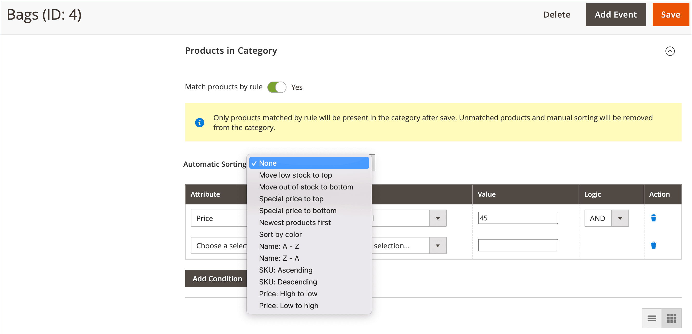

# 머천다이징에 대한 범주 규칙

{{ee-feature}}

카테고리 규칙은 조건 세트에 따라 제품 선택을 동적으로 변경합니다. 단일 규칙이 여러 조건을 가질 수 있지만 각 카테고리에는 하나의 카테고리 규칙만 있을 수 있습니다. 예를 들어 특정 브랜드에 대한 카테고리 규칙을 만들 수 있습니다. 동일한 카테고리에 할당되지 않은 경우에도 동일한 브랜드의 제품이 자동으로 목록에 추가됩니다. 포함할 제품을 설명하는 데 필요한 만큼 표현식에 조건을 추가할 수 있습니다.

>[!TIP]
>
>범주 규칙을 설정하는 동안 제품은 다음과 같습니다. _정렬됨_, _일치함_, _할당됨_, 및 _할당 해제됨_ 그 규칙에 따르면 **_전용_** 이 범주가 저장되면 예를 들어 카탈로그에 제품을 추가하고 규칙에 따라 할당하려면 다음을 수행합니다 **각 범주를 다시 저장해야 함** 는 규칙에 따라 제품과 일치하도록 설정되었습니다. 또한 제품 재고 상태가 (으)로 변경된 경우 `In Stock` 또는 `Out of Stock` 및 카테고리의 제품은 다음과 같아야 합니다. _정렬됨_ 에 따라 **[!UICONTROL Automatic Sorting]** 규칙, 다음을 클릭해야 합니다. **[!UICONTROL Save Category]**.

각 조건은 속성, 값 및 논리 연산자로 구성됩니다. 이 있는 속성만 _[[!UICONTROL Use in Product Listing]](../catalog/attribute-product-create.md)_속성이 로 설정됨 `Yes` 카테고리 규칙에 사용할 수 있습니다. 제품 목록에 포함되지 않은 속성을 사용하려면 속성에 대해 이 속성을 설정해야 합니다. 날짜 속성은 지원되지 않지만 작성일 또는 수정한 날짜 속성을 사용하여 날짜 또는 날짜 범위를 정의할 수 있습니다. 예를 들어 지난 주 동안 생성된 제품만 포함하려면 &quot;만든 날짜&quot;를 값으로 설정합니다. `<7`.

>[!NOTE]
>
>규칙에 로 사용되는 각 속성을 구성해야 합니다. [_스마트_ 속성](smart-attributes-configure.md).

{width="600" zoomable="yes"}

범주 제품 규칙은 범주에 나타나는 제품을 결정하는 조건에 따라 특정 제품을 범주에 할당하는 프로세스를 가속화할 수 있습니다. 카테고리 제품 규칙과 함께 사용할 수 있는 &quot;스마트&quot; 속성은 [Visual Merchandiser](visual-merchandiser.md) 구성.

>[!NOTE]
>
>조건에 맞지 않는 제품은 모두 카테고리에서 제거되므로 카테고리 제품 규칙을 적용할 때는 주의하십시오. 예를 들어 자주색 탱크 상단만 포함하는 규칙을 만드는 경우 다른 모든 탱크 상단이 카테고리에서 제거됩니다.

## 1단계: 구성 _스마트_ 속성

1. 규칙에 사용할 각 속성에 대해 [[!UICONTROL Use in Product Listing]](../catalog/product-attributes.md) storefront 속성이 `Yes`.

   >[!NOTE]
   >
   >선택한 속성이 다중 선택이 아닌지 확인합니다. _[!UICONTROL Input Type]_.

1. 다음을 완료합니다. [구성](smart-attributes-configure.md) 각각 식별 _스마트_ visual Merchandiser에 사용할 속성입니다.

## 2단계: 카테고리 규칙 만들기

1. 카테고리 트리에서 편집할 카테고리를 엽니다.

1. 다음에서 **[!UICONTROL Products in Category]** 섹션, 설정 **[!UICONTROL Match products by rule]** 끝 `Yes`.

   자동 정렬 및 조건 옵션이 나타납니다.

1. 클릭 **[!UICONTROL Add Condition]**.

1. 다음을 선택합니다. **[!UICONTROL Attribute]** 그것이 그 조건의 기초이다.

1. 설정 **[!UICONTROL Operator]** 다음 중 하나를 수행합니다.

   - `Equal`
   - `Not equal`
   - `Greater than`
   - `Greater than or equal to`
   - `Less than`
   - `Less than or equal to`
   - `Contains`

1. 다음을 입력합니다. **[!UICONTROL Value]** 일치시킬 수 있습니다.

   {width="500"}

1. 충족될 조건을 설명하는 데 필요한 각 속성에 대해 이 프로세스를 반복합니다.

   예를 들어 7일에서 30일 전에 생성된 제품을 일치시키려면 다음을 수행합니다.

   - 설정 **[!UICONTROL Date Created]** 끝 `Less than 30`.

   - 설정 **[!UICONTROL Logic]** 끝 `AND`.

     >[!NOTE]
     >
     >다음을 선택할 때 `AND`, 규칙은 모든 조건이 충족되는 제품에 적용됩니다. 무엇을 선택하시겠습니까 `OR`, 하나 이상의 조건이 충족되는 제품에 적용됩니다.

   - 설정 **[!UICONTROL Date Modified]** 끝 `Greater than 7`.

1. 동적으로 생성된 제품 목록에 자동으로 정렬 순서를 적용하려면 다음을 설정합니다. **[!UICONTROL Automatic Sorting]**.

   {width="600" zoomable="yes"}

   정렬은 현재 상태를 기반으로 합니다.

   | 정렬 옵션 | 설명 |
   |-----------| -----------|
   | [!UICONTROL Stock quantity] | 재고 기준 정렬(위쪽 또는 아래쪽): `Move low stock to top` 또는 `Move out of stock to bottom` |
   | [!UICONTROL Special price] | 가격을 기준으로 정렬합니다(위쪽 또는 아래쪽에서). `Special price to top` 또는 `Special price to bottom` |
   | [!UICONTROL New Products] | 최신 제품 나열: `Newest products first` |
   | [!UICONTROL Color] | 색상별로 알파벳순으로 정렬: `Sort by color` |
   | [!UICONTROL Product Names] | 이름별로 오름차순 또는 내림차순으로 정렬합니다. `Name A - Z` 또는 `Name Z -A` |
   | [!UICONTROL SKU] | SKU별로 오름차순 또는 내림차순으로 정렬합니다. `SKU: Ascending` 또는 `SKU: Descending` |
   | [!UICONTROL Price] | 가격별로 오름차순 또는 내림차순으로 정렬합니다. `Price: High to low` 또는 `Price: Low to high` |

   {style="table-layout:auto"}

1. 완료되면 다음을 클릭하십시오. **[!UICONTROL Save Category]**.

>[!NOTE]
>
>카테고리 규칙을 설정할 때 카테고리가 저장될 때 제품이 매칭되어 규칙에 지정됩니다. 제품을 카탈로그에 추가하고 규칙에 포함하려면 제품별로 일치하도록 설정된 각 카테고리를 규칙별로 다시 저장해야 합니다. 이렇게 하면 새 제품이 포함됩니다.

### 메뉴 옵션

- **[!UICONTROL Match products by rule]** - 카테고리의 제품 목록이 카테고리 규칙에 의해 동적으로 생성되는지 여부를 결정합니다. 옵션: `Yes` / `No`

- **[!UICONTROL Automatic Sorting]** - 범주 제품 목록에 정렬 순서를 자동으로 적용합니다. 옵션: `None`, `Move low stock to top`, `Move low stock to bottom`, `Special price to top`, `Special price to bottom`, `Newest products first`, `Sort by color`, `Name: A - Z`, `Name: Z - A`, `SKU: Ascending`, `SKU: Descending`, `Price: High to Low`, 및 `Price: Low to High`

  >[!NOTE]
  >
  >하위 제품으로 구성 가능한 제품이 있는 경우 상위 제품 스톡은 하위 제품 스톡의 총 합계를 기반으로 계산됩니다. 제품을 구성할 수 있는 예를 생각해 보십시오. _Proteus 피트니스 셔츠_ 각각 재고 수량이 다른 주황색, 빨간색, 노란색 하위 제품이 있습니다. 모제품 주식은 주황색, 적색 및 황색 하위 제품의 재고 합계를 기반으로 계산됩니다. 포함 `Move low stock to top` 옵션에서는 판매 가능한 모든 하위 제품 주식을 결합하여 상위 제품의 주식을 계산하고 그에 따라 정렬합니다.

- **[!UICONTROL Add Condition]** - 규칙에 다른 조건을 추가합니다.

- **[!UICONTROL Attribute]** - 조건의 기반으로 사용되는 속성을 결정합니다. 옵션:

  | 옵션 | 설명 |
  | ------ | ----------- |
  | `Clone Category ID(s)` | 분류 및 순서 없이 범주 ID를 기준으로 여러 범주의 제품을 동적으로 복제합니다. |
  | `Color` | 색상을 기반으로 하는 제품을 포함합니다. |
  | `Date Created (days ago)` | 카탈로그에 제품이 추가된 이후 일 수를 기준으로 제품을 포함합니다. |
  | `Date Modified (days ago)` | 제품을 마지막으로 수정한 이후 일 수를 기반으로 하는 제품을 포함합니다. |
  | `Name` | 제품 이름을 기반으로 하는 제품을 포함합니다. |
  | `Price` | 가격에 기반한 제품을 포함합니다. 구성 가능한 제품에는 자체 가격이 없으므로 이 속성을 적용할 수 없습니다. |
  | `Quantity` | 재고 수량을 기반으로 하는 제품을 포함합니다. |
  | `SKU` | SKU를 기반으로 하는 제품을 포함합니다. |

  {style="table-layout:auto"}

  >[!NOTE]
  >
  >하위 옵션이 있는 구성 가능한 제품의 수량은 모든 판매 가능한 하위 제품 수량을 결합하여 계산됩니다. 구성 가능한 제품이 있는 예를 생각해 보십시오. _기본 피트니스 탱크_ 자주색, 빨간색 및 노란색 옵션이 있으며 각 색상의 수량이 다릅니다. 이 경우 모제품(기초체력조) 수량은 보라색, 붉은색, 노란색의 아동용품을 합한 판매가능량이다.

- **[!UICONTROL Operator]** - 조건을 충족하기 위해 속성 값에 적용되는 연산자를 지정합니다. 연산자를 지정하지 않으면 `Equal` 는 기본값으로 사용됩니다. 옵션: `Equal`, `Not equal`, `Greater than`, `Greater than or equal to`, `Less than`, `Less than or equal to`, 및 `Contains`

- **[!UICONTROL Value]** - 조건을 충족하기 위해 특성이 가져야 하는 값을 지정합니다.

- **[!UICONTROL Logic]** - 논리 열은 여러 조건을 정의하는 데 사용되며 다른 조건이 추가될 때만 나타납니다. 연산자는 MySQL의 우선 순위 규칙을 따릅니다 [부울 연산자](https://dev.mysql.com/doc/refman/8.0/en/operator-precedence.html). 옵션: `AND` / `OR`
