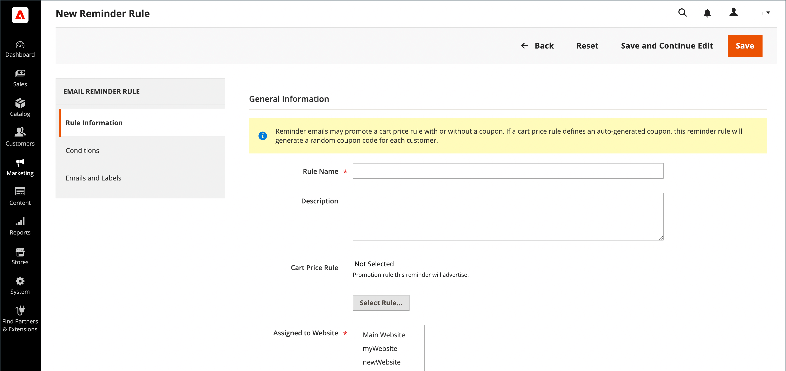
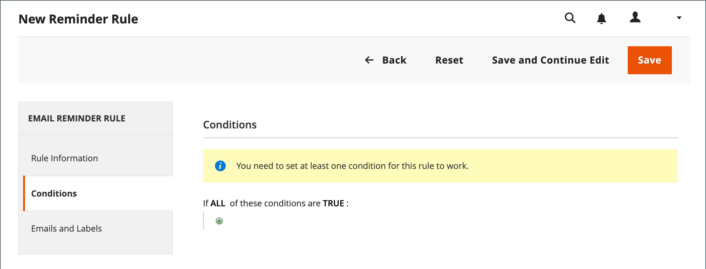
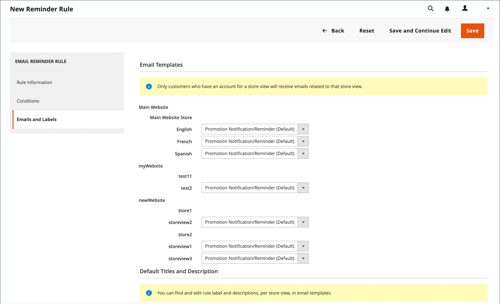
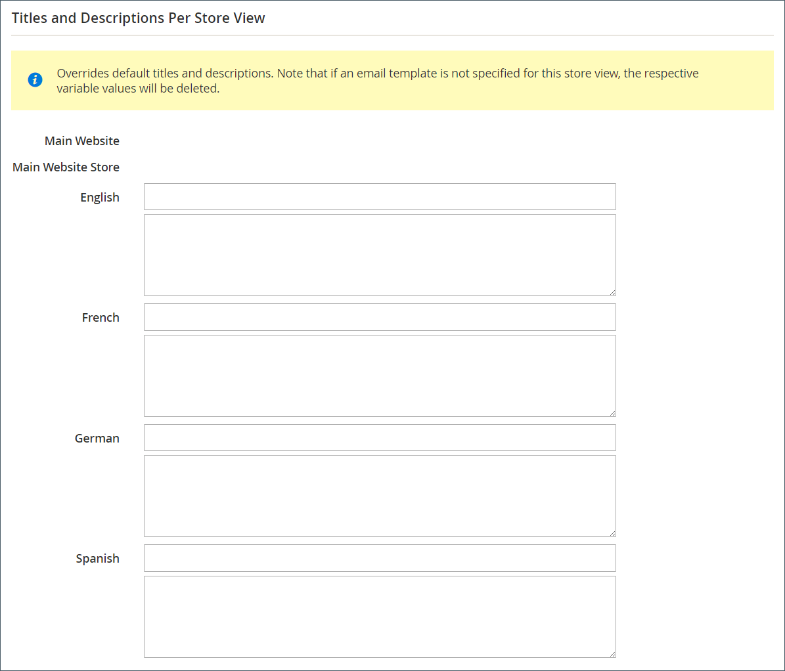

# 이메일 미리 알림 만들기

이메일 미리 알림 규칙을 설정하기 전에 먼저 [장바구니 가격 규칙을 설정](price-rules-cart-create.md)하여 제공되는 프로모션을 정의해야 합니다. 이메일 미리 알림을 트리거하는 규칙 조건은 장바구니 속성, 위시리스트 속성 또는 둘 다를 기반으로 할 수 있습니다.

>[!NOTE]
>
>이메일 미리 알림은 쿠폰을 사용하거나 사용하지 않는 장바구니 가격 규칙을 홍보할 수 있습니다. 자동 생성된 쿠폰을 정의하는 장바구니 가격 규칙은 각 고객에 대한 무작위 쿠폰 코드를 생성합니다.

1. _관리자_ 사이드바에서 **[!UICONTROL Marketing]** > _[!UICONTROL Communications]_>**[!UICONTROL Email Reminder Rules]**(으)로 이동합니다.

1. 오른쪽 상단에서 **[!UICONTROL Add New Rule]**&#x200B;을(를) 클릭합니다.

1. 다음과 같이 _[!UICONTROL Rule Information]_&#x200B;을(를) 완료합니다.

   {width="700" zoomable="yes"}

   - 내부적으로 규칙을 식별하려면 **[!UICONTROL Rule Name]**&#x200B;을(를) 입력하십시오.

   - 규칙의 간략한 **[!UICONTROL Description]**&#x200B;을(를) 입력하십시오.

   - 이 미리 알림을 광고할 **[!UICONTROL Cart Price Rule]** 프로모션을 선택하려면 **[!UICONTROL Select Rule…]**&#x200B;을(를) 클릭하고 규칙을 선택하십시오.

     {width="600" zoomable="yes"}

   - 규칙을 즉시 적용하려면 **[!UICONTROL Status]**&#x200B;을(를) `Active`(으)로 설정합니다.

   - 규칙을 활성화할 날짜 범위를 설정하려면 **[!UICONTROL From]** 및 **[!UICONTROL To]** 날짜를 입력하십시오.

     달력()에서 날짜를 선택할 수도 있습니다.

   - 미리 알림을 두 번 이상 보내려면 **[!UICONTROL Repeat Schedule]** 필드에 다음 전자 메일 전송까지의 일 수를 입력합니다.

1. 왼쪽 패널에서 **[!UICONTROL Conditions]**&#x200B;을(를) 선택합니다.

   규칙에 대해 하나 이상의 조건을 정의해야 합니다. 이 프로세스는 [카탈로그 가격 규칙을 작성하는 것과 비슷합니다.](price-rules-catalog.md)

   {width="600" zoomable="yes"}

   _추가_()을 클릭하여 옵션 목록을 표시한 다음 다음 조건 중 하나를 선택하십시오.

   - 위시리스트
   - 장바구니

   >[!NOTE]
   >
   >고객에게 일치하는 포기한 장바구니, 위시리스트 또는 두 가지 조합을 두 개 이상 보유한 경우, 이메일 미리 알림은 해당 고객에 대해 한 번만 트리거됩니다. 동일한 이메일 미리 알림을 다시 트리거하려면 _[!UICONTROL Repeat Schedule]_&#x200B;필드를 사용하여 이메일 간격(일)을 설정하십시오.  
   >
   >_[!UICONTROL Repeat Schedule]_&#x200B;기간이 끝난&#x200B;**_신규_**&#x200B;포기한 장바구니 및 희망 목록&#x200B;**_이후_**&#x200B;에 대해 동일한 고객에 대해 동일한 이메일 미리 알림이&#x200B;**_다시 시도되지 않음_**&#x200B;입니다.

   이메일 미리 알림을 트리거하는 시나리오를 설명하는 조건을 완료합니다.

   {width="600" zoomable="yes"}

1. 왼쪽 패널에서 **[!UICONTROL Emails and Labels]**&#x200B;을(를) 선택합니다.

   {width="600" zoomable="yes"}

1. **[!UICONTROL Email Templates]** 섹션에서 [스토어 계층 구조](../getting-started/websites-stores-views.md)의 각 웹 사이트 및 스토어 보기에 사용할 전자 메일 템플릿을 선택합니다.

   스토어 보기의 고객에게 미리 알림 이메일을 보내지 않으려면 값 `Not Selected`을(를) 그대로 둡니다.

1. _기본 제목 및 설명_ 섹션에서 다음을 수행합니다.

   - **[!UICONTROL Rule Title for All Store Views]** 입력.

     >[!NOTE]
     >
     >이 값은 `promotion_name` 변수를 사용하여 전자 메일 템플릿에 통합할 수 있습니다.

   - **[!UICONTROL Rule Description for All Store Views]** 입력.

     {width="500" zoomable="yes"}

   - _[!UICONTROL Titles and Descriptions Per Store View]_&#x200B;섹션에서_&#x200B;기본 저장소 보기&#x200B;_에 대한&#x200B;**[!UICONTROL Rule Title]**&#x200B;및&#x200B;**[!UICONTROL Description]**&#x200B;을(를) 입력하십시오. 여러 스토어 조회수의 경우 각각에 대해 적절한 제목과 설명을 입력합니다.

     >[!NOTE]
     >
     >promotion_description 변수를 사용하여 전자 메일 템플릿에 설명을 통합할 수 있습니다.

     {width="500" zoomable="yes"}

1. 완료되면 **[!UICONTROL Save]**&#x200B;을(를) 클릭합니다.

## 트리거 조건

| Source | 트리거 |
|--- |--- |
| [!UICONTROL Wish List] | [!UICONTROL Conditions Combination] [!UICONTROL Sharing] [!UICONTROL Number of Items] [!UICONTROL Items Sub selection] |
| [!UICONTROL Shopping Cart] | [!UICONTROL Conditions Combination] [!UICONTROL Coupon Code] [!UICONTROL Cart Line Items] [!UICONTROL Items Quantity] [!UICONTROL Virtual Only] [!UICONTROL Total Amount] [!UICONTROL Items Subselection] |

{style="table-layout:auto"}

## 필드 설명

| 필드 | 설명 |
|--- |--- |
| [!UICONTROL Rule Name] | 자동화된 미리 알림 규칙의 이름은 내부적으로 규칙을 식별합니다. |
| [!UICONTROL Description] | 내부 참조에 대한 규칙 설명. |
| [!UICONTROL Shopping Cart Price Rule] | 이 이메일 미리 알림과 연결된 장바구니 규칙입니다. 미리 알림 이메일은 쿠폰을 사용하거나 사용하지 않는 장바구니 가격 규칙을 홍보할 수 있습니다. 장바구니 가격 규칙에 자동 생성된 쿠폰이 포함된 경우 미리 알림 규칙은 각 고객에 대해 무작위의 고유 쿠폰 코드를 생성합니다. |
| [!UICONTROL Assigned to Website] | 이 규칙을 기반으로 자동 미리 알림 이메일을 받는 웹 사이트입니다. |
| [!UICONTROL Status] | 규칙을 활성화합니다. 상태가 비활성 상태인 경우 다른 모든 설정이 무시되고 규칙이 트리거되지 않습니다. 옵션: `Active` / `Inactive` |
| [!UICONTROL From Date] | 이 자동화된 미리 알림 규칙의 시작 날짜입니다. 날짜를 지정하지 않으면 규칙이 즉시 활성화됩니다. |
| [!UICONTROL To Date] | 이 자동화된 미리 알림 규칙의 종료 날짜입니다. 날짜를 지정하지 않으면 규칙이 무기한 활성화됩니다. |
| [!UICONTROL Repeat Schedule] | 규칙이 트리거되기까지 걸리는 일 수와 해당 조건이 충족되는 경우 다시 전송된 미리 알림 이메일. 규칙을 두 번 이상 트리거하려면 다음 이메일 전송까지의 일 수를 쉼표로 구분하여 입력합니다. 예를 들어 7일 후에 규칙이 다시 트리거되도록 하려면 `7`을(를) 입력하고, 7일 후에 규칙이 트리거되도록 하려면 `7,14`을(를) 입력하고, 14일 후에 다시 규칙을 트리거하도록 하려면 을(를) 입력합니다. |
| [!UICONTROL Email Templates] | 각 스토어 보기에 사용할 이메일 템플릿을 결정합니다. |
| [!UICONTROL Rule Title for All Store Views] | 각 저장소 보기에 대한 규칙의 제목을 결정합니다. |
| [!UICONTROL Rule Description for All Store Views] | 각 저장소 보기에 대한 규칙 설명을 결정합니다. |

{style="table-layout:auto"}
