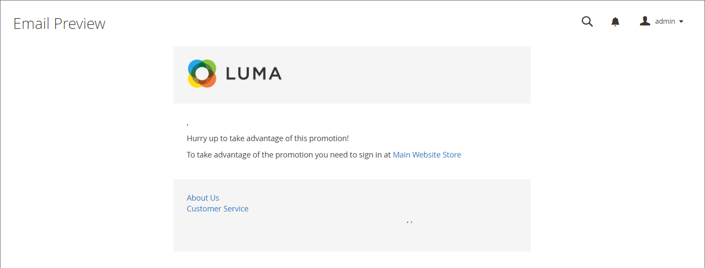

# 이메일 알림 메시지

{{ee-feature}}

이메일 미리 알림의 목적은 매장을 방문한 사람이 프로모션을 활용하고 구매하도록 장려하기 위한 것입니다. 특정 조건 세트가 충족되면 고객에게 이메일 미리 알림을 자동으로 전송할 수 있습니다. 예를 들어 장바구니 또는 위시리스트에 항목을 추가했지만 아직 구매하지 않은 고객에게 미리 알림을 보낼 수 있습니다. 이메일 미리 알림을 사용하여 고객이 스토어로 돌아가도록 유도하고 [쿠폰 코드](price-rules-cart-coupon.md)를 인센티브로 포함할 수 있습니다. 쿠폰 코드는 각 배치 이메일 미리 알림에 대해 자동으로 생성되어 각 배치와 연관된 오퍼를 제어할 수 있습니다.

이메일 미리 알림은 장바구니가 중단된 후 특정 일 수가 경과하거나 정의하려는 다른 조건에 대해 트리거될 수 있습니다. 일반적인 조건에는 총 장바구니 값, 수량, 장바구니에 있는 항목 등이 포함됩니다.

>[!NOTE]
>
>고객에게 일치하는 포기한 장바구니, 위시리스트 또는 두 가지 조합을 두 개 이상 보유한 경우, 이메일 미리 알림은 해당 고객에 대해 한 번만 트리거됩니다. 동일한 이메일 미리 알림을 다시 트리거하려면 _[!UICONTROL Repeat Schedule]_필드를 사용하여 이메일 간격(일)을 설정하십시오.

{width="700" zoomable="yes"}

## 이메일 미리 알림 구성

이메일 미리 알림 규칙은 분, 시간 또는 일별로 일정한 간격으로 전송할 수 있습니다. 이 구성은 일괄적으로 전송되는 이메일 수와 메시지 발신자로 표시되는 스토어 ID를 결정합니다.

1. _관리자_ 사이드바에서 **[!UICONTROL Stores]** > _[!UICONTROL Settings]_>**[!UICONTROL Configuration]**(으)로 이동합니다.

1. 왼쪽 패널에서 **[!UICONTROL Customers]**&#x200B;을(를) 확장하고 **[!UICONTROL Promotions]**&#x200B;을(를) 선택합니다.

1. **[!UICONTROL Automated Email Reminder Rules]** 섹션에서 를 확장하고 다음을 수행합니다.

   {width="600" zoomable="yes"}

   - **[!UICONTROL Enable Reminder Emails]**&#x200B;을(를) `Yes`(으)로 설정합니다.

   - 자동 전자 메일 미리 알림을 받는 새 고객에 대한 검사를 실행하는 빈도를 설정하려면 **[!UICONTROL Frequency]**&#x200B;을(를) 다음 중 하나로 설정하십시오.

      - `Minute Intervals`
      - `Hourly`
      - `Daily`

   - _[!UICONTROL Frequency]_설정을 기반으로 적절한&#x200B;**[!UICONTROL Interval]**을(를) 설정합니다.

   - **[!UICONTROL Start Time]**&#x200B;을(를) 24시간 시계에 따라 이메일이 전송되는 시간, 분, 초로 설정합니다.

   - 일괄 전송할 수 있는 전자 메일 수를 제한하려면 **[!UICONTROL Maximum Emails per One Run]** 필드에 숫자를 입력합니다.

   - 실패한 전자 메일을 보내려는 시도가 반복되지 않도록 하려면 **[!UICONTROL Email Send Failure Threshold]** 필드에 최대 시도 횟수를 입력합니다.

   - 미리 알림 전자 메일의 보낸 사람으로 표시되는 [스토어 연락처](../getting-started/store-details.md#store-email-addresses)(으)로 **[!UICONTROL Reminder Email Sender]**&#x200B;을(를) 설정합니다.

   이러한 옵션에 대한 자세한 목록이 필요하면 _구성 참조_&#x200B;에서 [자동 전자 메일 미리 알림 규칙](../configuration-reference/customers/promotions.md#automated-email-reminder-rules)을 참조하십시오.

1. 완료되면 **[!UICONTROL Save Config]**&#x200B;을(를) 클릭합니다.

## 이메일 미리 알림 템플릿

기본 이메일 미리 알림 템플릿을 사용자 정의하고 다양한 프로모션을 위해 추가 템플릿을 만들 수 있습니다. 이메일 미리 알림에는 메시지에 통합할 수 있는 특정 변수의 선택이 있습니다. 이러한 변수의 정보는 설정한 이메일 미리 알림 규칙과 쿠폰과 연결된 장바구니 가격 규칙에 따라 결정됩니다. 변수 삽입 버튼을 사용하여 변수가 있는 마크업 태그를 템플릿에 삽입할 수 있습니다. 자세한 내용은 [전자 메일](../systems/email-templates.md)을 참조하세요.

{width="600" zoomable="yes"}

### 이메일 미리 알림 템플릿 사용자 지정

1. _관리자_ 사이드바에서 **[!UICONTROL Marketing]** > _[!UICONTROL Communications]_>**[!UICONTROL Email Templates]**(으)로 이동합니다.

1. **[!UICONTROL Add New Template]**&#x200B;을(를) 클릭합니다.

1. `Magento_Reminder` 아래의 **[!UICONTROL Template]** 목록에서 **[!UICONTROL Promotion Notification/Reminder]** 템플릿을 선택합니다.

1. **[!UICONTROL Load Template]**&#x200B;을(를) 클릭합니다.

템플릿을 사용자 지정하려면 표준 [지침](../systems/email-template-custom.md)을(를) 따르십시오.

### 이메일 미리 알림 변수

#### 쿠폰 코드

```
{{var coupon.getCode()|escape}}
```

#### 쿠폰 사용 한도

```
{{var coupon.usage_limit|escape}}
```

#### 고객당 쿠폰 사용

```
{{var coupon.usage_per_customer|escape}}
```

#### 고객 계정 URL

```
{{var this.getUrl($store,'customer/account/',[_nosid:1])}}
```

#### 고객 이름

```
{{var customer_data.name|escape}}
```

#### 이메일 바닥글 템플릿

```
{{template config_path="design/email/footer_template"}}
```

#### 이메일 헤더 템플릿

```
{{template config_path="design/email/header_template"}}
```

#### 이메일 로고 이미지 대체

```
{{var logo_alt}}
```

#### 이메일 로고 이미지 URL

```
{{var logo_url}}
```

#### 프로모션 설명

```
{{var promotion_description|escape|nl2br}}
```

#### 프로모션 이름

```
{{var promotion_name|escape}}
```

#### 저장소 이름

```
{{var store.frontend_name}}
```

#### URL 저장

```
{{store url=""}}
```
