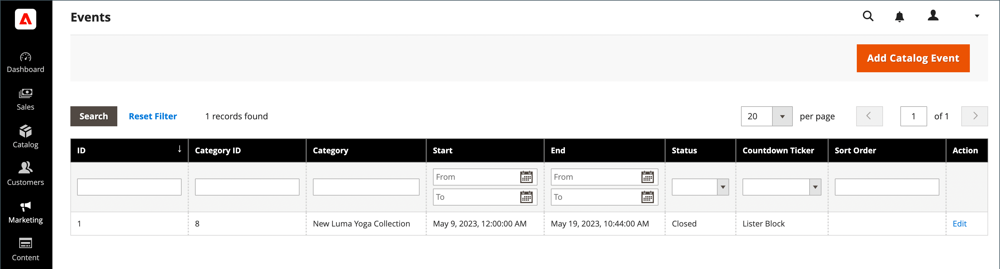

# 이벤트 만들기 및 업데이트

{{ee-feature}}

각 이벤트는 카탈로그의 범주와 연결되고 한 번에 하나의 이벤트만 지정된 범주와 연결할 수 있습니다. 스토어에서 예정된 이벤트 목록을 표시하려면 [카탈로그 이벤트 회전](../content-design/widget-event-carousel.md) 위젯도 설정해야 합니다.

{width="700" zoomable="yes"}

## 이벤트 만들기

1. _관리자_ 사이드바에서 **[!UICONTROL Marketing]** > _[!UICONTROL Private Sales]_>**[!UICONTROL Events]**(으)로 이동합니다.

1. 오른쪽 상단에서 **[!UICONTROL Add Catalog Event]**&#x200B;을(를) 클릭합니다.

1. 범주 트리에서 이벤트와 연결할 범주를 선택합니다.

   각 카테고리는 한 번에 하나의 이벤트만 가질 수 있으므로 이벤트가 이미 있는 모든 카테고리는 비활성화됩니다.

   {width="500" zoomable="yes"}

1. **[!UICONTROL Catalog Event Information]** 정의:

   {width="700" zoomable="yes"}

   - 이벤트의 **[!UICONTROL Start Date]**&#x200B;에 대해 달력()을 사용하여 날짜를 선택하세요. **[!UICONTROL Hour]** 및 **[!UICONTROL Minute]** 슬라이더를 사용하여 이벤트가 시작되는 시간을 설정하십시오.

   - 이벤트의 **[!UICONTROL End Date]**&#x200B;에 대해 달력()을 사용하여 날짜를 선택하세요. **[!UICONTROL Hour]** 및 **[!UICONTROL Minute]** 슬라이더를 사용하여 이벤트가 종료되는 시간을 설정하십시오.

   - 이벤트 위젯에 대한 **[!UICONTROL Image]**&#x200B;을(를) 업로드하려면 **[!UICONTROL Choose File]**&#x200B;을(를) 클릭하고 디렉터리에서 이미지 파일을 선택하십시오.

   - **[!UICONTROL Sort Order]** 필드에 다른 이벤트와 함께 나열할 때 이 이벤트가 나타나는 순서를 나타내는 숫자를 입력합니다.

   - 카운트다운 티커를 표시할 각 페이지 유형의 확인란을 선택합니다.

1. 완료되면 **[!UICONTROL Save]**&#x200B;을(를) 클릭합니다.

## 이벤트 업데이트

이벤트는 이벤트 페이지 또는 이벤트와 연결된 카테고리에서 편집할 수 있습니다. 카테고리에 연관된 이벤트가 있는 경우 오른쪽 상단에 이벤트 편집 버튼이 표시됩니다.

### 방법 1: 이벤트 페이지에서 이벤트 편집

1. _관리자_ 사이드바에서 **[!UICONTROL Marketing]** > _[!UICONTROL Private Sales]_>**[!UICONTROL Events]**(으)로 이동합니다.

1. 목록에서 이벤트를 찾아 편집 모드로 엽니다.

1. 이벤트에 필요한 사항을 변경합니다.

1. 완료되면 **[!UICONTROL Save]**&#x200B;을(를) 클릭합니다.

### 방법 2: 카테고리에서 이벤트 편집

1. _관리자_ 사이드바에서 **[!UICONTROL Catalog]** > **[!UICONTROL Categories]**(으)로 이동합니다.

1. 왼쪽의 카테고리 트리에서 이벤트와 관련된 카테고리를 선택합니다.

1. 오른쪽 상단 모서리에서 **[!UICONTROL Edit Even]t**&#x200B;을(를) 클릭합니다.

1. 이벤트에 필요한 사항을 변경합니다.

1. 완료되면 **[!UICONTROL Save]**&#x200B;을(를) 클릭합니다.

## 이벤트 삭제

1. _관리자_ 사이드바에서 **[!UICONTROL Marketing]** > _[!UICONTROL Private Sales]_>**[!UICONTROL Events]**(으)로 이동합니다.

1. 목록에서 이벤트를 찾아 편집 모드로 엽니다.

1. 오른쪽 상단에서 **[!UICONTROL Delete]**&#x200B;을(를) 클릭합니다.

1. 작업을 확인하려면 **[!UICONTROL OK]**&#x200B;을(를) 클릭합니다.

## 필드 설명

| 필드 | [범위](../getting-started/websites-stores-views.md#scope-settings) | 설명 |
|--- |--- |--- |
| [!UICONTROL Category] | 글로벌 | 이벤트를 만들 때 이 필드는 범주 트리로 다시 연결됩니다. 이벤트를 편집할 때 이벤트와 관련된 카테고리 페이지로 연결됩니다. |
| [!UICONTROL Start Date] | 글로벌 | `MMDDYYYY HH;MM` 형식의 이벤트 시작 날짜 및 시간입니다. 달력 아이콘을 클릭하여 날짜를 선택합니다. |
| [!DNL End Date] | 글로벌 | `MMDDYYYY HH;MM` 형식의 이벤트 종료 날짜 및 시간입니다. 달력 아이콘을 클릭하여 날짜를 선택합니다. |
| [!UICONTROL Image] | 스토어 뷰 | [카탈로그 이벤트 캐러셀 위젯](../content-design/widget-event-carousel.md)에 표시되는 이미지를 업로드합니다. |
| [!UICONTROL Sort Order] | 글로벌 | 다른 이벤트와 함께 나열할 때 이 이벤트가 표시되는 시퀀스를 결정합니다. |
| [!UICONTROL Display Countdown Ticker On] | 글로벌 | 지정된 각 페이지의 헤더에 카운트다운 티커를 표시합니다. 옵션: `Category Page` / `Product Page` |
| [!UICONTROL Status] | 글로벌 | 시작 날짜 및 종료 날짜 범위를 기반으로 이벤트의 상태를 나타냅니다. 상태는 읽기 전용 값입니다. 값: `Open` / `Closed` / `Upcoming` |

{style="table-layout:auto"}

## 단추 막대

| 단추 | 설명 |
|--- |--- |
| **[!UICONTROL Back]** | 새 이벤트나 기존 이벤트의 변경 사항을 저장하지 않고 이벤트 페이지로 돌아갑니다. |
| **[!UICONTROL Delete]** | 이벤트를 삭제합니다. |
| **[!UICONTROL Reset]** | 저장하지 않은 변경 내용의 양식을 지우고 원래 이벤트 정보를 복원합니다. |
| **[!UICONTROL Save and Continue Edit]** | 모든 변경 사항을 저장하고 편집 모드에서 양식을 열어 둡니다. |
| **[!UICONTROL Save]** | 변경 사항을 저장하고, 양식을 닫은 다음 이벤트 페이지로 돌아갑니다. |

{style="table-layout:auto"}
