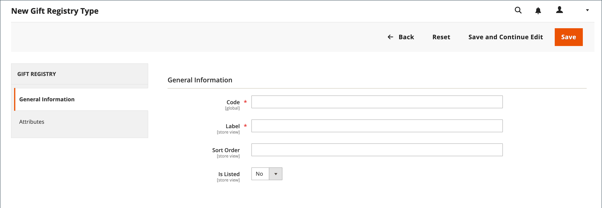

# 선물 등록 설정

{{ee-feature}}

선물 레지스트리는 결혼식, 생일, 기념일, 새 아기 또는 기타 특별한 날과 같은 모든 유형의 이벤트에 대해 만들 수 있습니다. 기본적으로 Adobe Commerce에는 다음과 같은 특수 이벤트가 포함됩니다.

- 아기
- 생일
- 웨딩

레지스트리를 만들면 고객 계정의 선물 레지스트리 유형 목록에서 옵션이 됩니다.

준비된 세 개의 선물 레지스트리 중 하나를 사용하거나 사용자 지정 레지스트리를 만들 수 있습니다. 각 선물 레지스트리 유형에는 고객이 선물 레지스트리를 만들기 위해 완료하는 데이터 항목 필드인 여러 속성이 포함됩니다. 속성은 이벤트, 시간 및 위치 또는 필요한 기타 정보에 대한 추가 정보를 제공합니다. 입력 유형에 따라 일부 속성에는 여러 옵션이 있습니다. 예를 들어 `Wedding` 선물 레지스트리 형식에 `Bride`, `Groom` 및 `Partner` 옵션이 있는 `Role` 특성이 있습니다. 특성 및 입력 유형에 대한 자세한 내용은 [특성](../customers/attribute-properties.md)을 참조하세요.

{width="700" zoomable="yes"}

## 준비된 선물 레지스트리 사용

1. _관리자_ 사이드바에서 **[!UICONTROL Stores]** > _[!UICONTROL Other Settings]_>**[!UICONTROL Gift Registry]**(으)로 이동합니다.

   생일, 결혼식 및 아기 등록기는 고객이 자신의 계정에서 사용할 수 있도록 준비되었습니다.

1. 브랜드를 반영하도록 [전자 메일 템플릿 구성](../systems/email-templates.md#configure-email-templates)을 완료해야 합니다.

## 사용자 지정 선물 레지스트리 만들기

1. 관리 사이드바에서 **[!UICONTROL Stores]** > _[!UICONTROL Other Settings]_>**[!UICONTROL Gift Registry]**(으)로 이동합니다.

1. 오른쪽 상단에서 **[!UICONTROL Add Gift Registry Type]**&#x200B;을(를) 클릭합니다.

1. **[!UICONTROL General Information]**&#x200B;에서 다음을 완료하십시오.

   - 내부적으로 선물 레지스트리를 식별하려면 고유한 **[!UICONTROL Code]**&#x200B;을(를) 입력하십시오.

     코드는 소문자로 시작해야 합니다. 나머지 코드는 소문자(a-z), 숫자(0-9) 및 밑줄(`_`)의 조합이 될 수 있습니다.

   - **[!UICONTROL Label]**&#x200B;의 경우 스토어에 표시할 선물 레지스트리의 이름을 입력하십시오.

     이 레이블은 고객이 사용할 수 있는 선물 레지스트리 유형 목록에 있는 옵션입니다.

   - **[!UICONTROL Sort Order]**&#x200B;의 경우 다른 형식으로 나열할 때 이 선물 레지스트리가 표시되는 순서를 결정하는 숫자를 입력하십시오.

   - 선물 레지스트리를 활성화하려면 **[!UICONTROL Is Listed]**&#x200B;을(를) `Yes`(으)로 설정하십시오.

     {width="600" zoomable="yes"}

1. 선물 레지스트리의 각 섹션을 검사하여 포함하려는 정보의 유형을 파악합니다.

1. 왼쪽 패널에서 **[!UICONTROL Attributes]**&#x200B;을(를) 선택하고 **[!UICONTROL Add Attribute]**&#x200B;을(를) 클릭합니다.

   {width="600" zoomable="yes"}

1. 각 속성에 대해 다음을 수행합니다.

   - 내부적으로 특성을 식별하려면 고유한 **[!UICONTROL Code]**&#x200B;을(를) 할당하십시오. 코드는 최대 15자까지 사용할 수 있으며 소문자로 시작해야 합니다. 나머지 코드는 소문자(`a`-`z`), 숫자(`0`-`9`) 및 밑줄(`_`) 문자를 포함하여 단어를 구분할 수 있습니다.

   - 데이터 입력에 사용할 **[!UICONTROL Input Type]**&#x200B;을(를) 선택하십시오. 사용자 지정 또는 정적 유형 중 하나를 사용할 수 있습니다.

   - 입력 형식에 여러 옵션이 있는 경우 **[!UICONTROL Add New Option]**&#x200B;을(를) 클릭하고 각 옵션에 대한 정보를 입력하십시오.

     일부 입력 유형에는 추가 속성이 있습니다. 예를 들어 이벤트 위치에는 이벤트를 검색할 수 있도록 하는 추가 속성이 있으며, 스토어의 선물 등록 공개 목록에 포함됩니다.

      - 특성을 표시할 선물 레지스트리의 섹션으로 **[!UICONTROL Attribute Group]**&#x200B;을(를) 설정합니다.

      - **[!UICONTROL Label]**&#x200B;의 경우 레지스트리의 데이터 입력 필드를 식별할 이름을 입력하십시오.

      - 고객이 선택하거나 필드에 값을 입력해야 하는 경우 **[!UICONTROL Is Required]**&#x200B;을(를) `Yes`(으)로 설정하십시오.

      - **[!UICONTROL Sort Order]**&#x200B;의 경우 스토어에서 사용할 수 있는 다른 선물 등록과 함께 나열될 때 이 선물 레지스트리가 표시되는 순서를 결정하는 숫자를 입력하십시오.

1. 다른 옵션을 추가하려면 **새 옵션 추가**&#x200B;를 클릭하세요.

   추가된 각 새 옵션은 상단의 새 섹션에 표시됩니다. 새 속성에 대해 이 프로세스를 반복합니다.

1. 완료되면 **[!UICONTROL Save]**&#x200B;을(를) 클릭합니다.

## 필드 설명

### [!UICONTROL General Information]

| 필드 | 설명 |
|--- |--- |
| [!UICONTROL Code] | 내부적으로 선물 레지스트리 유형을 식별하는 고유한 이름. 코드의 첫 번째 문자는 소문자여야 합니다. 나머지 코드는 소문자(a-z), 숫자(0-9) 및 밑줄 문자(`_`)의 조합이 될 수 있습니다. |
| [!UICONTROL Label] | 저장소에 표시되는 선물 레지스트리 유형의 이름입니다. |
| [!UICONTROL Sort Order] | 다른 유형과 함께 나열할 때 이 선물 레지스트리 유형이 표시되는 시퀀스를 결정합니다. |
| [!UICONTROL Is Listed] | 스토어에서 고객이 선물 레지스트리 유형을 사용할 수 있는지 여부를 결정합니다. 옵션: `Yes` / `No`. |

{style="table-layout:auto"}

### [!UICONTROL Attributes]

| 필드 | 설명 |
|--- |--- |
| [!UICONTROL Code] | 내부적으로 속성을 식별하는 고유한 이름입니다. 코드에는 소문자(a-z), 숫자(0-9) 및 밑줄 문자(`_`)의 조합이 포함될 수 있습니다. |
| [!UICONTROL Input Type] | 속성에 연결된 데이터 및 입력 컨트롤의 유형을 유형에 따라 결정합니다. |
| [!UICONTROL Attribute Group] | 선물 레지스트리에서 속성이 나열된 그룹을 선택합니다. |
| [!UICONTROL Label] | 고객 계정 대시보드에서 속성을 식별하는 이름입니다. |
| [!UICONTROL Is Required] | 속성이 필수 항목인지 여부를 나타냅니다. 필요한 모든 특성이 완료될 때까지 선물 레지스트리를 저장할 수 없습니다. 옵션: `Yes` / `No`. |
| [!UICONTROL Sort Order] | 다른 속성과 함께 나열되면 속성이 표시되는 시퀀스를 결정합니다. |

{style="table-layout:auto"}

#### [!UICONTROL Input Type Options]

속성과 연결된 데이터 및 입력 컨트롤의 유형을 선택합니다.

**_[!UICONTROL Custom Types]_**

| 필드 | 설명 |
|--- |--- |
| [!UICONTROL Text] | 속성을 텍스트 필드로 표시합니다. |
| [!UICONTROL Select] | 속성을 드롭다운 목록으로 표시합니다. **[!UICONTROL Add New Option]**&#x200B;을(를) 클릭하여 드롭다운 목록에 조건을 더 추가합니다.  **[!UICONTROL Code]**- 내부적으로 특성을 식별하는 고유한 이름입니다. **[!UICONTROL Label]** - 고객 계정 대시보드에서 특성을 식별하는 이름입니다. **[!UICONTROL Is Default]**- 이 스위치를 설정하여 기본 조건을 선택합니다. **[!UICONTROL Delete Option]** - 옵션을 삭제하려면 클릭하세요. |
| [!UICONTROL Date] | 속성을 날짜 필드로 표시합니다. 옵션: `Short (3/23/2014)` / `Medium (Mar 23, 1914)` / `Long (March 23, 1914)` / `Full (Sunday, March 23, 2014)` |
| [!UICONTROL Country] | 속성을 국가의 드롭다운 목록으로 표시합니다. **[!UICONTROL Show Region]**&#x200B;을(를) `Yes` / `No`(으)로 설정합니다. |

{style="table-layout:auto"}

**_[!UICONTROL Static Types]_**

| 필드 | 설명 |
|--- |--- |
| [!UICONTROL Event Date] | 저장소에서 날짜 속성을 사용하는 방법을 결정합니다. 옵션:  **[!UICONTROL Searchable]**- 고급 검색에 특성을 사용할 수 있는지 여부를 결정합니다. 옵션: `Yes` / `No`. **[!UICONTROL Is Listed]** - 저장소에서 사용할 수 있는 이벤트 목록에 이벤트가 포함되어 있는지 여부를 결정합니다. 옵션: `Yes` / `No`.  **[!UICONTROL Date Format]**- 이벤트 날짜의 형식을 결정합니다. 옵션: `Short (3/23/2014)` / `Medium (Mar 23, 1914)` / `Long (March 23, 1914)` / `Full (Sunday, March 23, 2014)` |
| [!UICONTROL Event Country] | 속성을 국가 목록으로 표시합니다. 옵션:  **[!UICONTROL Searchable]**- 고급 검색에 특성을 사용할 수 있는지 여부를 결정합니다. 옵션: `Yes` / `No`. **[!UICONTROL Is Listed]** - 저장소에서 사용할 수 있는 이벤트 목록에 이벤트가 포함되어 있는지 여부를 결정합니다. 옵션: `Yes` / `No`.  **[!UICONTROL Show Region]**- 이벤트의 영역을 결정합니다. |
| [!UICONTROL Event Location] | 선물 등록과 관련된 이벤트의 위치입니다.  **[!UICONTROL Is Searcheable]**&#x200B;을(를) 다음으로 설정: `Yes` / `No`  **[!UICONTROL Is Listed]**&#x200B;을(를) 다음으로 설정: `Yes` / `No` |
| [!UICONTROL Role] | 선물 받는 사람을 식별하는 역할입니다. 예: `Bride`, `Groom` 또는 `Partner`. **[!UICONTROL Is Searcheable]**- `Yes`/ `No` **&#x200B;이(가) 나열됨&#x200B;**- `Yes`/ `No` **[!UICONTROL Add New Option]**(으)로 설정 - 드롭다운 메뉴에 조건을 추가하려면 클릭: **코드** - 특성을 내부적으로 식별하는 고유한 이름. **[!UICONTROL Label]**- 고객 계정 대시보드에서 특성을 식별하는 이름입니다. **[!UICONTROL Is Default]** - 이 스위치를 설정하여 기본 조건을 선택합니다. **[!UICONTROL Delete Option]**- 옵션을 삭제하려면 클릭하세요. |

{style="table-layout:auto"}

#### [!UICONTROL Attribute Group Options]

선물 레지스트리에서 속성이 나열된 그룹을 선택합니다.

| 필드 | 설명 |
|--- |--- |
| [!UICONTROL Event Information] | 선물 레지스트리 이벤트, 시간, 위치 등에 대한 정보를 추가하는 모든 선물 레지스트리 특성을 그룹화합니다. |
| [!UICONTROL Gift Registry Properties] | 선물 레지스트리에 대한 정보를 직접 추가하는 모든 특성을 결합합니다. |
| [!UICONTROL Privacy Settings] | 선물 레지스트리 이벤트 개인 정보에 대한 정보를 추가하는 속성을 나열합니다. |
| [!UICONTROL Recipients Information] | 선물 레지스트리를 만드는 사람에 대한 정보를 제공하는 속성을 그룹화합니다. |
| [!UICONTROL Shipping Address] | 선물 레지스트리 이벤트 배송 주소에 대한 정보를 추가하는 속성을 결합합니다. |

{style="table-layout:auto"}
