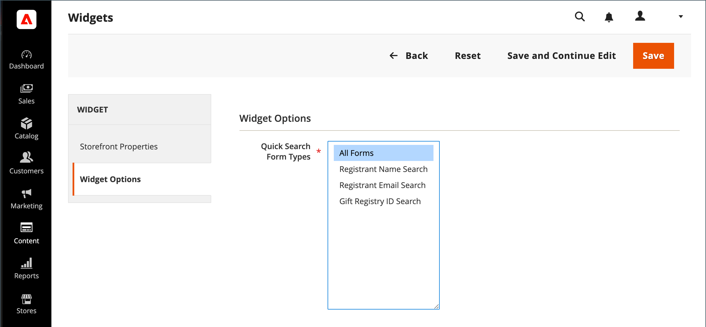

# 선물 레지스트리 검색 추가

{{ee-feature}}

[Widget](../content-design/widgets.md) 도구를 사용하여 저장소의 모든 위치에 선물 레지스트리 검색 상자를 배치할 수 있습니다. 이름, 이메일 주소 및 선물 레지스트리 ID와 같이 고객이 사용할 수 있는 검색 옵션을 지정할 수 있습니다. 고객이 검색 버튼을 클릭하면 선물 등록 검색 페이지에 결과가 표시됩니다. 검색 결과가 반환되지 않으면 고객은 다른 매개 변수로 다시 시도할 수 있습니다.

{width="700" zoomable="yes"}

## 선물 레지스트리 검색 구성

1. _관리자_ 사이드바에서 **[!UICONTROL Content]** > _[!UICONTROL Elements]_>**[!UICONTROL Widgets]**(으)로 이동합니다.

1. 오른쪽 상단에서 **[!UICONTROL Add Widget]**&#x200B;을(를) 클릭합니다.

1. **[!UICONTROL Settings]** 탭을 선택하고 다음을 수행합니다.

   - **[!UICONTROL Type]**&#x200B;을(를) `Gift Registry Search`(으)로 설정합니다.

   - **[!UICONTROL Design Theme]**&#x200B;을(를) 스토어에서 사용하는 테마로 설정합니다.

   - **[!UICONTROL Continue]**&#x200B;을(를) 클릭합니다.

   {width="700" zoomable="yes"}

1. _[!UICONTROL Storefront Properties]_&#x200B;섹션에서 다음을 수행합니다.

   - 내부 참조를 위해 **[!UICONTROL Widget Title]**&#x200B;을(를) 입력하십시오.

   - 선물 레지스트리 검색을 사용할 수 있는 저장소 보기로 **[!UICONTROL Assign to Store Views]**&#x200B;을(를) 설정합니다.

   - 페이지의 동일한 위치에 다른 블록이 할당된 경우 선물 레지스트리 검색 블록이 표시되는 순서를 결정하려면 **[!UICONTROL Sort Order]**&#x200B;을(를) 설정하십시오.

   {width="700" zoomable="yes"}

1. **[!UICONTROL Layout Updates]** 섹션에서 **[!UICONTROL Add Layout Update]**&#x200B;을(를) 클릭합니다.

1. 저장소에서 선물 레지스트리 검색이 표시되는 위치를 확인하려면 다음을 수행하십시오.

   - 선물 레지스트리 검색 블록을 표시할 저장소의 페이지로 **[!UICONTROL Display On]**&#x200B;을(를) 설정합니다.

   - 해당하는 경우 표시할 **[!UICONTROL Categories]**&#x200B;을(를) 선택하십시오.

   - **[!UICONTROL Container]**&#x200B;을(를) 페이지의 위치로 설정하여 선물 레지스트리 검색 블록을 배치합니다.

   {width="500" zoomable="yes"}

1. 왼쪽 패널에서 **[!UICONTROL Widget Options]**&#x200B;을(를) 선택합니다.

1. 사이트 방문자가 선물 등록기를 검색하는 방법을 결정하려면 다음 중 적용되는 수를 선택합니다.

   - [!UICONTROL All Forms]
   - [!UICONTROL Registrant Name Search]
   - [!UICONTROL Registrant Email Search]
   - [!UICONTROL Gift Registry ID Search]

   {width="700" zoomable="yes"}

1. 완료되면 **[!UICONTROL Save]**&#x200B;을(를) 클릭합니다.

1. 페이지 캐시를 새로 고치라는 메시지가 표시되면 작업 공간 상단에 있는 메시지에서 링크를 클릭하고 지침을 따릅니다.

## 필드 설명

### [!UICONTROL Settings]

| 필드 | 설명 |
|--- |--- |
| [!UICONTROL Type] | `Gift Registry Search`을(를) 위젯 형식으로 식별합니다. |
| [!UICONTROL Design Theme] | 선물 레지스트리 검색이 표시되는 스토어에서 사용하는 테마입니다. |

{style="table-layout:auto"}

### [!UICONTROL Storefront Properties]

| 필드 | 설명 |
|--- |--- |
| [!UICONTROL Widget Title] | 내부 참조의 이름입니다. |
| [!UICONTROL Assign to Store Views] | 선물 레지스트리 검색을 사용할 수 있는 저장소 보기를 식별합니다. |
| [!UICONTROL Sort Order] | 같은 위치에 나타나도록 지정된 다른 블록이 있는 경우 선물 레지스트리 검색 블록이 나타나는 순서를 나타냅니다. |

{style="table-layout:auto"}

### [!UICONTROL Layout Updates]

| 필드 | 설명 |
|--- |--- |
| [!UICONTROL Display On] | 선물 레지스트리 검색 블록이 나타나는 특정 페이지 또는 페이지 유형을 나타냅니다. |
| [!UICONTROL Categories] | 해당하는 경우 선물 레지스트리 검색이 나타나는 카테고리 페이지를 식별합니다. |
| [!UICONTROL Container] | 선물 레지스트리 검색이 배치된 페이지 레이아웃 블록을 나타냅니다. 옵션은 템플릿과 테마에 따라 다릅니다. |

{style="table-layout:auto"}

### [!UICONTROL Widget Options]

| 필드 | 설명 |
|--- |--- |
| [!UICONTROL Quick Search Form Types] | 선물 레지스트리 검색으로 수행할 수 있는 검색 유형을 결정합니다. 옵션: `All Forms` / `Registrant Name Search` /` Registrant Email Search` / `Gift Registry ID Search` |

{style="table-layout:auto"}
