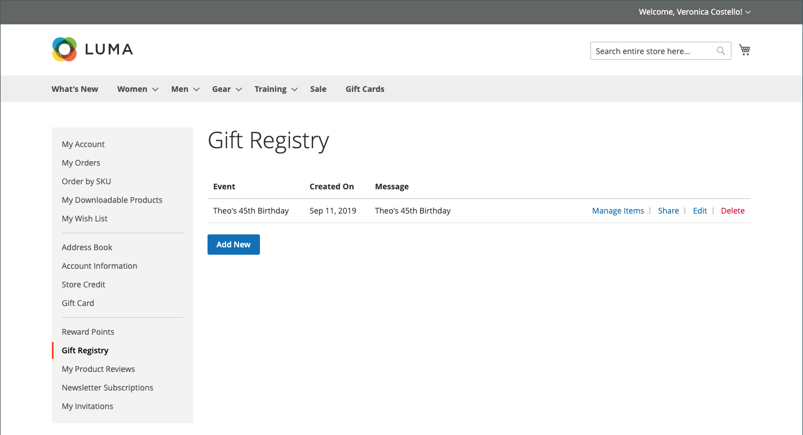

# 선물 등록 상점 경험

{{ee-feature}}

다음 [선물 등록](gift-registries.md) 고객 계정의 섹션에는 고객의 현재 선물 등록기 및 관련 이벤트가 나열됩니다. 고객은 현재 레지스트리를 관리하고 새 레지스트리를 추가할 수 있습니다.

{width="700" zoomable="yes"}

## 선물 등록 정보

고객은 계정에서 선물 등록기를 만들고 관리할 수 있습니다. 각 레지스트리 유형과 관련된 모든 정보는 고객 계정에서 사용할 수 있습니다.

{width="700" zoomable="yes"}

| 섹션 | 설명 |
|--- |--- |
| [!UICONTROL General Information] | 이 섹션에는 일반적으로 이벤트 이름, 이벤트에 대한 메시지 또는 설명, 개인 정보 설정 및 이벤트 상태가 포함됩니다. |
| [!UICONTROL Event Information] | 이 섹션에는 이벤트의 위치 및 날짜가 포함됩니다. 결혼식의 경우 한 사람이 데려올 수 있는 손님 수도 포함될 수 있습니다. |
| [!UICONTROL Gift Registry Details] | 여기에는 해당 상황과 관련된 추가 정보가 포함될 수 있습니다. |
| [!UICONTROL Registrant Information] | 이 섹션에는 등록 정보를 통지받을 각 사용자의 이름과 연락처 정보가 포함됩니다. 웨딩 레지스트리의 경우 역할 필드가 포함되어 신부 또는 신랑의 친구로 등록자를 연결할 수 있습니다. |
| [!UICONTROL Shipping Address] | 이 섹션에서는 선물을 보낼 위치를 보여 주고, 통신사가 패키지를 배달하는 데 필요한 정보를 포함합니다. |

{style="table-layout:auto"}

>[!NOTE]
>
>선물 레지스트리가 비활성 상태이면 레지스트리에 대한 검색 및 링크가 작동하지 않습니다. 나중에 레지스트리를 다시 활성화하면 링크가 끊어진 상태로 유지됩니다.

## 선물 레지스트리 만들기

1. 고객이 선택 **[!UICONTROL Gift Registry]** 계정 대시보드에서 을 참조하십시오.

1. 다음에서 _선물 등록_ 페이지, 클릭 수 **[!UICONTROL Add New]**.

1. 선택 **[!UICONTROL Gift Registry Type]**, 예:

   - 생일

   - 아기 등록부

   - 웨딩

1. 클릭수 **[!UICONTROL Next]**.

1. 필요한 정보를 입력하고 클릭합니다. **[!UICONTROL Save]**.

## 레지스트리에 제품 추가

1. 고객이 기프트 등록 이벤트에 추가할 제품을 엽니다.

1. 클릭수 **[!UICONTROL Add to Cart]**.

1. 클릭수 **[!UICONTROL View and Edit Cart]** 미니 장바구니에서.

1. 장바구니 페이지에서 원하는 이벤트를 선택하고 클릭/탭합니다. **[!UICONTROL Add All To Gift Registry]**.

   항목이 선택한 이벤트의 선물 레지스트리에 추가됩니다.

## 선물 레지스트리 공유

1. 계정 대시보드에서 로 이동합니다. **[!UICONTROL Gift Registry]**.

1. 관리할 레지스트리 이벤트를 찾고 클릭합니다. **[!UICONTROL Share]**.

1. 필요한 정보를 입력하고 클릭합니다. **[!UICONTROL Share Gift Registry]**.

## 선물 레지스트리 편집

1. 계정 대시보드에서 로 이동합니다. **[!UICONTROL Gift Registry]**.

1. 관리할 레지스트리 이벤트를 찾고 클릭합니다. **[!UICONTROL Edit]**.

1. 필요에 따라 옵션을 변경합니다.

1. 필요한 옵션 및 클릭 수를 편집합니다. **[!UICONTROL Save]**.

## 선물 등록 항목 관리

1. 계정 대시보드에서 로 이동합니다. **[!UICONTROL Gift Registry]**.

   {width="700" zoomable="yes"}

1. 레지스트리 이벤트를 찾고 관리할 항목을 선택한 다음 클릭합니다. **[!DNL Manage Items]**.

1. 다음과 같은 필수 옵션을 변경합니다. **[!UICONTROL Note]** 및 **[!UICONTROL Qty]**.

1. 필요한 경우 확인란을 선택하고 을 클릭하여 선물 레지스트리에서 항목을 제거합니다. **[!UICONTROL Delete]**.

1. 클릭수 **[!UICONTROL Update Gift Registry]** 변경 내용을 저장합니다.

## 선물 레지스트리 삭제

1. 계정 대시보드에서 로 이동합니다. **[!UICONTROL Gift Registry]**.

1. 관리할 레지스트리 이벤트를 찾고 클릭합니다. **[!UICONTROL Delete]**.

1. 클릭수 **[!UICONTROL OK]** 확인할 수 있습니다.
