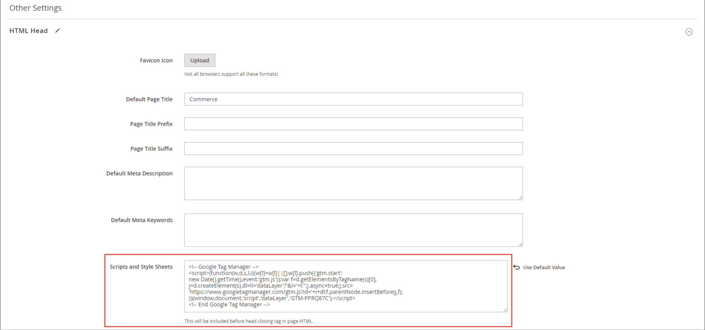

# [!DNL Google Tag Manager]

{{ee-feature}}

[!DNL Google Tag Manager]을(를) 사용하면 마케팅 캠페인 이벤트와 관련된 많은 태그(코드 조각)를 관리할 수 있습니다. [!DNL Google Tag Manager]에서는 사이트에 추적 태그를 추가하여 대상자를 측정하거나 검색 엔진 마케팅 이니셔티브를 개인화, 리타겟팅 또는 수행할 수 있습니다.

[!DNL Google Tag Manager]은(는) 데이터와 이벤트를 [!DNL Google Analytics], Enhanced Ecommerce 및 다른 서드파티 분석 솔루션으로 직접 전송하여 사이트, 제품 및 프로모션의 성과를 명확하게 파악합니다.

이 프로세스를 계속하려면 [!DNL Google Analytics] 및 [!DNL Tag Manager] 계정이 있어야 합니다. 다음 지침은 Google 계정을 구성하고, Commerce 스토어를 구성하고, 태그를 만드는 과정을 안내합니다.

>[!NOTE]
>
>비즈니스에 [일반 데이터 보호 규정](../getting-started/compliance-gdpr.md) 및/또는 [캘리포니아 소비자 개인정보 보호법](../getting-started/compliance-ccpa.md)과 같은 개인정보 보호 규정이 적용되는 경우 [Google 개인정보 보호 설정](google-tools.md#google-privacy-settings)을 참조하십시오.

## 1단계. [!DNL Google Analytics] 계정 구성

시작하는 데 필요한 기본 사항은 Google 도움말의 [사이트 검색 설정](https://support.google.com/analytics/answer/1012264)을 참조하십시오. [Google Analytics](https://support.google.com/analytics/answer/9304153) 및 [Google 태그 관리자](https://support.google.com/tagmanager/answer/6102821)용 Google 안내서도 참조하세요.

1. [!DNL Google Analytics] 계정에 로그인합니다.

1. **[!UICONTROL Internal Site Search Tracking]**&#x200B;을(를) 사용하려면 다음을 수행하십시오.

   - **[!UICONTROL Select View]** > **[!UICONTROL View Settings]**(으)로 이동합니다.

   - **[!UICONTROL Site Search Tracking]**&#x200B;을(를) `On`(으)로 설정합니다.

   - **[!UICONTROL Query]** 매개 변수를 `q`(으)로 설정합니다.

   - 완료되면 설정을 **[!UICONTROL Save]**&#x200B;합니다.

1. 디스플레이 기능을 활성화하려면 다음을 수행합니다.

   - **[!UICONTROL Property Settings]**&#x200B;을(를) 선택하십시오.

   - _[!UICONTROL Advertising Features]_에서&#x200B;**[!UICONTROL Enable Demographics and Interest Reports]**을(를) `On`(으)로 설정합니다.

   - **[!UICONTROL Save]** 설정입니다.

1. 전자 상거래 추적을 활성화하려면 다음 작업을 수행하십시오.

   - **[!UICONTROL Select View]** > **[!UICONTROL Ecommerce Settings]**(으)로 이동합니다.

   - **[!UICONTROL Enable Ecommerce]**&#x200B;을(를) `On`(으)로 설정합니다.

   - **[!UICONTROL Enable Enhanced Ecommerce Reporting]**&#x200B;을(를) `On`(으)로 설정합니다.

   - **[!UICONTROL Save]** 설정입니다.

1. 페이지를 다시 로드하고 모든 설정이 `On` 상태로 유지되는지 확인하십시오.

   >[!NOTE]
   >
   >일부 설정이 `On`이(가) 아닌 경우 이전 단계를 반복하여 페이지를 저장하고 다시 로드합니다. 모든 설정이 `On`(으)로 설정될 때까지 이 프로세스를 반복합니다.

## 2단계. [!DNL Google Tag Manager] 계정 구성

다음 지침은 기본 설정으로 새 컨테이너를 구성하는 방법을 보여 줍니다. 샘플 [Composer](https://developer.adobe.com/commerce/php/development/composer/) 구성(.json) 파일을 사용하여 프로세스를 단순화하고 가져오기를 통해 새 컨테이너에서 태그를 생성합니다. 이 예제에서는 기존 컨테이너를 수정하지 않고 컨테이너를 만드는 것이 좋습니다.

>[!NOTE]
>
>자세한 내용은 Google의 [컨테이너 내보내기 및 가져오기](https://support.google.com/tagmanager/answer/6106997)를 참조하십시오. 이러한 지침은 새 컨테이너에서 샘플 JSON을 가져오는 방법에 대한 설명을 제공합니다.

1. 연결된 파일 [GTM_M2_Config_json.txt](./assets/GTM_M2_Config_json.txt)를 다운로드하고 편집기에서 파일을 열고 `GTM_M2_Config.json`(으)로 저장합니다.

   json 파일이 [!DNL Google Tag Manager]에 바로 업로드됩니다.

1. **[!UICONTROL Admin]** > **[!UICONTROL Container]** > **[!UICONTROL Import Container]**(으)로 이동합니다.

1. **[!UICONTROL Choose container file]**&#x200B;을(를) 클릭하고 json 파일을 선택하십시오.

1. **[!UICONTROL Choose workspace]**&#x200B;에서 **[!UICONTROL New]**&#x200B;을(를) 클릭합니다.

1. 제목과 설명을 입력한 다음 **[!UICONTROL Save]**&#x200B;을(를) 클릭합니다.

1. 파일을 가져오려면 다음 작업 중 하나를 선택합니다.

   - 새 컨테이너에 대해 **[!UICONTROL Overwrite]** 옵션을 선택해야 합니다.

   - 기존 컨테이너를 사용하는 경우 **[!UICONTROL Merge]** 옵션을 선택해야 합니다.

1. 태그, 트리거 및 변수를 검토하려면 **[!UICONTROL Preview]**&#x200B;을(를) 클릭하십시오.

1. 변수에서 참조되는 **[!UICONTROL Google Analytics ID]**&#x200B;을(를) 편집하려면 다음을 수행하십시오.

   - **[!UICONTROL Variables]** > **[!UICONTROL User-Defined Variables]**(으)로 이동합니다.

   - **[!UICONTROL Google Analytics]**&#x200B;을(를) 선택하고 자리 표시자(`UA-xxxxxx-x`)를 **[!UICONTROL GA ID]**(으)로 업데이트하십시오.

1. 태그, 트리거 및 변수를 새 컨테이너에 추가하는 방법에 대한 Google의 지침을 따릅니다.

   사용할 다른 컨테이너에 설정이 있는 경우 새 컨테이너로 이동할 수 있습니다.

1. 완료되면 **[!UICONTROL Confirm]**&#x200B;을(를) 클릭합니다.

1. 새 컨테이너를 게시하려면 Google의 지침을 따르십시오.

## 3단계. 스토어 구성

{{gtag-api-note}}

1. Commerce 스토어의 관리자에 로그인합니다.

1. _관리자_ 사이드바에서 **[!UICONTROL Stores]** > _[!UICONTROL Settings]_>**[!UICONTROL Configuration]**(으)로 이동합니다.

1. 왼쪽 패널에서 **[!UICONTROL Sales]**&#x200B;을(를) 확장하고 **[!UICONTROL Google API]**&#x200B;을(를) 선택합니다.

1. **[!UICONTROL Google Analytics]** 섹션에서 를 확장하고 다음을 구성합니다.

   {width="600" zoomable="yes"}

   - **[!UICONTROL Enable]**&#x200B;을(를) `Yes`(으)로 설정합니다.

   - **[!UICONTROL Account type]**&#x200B;을(를) `Google Tag Manager`(으)로 설정합니다.

   - **[!UICONTROL Container ID]** 필드에 GTM ID(`GTM-xxxxxx`)를 입력합니다.

   - 콘텐츠 실험에 Google Analytics을 사용하는 경우 **콘텐츠 실험 사용**&#x200B;을(를) `Yes`(으)로 설정하십시오.

   - 나머지 필드에 기본값을 사용합니다.

1. 완료되면 **[!UICONTROL Save Config]**&#x200B;을(를) 클릭합니다.

1. [!DNL Google Tag Manager] 설정을 테스트하고 모든 설정이 올바르게 작동하는지 확인하십시오.

>[!NOTE]
>
>각 컨테이너는 하나의 웹 사이트와 연결되어 있으며 계정당 하나의 컨테이너만 있으면 됩니다. 다중 사이트 Commerce 인스턴스가 있는 경우 별도의 컨테이너가 필요합니다.

## 4단계. Adobe Commerce 스토어에 GTM 코드 추가

1. GTM 코드를 복사하려면 **[!UICONTROL Admin]** > **[!UICONTROL Install Google Tag Manager]**(으)로 이동합니다.

   두 개의 GTM 코드 조각을 Commerce 사이트에 추가할 수 있습니다. 하나는 `<head>` 태그에 대한 것이고 다른 하나는 `<body>` 태그에 대한 것입니다.

1. Commerce 관리자에서 **[!UICONTROL Content]** > _[!UICONTROL Design]_>**[!UICONTROL Configuration]**(으)로 이동하여 편집 모드로 스토어 보기를 엽니다.

1. _[!UICONTROL Other Settings]_에서&#x200B;**[!UICONTROL HTML Head]**을(를) 확장하고 `<head>` 태그에 대해 GTM에서 복사한 코드를&#x200B;**[!UICONTROL Scripts and Style Sheets]**필드에 붙여넣습니다.

   {width="600" zoomable="yes"}

1. **[!UICONTROL Footer]**&#x200B;을(를) 확장하고 `<body>`의 GTM 코드를 **[!UICONTROL Miscellaneous HTML]** 필드에 붙여 넣습니다.

   {width="600" zoomable="yes"}

1. 완료되면 **[!UICONTROL Save Configuration]**&#x200B;을(를) 클릭합니다.

## 필드 설명

| 필드 | 범위 | 설명 |
|--- |--- |--- |
| [!UICONTROL Enable] | 스토어 뷰 | Google Analytics 고급 전자 메일을 사용하여 스토어의 활동을 분석할 수 있는지 여부를 결정합니다. 옵션: `Yes` / `No` |
| [!UICONTROL Account type] | 스토어 뷰 | 저장소 활동 및 트래픽을 모니터링하는 데 사용되는 Google 추적 코드를 결정합니다. 옵션: `Google Analytics` / `Google Tag Manager` |
| [!UICONTROL Anonymize IP] | 스토어 뷰 | Google Analytics 결과에 나타나는 IP 주소에서 식별 정보가 제거되는지 여부를 결정합니다. |
| [!UICONTROL Enable Content Experiments] | 스토어 뷰 | 동일한 페이지의 서로 다른 버전을 최대 10개까지 테스트하는 데 사용할 수 있는 Google 콘텐츠 실험을 활성화합니다. 옵션: `Yes` / `No` |
| [!UICONTROL Container Id] | 스토어 뷰 | 저장소에 대해 [!DNL Google Tag Manager]이(가) 이미 설치 및 구성된 경우 컨테이너 ID가 이 필드에 자동으로 표시됩니다. |
| [!UICONTROL List property for the catalog page] | 스토어 뷰 | 카탈로그 페이지와 연결된 태그 관리자 속성을 식별합니다. 기본값: `Catalog Page` |
| [!UICONTROL List property for the cross-sell block] | 스토어 뷰 | 크로스셀 블록과 연결된 Tag Manager 속성을 식별합니다. 기본값: `Cross-sell` |
| [!UICONTROL List property for the up-sell block] | 스토어 뷰 | 업셀 블록과 연결된 Tag Manager 속성을 식별합니다. 기본값: `Up-sell` |
| [!UICONTROL List property for the related products block] | 스토어 뷰 | 관련 제품 블록과 연결된 Tag Manager 속성을 식별합니다. 기본값: `Related Products` |
| [!UICONTROL List property for the search results page] | 스토어 뷰 | 검색 결과 페이지와 연결된 태그 관리자 속성을 식별합니다. 기본값: `Search Results` |
| [!UICONTROL "Internal Promotions" for promotions field "Label"] | 스토어 뷰 | 내부 프로모션의 레이블과 연결된 태그 관리자 속성을 식별합니다. 기본값: `Label` |

{style="table-layout:auto"}

## 전환 추적을 위한 태그 만들기

Google AdWords 계정이 있는 경우 전환을 추적하는 태그를 만들 수 있습니다. 다음 예제에서는 [!DNL Google Tag Manager]과(와) [!DNL Google Analytics]을(를) 모두 사용하여 스토어의 전환 _성공_ 페이지에서 실행되는 태그를 만드는 방법을 보여 줍니다.

### 1단계. 태그 만들기

1. [!DNL Google Tag Manager] 계정에 로그인하고 스토어에 대해 만든 컨테이너에 대한 링크를 클릭합니다.

1. **[!UICONTROL New Tag]** 상자에서 **[!UICONTROL Add a new tag]**&#x200B;을(를) 클릭합니다.

1. AdWords 계정에서 다음 정보를 가져옵니다.

   - 전환 ID
   - 전환 레이블

   도움이 필요하면 Google의 [지원 사이트](https://support.google.com/tagmanager/answer/6105160)를 방문하세요.

1. [!DNL Google Tag Manager] 대시보드에서 **[!UICONTROL Google AdWords]**&#x200B;을(를) 클릭하고 다음을 수행합니다.

   - 제목 자리 표시자를 클릭하고 새 태그의 이름을 입력합니다.

   - **[!UICONTROL Choose Product]**&#x200B;에서 **[!UICONTROL Google AdWords]**&#x200B;을(를) 선택합니다.

   - _[!UICONTROL Choose a Tag Type]_에서&#x200B;**[!UICONTROL AdWords Conversion Tracking]**을(를) 선택하고&#x200B;**[!UICONTROL Continue]**을(를) 클릭합니다.

1. AdWords 계정에서 **[!UICONTROL Conversion ID]** 및 **[!UICONTROL Conversion Label]**&#x200B;을(를) 입력하고 **[!UICONTROL Continue]**&#x200B;을(를) 클릭합니다.

### 2단계. 규칙 만들기

[!DNL Google Tag Manager] 대시보드에서 계속하는 다음 단계는 전환 페이지에서 태그를 실행하는 규칙을 만드는 것입니다.

1. **[!UICONTROL Fire On]**&#x200B;에서 **[!UICONTROL Some Pages]**&#x200B;을(를) 클릭합니다.

1. _[!UICONTROL Choose Pages]_섹션에서 다음 설정을 완료합니다.

   - **[!UICONTROL Name]** - 페이지 설명의 이름을 입력합니다.

   - **[!UICONTROL Variable]** `url`

   - **작업** - `matches RegEx`

     자세한 내용은 Google 태그 관리자 도움말에서 [Regex 및 CSS 선택기 연산자](https://support.google.com/tagmanager/answer/7679109)를 참조하십시오.

   - **[!UICONTROL Value]** - `checkout/success.*`

1. 녹색 확인란을 선택하고 **[!UICONTROL Save]**&#x200B;을(를) 클릭합니다.

   설정한 트리거는 [실행] 섹션에 파란색 단추로 나타납니다.

1. 완료되면 **[!UICONTROL Save Tag]**&#x200B;을(를) 클릭합니다.

### 3단계. 미리보기 및 게시

프로세스의 다음 단계는 태그를 미리 보는 것입니다. 태그를 미리 볼 때마다 버전의 스냅샷이 저장됩니다. 결과가 만족스러우면 사용할 버전으로 이동하여 **[!UICONTROL Publish]**&#x200B;을(를) 클릭합니다.
