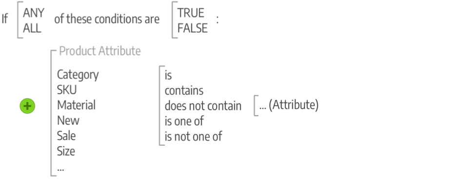

# Commerce 머천다이징 및 프로모션 소개

프로모션을 타겟팅하고 고객 참여를 위한 기회를 창출하며 구매자를 구매자로 전환합니다. 구매 후 활동을 지원하고 재방문 고객에게 특별 할인을 제공하여 고객 관계를 관리합니다. SEO 이니셔티브를 지원하는 모범 사례 및 기법을 알아보십시오.

## 머천다이징

_머천다이징_&#x200B;은 소매점에서 플로어 플랜 개발 및 제품 프레젠테이션의 예술과 과학을 설명하는 용어입니다. [범주 기반 탐색](../catalog/navigation-top.md)은 매장의 평면도로, 제품의 동적 표시는 매장의 제품 목록에 적용할 수 있는 조건으로 생각할 수 있습니다. 또한 더 많은 제품 판매를 촉진하는 프로그램을 구현할 수 있습니다.

- [!BADGE PaaS 전용]{type=Informative url="https://experienceleague.adobe.com/en/docs/commerce/user-guides/product-solutions" tooltip="Adobe Commerce 온 클라우드 프로젝트(Adobe 관리 PaaS 인프라) 및 온프레미스 프로젝트에만 적용됩니다."} [시각적 머천다이저](visual-merchandiser.md) - 제품을 배치하고 범주 목록에 표시되는 제품을 결정하는 조건을 적용할 수 있는 고급 도구 세트입니다.

- [선물 등록기](gift-registries.md) - 특별한 경우에 사용할 선물 등록기를 만들고 친구 및 가족이 선물 등록기에서 선물을 구입하도록 초대할 수 있는 기능을 고객에게 제공합니다.

- [보상 및 충성도](rewards-loyalty.md) - 포인트 시스템을 사용하여 고객 참여를 유도하고 고객 충성도를 높이는 고유한 프로그램을 구현합니다. 다양한 거래 및 고객 활동에 대해 포인트를 수여하고 포인트 배분, 잔고 및 만기를 제어할 수 있습니다.

- [개인 판매 및 이벤트](events-private-sales.md) - 기존 고객 기반을 사용하여 버즈 및 새 리드를 생성하거나 개인 판매 및 기타 카탈로그 이벤트를 통해 잉여 인벤토리를 오프로드합니다.

>[!TIP]
>
>제품 추천과 이를 통해 구매자에게 최상의 경험을 제공하기 위해 필요한 insight 및 제어 기능을 제공하는 방법에 대해 알아보려면 [제품 추천 사용 안내서](https://experienceleague.adobe.com/docs/commerce/product-recommendations/guide-overview.html)를 참조하세요.

## 프로모션

Adobe Commerce에서 프로모션 기능을 사용하여 제품 관계를 설정하고 가격 규칙을 사용하여 다양한 조건에 따라 할인을 트리거합니다. 다음과 같은 고객 인센티브를 제공하기 위해 가격 규칙을 사용할 수 있습니다.

- 최고의 고객에게 특정 제품의 할인에 대한 쿠폰을 보내십시오.
- 일정 금액 이상 구매 시 무료 배송 제공
- 특정 기간에 대한 프로모션 예약

규칙은 하나 또는 모두가 충족될 때 제품에 가격 변경을 적용하는 조건(하나 이상)의 컬렉션입니다. 각 규칙은 모든 또는 일부(하나 이상의 모든 것이 아닌) 문이 true 또는 false일 때 적용되는 여러 조건을 가질 수 있습니다.

### 조건

조건은 제품 목록과 규칙을 적용하기 위한 상황을 구체화하는 명령문입니다. 조건에 대한 속성과 옵션은 사용 가능한 규칙 유형마다 다릅니다. 충족되면 할인, 원-원(BOGO) 및 기타 옵션과 같은 작업이 완료됩니다. 비즈니스 요구 사항, 계절별 할인 및 프로모션, 1년 간의 기회에 맞춰 규칙은 단순하거나 필요에 따라 복잡할 수 있습니다. 예를 들어 장바구니의 소계가 높은 경우 연중 무료 배송을 제공하면서 휴일에 대한 몇 가지 옵션을 추가할 수 있습니다.

>[!NOTE]
>
>특정 제품 특성을 기반으로 조건을 정의하려면 **[!UICONTROL Use for Promo Rule Conditions]** Storefront 속성`Yes`의 특성에 대해 [을(를) ](../catalog/attribute-product-create.md)(으)로 설정해야 합니다.

### 가격 규칙

[카탈로그 가격 규칙](price-rules-catalog.md)의 경우 카탈로그, 비교 함수 및 선택한 특성의 [특성 집합](../catalog/attribute-sets.md)을(를) 기반으로 조건을 만듭니다. 몇 개의 문장을 선택하여 문장과 같은 조건을 생성합니다. 예를 들어 두 개의 가격 규칙을 만들어 카테고리에 따라 아동 의류 및 남성/여성 의류에 대한 할인을 적용할 수 있습니다.

{width="500"}

[장바구니 가격 규칙](price-rules-cart.md) 조건은 저장소 [루트](../catalog/category-root.md)의 하위 항목인 모든 범주를 기반으로 할 수 있습니다. 가격 규칙은 미리 설정되어 있으며, 필요한 조건이 충족될 때마다 실행됩니다. 이러한 규칙은 제품 특성을 사용하여 장바구니의 SKU와 일치하는 제품 특성 조합과 같은 특성을 사용합니다. 이러한 규칙은 제품 선택 수량 조건, 복잡한 규칙에 대한 조건 조합 및 소계와 같은 장바구니 속성을 사용할 수도 있습니다.

{width="500"}

## 통신 및 SEO

[SEO(검색 엔진 최적화)](seo-overview.md)을 마스터하는 것은 잠재적 구매자를 끌어들이는 데 중요합니다. 검색 엔진에서 페이지를 색인화하는 방법을 개선하기 위해 검색 엔진 최적화와 사이트 콘텐츠 및 프레젠테이션 미세 조정에 대해 알아봅니다.

스토어를 시작하기 전에 완료해야 하는 작업 중 하나는 스토어에서 보낸 모든 통신에 사용되는 이메일 템플릿을 검토하여 브랜드가 반영되었는지 확인하는 것입니다. 그러나 기존 고객에게 브랜드와 제품을 홍보하는 다른 커뮤니케이션을 개발하여 이 단계를 한 단계 더 발전시켜야 합니다. 변수와 마크업 태그를 사용하여 콘텐츠를 개인화할 수 있습니다.

>[!NOTE]
>
>Adobe Commerce 및 Magento Open Source 릴리스 2.4.0 - 2.4.3에는 dotdigital Engagement Cloud와 통합하는 데 사용되는 dotdigital 공급업체가 개발한 확장 프로그램이 포함되어 있습니다. 2.4.4 릴리스부터 이 확장은 더 이상 핵심 릴리스와 번들로 제공되지 않으며 Commerce Marketplace에서 설치하고 업데이트해야 합니다. Marketplace에서는 확장 개발자가 제공하는 현재 설명서에 대한 액세스도 제공합니다.
>&#x200B;>  
>&#x200B;>번들 확장을 활성화하고 구성한 경우 2.4.4 업그레이드 프로세스의 일부로 composer.json 파일을 업데이트하고 앞으로 확장 업데이트를 관리해야 합니다. 자세한 내용은 [업그레이드 안내서](https://experienceleague.adobe.com/docs/commerce-operations/upgrade-guide/modules/upgrade.html)의 _업그레이드 모듈_&#x200B;을 참조하십시오.

- [뉴스레터](newsletters.md) - 뉴스레터를 생성하고, 구독자 목록을 관리하고, 콘텐츠를 개발하고, 스토어로 트래픽을 유도합니다.

- [RSS 피드](social-rss.md#rss-feeds) - RSS 피드를 사용하여 제품 정보를 쇼핑 집계 사이트에 게시하고 뉴스레터에 포함시킵니다. 고객은 RSS 피드에 가입하여 새로운 제품 및 프로모션에 대해 알아볼 수 있습니다.

- [소셜 네트워크](social-rss.md#social-networks) - Marketplace 확장을 설치하거나 콘텐츠 페이지에 플러그인을 추가하여 스토어를 소셜 네트워크와 통합합니다.

## Google 마케팅 도구

스토어 구성은 다음의 Google 도구와 통합되어 콘텐츠를 최적화하고, 트래픽을 분석하고, 카탈로그를 쇼핑 집선 및 마켓플레이스에 연결하는 데 도움이 됩니다.

>[!NOTE]
>
>2.4.5 릴리스부터 Google 서비스 통합이 GTag API 사용을 지원하도록 업데이트됩니다. GTag는 웹 페이지에 대한 Google 기능과 통합하기 위한 통합 메커니즘으로, Google Services를 통해 컨텐츠를 추적하고 관리할 수 있는 최신 기능과 기회를 지원합니다. 자세한 내용은 [Google Analytics 개발자 설명서](https://developers.google.com/analytics/devguides/collection/gtagjs)를 참조하세요.

- [Google Analytics](google-analytics.md) - Google Universal Analytics를 사용하여 추적을 위한 추가 사용자 지정 차원 및 지표를 정의하고 오프라인 및 모바일 앱 상호 작용을 지원하며 진행 중인 업데이트에 액세스할 수 있습니다.

- [Google 태그 관리자](google-tag-manager.md) - (Adobe Commerce 전용) Google 태그 관리자를 사용하여 마케팅 캠페인 이벤트와 관련된 여러 태그를 관리합니다.

- [Google AdWords](google-adwords.md) - Google AdWords 캠페인을 만들고 스토어에 대한 전환을 추적합니다.
