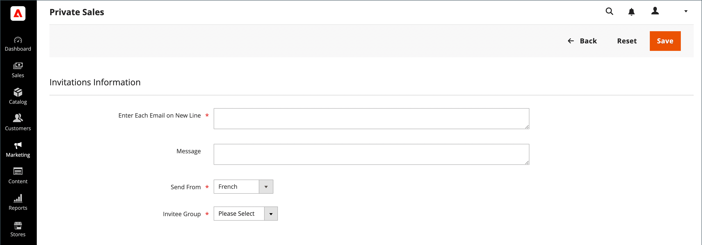

# 이벤트 초대

{{ee-feature}}

초대가 활성화되면 고객은 고객 계정의 대시보드에서 초대를 보내고 볼 수 있습니다. 초대 이메일에는 스토어의 고객 로그인 페이지에 대한 링크가 포함되어 있습니다.

## 내 초대

고객 계정의 _[!UICONTROL My Invitations]_&#x200B;섹션에는 고객이 보낸 모든 초대가 나열됩니다. 고객은 상점 이벤트, 선물 등록, 위시리스트 등을 위해 친구 및 가족에게 초대장을 보낼 수 있습니다.

{width="700" zoomable="yes"}

### 초대 워크플로

1. **고객이 초대를 준비합니다**: 계정 대시보드에서 고객이 수신자 목록을 준비하고 초대를 완료합니다. 구성에 따라 사용자 지정 메시지를 포함할 수 있습니다.
1. **고객이 초대를 보냅니다**: 준비가 되면 고객이 _[!UICONTROL Send Invitations]_&#x200B;단추를 클릭합니다.
1. **시스템에서 전송을 관리합니다**: 시스템에서 구성에 설정된 숫자에 따라 초대를 일괄적으로 보냅니다.
1. **고객이 응답을 모니터링함**: 고객은 계정 대시보드의 각 초대 상태를 `Sent`, `Accepted` 또는 `Canceled`(으)로 모니터링합니다.

### 초대 보내기

1. 상점 앞에 있는 계정의 사이드바에서 고객이 **[!UICONTROL My Invitations]**&#x200B;을(를) 선택합니다.

1. _내 초대_ 페이지에서 **[!UICONTROL Send Invitation]**&#x200B;을(를) 클릭합니다.

1. 새 초대 항목 정의:

   - 이메일 정보를 완료합니다.

   - (선택 사항) **+**&#x200B;을(를) 클릭하고 다른 전자 메일 주소를 추가하여 다중 주소 초대를 만듭니다.

     단일 초대에 5개의 이메일 주소 제한이 있습니다.

   - (선택 사항) 함께 제공되는 메시지를 입력합니다.

1. 완료되면 **[!UICONTROL Send Invitation]**&#x200B;을(를) 클릭합니다.

초대 알림은 초대된 사용자의 이메일 주소로 전송되며 계정 설정에 대한 지침 링크가 있습니다.

>[!NOTE]
>
>사용자는 특정 이메일 주소에 하나의 초대장만 보낼 수 있습니다. 동일한 이메일 주소로 초대를 다시 보내려고 하면 오류 메시지가 표시되고 초대가 전송되지 않습니다.

## 스토어에 대한 초대 활성화

초대 구성은 스토어에 대한 초대를 활성화하고 전송 방법을 결정합니다.

1. _관리자_ 사이드바에서 **[!UICONTROL Stores]** > _[!UICONTROL Settings]_>**[!UICONTROL Configuration]**(으)로 이동합니다.

1. 왼쪽 패널에서 **[!UICONTROL Customers]**&#x200B;을(를) 확장하고 **[!UICONTROL Invitations]**&#x200B;을(를) 선택합니다.

1. **[!UICONTROL General]** 섹션에서 를 확장합니다.

   {width="600" zoomable="yes"}

1. **[!UICONTROL Enable Invitations Functionality]**&#x200B;을(를) `Yes`(으)로 설정합니다.

1. 고객이 상점 첫 화면에서 초대를 관리할 수 있도록 하려면 **상점 첫 화면에서 초대 사용**&#x200B;을 `Yes`(으)로 설정하십시오.

1. **[!UICONTROL Referred Customer Group]**&#x200B;을(를) 다음 중 하나로 설정합니다.

   - `Same as Inviter`
   - `Default Customer Group from Configuration`

1. **[!UICONTROL New Accounts Registration]**&#x200B;을(를) 다음 중 하나로 설정합니다.

   - `By Invitation Only`
   - `Available to All`

1. **[!UICONTROL Allow Customers to Add Custom Message to Invitation Email]**&#x200B;하려면 `Yes`을(를) 선택하십시오.

1. 한 번에 보낼 수 있는 초대 수를 제한하려면 **[!UICONTROL Max Invitations Allowed to be Sent at One Time]** 필드에 숫자를 입력합니다.

1. **[!UICONTROL Email]** 섹션에서 를 확장하고 다음을 수행합니다.

   {width="600" zoomable="yes"}

   - **[!UICONTROL Customer Invitation Email Sender]**(으)로 사용할 저장소 ID를 선택하십시오.

   - 보낸 초대에 사용된 **[!UICONTROL Customer Invitation Email Template]**&#x200B;을(를) 선택하십시오.

1. 완료되면 **[!UICONTROL Save Config]**&#x200B;을(를) 클릭합니다.

## 관리자에서 초대 보내기 및 관리

[비공개 판매 보고서](../getting-started/private-sales-reports.md) 섹션에서 지정된 기간 동안 보낸 초대 수 또는 초대를 보낸 고객을 확인할 수 있습니다.

### 관리자에서 초대 만들기

1. _관리자_ 사이드바에서 **[!UICONTROL Marketing]** > _[!UICONTROL Private Sales]_>**[!UICONTROL Invitations]**(으)로 이동합니다.

1. 오른쪽 상단에서 **[!UICONTROL Add Invitations]**&#x200B;을(를) 클릭합니다.

1. 다음 화면에서는 새 고객을 초대하고 사용자 지정 메시지를 추가하고 보낸 사람을 선택한 다음 초대 그룹을 선택하는 이메일 주소를 입력합니다.

   저장소 보기가 여러 개인 경우 **[!UICONTROL Send From]** 옵션을 사용하여 초대를 보낼 저장소 보기를 지정합니다.

   {width="700" zoomable="yes"}

1. 완료되면 **[!UICONTROL Save]**&#x200B;을(를) 클릭합니다.

### 단일 엔터티에 대한 초대 무시

1. _관리자_ 사이드바에서 **[!UICONTROL Marketing]** > _[!UICONTROL Private Sales]_>**[!UICONTROL Invitations]**(으)로 이동합니다.

1. 필터를 사용하여 필요한 초대를 찾아 편집 모드로 엽니다.

1. 오른쪽 상단에서 **[!UICONTROL Discard Invitation]**&#x200B;을(를) 클릭합니다.

1. 작업을 확인하려면 **[!UICONTROL OK]**&#x200B;을(를) 클릭합니다.

### 여러 엔터티에 대한 초대 무시

1. _관리자_ 사이드바에서 **[!UICONTROL Marketing]** > _[!UICONTROL Private Sales]_>**[!UICONTROL Invitations]**(으)로 이동합니다.

1. 삭제할 초대를 찾아 선택합니다.

1. 왼쪽 상단에서 **[!UICONTROL Actions]** 메뉴를 사용하여 **[!UICONTROL Discard Selected]**&#x200B;을(를) 선택하고 **[!UICONTROL Submit]**&#x200B;을(를) 클릭합니다.

1. 작업을 확인하려면 **[!UICONTROL OK]**&#x200B;을(를) 클릭합니다.

### 필드 설명

| 필드 | 설명 |
|--- |--- |
| [!UICONTROL Select] | 확인란을 선택하여 작업에 적용할 초대를 선택하거나 열 머리글에서 선택 컨트롤을 사용합니다. 옵션: `Select All` /` Deselect All` / `Select Visible` / `Unselect Visible` |
| [!UICONTROL ID] | 초대의 내부 ID 번호 |
| [!UICONTROL Email] | 해당 고객 이메일 주소 |
| [!UICONTROL Invitee] | 초대된 사용자 이메일 |
| [!UICONTROL Sent] | 초대가 전송된 시간과 날짜 |
| [!UICONTROL Registered] | 고객이 등록된 시간 및 데이터 |
| [!UICONTROL Status] | 초대 상태. 옵션: `Sent` / `Not Sent` / `Accepted` / `Discarded` |
| [!UICONTROL Valid Website] | 해당 웹 사이트 |
| [!UICONTROL Invitee Group] | 초대받은 사람의 고객 그룹 |

{style="table-layout:auto"}
