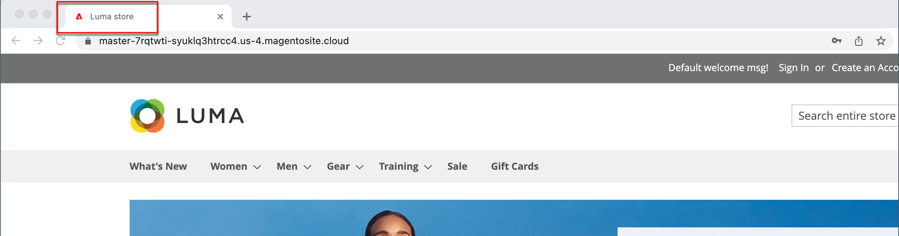

# 메타데이터

스토어에는 검색 엔진이 사이트를 색인화하는 방식을 개선하기 위해 키워드가 풍부한 메타데이터를 입력할 수 있는 위치가 로드됩니다. 스토어를 설정하는 동안 나중에 완료하기 위해 사전 메타데이터를 입력할 수 있습니다. 시간이 지남에 따라 고객의 구매 패턴과 선호도를 타겟팅하기 위해 메타데이터를 미세 조정할 수 있습니다.

{width="700" zoomable="yes"}

## 메타 제목

메타 제목은 브라우저 및 검색 결과 목록의 제목 표시줄 및 탭에 나타납니다. 메타 제목은 페이지에 고유해야 하며 길이는 70자 미만이어야 합니다.

{width="600"}

## 메타 키워드

일부 검색 엔진은 메타 키워드를 무시하지만 다른 검색 엔진은 메타 키워드를 계속 사용합니다. 현재 가장 좋은 방법은 메타 제목과 메타 설명에 고가치 키워드를 통합하는 것입니다.

{width="500"}

## 메타 설명

메타 설명은 검색 결과 목록 페이지에 대한 간략한 개요를 제공합니다. 메타 설명은 150-160자 사이여야 하지만 필드에는 최대 255자를 사용할 수 있습니다.

## 리치 스니펫

리치 스니펫은 검색 결과 목록 및 기타 애플리케이션에 대한 자세한 정보를 제공합니다. 기본적으로 [schema.org][1] 표준을 기반으로 하는 구조화된 데이터 마크업이 스토어의 제품 템플릿에 추가됩니다. 따라서 검색 엔진이 제품 목록에 _리치 스니펫_(으)로 포함하는 자세한 정보를 사용할 수 있습니다.

## 표준 메타 태그

일부 검색 엔진은 동일한 콘텐츠를 가리키는 여러 URL이 있는 웹 사이트에 불이익을 줍니다. 정식 메타 태그는 검색 엔진에 여러 URL에 동일하거나 유사한 콘텐츠가 있을 때 색인화할 페이지를 알려줍니다. 표준 메타 태그를 사용하면 사이트 등급 및 집계 페이지 조회수를 향상시킬 수 있습니다. 정식 메타 태그가 제품 또는 범주 페이지의 `<head>` 블록에 배치됩니다. 기본 URL에 대한 링크를 제공하므로 검색 엔진이 이를 더 가중시킵니다.

### 예제 1: 카테고리 경로가 중복 URL을 만듭니다.

예를 들어 카탈로그가 제품 URL에 카테고리 경로를 포함하도록 구성된 경우 스토어는 동일한 제품 페이지를 가리키는 여러 URL을 생성합니다.

    http://mystore.com/gear/bags/driven-backpack.html
    http://mystore.com/driven-backpack.html

### 예제 2: 카테고리 페이지 전체 URL

카테고리에 대한 표준 메타 태그가 활성화되면 스토어의 카테고리 페이지에는 전체 카테고리 URL에 대한 표준 URL이 포함됩니다.

    http://mystore.com/gear/bags/

### 예제 3: 제품 페이지 전체 URL

제품에 대한 표준 메타 태그가 활성화되면 제품 URL 키가 전체적으로 고유하므로 제품 페이지에는 도메인 이름/제품 URL 키에 대한 표준 URL이 포함됩니다.

    http://mystore.com/driven-backpack.html

제품 URL에 카테고리 경로도 포함하는 경우 표준 URL은 도메인 이름/제품 URL 키로 유지됩니다. 그러나 카테고리를 포함하는 전체 URL을 사용하여 제품에 액세스할 수도 있습니다. 예를 들어 제품 URL 키가 `driven-backpack`이고 [톱니바퀴] > [가방] 범주에 할당된 경우 URL 중 하나를 사용하여 제품에 액세스할 수 있습니다.

URL에서 카테고리를 생략하거나 표준 메타 태그를 사용하여 검색 엔진이 제품 또는 카테고리별로 색인화하도록 하면 검색 엔진에 의해 페널티를 받지 않을 수 있습니다. 카테고리 및 제품 모두에 대해 표준 메타 태그를 활성화하는 것이 좋습니다.

### 정식 메타 태그 활성화

1. _관리자_ 사이드바에서 **[!UICONTROL Stores]** > _[!UICONTROL Settings]_>**[!UICONTROL Configuration]**(으)로 이동합니다.

1. 왼쪽 패널에서 **[!UICONTROL Catalog]**&#x200B;을(를) 확장하고 아래의 **[!UICONTROL Catalog]**&#x200B;을(를) 선택합니다.

1. **검색 엔진 최적화** 섹션에서 을 확장합니다.

   필드 값을 변경하려면 먼저 각 필드 뒤에 있는 **시스템 값 사용** 확인란의 선택을 취소해야 합니다.

   {width="600" zoomable="yes"}

1. 검색 엔진이 전체 범주 경로를 사용하여 범주 페이지만 색인화하도록 하려면 다음을 수행합니다.

   - **범주에 표준 링크 메타 태그 사용**&#x200B;을(를) `Yes`(으)로 설정합니다.

   - **제품에 정식 링크 메타 태그 사용**&#x200B;을(를) `No`(으)로 설정합니다.

1. 검색 엔진이 도메인 이름/제품 URL 키 형식을 사용해서만 제품 페이지를 색인화하도록 하려면 다음을 수행하십시오.

   - **제품에 정식 링크 메타 태그 사용**&#x200B;을(를) `Yes`(으)로 설정합니다.

   - **범주에 표준 링크 메타 태그 사용**&#x200B;을(를) `No`(으)로 설정합니다.

1. 완료되면 **[!UICONTROL Save Config]**&#x200B;을(를) 클릭합니다.

## 메타데이터 데모

SEO 메타데이터 관리에 대해 알아보려면 이 비디오 를 시청하십시오.

>[!VIDEO](https://video.tv.adobe.com/v/343750?quality=12)

[1]: https://schema.org/
