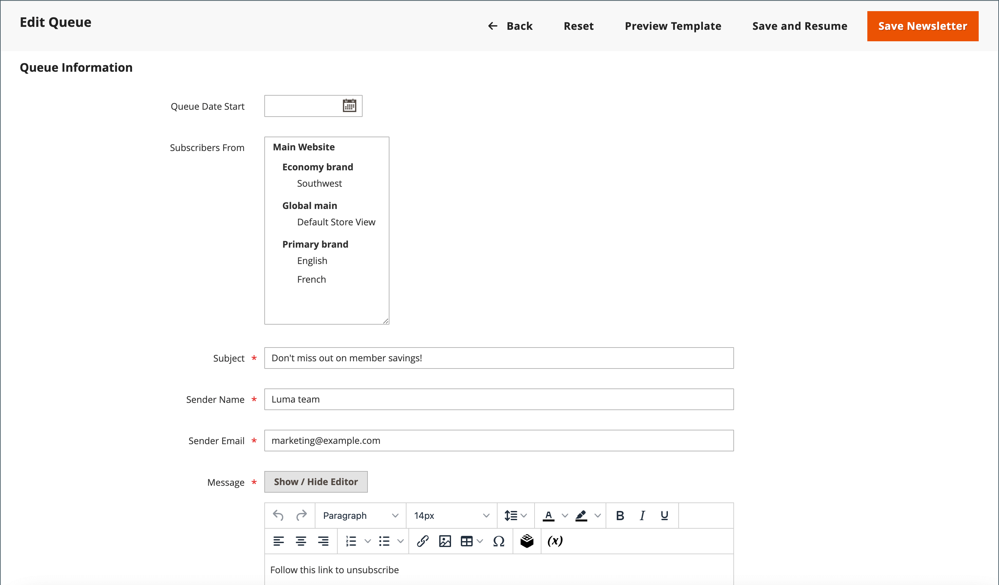

# 뉴스레터 큐

서버의 로드를 관리하기 위해 구독자가 많은 뉴스레터가 여러 배치의 대기열로 전송됩니다. 뉴스레터 큐를 정기적으로 확인하여 상태를 확인하고 처리된 메시지 수를 볼 수 있습니다. 전송 중에 발생하는 모든 문제는 _뉴스레터 문제_ 보고서.

## 뉴스레터 전송

1. 다음에서 _관리자_ 메뉴, 이동 **[!UICONTROL Marketing]** > _[!UICONTROL Communications]_>**[!UICONTROL Newsletter Template]**.

1. 그리드에서 [뉴스레터 템플릿](newsletter-template.md) 전송 및 설정 예정 **[!UICONTROL Action]** 열 위치: `Queue Newsletter`.

1. 대상 **[!UICONTROL Queue Date Start]**&#x200B;을 클릭하고 달력에서 전송을 시작할 날짜를 선택합니다().

1. 대상 **[!UICONTROL Subscribers From]**&#x200B;이메일 전달에 포함할 각 스토어 보기를 선택합니다.

1. 이메일 헤더 정보를 작성합니다.

   - 뉴스레터에 대한 간략한 설명을 입력하십시오. **[!UICONTROL Subject]** 이메일 헤더의 줄입니다.

   - 다음을 입력합니다. **[!UICONTROL Sender Name]**.

   - 대상 **[!UICONTROL Sender Email]**&#x200B;을(를) 통해 발신자의 이메일 주소를 입력합니다.

     발신자의 기본 이름과 이메일 주소는 구성에 지정됩니다.

     {width="600" zoomable="yes"}

1. 해당하는 경우 **[!UICONTROL Message]** 가입을 해지하는 방법 위의 상자입니다.

   >[!NOTE]
   >
   >많은 관할권에서 법에 따라 요구되는 지침을 제거하지 마십시오.

1. 뉴스레터에 사용자 지정 스타일을 적용하려면 **[!UICONTROL Newsletter Styles]** 필드.

1. 완료되면 다음을 클릭하십시오. **[!UICONTROL Save and Resume]**.

   뉴스레터가 처리 대기 중인 큐에 나타납니다.

## 문제 확인

다음에서 _관리자_ 메뉴, 이동 **[!UICONTROL Reports]** > _[!UICONTROL Marketing]_>**[!UICONTROL Newsletter Problem Reports]**.

## 단추 막대

| 단추 | 설명 |
|--- |--- |
| **[!UICONTROL Back]** | 변경 사항을 저장하지 않고 뉴스레터 템플릿 페이지로 돌아갑니다. |
| **[!UICONTROL Reset]** | 대기열 정보 양식의 저장되지 않은 변경 사항을 이전 값으로 재설정합니다. |
| **[!UICONTROL Preview Template]** | 별도의 탭에서 미리보기 페이지를 엽니다. |
| **[!UICONTROL Save and Resume]** | 변경 사항을 모두 저장합니다. 뉴스레터를 큐에 넣습니다. |
| **[!UICONTROL Save Newsletter]** | 변경 사항을 모두 저장합니다. 뉴스레터를 큐에 넣습니다. |

{style="table-layout:auto"}

## 열

| 열 | 설명 |
|--- |--- |
| [!UICONTROL ID] | 각 뉴스레터 템플릿에 할당된 고유한 숫자 식별자입니다. |
| [!UICONTROL Queue Start] | 뉴스레터가 발송된 날짜. |
| [!UICONTROL Queue End] | 뉴스레터 전송이 완료된 날짜. |
| [!UICONTROL Subject] | 뉴스레터 템플릿의 제목입니다. |
| [!UICONTROL Status] | 뉴스레터 메일링 상태를 나타냅니다. 가능한 값: `Sent`, `Canceled`, `Not Sent`, `Sending`, 또는 `Paused`. |
| [!UICONTROL Processed] | 얼마나 많은 뉴스레터가 전송되었는지 나타냅니다. |
| [!UICONTROL Recipients] | 구독자가 받은 뉴스레터 수를 나타냅니다. |
| [!UICONTROL Actions] | **[!UICONTROL Preview]**: 템플릿을 미리 볼 수 있는 별도의 창을 엽니다. |

{style="table-layout:auto"}
