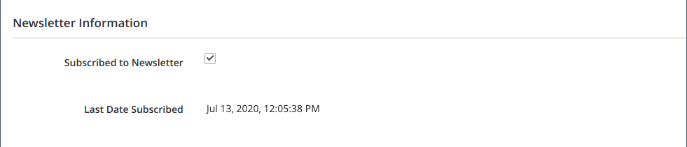
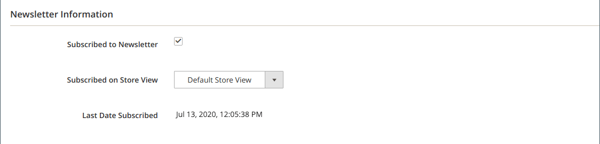

# 뉴스레터 구독자 관리

구독 목록을 정기적으로 관리하고 구독 취소 요청을 처리하는 것이 좋습니다. 일부 관할권에서는 특정 기간 내에 가입 해지 요청을 처리하는 것이 법률상 요구된다.

간단한 활성 구독 목록을 사용하여 구독자를 쉽게 관리할 수 있습니다. 고객이 구독 취소 요청을 제출하면 _구독 취소_ 하나 이상의 선택한 가입에 대한 작업입니다.

여러 스토어 보기가 있는 단일 사이트 설정에서 고객 계정 구독은 특정 스토어 보기와 연결될 수 있습니다.

글로벌 을 사용하는 다중 스토어 및 다중 사이트 설정 [고객 계정 범위](../customers/customer-account-scope.md), 고객 계정은 여러 사이트/스토어의 뉴스레터를 구독할 수 있습니다. 이 경우 고객 계정을 편집하여 구독 그룹을 관리하거나 특정 사이트/스토어에 대한 구독을 취소하여 요청을 수락할 수 있습니다.

서드파티 서비스를 사용하여 뉴스레터를 전송하려면 구독 목록을 CSV 또는 XML 파일로 내보낼 수 있습니다.

## 고객에 대한 구독 관리

1. 다음에서 _관리자_ 사이드바, 이동 **[!UICONTROL Customers]** > **[!UICONTROL All Customers]**.

1. 그리드에서 고객을 찾아 다음을 클릭합니다. **[!UICONTROL Edit]** 다음에서 _[!UICONTROL Action]_열.

1. 클릭 **[!UICONTROL Newsletter]** 왼쪽 패널에서

1. 사이트/스토어 설정에 따라 고객에 대한 구독을 수정합니다.

   단일 사이트/단일 스토어 설정의 경우 **[!UICONTROL Subscribed to Newsletter]** 확인란.

   {width="500" zoomable="yes"}

   단일 사이트/다중 스토어 설정의 경우 **[!UICONTROL Subscribed to Newsletter]** 확인란 및 설정 **[!UICONTROL Subscribed on Store View]** 구독을 위한 올바른 스토어 보기로 이동합니다.

   {width="500" zoomable="yes"}

   글로벌 고객 계정 범위를 사용하는 다중 사이트/다중 스토어 설정의 경우 페이지에 모든 사이트에 대한 구독 상태가 표시됩니다. 다음을 선택하거나 선택 취소할 수 있습니다. **[!UICONTROL Subscribed]** 확인란 및/또는 변경 **[!UICONTROL Store View]** 구독.

   {width="500" zoomable="yes"}

1. 클릭 **[!UICONTROL Save Customer]**.

## 구독자 목록에서 구독 취소

1. 다음에서 _관리자_ 사이드바, 이동 **[!UICONTROL Marketing]** > _[!UICONTROL Communications]_>**[!UICONTROL Newsletter Subscribers]**.

   일부 고객이 둘 이상의 사이트에 대한 구독을 갖는 다중 사이트 설정의 경우 각 구독이 그리드에 라인 항목으로 표시됩니다.

1. 그리드에서 가입자를 찾은 다음 첫 번째 열에서 확인란을 선택합니다.

   >[!NOTE]
   >
   >일괄 가입을 해지하려면 취소할 각 가입자의 확인란을 선택합니다.

1. 설정 _[!UICONTROL Action]_제어 대상&#x200B;**[!UICONTROL Unsubscribe]**및 클릭&#x200B;**[!UICONTROL Submit]**.

   {width="600" zoomable="yes"}

   레코드의 상태가 다음으로 변경됨: `Unsubscribed`.

## 구독자 목록 내보내기

1. 다음에서 _[!UICONTROL Newsletter Subscribers]_list, filter 컨트롤을 사용하여_&#x200B;상태&#x200B;_/ `Subscribed` 및 를 사용하여 적절한 웹 사이트, 스토어 또는 스토어 뷰를 제공할 수 있습니다.

1. 설정 **[!UICONTROL Export to]** 다음 중 하나를 제어하십시오.

   - `CSV`
   - `XML`

1. 클릭 **[!UICONTROL Export]** 그리고 화면 하단에서 프롬프트를 찾아 파일을 저장합니다.

   {width="600" zoomable="yes"}

## 구독자 목록에서 구독자를 삭제합니다.

1. 다음에서 _관리자_ 사이드바, 이동 **[!UICONTROL Marketing]** > _[!UICONTROL Communications]_>**[!UICONTROL Newsletter Subscribers]**.

1. 그리드에서 가입자를 찾은 다음 첫 번째 열에서 확인란을 선택합니다.

1. 설정 _[!UICONTROL Action]_제어 대상&#x200B;**[!UICONTROL Delete]**및 클릭&#x200B;**[!UICONTROL Submit]**.

1. 확인을 묻는 메시지가 나타나면 **[!UICONTROL OK]**.
