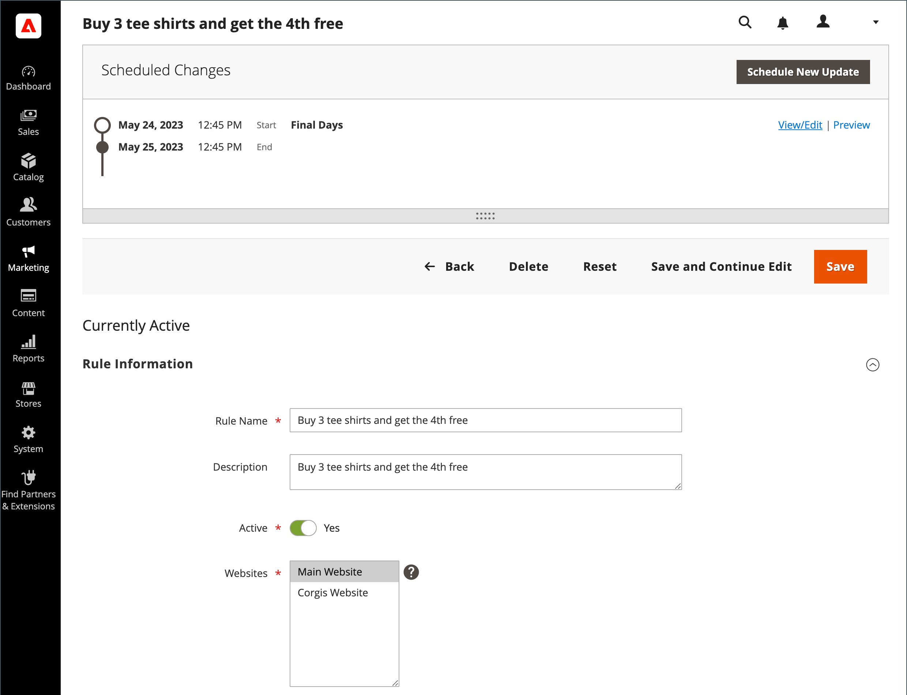

# 장바구니 가격 규칙에 대한 예약된 변경 사항

{{ee-feature}}

장바구니 가격 규칙은 캠페인의 일부로 일정에 따라 적용하고 다른 콘텐츠 변경 사항과 그룹화할 수 있습니다. 가격 규칙에 대한 예약된 변경 사항을 기반으로 캠페인을 생성하거나 변경 사항을 기존 캠페인에 적용할 수 있습니다.

{width="700" zoomable="yes"}

>[!NOTE]
>
>모든 예약된 업데이트가 연속적으로 적용됩니다. 즉, 모든 엔티티는 한 시점에서 하나의 예약된 업데이트만 가질 수 있습니다. 모든 예약된 업데이트는 해당 시간대 내의 모든 스토어 보기에 적용됩니다. 따라서 엔티티는 서로 다른 스토어 보기에 대해 동시에 서로 다른 예약된 업데이트를 가질 수 없습니다. 현재 예약된 업데이트의 영향을 받지 않는 모든 스토어 뷰 내의 모든 엔티티 속성 값은 이전 예약된 업데이트가 아닌 기본값에서 가져옵니다.

동일한 캠페인에서 여러 가격 규칙이 실행되는 경우 _[!UICONTROL Priority]_가격 규칙의 설정에 따라 우선 순위가 결정됩니다. 자세한 내용은 다음을 참조하십시오. [컨텐츠 스테이징](../content-design/content-staging.md).

다음 주의 사항에 유의하십시오.

- 가격 규칙이 포함된 캠페인을 처음에 종료 날짜 없이 만든 경우 종료 날짜를 포함하도록 캠페인을 나중에 편집할 수 없습니다. 캠페인을 만들 때 종료 날짜를 추가하거나 기존 캠페인의 중복 버전을 만들고 필요에 따라 종료 날짜를 중복 날짜에 추가하는 것이 좋습니다.
- 예약된 업데이트를 사용하여 종료 날짜가 있는 장바구니 가격 규칙을 활성화할 때 규칙을 처음에 비활성화한 것으로 설정해야 합니다. 이미 활성화된 규칙은 종료 날짜를 준수하지 않습니다.
- 쿠폰이 장바구니 가격 규칙에 연결되어 있지 않습니다. 예약된 업데이트는 다음에 대한 액세스를 제공하지 않습니다. _[!UICONTROL Coupon]_,_[!UICONTROL Coupon Code]_, _[!UICONTROL Uses per Coupon]_, 및_[!UICONTROL Uses per Customer]_ 의 필드 _[!UICONTROL Rule Information]_탭. 또한_[!UICONTROL Manage Coupon Codes]_ 탭을 사용할 수 없습니다.

>[!IMPORTANT]
>
>캠페인 **[!UICONTROL Start Date]** 및 **[!UICONTROL End Date]** 다음을 사용하여 정의해야 합니다. **_기본값_** 각 웹 사이트의 현지 시간대에서 변환되는 관리 시간대입니다. 서로 다른 시간대에 여러 개의 웹 사이트가 있지만 미국 시간대를 기반으로 하는 캠페인을 시작하려는 예를 생각해 보십시오. 이 경우 각 현지 시간대에 대해 별도의 업데이트를 예약하고 을 설정해야 합니다 **[!UICONTROL Start Date]** 및 **[!UICONTROL End Date]** 각 로컬 웹 사이트 시간대에서 기본 관리 시간대로 변환되었습니다.
