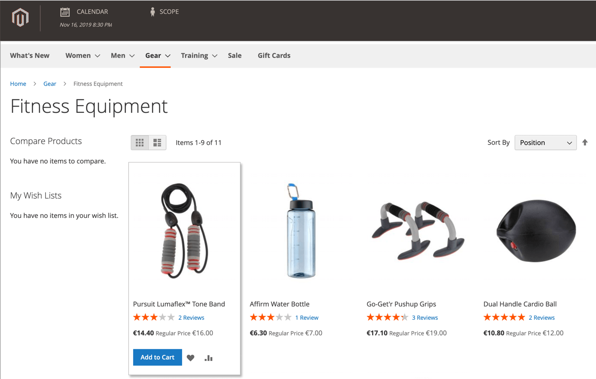
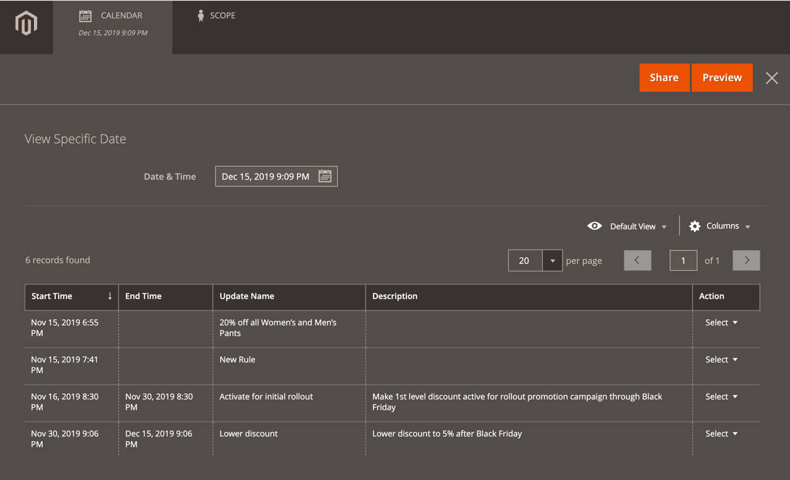

# 카탈로그 가격 규칙에 대한 예약된 변경 사항

{{ee-feature}}

새 가격 규칙을 저장하거나 업데이트하면 페이지 상단에 예약된 변경 상자가 나타납니다. 카탈로그 가격 규칙은 캠페인의 일부로 일정에 따라 적용하고 다른 콘텐츠 변경 사항과 그룹화할 수 있습니다. 가격 규칙에 대한 예약된 변경 사항을 기반으로 캠페인을 생성하거나 변경 사항을 기존 캠페인에 적용할 수 있습니다.

>[!NOTE]
>
> Adobe Commerce에서 [!UICONTROL From] 및 [!UICONTROL To] 필드가 제거되었으며 카탈로그 가격 규칙에서 직접 수정할 수 없습니다. 이러한 활성화를 위해 예약된 업데이트를 만들어야 합니다.

>[!NOTE]
>
>모든 예약된 업데이트가 연속적으로 적용됩니다. 즉, 모든 엔티티는 한 시점에서 하나의 예약된 업데이트만 가질 수 있습니다. 모든 예약된 업데이트는 해당 시간대 내의 모든 스토어 보기에 적용됩니다. 따라서 엔티티는 서로 다른 스토어 보기에 대해 동시에 서로 다른 예약된 업데이트를 가질 수 없습니다. 현재 예약된 업데이트의 영향을 받지 않는 모든 스토어 뷰 내의 모든 엔티티 속성 값은 이전 예약된 업데이트가 아닌 기본값에서 가져옵니다.

동일한 캠페인에서 여러 개의 가격 규칙이 실행되는 경우 가격 규칙의 우선순위 설정에 따라 우선 순위가 결정됩니다. 자세한 내용은 [콘텐츠 스테이징](../content-design/content-staging.md)을 참조하세요.

>[!IMPORTANT]
>
>가격 규칙이 포함된 캠페인을 처음에 종료 날짜 없이 만든 경우 종료 날짜를 포함하도록 캠페인을 나중에 편집할 수 없습니다. 캠페인을 만들 때 종료 날짜를 추가하거나 기존 캠페인의 중복 버전을 만들고 필요에 따라 종료 날짜를 중복에 추가하는 것이 좋습니다.

{width="600" zoomable="yes"}

## 카탈로그 가격 규칙 업데이트 예약

1. _관리자_ 사이드바에서 **[!UICONTROL Marketing]** > _[!UICONTROL Promotions]_>**카탈로그 가격 규칙**(으)로 이동합니다.

1. 편집 모드에서 규칙을 엽니다.

1. 페이지 상단의 **[!UICONTROL Scheduled Changes]** 상자에서 **[!UICONTROL Schedule New Update]**&#x200B;을(를) 클릭합니다.

1. **[!UICONTROL Save as a New Update]** 옵션을 선택한 상태에서 다음을 수행합니다.

   - **[!UICONTROL Update Name]**&#x200B;에 규칙 업데이트의 이름을 입력하십시오.

   - 업데이트 적용 방법 또는 이유를 포함하여 업데이트의 간략한 **[!UICONTROL Description]**&#x200B;을(를) 입력하십시오.

   - _달력_()을 사용하여 변경 일정을 적용할 **[!DNL Start Date]** 및 **[!UICONTROL End Date]**&#x200B;을(를) 선택하십시오. 끝이 열린 변경 내용을 만들려면 종료 날짜를 비워 둡니다.

   {width="600" zoomable="yes"}

   >[!NOTE]
   >
   >시작 및 종료 날짜/시간은 특정 웹 사이트의 시간대가 아니라 기본 관리 패널 날짜/시간 및 시간대로 결정됩니다. 웹 사이트의 시간대를 고려하여 시작 및 종료 시간을 적절하게 결정하십시오. 특정 현지 시간에 시작 및/또는 중지해야 하는 시간대가 다른 웹 사이트에 대한 별도의 규칙을 만듭니다.

1. **[!UICONTROL Rule Information]** 섹션까지 아래로 스크롤하고 필요에 따라 규칙을 변경합니다.

   규칙의 웹 사이트(범위)/고객 그룹, 규칙의 조건 및 규칙이 적용하는 작업을 포함하여 모든 규칙 매개 변수에 대한 변경 사항을 예약할 수 있습니다. 자세한 내용은 [카탈로그 가격 규칙 만들기](price-rules-catalog-create.md)를 참조하세요.

   >[!NOTE]
   >
   >규칙 정보 매개 변수를 변경하는 경우 _[!UICONTROL Status]_이(가) 올바르게 설정되어 있는지 확인하십시오. 변경한 결과 규칙이 적용되게 하려면 상태가 `Active`이어야 합니다.

1. 완료되면 **[!UICONTROL Save]**&#x200B;을(를) 클릭합니다.

   예약된 변경 사항은 캠페인의 시작 및 종료 날짜와 함께 페이지 맨 위에 표시됩니다.

## 예약된 규칙 변경 사항 편집

1. 페이지 상단의 **[!UICONTROL Scheduled Changes]** 상자에서 **[!UICONTROL View/Edit]**&#x200B;을(를) 클릭합니다.

1. 예약된 업데이트에 필요한 변경 작업을 수행합니다.

1. **[!UICONTROL Save]**&#x200B;을(를) 클릭합니다.

## 예약된 규칙 변경 내용 미리 보기

1. 페이지 상단의 **[!UICONTROL Scheduled Changes]** 상자에서 **[!UICONTROL Preview]**&#x200B;을(를) 클릭합니다.

   미리보기에서는 적용된 예약 변경 사항이 있는 상점 전면을 로드하는 새 브라우저 탭을 엽니다. 변경의 영향을 받는 제품으로 이동합니다.

   {width="600" zoomable="yes"}

1. 미리 보기 창의 왼쪽 상단 모서리에서 **[!UICONTROL Calendar]**&#x200B;을(를) 클릭합니다.

   달력 세부 정보에는 같은 날 예약된 다른 캠페인이 표시됩니다. 목록의 각 레코드는 별도의 규칙 업데이트입니다.

   {width="600" zoomable="yes"}

1. 다른 날 또는 시간을 미리 보려면 **[!UICONTROL Date & Time]** 일정 을 클릭하고 다음을 수행하십시오.

   - 다른 날짜 및/또는 시간을 선택하십시오.

   - **[!UICONTROL Preview]**&#x200B;을(를) 클릭합니다.

1. 일정으로 돌아가려면 미리 보기 페이지의 헤더에서 **[!UICONTROL Calendar]**&#x200B;을(를) 클릭합니다.

   여기에서 다음 작업을 수행할 수 있습니다.

   **미리 보기에 대한 링크 공유**

   스토어 미리 보기에 대한 링크를 동료와 공유하려면 **[!UICONTROL Share]**&#x200B;을(를) 클릭합니다. 링크를 클립보드에 복사한 다음 이메일 메시지 본문에 붙여넣습니다.

   >[!NOTE]
   >
   >공유 미리 보기를 보려면 관리자 계정이 필요합니다. [역할에 관리자 계정을 만들 수 있는 액세스 권한](../systems/permissions-user-roles.md)이 있는 경우 공유하기 전에 새 사용자에 대한 계정을 만들어야 합니다.

   **미리 보기 범위 변경**

   다른 저장소 보기에 대해 예약된 변경 내용을 보려면 미리 보기 페이지의 헤더에서 **[!UICONTROL Scope]**&#x200B;을(를) 클릭하십시오. 미리 보려는 웹 사이트, 스토어 또는 스토어 보기를 선택합니다.

1. 필요한 경우 일정으로 돌아가서 _[!UICONTROL Action]_열의&#x200B;**[!UICONTROL View/Edit]**을(를) 클릭하여 다른 예약된 업데이트를 엽니다.
