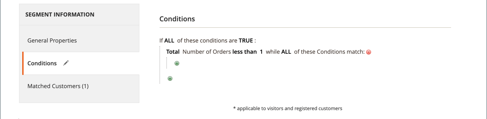

# 장바구니 가격 규칙 예 - 첫 구매와 함께 할인

{{ee-feature}}

장바구니 가격 규칙은 쿠폰이 필요 없이 첫 번째 구매 시 고객에게 자동으로 할인을 제공하는 데 사용할 수 있습니다.

처음 고객을 대상으로 하는 할인을 제공하려면 다음을 수행할 수 있습니다.

- 다음과 같이 정의된 고객 세그먼트 만들기 _주문이 없는 구매자_, 및
- 새 고객 세그먼트를 타겟팅하는 장바구니 가격 규칙을 만듭니다.

>[!NOTE]
>
>고객 세그먼트 기능이 활성화되어 있는지 확인합니다. 을(를) 참조하십시오 [고객 세그먼트 만들기](../customers/customer-segment-create.md).

## 1단계. 고객 세그먼트 만들기

1. 다음에서 _관리자_ 사이드바, 이동 **[!UICONTROL Customers]** > **[!UICONTROL Segments]**.

1. 오른쪽 위 모서리에서 을(를) 클릭합니다. **[!UICONTROL Add Segment]**.

1. 다음을 정의합니다. **[!UICONTROL General Properties]**.

   - 입력 **[!UICONTROL Segment Name]** 고객 세그먼트 식별(예: _최초 고객_).

   - 대상 **[!UICONTROL Assigned to Website]**&#x200B;고객 세그먼트를 사용할 수 있는 웹 사이트를 선택합니다.

   - 대상 **[!UICONTROL Status]**, 선택 `Active`.

   - 대상 **[!UICONTROL Apply to]**, 선택 `Visitors and Registered Customers`.

   - 완료되면 다음을 클릭하십시오. **[!UICONTROL Save and Continue Edit]**.

     왼쪽 패널에서 추가 옵션을 사용할 수 있습니다.

   {width="600" zoomable="yes"}

1. 다음을 정의합니다. **[!UICONTROL Conditions]**.

   이 예의 경우 조건은 다음 대상이 되는 고객을 타겟팅합니다 _총 주문 수가 1보다 작음_ true입니다.

   - 왼쪽의 패널에서 을 선택합니다 **[!UICONTROL Conditions]**.

     기본 조건은 &quot;다음 조건이 모두 TRUE인 경우&quot;로 시작됩니다.

   - 클릭 _추가_ () 및 선택 `Number of Orders`.

   - 클릭 **[!UICONTROL is]** 및 선택 `less than`.

   - 클릭 **...** 및 입력 `1` 필드에서.

   - 녹색 확인 표시를 클릭합니다(  )를 클릭하여 조건 설정을 저장합니다.

   {width="600" zoomable="yes"}

1. 클릭 **[!UICONTROL Save]**.

고객 세그먼트가 만들어지고 _[!UICONTROL Customer Segments]_그리드.

>[!TIP]
>
>세그먼트 ID를 기록해 둡니다. 이 ID 번호를 사용하여 장바구니 가격 규칙을 만듭니다.

## 2단계. 장바구니 가격 규칙 만들기

1. 다음에서 _관리자_ 사이드바, 이동 **[!UICONTROL Marketing]** > _[!UICONTROL Promotions]_>**[!UICONTROL Cart Price Rule]**.

1. 오른쪽 위 모서리에서 을(를) 클릭합니다. **[!UICONTROL Add New Rule]**.

   다음 **[!UICONTROL Rule Information]** 섹션은 기본적으로 표시되며, 확장 가능한 섹션은 다음과 같습니다. **[!UICONTROL Conditions]** 및 **[!UICONTROL Conditions]**.

1. 다음을 정의합니다. **[!UICONTROL Rule Information]**.

   - 다음을 완료합니다. **[!UICONTROL Rule Name]** 및 **[!UICONTROL Description]** 필드. 이 필드는 내부 참조용입니다.

   - 대상 **[!UICONTROL Websites]**&#x200B;을(를) 통해 규칙을 사용할 수 있는 웹 사이트를 선택합니다.

   - 대상 **[!UICONTROL Customer Groups]**&#x200B;이 규칙이 적용되는 고객 그룹을 선택합니다.

     여러 그룹을 선택하려면 Ctrl 키(PC) 또는 Command 키(Mac)를 누른 채 각 옵션을 클릭합니다.

     >[!NOTE]
     >
     >이 목록의 옵션은 에서 만들고 관리하는 고객 그룹에 따라 다릅니다 **[!UICONTROL Customers]** > **[!UICONTROL Customer Groups]**.

   - 대상 **[!UICONTROL Coupon]**, 선택 `No Coupon`.

   - 대상 **[!UICONTROL Uses per Customer]**, 입력 `1`.

   - 대상 **[!UICONTROL Priority]**&#x200B;을 클릭하고 숫자를 입력하여 다른 규칙과 관련하여 이 규칙의 우선 순위를 설정합니다.

     >[!NOTE]
     >
     >동일한 카탈로그 제품이 두 개 이상의 가격 규칙에 대해 설정된 조건을 충족할 경우 우선순위 설정이 중요합니다. 우선 순위가 가장 높은 설정이 있는 규칙이 고객에 대해 활성화됩니다. 가장 높은 우선 순위는 1입니다. 이 예제의 경우 `1` 은 이 규칙이 다른 가격 규칙보다 먼저 적용됨을 의미합니다. 이 값은 **[!UICONTROL Discard Subsequent Rules]** 에서 설정 **[!UICONTROL Action]** 섹션.

   - 완료되면 다음을 클릭하십시오. **[!UICONTROL Save and Continue Edit]**.

     왼쪽 패널에서 추가 옵션을 사용할 수 있습니다.

   {width="600" zoomable="yes"}

1. 다음을 정의합니다. **[!UICONTROL Conditions]**.

   - 아래로 스크롤하고 확장합니다.  다음 **[!UICONTROL Conditions]** 섹션.

     기본 규칙은 &quot;이 모든 조건이 TRUE인 경우:&quot;로 시작됩니다.

   - 클릭 _추가_ () 및 선택 `Customer Segment`.

     구분자 필드의 기본값은 입니다. `matches`.

   - 클릭 **...** 타겟팅할 고객 세그먼트의 세그먼트 ID를 입력합니다.

     이 예에서는 1단계에서 생성된 새 세그먼트의 세그먼트 ID가 입니다. `2`.

     >[!NOTE]
     >
     >세그먼트 ID를 모르는 경우 선택기 아이콘( )을 클릭합니다.  )을 클릭하여 고객 세그먼트 목록을 표시합니다. 필드에 ID를 수동으로 입력하거나 원하는 세그먼트의 확인란을 선택하여 필드를 자동으로 채울 수 있습니다.

   - 녹색 확인 표시를 클릭합니다(  )를 클릭하여 조건 설정을 저장합니다.

   - 완료되면 다음을 클릭하십시오. **[!UICONTROL Save and Continue Edit]**.

     이 규칙 행은 고객 세그먼트 ID 2와 일치하는 모든 고객에게 적용됩니다.

   {width="400"}

1. 아래로 스크롤하고 확장합니다. 다음 **[!UICONTROL Conditions]** 섹션에 규칙 작업을 정의하십시오.

   이 섹션에서는 할인 유형 및 처음 고객에게 적용할 할인의 값/금액을 정의합니다. 이 예에서는 정의된 조건을 충족하는 모든 고객에 대해 10% 할인을 정의합니다. 사용 가능한 다른 옵션에 대한 자세한 내용은 [장바구니 가격 규칙 생성](price-rules-cart-create.md).

   - 대상 **[!UICONTROL Apply]**&#x200B;제품 가격 할인의 백분율을 선택합니다.

   - 대상 **[!UICONTROL Discount Amount]**, 입력 `10`.

   - 이 가격 규칙을 제품 금액에만 적용하려면 다음을 설정합니다. **[!UICONTROL Apply to Shipping Amount]** 끝 `No`.

   - 시스템이 동일한 제품에 여러 가격 규칙을 적용하지 못하도록 하려면 다음을 설정합니다. **[!UICONTROL Discard Subsequent Rules]** 끝 `Yes`.

   - 완료되면 다음을 클릭하십시오. **[!UICONTROL Save]**.

   {width="600" zoomable="yes"}

새 규칙은 일반적으로 한 시간 내에 사용할 수 있습니다. 규칙을 테스트하여 정의한 대로 작동하는지 확인합니다.

## 3단계: 규칙 저장 및 테스트

{{new-price-rule}}

1. 규칙이 완료되면 다음을 클릭하십시오. **[!UICONTROL Save Rule]**.

1. 규칙이 올바르게 작동하는지 테스트합니다.
