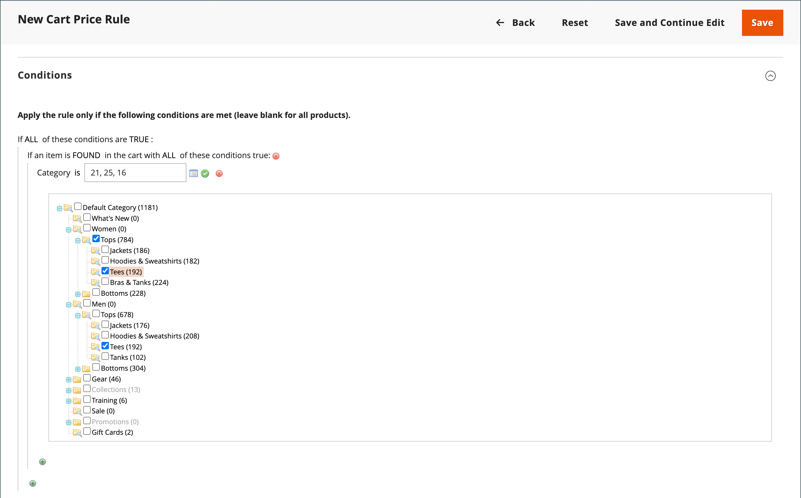
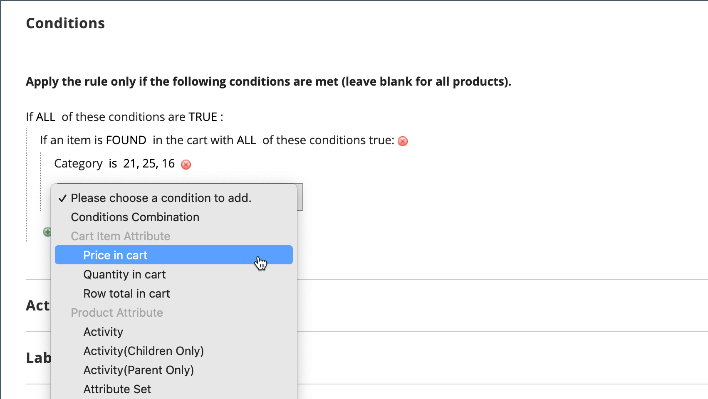

# 장바구니 가격 규칙 예 - 최소 제품 가격이 포함된 할인

장바구니 가격 규칙을 사용하여 장바구니에서 최소 제품 가격을 기반으로 퍼센트 할인을 제공할 수 있습니다. 다음 예에서는 지정된 범주에서 $30.00를 초과하는 제품 1개를 장바구니에 추가하면 전체 장바구니에 있는 모든 제품에 10% 할인이 적용됩니다. 할인 형식은 다음과 같습니다.

최소 1개의 제품이 Y 카테고리이고 가격이 $Z를 초과하는 경우 X% 장바구니 전체 할인.

## 1단계. 장바구니 규칙 만들기

기본 [지침](price-rules-cart.md)에 따라 장바구니 규칙을 만듭니다.

## 2단계. 조건 정의

1. 아래로 스크롤하여 **[!UICONTROL Conditions]** 섹션에서 를 확장합니다.

1. _추가_()을 클릭하고 **[!UICONTROL Product Attribute Combination]**&#x200B;을(를) 선택합니다.

   {width="500" zoomable="yes"}

1. 다음 줄의 시작 부분에서 _추가_()을 클릭하고 **[!UICONTROL Product Attribute]** 아래 목록에서 **[!UICONTROL Category]**&#x200B;을(를) 선택합니다.

   - 추가 옵션을 표시하려면 (**...**) _자세히_ 링크를 클릭하십시오.

     {width="600" zoomable="yes"}

   - 사용 가능한 범주를 보려면 _선택기_() 아이콘을 클릭하십시오. 카테고리 트리에서 포함할 각 카테고리의 확인란을 선택합니다. 확인 아이콘을 클릭하여 범주 선택 사항을 적용합니다.

     {width="600" zoomable="yes"}

1. 다음 줄의 시작 부분에서 _추가_()을 클릭하고 다음을 수행합니다.

   - **[!UICONTROL Cart Item Attribute]** 아래 목록에서 **[!UICONTROL Price in cart]**&#x200B;을(를) 선택합니다.

     {width="500"}

   - **is**&#x200B;을(를) 클릭하고 `equals or greater than`을(를) 선택합니다.

   - **..**&#x200B;을(를) 클릭하고 조건을 충족하기 위해 장바구니 가격이 필요한 금액을 입력합니다. 예를 들어 `30`을(를) 입력합니다.

     {width="500"}

1. **[!UICONTROL Save and Continue Edit]**&#x200B;을(를) 클릭합니다.

## 3단계. 작업 정의

1. **[!UICONTROL Actions]** 섹션에서 를 확장하고 다음을 수행합니다.

   {width="600" zoomable="yes"}

   - **[!UICONTROL Apply]**&#x200B;을(를) `Percent of product price discount`(으)로 설정합니다.

   - **[!UICONTROL Discount Amount]** 입력. 예를 들어 10% 할인에 대해 `10`을(를) 입력하십시오.

   - 추가 판촉 행사가 구매에 적용되지 않도록 하려면 **[!UICONTROL Discard subsequent rules]**&#x200B;을(를) `Yes`(으)로 설정하십시오.

1. **[!UICONTROL Save and Continue Edit]**&#x200B;을(를) 클릭하고 필요에 따라 규칙을 완료합니다.

## 4단계. 레이블 작성

장바구니 가격 규칙 지침의 [4](price-rules-cart.md)단계를 완료하여 체크아웃 중에 나타나는 모든 레이블을 입력합니다.

## 5단계: 규칙 저장 및 테스트

{{new-price-rule}}

1. 규칙이 완료되면 **[!UICONTROL Save Rule]**&#x200B;을(를) 클릭합니다.

1. 규칙이 올바르게 작동하는지 테스트합니다.
