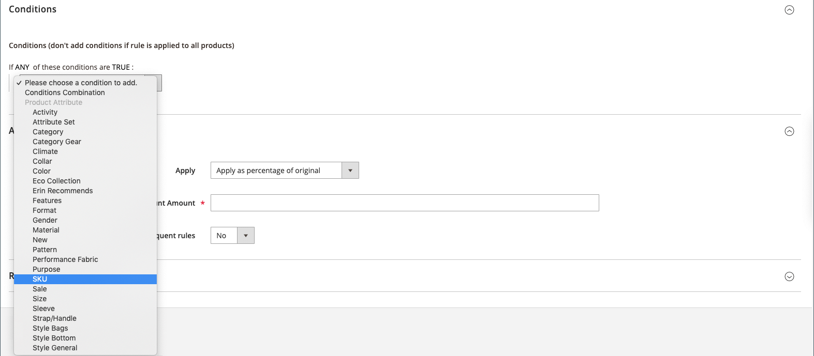
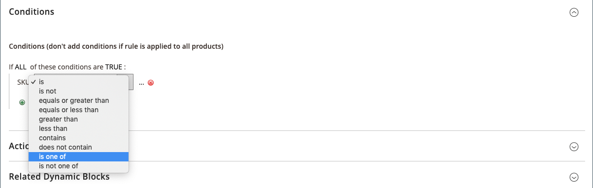

# 여러 SKU가 있는 카탈로그 가격 규칙

단일 카탈로그 가격 규칙을 여러 SKU에 적용할 수 있으므로 제품, 브랜드 또는 카테고리를 기반으로 다양한 프로모션을 만들 수 있습니다. 이 규칙을 만들 때 선택한 SKU와 일치하는 조건을 설정해야 합니다. 규칙을 작성할 때 그리드에서 SKU를 쉽게 검색하고 선택할 수 있습니다.

## 1단계. 제품 특성의 Storefront 속성 확인

시작하기 전에 `sku` 특성의 [Storefront 속성](../catalog/attribute-product-create.md#step-4-describe-the-storefront-properties)이(가) `Use in Promo Rules`(으)로 설정되어 있는지 확인하십시오.

1. _관리자_ 사이드바에서 **[!UICONTROL Stores]** > _[!UICONTROL Attributes]_>**[!UICONTROL Product]**(으)로 이동합니다.

1. _[!UICONTROL Attribute Code]_&#x200B;열 상단의 검색 필터에서 `sku`을(를) 입력하고&#x200B;**[!UICONTROL Search]**&#x200B;을(를) 클릭합니다.

1. 편집 모드에서 `sku` 특성을 열려면 클릭하세요.

1. 왼쪽 패널에서 **[!UICONTROL Storefront Properties]**&#x200B;을(를) 클릭하고 **[!UICONTROL Use for Promo Rule Conditions]**&#x200B;이(가) `Yes`(으)로 설정되어 있는지 확인하십시오.

1. 속성 값을 변경한 경우 **[!UICONTROL Save Attribute]**&#x200B;을(를) 클릭합니다.

## 2단계. 여러 SKU에 가격 규칙 적용

1. _관리자_ 사이드바에서 **[!UICONTROL Marketing]** > _[!UICONTROL Promotions]_>**[!UICONTROL Catalog Price Rules]**(으)로 이동합니다.

1. 다음 중 하나를 수행합니다.

   - 지침에 따라 [카탈로그 가격 규칙을 만듭니다](price-rules-catalog.md).
   - 기존 카탈로그 가격 규칙을 엽니다.

1. **[!UICONTROL Conditions]** 섹션에서 를 확장하고 다음을 수행합니다.

   - 첫 번째 줄에서 첫 번째 매개 변수를 `ANY`(으)로 설정합니다.

     {width="600" zoomable="yes"}

   - 다음 줄의 시작 부분에서 _추가_()를 클릭하고 **[!UICONTROL Product Attribute]** 아래 목록에서 `SKU`을(를) 클릭합니다.

     {width="600" zoomable="yes"} 중 하나입니다.

   - 비교를 위해 옵션을 사용할 수 있습니다. SKU 목록에서 하나 이상의 SKU를 찾으려면 `select is one of`. 모두 검색하여 적용해야 하는 SKU 그룹을 찾으려면 `is`을(를) 선택하십시오. `is one of`을(를) 선택하는 것이 좋습니다.

     {width="600" zoomable="yes"} 중 하나입니다.

   - 조건을 완료하려면 자세히(**...**) 링크를 클릭하고 사용 가능한 제품 목록의 _선택기_() 아이콘을 클릭하십시오.

     {width="600" zoomable="yes"}

   - 추가할 SKU를 검색, 필터링 또는 검색하여 찾습니다. 목록에서 포함할 각 제품의 확인란을 선택합니다.

   - 조건에 SKU를 추가하려면 **[!UICONTROL Save and Apply]**&#x200B;을(를) 클릭하십시오.

     {width="600" zoomable="yes"}

1. 조건이 충족될 때 수행할 [작업](price-rules-catalog.md)을 포함하여 규칙을 완료합니다.

1. 규칙이 완료되면 **[!UICONTROL Save]**&#x200B;을(를) 클릭합니다.

{{new-price-rule}}
