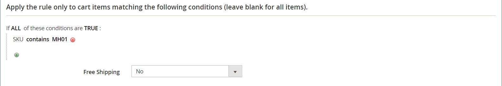

# 장바구니 가격 규칙 예 - 구매

이 예에서는 _구매, 무료_ 프로모션을 위해 [장바구니 가격 규칙](price-rules-cart.md)을 설정하는 방법을 보여 줍니다. 할인 형식은 다음과 같습니다.

_제품 X개 구입, Y개 무료 구입_

## 1단계. 장바구니 가격 규칙 만들기

장바구니 가격 규칙 지침의 [단계 1](price-rules-cart.md)을(를) 완료하여 규칙 정보를 완료합니다.

## 2단계. 조건 정의

장바구니 지침 중 [단계 2](price-rules-cart.md)를 완료하여 가격 규칙에 대한 조건을 정의합니다. 이는 규칙에 추가할 수 있는 두 가지 조건 중 첫 번째 조건이며, 규칙이 트리거되는 시기를 결정합니다. 이는 다음 항목을 조합하여 기반으로 할 수 있습니다.

- 제품 속성
- 제품
- 장바구니 속성
- (Adobe Commerce만 해당) 고객 세그먼트

비워 두면 모든 장바구니에 대해 규칙이 트리거됩니다.

{width="600" zoomable="yes"}

## 3단계. 작업 정의

1. **[!UICONTROL Actions]** 섹션에서 를 확장하고 다음을 수행합니다.

   - **[!UICONTROL Apply]**&#x200B;을(를) `Buy X get Y free (_[!UICONTROL _[!UICONTROL Discount Amount]_]_ is Y)`(으)로 설정합니다.

   - **[!UICONTROL Discount Amount]**&#x200B;을(를) `1`(으)로 설정합니다. 이것은 고객이 무료로 받는 수량입니다.

   - 조건이 충족될 때 적용할 수 있는 할인 횟수를 제한하려면 **[!UICONTROL Maximum Qty Discount is Applied To]** 필드에 숫자를 입력합니다. 이 [수식](#maximum-quantity-discount)을 사용하여 계산됩니다.

   - **[!UICONTROL Discount Qty Step (Buy X)]**&#x200B;에 대해 할인을 받기 위해 고객이 구매해야 하는 수량을 입력합니다. 이 예에서는 고객이 3개를 구입해야 합니다.

   - 구매에 다른 할인이 적용되지 않도록 하려면 **[!UICONTROL Discard subsequent rules]**&#x200B;을(를) `Yes`(으)로 설정하십시오.

   {width="600" zoomable="yes"}

1. 장바구니의 특정 항목에만 규칙을 적용하려면 프로모션에 필요한 장바구니 항목 및/또는 제품 속성을 설명하는 조건을 완료합니다.

   다음 예제에서는 SKU를 사용하여 구성 가능한 제품의 모든 관련 변형에 규칙을 적용합니다.

   {width="600" zoomable="yes"}

1. **[!UICONTROL Free Shipping]**&#x200B;을(를) 포함하려면 `For matching items only`을(를) 선택하십시오.

1. **[!UICONTROL Save and Continue Edit]**&#x200B;을(를) 클릭하고 필요에 따라 나머지 규칙을 완료합니다.

## 4단계. 레이블 완료

장바구니 가격 규칙 지침의 [4](price-rules-cart.md)단계를 완료하여 체크아웃 중에 나타나는 레이블을 입력합니다.

## 5단계: 규칙 저장 및 테스트

{{new-price-rule}}

1. 규칙이 완료되면 **[!UICONTROL Save Rule]**&#x200B;을(를) 클릭합니다.

1. 규칙이 올바르게 작동하는지 테스트합니다.

## 변형

X Get Y Free는 _행 합계_ 종속성이 있는 단일 작업으로 처리됩니다. 모든 항목은 동일한 SKU에서 제공되어야 판촉 행사 자격이 있습니다. For example:

범주 A에서 X개의 제품을 구매하고, 같은 제품에서 Y개의 수량을 무료로 받습니다.

무료 제품을 범주 A, B 및 C로 제한하려면 다음과 같이 작업을 설정합니다.

다음 조건이 모두 TRUE인 경우:
범주는 A, B, C 중 하나입니다.

모든 카테고리(A, B 또는 C)에서 무료 항목을 제한하고 SKU(D123, E123 또는 F123)에서 Y를 받으려면 다음과 같이 작업을 설정합니다.

다음 조건이 모두 TRUE인 경우:
SKU는 D123, E123, F123 중 하나입니다.

## 최대 수량 할인

다음 공식을 사용하여 최대 수량 할인에 대한 정확한 값을 결정합니다.

수식 = `(X+Y) * (M/Y)`
위치
`X` = 구매한 항목 수
`Y` = 사용 가능한 항목 수
`M` = 허용된 최대 사용 가능한 항목 수

For example:

5개를 구입하면 2개를 무료로 받을 수 있으며 최대 4개의 무료 아이템이 허용됩니다.

    위치
    X = 5
    Y = 2
    M = 4
    최대 할인 수량 = (5+2)*(4/2)=(7)*(2)=14

5개를 구입하면 3개를 무료로 받을 수 있으며 최대 9개의 무료 아이템이 허용됩니다.

    위치
    X = 5
    Y = 3
    M = 9
    최대 할인 수량 = (5+3)*(9/3)=24

20개를 구입하시면 2개를 무료로 드립니다. 최대 20개까지 무료입니다.

    위치
    X = 20
    Y = 2
    M = 20
    최대 할인 수량 = (20+2)*(20/2)=(22)*(10)=220
