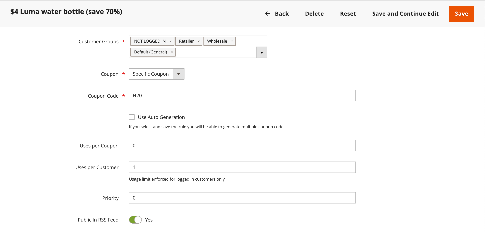
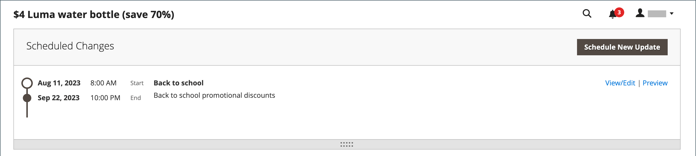
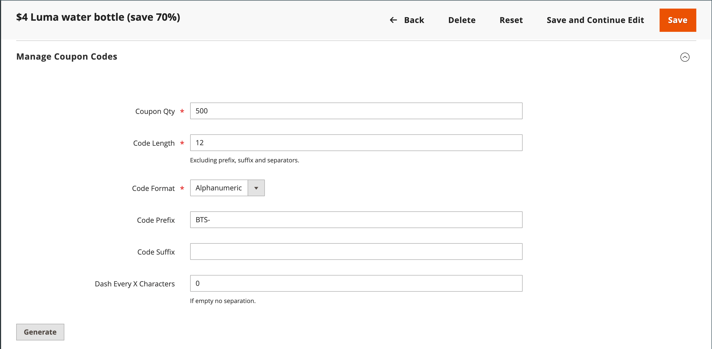
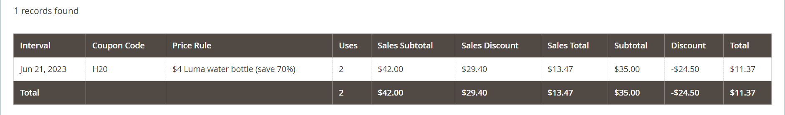

# 쿠폰 코드

쿠폰 코드는 [장바구니 가격 규칙](price-rules-cart.md)과 함께 사용되어 조건 세트가 충족될 때 할인을 적용합니다. 예를 들어 특정 고객 그룹 또는 특정 금액을 초과하는 구매를 수행하는 모든 사용자에 대해 쿠폰 코드를 작성할 수 있습니다. 구매에 쿠폰을 적용하려면 고객이 장바구니에 쿠폰 코드를 입력하거나 _오프라인_ 상점의 현금 등록기에 쿠폰을 입력할 수 있습니다. 다음은 스토어에서 쿠폰을 사용할 수 있는 몇 가지 방법입니다.

- 고객에게 이메일 쿠폰
- 인쇄된 쿠폰 만들기
- 모바일 사용자를 위한 매장 내 쿠폰 만들기

쿠폰 코드는 이메일로 전송하거나 뉴스레터, 카탈로그 및 광고에 포함할 수 있습니다. 쿠폰 코드 목록을 내보내고 상업용 프린터로 보낼 수 있습니다. 또한 소비자가 스마트폰으로 스캔할 수 있는 빠른 응답 코드로 매장 내 쿠폰을 만들 수도 있습니다. QR 코드는 프로모션에 대한 자세한 정보가 포함된 사이트의 페이지에 연결할 수 있습니다.

Commerce 2.4.7부터 쇼핑객은 장바구니에 여러 쿠폰을 적용할 수 있습니다. 가맹점에서도 쇼핑 도우미를 활용해 여러 쿠폰을 신청할 수 있다.

>[!NOTE]
>
>우선 순위가 동일한 장바구니 가격 규칙은 결합된 할인을 생성하지 않습니다. 각 규칙(쿠폰)은 데이터베이스의 장바구니 가격 규칙 ID에 따라 일치하는 제품에 개별적으로 적용됩니다. 할인이 적용되는 순서를 제어하기 위해, Adobe은 추가된 각 장바구니 가격 규칙에 대해 다른 우선 순위를 설정할 것을 권장합니다.

## 쿠폰 코드 구성

자동 생성된 쿠폰 코드의 길이 및 포맷은 구성에 의해 제어된다. 문자는 모든 숫자, 모든 문자 또는 그 조합으로 설정할 수 있습니다. 대시를 설정된 간격으로 삽입하여 쉽게 읽을 수 있으며, 접두어와 접미어를 추가하여 코드를 특정 캠페인 또는 이니셔티브와 연결할 수 있습니다.

1. _관리자_ 사이드바에서 **[!UICONTROL Stores]** > _[!UICONTROL Settings]_>**[!UICONTROL Configuration]**(으)로 이동합니다.

1. 왼쪽 패널에서 **[!UICONTROL Customers]**&#x200B;을(를) 확장하고 **[!UICONTROL Promotions]**&#x200B;을(를) 선택합니다.

   {width="600" zoomable="yes"}

1. **[!UICONTROL Auto Generated Specific Coupon Codes]** 섹션을 확장합니다.

   {width="600" zoomable="yes"}

1. 접두사, 접미사 및 구분 기호를 포함한 **[!UICONTROL Code Length]**&#x200B;을(를) 입력하십시오.

1. **[!UICONTROL Code Format]**&#x200B;을(를) 다음 중 하나로 설정합니다.

   - `Alphanumeric`
   - `Alphabetical`
   - `Numeric`

1. **[!UICONTROL Code Prefix]**&#x200B;의 경우 모든 쿠폰 코드의 시작 부분에 표시할 값을 입력하십시오.

1. **[!UICONTROL Code Suffix]**&#x200B;의 경우 모든 쿠폰 코드의 끝에 표시할 값을 입력하십시오.

1. **[!UICONTROL Dash Every X Characters]**&#x200B;의 경우 각 대시 사이의 문자 수를 입력합니다.

   대시 패턴이 다른 쿠폰 코드는, 번호가 동일하더라도 다른 코드로 간주된다.

1. 완료되면 **[!UICONTROL Save Config]**&#x200B;을(를) 클릭합니다.

## 쿠폰 만들기

>[!NOTE]
>
>쿠폰을 만들기 전에 `bin/magento cron:run` 명령을 사용하여 cron이 실행 중인지 확인하십시오. 자세한 내용은 _구성 가이드_&#x200B;의 [명령줄에서 cron 실행](https://experienceleague.adobe.com/docs/commerce-operations/configuration-guide/cli/configure-cron-jobs.html#run-cron-from-the-command-line)을 참조하십시오.

### 방법 1: 특정 쿠폰 만들기

1. 지침에 따라 [장바구니 가격 규칙을 만듭니다](price-rules-cart.md).

1. **[!UICONTROL Rule Information]** 섹션에서 **[!UICONTROL Coupon]**&#x200B;을(를) `Specific Coupon`(으)로 설정합니다.

1. 프로모션과 함께 사용할 **[!UICONTROL Coupon Code]**&#x200B;을(를) 입력하십시오.

   코드 형식(숫자, 영숫자 또는 알파벳)은 [구성](#configure-coupon-codes)에 의해 결정됩니다.

1. 쿠폰 사용 횟수를 제한하려면 다음을 수행하십시오.

   - **[!UICONTROL Uses per Coupon]**&#x200B;의 수를 입력하십시오.
   - **[!UICONTROL Uses per Customer]**&#x200B;의 수를 입력하십시오.

   무제한으로 사용하려면 이 필드를 비워 둡니다.

   {width="600" zoomable="yes"}

   >[!NOTE]
   >
   >여러 고객이 동시에 동일한 쿠폰을 동시에 사용하는 경우, 쿠폰 처리가 지연돼 설정한 사용 한도를 넘어설 수 있기 때문이다.

1. 일정 기간 동안 쿠폰을 유효하게 하려면 다음을 수행합니다.

   - (Magento Open Source 전용) **시작** 및 **종료** 날짜를 완료합니다. 날짜를 선택하려면 각 필드 옆에 있는 **달력**() 아이콘을 클릭합니다. 날짜 범위를 비워 두면 규칙이 만료되지 않습니다.

   - (Adobe Commerce만 해당) 다음 중 하나를 수행하십시오.

     **옵션 1:** 새 업데이트 예약

      - 페이지의 오른쪽 위 모서리에서 **[!UICONTROL Schedule New Update]**&#x200B;을(를) 클릭합니다.

        {width="600" zoomable="yes"}

      - **[!UICONTROL Update Name]** 및 **[!UICONTROL Description]**&#x200B;을(를) 입력하십시오.

      - 일정( )에서 **시작 날짜** 및 **[!UICONTROL End Date]**&#x200B;을(를) 선택하십시오. 날짜 범위를 비워 두면 규칙이 만료되지 않습니다.

      - 완료되면 **[!UICONTROL Save]**&#x200B;을(를) 클릭합니다.

        {width="600" zoomable="yes"}

     **옵션 2:** 기존 업데이트에 할당:

      - **[!UICONTROL Assign to Another Update]**&#x200B;을(를) 선택합니다.

      - 목록에서 업데이트를 찾은 다음 **[!UICONTROL Select]**&#x200B;을(를) 클릭합니다.

1. 필요에 따라 [장바구니 가격 규칙](price-rules-cart.md)을 완료합니다.

### 방법 2: 쿠폰 배치 생성

할인 쿠폰 생성은 비동기 작업으로, 작업이 완료될 때까지 기다리지 않고 관리자 작업을 계속할 수 있도록 백그라운드에서 실행됩니다. 작업이 완료되면 시스템이 메시지를 표시합니다.

1. 지침에 따라 [장바구니 가격 규칙을 만듭니다](price-rules-cart.md).

1. **[!UICONTROL Coupon Code]**&#x200B;에서 **[!UICONTROL Use Auto Generation]** 확인란을 선택합니다.

1. 각 고객이 쿠폰을 사용할 수 있는 횟수를 제한하려면 **[!UICONTROL Uses per Customer]** 수를 입력하십시오.

   {width="600" zoomable="yes"}

   >[!NOTE]
   >
   >여러 고객이 동시에 동일한 쿠폰을 동시에 사용하는 경우, 쿠폰 처리가 지연돼 설정한 사용 한도를 넘어설 수 있기 때문이다.

1. 아래로 스크롤하여 **[!UICONTROL Manage Coupon Codes]** 섹션에서 를 확장하고 다음을 수행합니다.

   {width="600" zoomable="yes"}

   - **[!UICONTROL Coupons Qty]**&#x200B;에 대해 생성할 쿠폰 수를 입력하십시오.

   - 접두사, 접미사 또는 구분 기호를 포함하지 않고 **[!UICONTROL Code Length]**&#x200B;을(를) 입력하십시오.

   - **[!UICONTROL Code Format]**&#x200B;을(를) 다음 중 하나로 설정합니다.

      - `Alphanumeric`
      - `Alphabetical`
      - `Numeric`

   - (선택 사항) 코드의 시작 부분에 추가할 **[!UICONTROL Code Prefix]**&#x200B;을(를) 입력합니다.

   - (선택 사항) 코드 끝에 추가할 **[!UICONTROL Code Suffix]**&#x200B;을(를) 입력합니다.

   - (선택 사항) **[!UICONTROL Dash Every X Characters]**&#x200B;의 경우 각 대시 사이의 문자 수를 입력합니다. 예를 들어 코드가 12자이고 4자마다 대시가 있는 경우 `xxxx-xxxx-xxxx`과(와) 같습니다. 대시를 사용하면 코드를 보다 쉽게 읽고 입력할 수 있습니다.

1. 완료되면 **[!UICONTROL Generate]**&#x200B;을(를) 클릭합니다.

   시스템에 `Message is added to queue, wait to get your coupons soon`이(가) 표시됩니다.

   cron 작업이 완료되면 생성된 코드 목록이 표시됩니다.

   | 필드 | 설명 |
   |-------------|-------------|
   | [!UICONTROL Coupon Code] | 특수 조건을 받는 데 사용할 수 있도록 만들어져 있는 고유한 쿠폰 코드입니다. |
   | [!UICONTROL Created] | 쿠폰 코드가 생성된 날짜. |
   | [!UICONTROL Used] | 쿠폰이 사용되었는지 보여 줍니다. |
   | [!UICONTROL Times Used] | 쿠폰 코드가 사용된 횟수를 나타냅니다. |

   {style="table-layout:auto"}

파일 형식을 선택하고 **[!UICONTROL Export]**&#x200B;을(를) 클릭하여 쿠폰 코드를 CSV 또는 Excel XML 파일로 내보낼 수 있습니다.

쿠폰 코드를 삭제하려면 목록에서 하나 이상의 코드를 선택합니다. **[!UICONTROL Actions]** 선택기에서 `Delete`을(를) 선택한 다음 **[!UICONTROL Submit]**&#x200B;을(를) 클릭합니다.

>[!NOTE]
>
>Commerce에서는 여러 쿠폰 코드를 구성할 수 있지만, 고객은 장바구니에서 하나의 쿠폰 코드만 사용할 수 있습니다. 장바구니에서 동시에 두 개 이상의 쿠폰 코드를 사용할 수 있도록 하려면 [Commerce Marketplace](https://marketplace.magento.com/)의 해당 확장을 사용하는 것이 좋습니다.

## 쿠폰 보고서

_쿠폰_ 보고서는 특정 날짜 범위 동안 사용되는 각 쿠폰의 데이터를 집계합니다. 쿠폰은 장바구니에서 적용되므로 [주문 상태](../stores-purchase/order-status.md)에 관계없이 보고서에 회수된 모든 쿠폰의 데이터가 포함됩니다. 그 결과, 보고서에는 예상 및 실제 합계가 모두 포함될 수 있습니다. 보고서는 특정 스토어 보기, 기간, 주문 상태 및 장바구니 가격 규칙에 대해 필터링할 수 있습니다.

다음 예에서는 두 고객이 쿠폰 코드 &#39;H20&#39;을 사용했습니다. 주문 중 하나는 송장이 발행되었지만 다른 주문은 여전히 _보류 중_&#x200B;입니다. 예상 판매 소계, 판매 할인 및 판매 합계 열에는 두 주문의 총괄된 금액이 표시되지만, 실제 송장이 발행된 주문만 소계, 할인 및 합계 열에 나타납니다. 보고서의 각 행은 단일 쿠폰 프로모션을 나타냅니다.

{width="600" zoomable="yes"}

### 보고서 실행

1. _관리자_ 사이드바에서 **[!UICONTROL Reports]** > _[!UICONTROL Sales]_>**[!UICONTROL Coupons]**(으)로 이동합니다.

1. 저장소 보기가 여러 개인 경우 왼쪽 상단 모서리에서 **[!DNL Store View]**&#x200B;을(를) 설정하여 보고서의 범위를 설정하십시오.

1. 해당 날짜의 판매 [통계](../getting-started/sales-reports.md#refresh-statistics)를 새로 고치려면 작업 영역 맨 위에 있는 _마지막 업데이트_ 메시지를 클릭합니다.

   **[!UICONTROL Coupons]** 확인란을 클릭하여 선택하고 **[!UICONTROL Refresh]**&#x200B;을(를) 클릭합니다.

   {width="600" zoomable="yes"}

1. 데이터를 필터링하려면 다음을 수행합니다.

   {width="600" zoomable="yes"}

   - **[!UICONTROL Date Used]**&#x200B;을(를) 다음 중 하나로 설정합니다.

      - `Order Created`
      - `Order Updated`

     _업데이트된 주문_ 보고서는 실시간으로 만들어지며 새로 고침이 필요하지 않습니다.

   - 보고서에서 다루는 기간을 정의하려면 **[!UICONTROL Period]**&#x200B;을(를) 다음 중 하나로 설정하십시오.

      - `Day`
      - `Month`
      - `Year`

   - 보고서의 날짜 범위를 정의하려면 **시작** 및 **종료** 날짜를 M/D/YY 형식으로 입력하십시오.

   - 특정 [주문 상태](../stores-purchase/order-status.md)에 대한 보고서를 인쇄하려면 **[!UICONTROL Order Status]**&#x200B;을(를) `Specified`(으)로 설정하고 목록에서 주문 상태를 선택하십시오.

   - 보고서에서 데이터가 없는 행을 생략하려면 **[!UICONTROL Empty Rows]**&#x200B;을(를) `No`(으)로 설정하십시오.

   - 보고서에 포함된 쿠폰 활동을 정의하려면 다음 중 하나를 수행합니다.

      - 모든 가격 규칙의 모든 쿠폰 활동을 포함하려면 **[!UICONTROL Cart Price Rule]**&#x200B;을(를) `Any`(으)로 설정합니다.
      - 특정 가격 규칙과 관련된 활동만 포함하려면 **[!UICONTROL Cart Price Rule]**&#x200B;을(를) `Specified`(으)로 설정하고 목록에서 장바구니 가격 규칙을 선택하십시오.

1. 보고서를 실행할 준비가 되면 **[!UICONTROL Show Report]**&#x200B;을(를) 클릭합니다.

   보고서가 페이지 하단에 나타납니다.

### 필터 옵션

| 필드 | 설명 |
|--- |--- |
| [!UICONTROL Date Used] | 보고서의 기반으로 사용되는 날짜 필드를 식별합니다. 옵션: **[!UICONTROL Order Created]**: 고객이 주문한 날짜를 기준으로 보고서를 생성합니다. 최신 데이터가 포함되도록 하려면 메시지의 링크를 눌러 통계를 새로 고칩니다. **[!UICONTROL Order Updated]**: 주문이 마지막으로 업데이트된 날짜를 기준으로 보고서를 생성합니다. 이 보고서는 실시간 데이터를 사용하며 통계를 새로 고칠 필요가 없습니다. |
| [!UICONTROL Period] | 보고서에 사용되는 날짜 범위의 유형을 결정합니다. 옵션: `Day` / `Month` / `Year` |
| [!UICONTROL From] | 보고서에 포함된 주문 데이터 범위의 첫 번째 날짜를 나타냅니다. |
| [!UICONTROL To] | 보고서에 포함된 주문 데이터 범위의 마지막 날짜를 나타냅니다. |
| [!UICONTROL Order Status] | 주문 상태별로 보고서를 필터링합니다. 보고서는 모든 주문에 대해 생성되거나 특정 주문 상태로 제한될 수 있습니다. 옵션:  **[!UICONTROL Any]**: 상태에 관계없이 모든 주문을 포함합니다. **[!UICONTROL Specified]**: 지정한 상태의 주문만 포함합니다. 취소된 주문은 보고서에 포함되지 않습니다. |
| [!UICONTROL Empty Rows] | 보고서에 검색할 수 있는 빈 데이터 행이 포함되어 있는지 여부를 결정합니다. 옵션: `Yes` / `No` |
| [!UICONTROL Cart Price Rules] | 보고서에 포함할 쿠폰 프로모션을 결정합니다. 옵션: **[!UICONTROL Any]**: 지정한 날짜 범위 동안 사용한 쿠폰 프로모션에 대한 주문 정보를 포함합니다. **[!UICONTROL Specified]**: 지정한 날짜 범위 동안 선택한 쿠폰 프로모션에 대한 주문 정보만 포함합니다. |

{style="table-layout:auto"}

### 보고서 열

| 열 | 설명 |
|--- |--- |
| [!UICONTROL Interval] | 보고서에 포함될 쿠폰 사용의 날짜 범위를 나타냅니다. 간격은 특정 일, 월, 연도 또는 날짜 범위일 수 있습니다. 간격 날짜는 **[!UICONTROL Period]** 설정에 설정된 값에 따라 다음 예제와 같이 형식이 지정됩니다.  `Day`: 6/21/19 `Month`: 6/2019 `Year`: 2019 |
| [!UICONTROL Coupon Code] | 고객이 장바구니에 입력하여 할인을 받는 할인 코드. |
| [!UICONTROL Price Rule] | 쿠폰과 연계된 가격 규칙의 이름. |
| [!UICONTROL Uses] | 보고서에 대해 지정된 날짜 범위 동안 쿠폰을 사용한 횟수입니다. |
| [!UICONTROL Sales Subtotal] | 쿠폰과 함께 배치된 모든 주문의 예상 소계.  판매 소계는 모든 적격 주문에서 집계된 소계를 나타내며 아직 송장이 발행되지 않은 `Pending`개의 판매 주문을 포함합니다. |
| [!UICONTROL Sales Discount] | 쿠폰과 함께 주문된 모든 주문의 예상 할인 금액.  할인은 모든 적격 주문에서 집계된 할인 금액을 나타내며 아직 송장이 발행되지 않은 `Pending`개의 판매 주문을 포함합니다. |
| [!UICONTROL Sales Total] | 쿠폰과 함께 배치된 모든 주문의 예상 총 합계. Sales Total에는 할인액을 제외한 모든 배송 및 취급 수수료가 포함됩니다.  판매 총계는 모든 적격 주문의 총계 금액을 나타내며 아직 송장이 발행되지 않은 `Pending`개의 판매 주문을 포함합니다. 이 값에는 소계 + 운송 및 처리, 할인액 + 세금이 포함됩니다.   계산자: `((Subtotal + Shipping & Handling) - Discount) + Tax` |
| [!UICONTROL Subtotal] | 쿠폰을 사용한 모든 송장이 발행된 주문에서 집계된 소계. |
| [!UICONTROL Discount] | 쿠폰을 사용한 모든 송장 발부 주문의 총괄 할인. |
| [!UICONTROL Total] | 쿠폰을 사용한 모든 송장이 발행된 주문의 주문 합계 총괄입니다. |

{style="table-layout:auto"}
