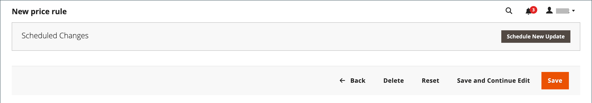
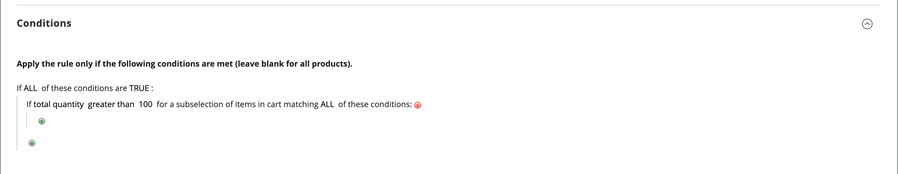
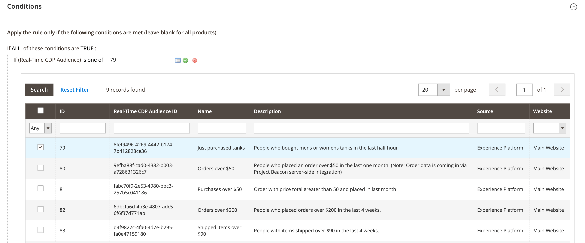
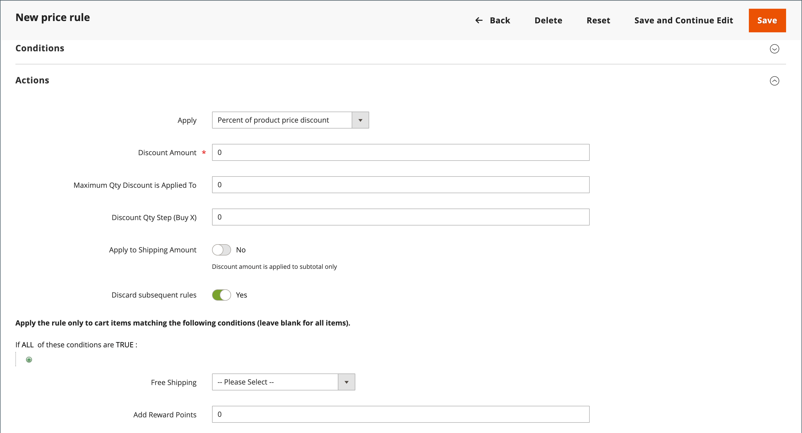
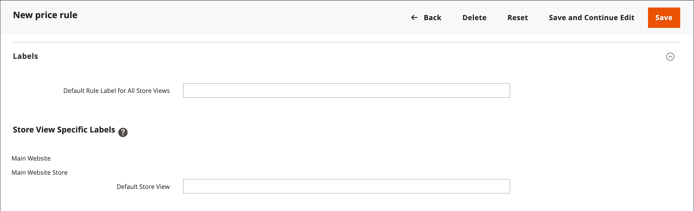

# 장바구니 가격 규칙 만들기

규칙을 추가하고, 조건을 설명하고, 작업을 정의하려면 다음 단계를 완료하십시오. 또한 레이블을 완료하고 규칙을 테스트합니다. 가격 규칙 조건은 장바구니 또는 [제품 특성](../catalog/product-attributes.md) 또는 [Real-Time CDP 대상](#use-real-time-cdp-audiences-to-set-a-condition)을 기반으로 할 수 있지만 [사용자 지정 가능한 옵션](../catalog/settings-advanced-custom-options.md)을 기반으로 할 수 없습니다.

## 1단계: 규칙 추가

1. _관리자_ 사이드바에서 **[!UICONTROL Marketing]** > _[!UICONTROL Promotions]_>**[!UICONTROL Cart Price Rules]**(으)로 이동합니다.

1. **[!UICONTROL Add New Rule]**&#x200B;을(를) 클릭하고 다음을 수행합니다.

   - _[!UICONTROL Rule Information]_&#x200B;에서&#x200B;**[!UICONTROL Rule Name]**&#x200B;및&#x200B;**[!UICONTROL Description]**&#x200B;을(를) 완료합니다.

   - 규칙을 즉시 적용하지 않으려면 **[!UICONTROL Active]**&#x200B;을(를) `No`(으)로 설정하십시오.

   {width="600" zoomable="yes"}

1. 규칙의 [범위](../getting-started/websites-stores-views.md#scope-settings)를 설정하려면 다음을 수행하십시오.

   - 프로모션을 사용할 수 있는 **[!UICONTROL Websites]**&#x200B;을(를) 선택하십시오.

   - 프로모션이 적용되는 **[!UICONTROL Customer Groups]**&#x200B;을(를) 선택하십시오.

     등록된 고객만 프로모션을 사용할 수 있도록 하려면 **_하지 마십시오_** `NOT LOGGED IN` 옵션을 선택하십시오.

1. [쿠폰](price-rules-cart-coupon.md)을 사용하거나 사용하지 않는 규칙을 다음과 같이 설정하십시오.

   - 쿠폰 코드를 사용하지 않고 장바구니 규칙을 적용하려면 **[!UICONTROL Coupon]**&#x200B;을(를) `No Coupon`(으)로 설정하고 5단계로 건너뜁니다.

   - 쿠폰을 가격 규칙과 연결하려면 **[!UICONTROL Coupon]**&#x200B;을(를) `Specific Coupon`(으)로 설정하고 다음을 수행합니다.

      - 할인을 받기 위해 고객이 입력해야 하는 자유 텍스트 **[!UICONTROL Coupon Code]**&#x200B;을(를) 입력하십시오.

      - 쿠폰을 사용할 수 있는 횟수에 대한 제한을 설정하려면 다음 옵션을 완료하십시오.

     | 옵션 | 설명 |
     |------|-----------|
     | `Uses per Coupon` | 쿠폰 코드를 사용할 수 있는 횟수를 결정합니다. 제한이 없는 경우 필드를 비워 둡니다. |
     | `Uses per Customer` | 선택한 고객 그룹에 속하는 등록된 동일한 고객이 장바구니 가격 규칙을 사용할 수 있는 횟수를 결정합니다. 이 설정은 NOT LOGGED IN 고객 그룹의 멤버인 게스트 쇼핑객이나 계정에 로그인하지 않고 쇼핑하는 고객에게는 적용되지 않습니다. 제한이 없는 경우 필드를 비워 둡니다. |

     {style="table-layout:auto"}

     자세한 내용은 [쿠폰 코드](price-rules-cart-coupon.md)를 참조하세요.

     {width="600" zoomable="yes"}

   - (Magento Open Source만 해당) _일정_()을 사용하여 프로모션의 **[!UICONTROL From]** 및 **[!UICONTROL To]** 날짜 범위를 선택하십시오.

1. 동시에 활성화된 다른 가격 규칙의 작업 설정과 관련하여 이 가격 규칙의 **[!UICONTROL Priority]**&#x200B;을(를) 정의할 숫자를 입력하십시오.

   여러 장바구니 규칙이나 쿠폰이 동일한 제품에 적용되는 경우, 우선 순위가 가장 높은(가장 낮은 숫자) 규칙이 먼저 적용됩니다. 우선 순위가 같은 규칙은 결합되지 않습니다. 규칙 ID를 기반으로 별도로 적용됩니다. 할인이 적용되는 순서를 제어하려면 고유한 우선 순위를 지정하고, 할인 스태킹을 방지하기 위해 작업 단계에서 [후속 가격 규칙 무시](#step-3-define-the-actions)를 사용하는 것이 좋습니다.

1. 게시된 [RSS 피드](social-rss.md#rss-feeds)에 규칙을 적용하려면 **RSS 피드에서 공개**&#x200B;를 `Yes`(으)로 설정하십시오.

1. **[!UICONTROL Save and Continue Edit]**&#x200B;을(를) 클릭합니다.

   - (Magento Open Source만 해당) 규칙이 저장되면 장바구니 가격 규칙의 이름이 페이지 맨 위에 나타납니다.

   - (Adobe Commerce만 해당) 규칙이 저장되면 장바구니 가격 규칙의 이름과 [예약된 변경 사항](price-rule-cart-scheduled-changes.md) 상자가 페이지 맨 위에 나타납니다.

     {width="600" zoomable="yes"}

## 2단계: 조건 설명

>[!NOTE]
>
>Real-Time CDP의 대상을 사용하는 경우 [이 섹션](#use-real-time-cdp-audiences-to-set-a-condition)으로 건너뜁니다.

이 단계에서는 프로모션 자격을 부여하기 위해 주문에 대해 충족되어야 하는 조건이 설명되어 있습니다. 조건은 다음과 같은 방식으로 장바구니 가격 규칙에 영향을 줍니다.

- 장바구니 가격 규칙은 _[!UICONTROL Conditions]_&#x200B;탭의 조건 집합이 충족될 때마다 장바구니의&#x200B;**_each_**&#x200B;제품에 적용됩니다. 장바구니 가격 규칙의 영향을 받는 제품 수를 제한하려면&#x200B;_[!UICONTROL Actions]_ 탭에 조건을 추가하여 장바구니 가격 규칙의 영향을 받는 제품 수를 제한하십시오.

- 하나 이상의 조건부 제품 속성에 빈 값이 있으면 장바구니 가격 규칙이 제품에 적용되지 않습니다.

1. 왼쪽 패널에서 **[!UICONTROL Conditions]**&#x200B;을(를) 선택합니다.

   {width="600" zoomable="yes"}

   첫 번째 조건은 기본적으로 나타나고 다음과 같이 표시됩니다.

   `If **ALL** of these conditions are **TRUE**:`

   명령문에는 명령문의 해당 부분에 대한 선택 사항을 표시하기 위해 클릭할 수 있는 두 개의 굵은 링크가 있습니다. 이러한 값의 조합을 변경하여 다른 조건을 만들 수 있습니다. 다음 중 하나를 수행합니다.

   - **[!UICONTROL ALL]**&#x200B;을(를) 클릭하고 `ALL` 또는 `ANY`을(를) 선택합니다.
   - **[!UICONTROL TRUE]**&#x200B;을(를) 클릭하고 `TRUE` 또는 `FALSE`을(를) 선택합니다.
   - 모든 제품에 규칙을 적용하려면 조건을 변경하지 마십시오.

1. 다음 줄의 맨 앞에 있는 _추가_()을 클릭하고 장바구니 특성, 제품 하위 선택 또는 조합과 같은 조건에 대한 옵션을 선택합니다.

   이 예에서는 다음과 같이 조건의 다음 부분을 완료합니다.

   - **[!UICONTROL Choose the condition to add]** 메시지가 표시되면 `Products Subselection`을(를) 선택합니다.

     {width="600" zoomable="yes"}

   - 조건문에서 **[!UICONTROL total quantity]**&#x200B;을(를) 클릭하고 `total quantity` 또는 `total amount`을(를) 선택합니다.

   >[!IMPORTANT]
   >
   >[!UICONTROL Total amount]은(는) 행 합계이므로 [!UICONTROL Products Subselection] 장바구니 가격 규칙 조건의 `total amount`에 세금이 포함되지 않습니다. 세금을 포함하려면 [!UICONTROL Subtotal (Incl. Tax)] 조건을 사용하십시오.

   - 조건문에서 **[!UICONTROL is]**&#x200B;을(를) 클릭하고 `greater than`을(를) 선택합니다.

1. 조건의 다음 부분이 나타나면 문의 요소를 클릭하여 변수 값이 있는 각 링크가 있는 위치를 확인할 수 있습니다.

1. &quot;기타&quot;(...) 링크를 클릭하고 `100`을(를) 입력하십시오.

   이 조건을 사용하려면 장바구니의 총 수량이 `101` 이상이어야 합니다.

   {width="600" zoomable="yes"}

1. 다음 줄의 시작 부분에서 **추가**()를 클릭한 다음 **범주**&#x200B;를 기반으로 하는 조건을 추가합니다.

   {width="600" zoomable="yes"}

1. 조건의 다음 부분에서 _자세히_(**...**) 링크를 클릭하여 입력 필드를 표시한 다음 _선택기_()을 열어 범주 트리를 표시합니다.

1. 가격 규칙의 조건으로 사용할 범주의 확인란을 선택하고  아이콘을 클릭하여 범주 선택 사항을 수락합니다.

   조건은 스토어의 [루트 범주](../catalog/category-root.md)의 하위 범주인 모든 범주를 기반으로 할 수 있습니다.

   {width="600" zoomable="yes"}

1. 조건을 더 추가하려면 _추가_()을 클릭하고 다른 조건을 정의합니다.

   가격 규칙에 대해 충족해야 하는 조건을 설명하는 데 필요한 횟수만큼 프로세스를 반복할 수 있습니다. 다음은 몇 가지 예입니다.

   **예 1:** 지역 가격 규칙

   지역 가격 규칙을 생성하려면 다음 장바구니 속성 중 하나를 사용합니다.

   - `Shipping Postcode`
   - `Shipping Region`
   - `Shipping State/Province`
   - `Shipping Country`

   **예 2:** 장바구니 합계

   장바구니 합계를 기준으로 조건을 지정하려면 다음 장바구니 속성 중 하나를 사용하십시오.

   - `Subtotal`
   - `Total Items Quantity`
   - `Total Weight`

>[!NOTE]
>
>복수 병렬 판촉의 경우 _소계_ 조건이 _기본_ 장바구니 소계 **_이전_**&#x200B;에 적용됩니다.

>[!IMPORTANT]
>
>**구매 주문의 경우에만**: 하나 이상의 특정 결제 방법을 기준으로 장바구니 가격 규칙을 설정하면 구매 주문이 생성될 때 총계에 할인이 적용됩니다. 구매 발주가 생성된 후에도 결제 방법을 장바구니 가격 규칙이 적용되지 않는 방법으로 변경하면 할인이 총계에 계속 적용됩니다.

### 장바구니 가격 규칙에 제품 속성 추가

1. **[!UICONTROL Stores]** > _[!UICONTROL Attributes]_>**[!UICONTROL Product]**(으)로 이동하여 제품 특성을 엽니다.

1. 왼쪽 패널에서 **[!UICONTROL Storefront Properties]**&#x200B;을(를) 선택합니다.

1. **[!UICONTROL Use for Promo Rule Conditions]**&#x200B;을(를) `Yes`(으)로 설정합니다.

1. **[!UICONTROL Save Attribute]**&#x200B;을(를) 클릭합니다.

1. **[!UICONTROL Marketing]** > **[!UICONTROL Cart Price Rules]**(으)로 이동하여 필요한 장바구니 가격 규칙을 엽니다.

1. **[!UICONTROL Condition]** 섹션에서 를 확장하고 **[!UICONTROL Product attribute combination]**&#x200B;을(를) 선택합니다.

1. 이 조건을 다음 값 중 하나로 설정합니다.

   - **[!UICONTROL FOUND]**&#x200B;을(를) 클릭하고 `FOUND` 또는 `NOT FOUND`을(를) 선택합니다.

   - **[!UICONTROL ALL]**&#x200B;을(를) 클릭하고 `ALL` 또는 `ANY`을(를) 선택합니다.

1. _추가_() 아이콘을 클릭하고 프로모션 규칙 조건에 대해 설정한 **[!UICONTROL Product Attribute]**&#x200B;을(를) 선택합니다.

1. **[!UICONTROL Save]**&#x200B;을(를) 클릭합니다.

>[!NOTE]
>
>_SKU_ 제품 특성 및 구성 가능한 제품과 함께 `is not one of` 조건을 사용하는 경우 상위 및 하위 제품 SKU를 모두 선택해야 합니다. 규칙에 모든 하위 SKU가 나열되지 않도록 구성 가능한 제품 및 해당 하위 제품의 일반 SKU 부분과 함께 `does not contain` 조건을 사용할 수 있습니다.

### Real-Time CDP 대상을 사용하여 조건 설정

Real-Time CDP [대상자](../customers/audience-activation.md)를 기반으로 장바구니 가격 규칙에 대한 조건을 설정할 수 있습니다.

1. **[!UICONTROL Conditions]**&#x200B;을(를) 확장하고 &quot;+&quot; 아이콘을 클릭한 다음 목록에서 **[!UICONTROL Real-Time CDP Audience]**&#x200B;을(를) 선택합니다.

   {width="300"}

1. _자세히_(**...**) 아이콘을 선택하고 **[!UICONTROL Open Chooser]**&#x200B;을(를) 클릭한 다음 사용 가능한 모든 Real-Time CDP 대상을 봅니다.

   {width="600" zoomable="yes"}

1. 장바구니 가격 규칙에 사용할 Real-Time CDP 대상을 선택합니다.

   | 옵션 | 설명 |
   |------|-----------|
   | `ID` | 관리자 내에서 사용되는 대상자의 내부 식별자입니다 |
   | `Real-Time CDP Audience ID` | Experience Platform에서 대상을 만들 때 대상의 고유 식별자 |
   | `Name` | 대상 이름(예: `Orders over $50`) |
   | `Description` | 대상자에 대한 설명(예: `People who placed an order over $50 in the last month.`). |
   | `Source` | 대상자가 있었던 위치(예: `Experience Platform`)를 나타냅니다. |
   | `Website` | 대상자를 포함하는 데이터 스트림에 연결한 웹 사이트를 나타냅니다. [[!DNL Data Connection]](https://experienceleague.adobe.com/docs/commerce/data-connection/fundamentals/connect-data.html) 확장을 통해 Commerce 인스턴스를 Experience Platform에 연결할 때 이 링크를 만듭니다. |

   {style="table-layout:auto"}

다음 단계에서는 조건이 충족될 때 발생하는 작업을 정의합니다.

## 3단계: 작업 정의

장바구니 가격 규칙 작업은 조건이 충족될 때 가격이 업데이트되는 방법을 설명합니다.

1. **[!UICONTROL Actions]**&#x200B;까지 아래로 스크롤한 다음 섹션을 합니다.

   {width="600" zoomable="yes"}

1. **[!UICONTROL Apply]**&#x200B;을(를) 다음 할인 옵션 중 하나로 설정합니다.

   | 옵션 | 설명 |
   |------|-----------|
   | `Percent of product price discount` | 최초 가격에서 퍼센트를 차감하여 품목을 할인합니다. 할인은 장바구니에 있는 각 적격 항목에 적용됩니다. 예를 들어 원래 가격보다 10% 낮은 업데이트된 가격을 보려면 [!UICONTROL Discount Amount]에 `10`을(를) 입력하십시오. |
   | `Fixed amount discount` | 장바구니에 있는 각 적격 품목의 최초 가격에서 고정 금액을 차감하여 품목을 할인합니다. 예를 들어 [!UICONTROL Discount Amount]에 `10`을(를) 입력하여 원래 가격보다 $10만큼 저렴한 업데이트된 가격을 입력합니다. |
   | 장바구니 전체에 대한 고정 금액 할인 | 장바구니 합계에서 고정 금액을 빼서 전체 장바구니를 할인합니다. 예를 들어 장바구니 합계에서 $10를 빼려면 [!UICONTROL Discount Amount]에 10을 입력합니다. 기본적으로 할인율은 장바구니 소계에만 적용됩니다. 소계 및 배송에 별도로 할인을 적용하려면 _[!UICONTROL Apply to Shipping Amount]_&#x200B;옵션을 사용하십시오. |
   | `Buy X get Y free` | 고객이 같은 제품/변형 **의 Y**&#x200B;개 수량을 무료로 받기 위해 구매해야 하는 X 수량을 정의합니다. ([!UICONTROL Discount Amount]은(는) Y입니다.) 할인을 적용하려면 동일한 항목의 X+Y의 총 수량이 장바구니에 있거나 장바구니에 추가되어야 합니다. |

   {style="table-layout:auto"}

   - 다른 통화를 사용하는 웹 사이트 간에 고정 금액 할인을 일관되게 적용하려면(글로벌 기본 통화에서 전환하지 않고) **[!UICONTROL Catalog Price Scope]** 옵션을 `Website`(으)로 설정하고 각 사이트에 대한 기본 통화를 정의합니다.

   - 기호 없이 **[!UICONTROL Discount Amount]**&#x200B;을(를) 숫자로 입력하십시오. 예를 들어 선택한 할인 옵션에 따라 숫자 10은 퍼센트, 고정 금액 또는 품목 수량을 나타낼 수 있습니다.

   - _Y를 무료로 구매하기_ 할인의 경우 고객이 구매해야 하는 단일 제품/SKU/라인 항목의 **[!UICONTROL Discount Qty Step (Buy X)]** 필드에 수량을 입력하여 Y의 수량을 할인 받으십시오. X와 Y는 모두 동일한 SKU의 수량을 참조하며, 해당 품목의 특정 수량(구성 가능한 제품의 변형은 별도로 계산됨)은 장바구니에 수동으로 추가해야 합니다.

   - **[!UICONTROL Maximum Qty Discount is Applied To]** 필드에 동일한 구매에서 할인을 받을 수 있는 동일한 제품의 최대 수량을 입력합니다.

   - **[!UICONTROL Apply to Shipping Amount]**()을 다음과 같이 설정합니다.

     | 옵션 | 설명 |
     |------|-----------|
     | `Yes` | 소계 및 배송 금액에 할인 금액을 별도로 적용합니다. |
     | `No` | 소계에 대해서만 할인 금액을 적용합니다. |

     {style="table-layout:auto"}

   - 이 규칙이 적용된 후 다른 규칙 처리를 중지하려면 **[!UICONTROL Discard Subsequent Rules]**()을(를) `Yes`(으)로 설정하십시오. 이 설정은 동일한 제품에 여러 할인 혜택을 적용할 수 없도록 합니다.

     | 옵션 | 설명 |
     |------|-----------|
     | `Yes` | 제품에 적용할 수 있는 다른 가격 책정 규칙이 적용되지 않도록 합니다. 동일한 제품에 여러 개의 가격 규칙이 적용되는 경우, 규칙 [!UICONTROL Priority] 필드에서 정의된 우선 순위가 가장 높은 가격 규칙만 해당 제품에 적용됩니다. 이렇게 하면 여러 가격 규칙이 누적되어 의도하지 않은 추가 할인을 제공하는 것을 방지할 수 있습니다. |
     | `No` | 여러 가격 규칙을 동일한 제품에 적용할 수 있습니다. 이렇게 하면 목록 가격에 여러 할인 사항이 스택되어 제공될 수 있습니다. |

     {style="table-layout:auto"}

     >[!IMPORTANT]
     >
     >후속 규칙을 삭제하려면 가격책정 규칙은 각 규칙의 우선순위 필드에 설정된 정의된 우선순위를 사용해야 하며 여러 규칙의 우선순위가 동일하지 않아야 합니다 . _새 규칙 추가_ 단계에서 **[!UICONTROL Priority]**&#x200B;을(를) 참조하십시오.

1. 장바구니 가격 규칙의 영향을 받는 장바구니에서 **_exact_** 제품을 정의하려면 작업에 필요한 **_추가_** 조건을 추가합니다.

   조건을 충족하는 주문에 대해 무료 배송이 적용되는지 확인하려면 **[!UICONTROL Free Shipping]**&#x200B;을(를) 다음 중 하나로 설정하십시오.

   | 옵션 | 설명 |
   |------|-----------|
   | `No` | 무료 배송은 불가능합니다. |
   | `For matching items only` | 규칙의 조건과 일치하는 항목에 대해서만 무료 배송이 가능합니다. |
   | `For shipment with matching items` | 일치하는 품목이 포함된 모든 배송에 대해 무료 배송이 가능합니다. 이 옵션을 사용하려면 [무료 배송](../stores-purchase/shipping-free.md) 배달 방법을 사용하도록 설정해야 합니다. |

   {style="table-layout:auto"}

1. (Adobe Commerce만 해당) **[!UICONTROL Add Rewards Points]**&#x200B;의 경우 장바구니 가격 규칙이 적용될 때마다 고객이 주문당 얻는 고정 포인트 수 **_한 번_**&#x200B;을(를) 입력하십시오.

   보상 포인트가 활성화되지 않은 경우 이 필드를 비워 둡니다.

1. 완료되면 **[!UICONTROL Save and Continue Edit]**&#x200B;을(를) 클릭합니다.

## 4단계: 레이블 완료

레이블을 주문의 합계 섹션에 표시하여 할인을 식별합니다. 레이블 텍스트는 단어 `Discount` 뒤에 괄호로 묶입니다. 모든 스토어 보기에 대한 기본 레이블을 입력하거나 각 보기에 대해 다른 레이블을 입력할 수 있습니다.

{width="600"}

1. **[!UICONTROL Labels]**&#x200B;까지 아래로 스크롤한 다음 섹션을 확장합니다.

1. **[!UICONTROL Default Rule Label for All Store Views]**(으)로 사용할 텍스트를 입력하십시오.

   {width="600" zoomable="yes"}

1. 스토어에 여러 보기가 있거나 여러 보기가 있는 웹 사이트가 있는 경우 각각에 대해 적절한 레이블 텍스트를 입력합니다.

   예를 들어, 각 스토어 보기가 서로 다른 언어인 경우, 각 보기에 대한 레이블의 번역을 입력하십시오.

   {width="600" zoomable="yes"}

## 5단계: 관련 동적 블록 추가(선택 사항)

{{ee-feature}}

규칙과 연결된 [동적 블록](../content-design/dynamic-blocks.md)은(는) 조건이 충족될 때마다 상점 앞에 나타납니다.

1. **[!UICONTROL Related Dynamic Blocks]** 섹션에서 를 확장합니다.

1. [검색 필터](../getting-started/admin-workspace.md)를 사용하여 규칙과 연결할 블록을 찾습니다.

1. 블록을 규칙과 연결하려면 첫 번째 열에서 확인란을 선택합니다.

   자세한 내용은 [가격 규칙의 동적 블록](../content-design/dynamic-blocks-price-rules.md)을 참조하세요.

## 6단계: 규칙 저장 및 테스트

1. 완료되면 **[!UICONTROL Save Rule]**&#x200B;을(를) 클릭합니다.

1. 규칙이 올바르게 작동하는지 테스트합니다.

   가격 규칙은 매일 밤 다른 시스템 규칙과 함께 자동으로 처리됩니다. 가격 규칙을 만들 때 시스템에 들어갈 충분한 시간을 허용합니다. 또한 규칙이 올바르게 작동하는지 테스트합니다. 새로운 규칙이 추가되면 Commerce은 이에 따라 가격과 우선 순위를 다시 계산합니다.

## 장바구니 가격 규칙 데모

이 비디오를 통해 장바구니 가격 규칙을 만드는 방법에 대해 알아보십시오.

>[!VIDEO](https://video.tv.adobe.com/v/343835?quality=12&learn=on)

## 필드 설명

### [!UICONTROL Rule Information]

| 필드 | 설명 |
|--- |--- |
| [!UICONTROL Rule Name] | (필수) 규칙 이름은 내부 참조용입니다. |
| [!UICONTROL Description] | 규칙에 대한 설명에는 규칙의 목적이 포함되어야 하며, 규칙의 사용 방법이 설명되어야 합니다. |
| [!UICONTROL Active] | (필수) 규칙이 저장소에서 활성 상태인지 여부를 결정합니다. 옵션: `Yes` / `No` |
| [!UICONTROL Websites] | (필수) 규칙을 사용할 수 있는 웹 사이트를 식별합니다. |
| [!UICONTROL Customer Groups] | (필수) 규칙이 적용되는 고객 그룹을 식별합니다. |
| [!UICONTROL Coupon] | (필수) 쿠폰이 규칙과 연결되어 있는지 여부를 나타냅니다. 옵션:  **[!UICONTROL No Coupon]**- 규칙과 연결된 쿠폰이 없습니다. **[!UICONTROL Specific Coupon]** - 특정 쿠폰이 규칙과 연결되어 있습니다.  **[!UICONTROL Coupon Code]**- 메시지가 표시되면 고객이 입력해야 하는 쿠폰 코드를 입력하여 프로모션을 활용합니다. **[!UICONTROL Use Auto Generation]** - 프로모션과 함께 사용할 수 있는 여러 쿠폰 코드를 자동으로 생성하려면 확인란을 선택하십시오.  **[!UICONTROL Auto]**- 생성할 쿠폰 코드의 형식을 정의하는 _[!UICONTROL Manage Coupon Codes]_&#x200B;섹션을 표시합니다. |
| [!UICONTROL Uses per Coupon] | 쿠폰 코드를 사용할 수 있는 횟수를 결정합니다. 제한이 없는 경우 필드를 비워 둡니다. |
| [!UICONTROL Uses per Customer] | 선택한 고객 그룹에 속하는 등록된 동일한 고객이 장바구니 가격 규칙을 사용할 수 있는 횟수를 결정합니다. NOT LOGGED IN 고객 그룹의 멤버인 게스트 쇼핑객이나 계정에 로그인하지 않고 쇼핑하는 고객에게는 적용되지 않습니다. 제한을 두지 않으려면 비워 둡니다. |
| [!UICONTROL Priority] | 다른 규칙과 관련한 이 규칙의 우선 순위를 나타내는 숫자입니다. 높은 우선 순위에서 낮은 우선 순위는 `0,1,2,3...`입니다. |
| [!UICONTROL Public in RSS Feed] | 스토어의 공개 RSS 피드에 프로모션이 포함되어 있는지 여부를 결정합니다. 옵션:  `Yes` / `No` |
| [!UICONTROL From] | (Magento Open Source 전용) 쿠폰을 사용할 수 있는 첫 번째 날짜입니다. |
| [!UICONTROL To] | (Magento Open Source 전용) 쿠폰을 사용할 수 있는 마지막 날짜입니다. |

{style="table-layout:auto"}

### [!UICONTROL Conditions]

장바구니 가격 규칙이 실행되기 전에 충족해야 하는 조건을 지정합니다. 비워 두면 장바구니에 있는 모든 제품에 규칙이 적용됩니다. 조건은 장바구니와 제품 속성의 조합을 기반으로 할 수 있습니다. 그러나 장바구니 가격 규칙 조건에서는 [사용자 지정 가능한 옵션](../catalog/settings-advanced-custom-options.md)을(를) 참조할 수 없습니다.

| 필드 | 설명 |
|--- |--- |
| [!UICONTROL **장바구니 항목 특성**] |  |
| [!UICONTROL Price in cart] | 제품 가격. 장바구니 조건의 제품 가격이 충족되는 경우 규칙이 적용됩니다. |
| [!UICONTROL Quantity in cart] | 제품 수량. 장바구니 조건의 제품 수량이 충족되는 경우 규칙이 적용됩니다. |
| [!UICONTROL Row total in cart] | 제품 행 합계. 장바구니 조건의 제품 행 합계가 충족되는 경우 규칙이 적용됩니다. |
| [!UICONTROL **제품 특성**] |  |
| [!UICONTROL Attribute Set] | 제품 속성 집합. 제품이 제품 속성 조건을 충족하면 규칙이 적용됩니다. |
| [!UICONTROL Category/Other attribute] | 제품 범주/기타 속성. 제품 자체 또는 하위 항목이 범주/기타 속성 조건을 충족하면 규칙이 적용됩니다. 특성에 [!UICONTROL Use for Promo Rule Conditions]이(가) `Yes`(으)로 설정되어 있어야 합니다. |
| [!UICONTROL Category/Other attribute (Children Only)] | 하위 제품 범주/기타 속성. 이 규칙은 제품 하위 항목만 범주/기타 속성 조건을 충족하는 경우 적용됩니다(제품 자체는 여기에서 확인되지 않음). 특성에는 [!UICONTROL Use for Promo Rule Conditions] - `Yes`이(가) 있어야 합니다. |
| [!UICONTROL Category/Other attribute (Parent Only)] | 상위 제품 범주/기타 속성. 이 규칙은 제품 자체만 범주/기타 속성 조건을 충족하는 경우 적용됩니다(하위 제품은 여기에서 확인하지 않음). 특성에 [!UICONTROL Use for Promo Rule Conditions]이(가) `Yes`(으)로 설정되어 있어야 합니다. |
| [!UICONTROL **장바구니 특성**] |  |
| [!UICONTROL Subtotal (Excl. Tax)] | 장바구니 소계(세금 제외). 장바구니가 소계(세금 제외) 조건을 충족하면 규칙이 적용됩니다. |
| [!UICONTROL Subtotal (Incl. Tax)] | 장바구니 소계(세금 포함). 장바구니가 소계(세금 포함) 조건을 충족하면 규칙이 적용됩니다. |
| [!UICONTROL Subtotal] | 장바구니 소계. 장바구니가 소계 조건을 충족하면 규칙이 적용됩니다. 이 확인서에서는 현재 세금 설정에 따라 세금을 포함하거나 제외합니다. |
| [!UICONTROL Total Items Quantity] | 장바구니에 있는 모든 제품의 총 수량입니다. 장바구니가 총 품목 수량 조건을 충족하면 규칙이 적용됩니다. |
| [!UICONTROL Total Weight] | 장바구니에 있는 모든 제품의 총 무게입니다. 장바구니가 총 중량 조건을 충족하는 경우 규칙이 적용됩니다. |
| [!UICONTROL Payment Method] | 체크아웃 시 선택한 결제 방법. 이 규칙은 결제 방법 조건이 충족되는 경우에 적용됩니다. |
| [!UICONTROL Shipping Method] | 체크아웃 시 배송 방법을 선택했습니다. 배송 방법 조건이 충족되는 경우 규칙이 적용됩니다. |
| [!UICONTROL Shipping Postcode] | 배송 주소 우편 번호. 배송 주소가 우편 번호 조건을 충족하면 규칙이 적용됩니다. |
| [!UICONTROL Shipping Region] | 배송 주소 영역. 배송 주소가 지역 조건을 충족하면 규칙이 적용됩니다. |
| [!UICONTROL Shipping State/Province] | 배송 주소 시/도. 배송 주소가 시/도 조건을 충족하면 규칙이 적용됩니다. |
| [!UICONTROL Shipping Country] | 배송 주소 국가. 배송 주소가 국가 조건을 충족하면 규칙이 적용됩니다. |
| [!UICONTROL Customer Segment] | 이 규칙은 등록된 고객 또는 게스트 고객이 고객 세그먼트 조건을 충족하는 경우 적용됩니다. |

### [!UICONTROL Actions]

| 필드 | 설명 |
|--- |--- |
| [!UICONTROL Apply] | 구매에 적용되는 계산 유형을 결정합니다. 옵션:  **[!UICONTROL Percent of product price discount]**- 원래 가격에서 백분율을 뺀 할인 항목입니다. 예를 들어 원래 가격보다 10% 낮은 업데이트된 가격을 보려면 _[!UICONTROL Discount Amount]_&#x200B;에 `10`을(를) 입력하십시오. **[!UICONTROL Fixed amount discount]**- 장바구니에 있는 각 적격 항목의 원래 가격에서 고정 금액을 빼서 항목을 할인합니다. 예를 들어&#x200B;_[!UICONTROL Discount Amount]_&#x200B;에 `10`을(를) 입력하여 원래 가격보다 $10만큼 저렴한 업데이트된 가격을 입력합니다.  **[!UICONTROL Fixed amount discount for whole cart]**- 장바구니 소계에서 고정 금액을 빼서 전체 장바구니를 할인합니다. 예를 들어 장바구니 소계에서 $10를 빼려면 _[!UICONTROL Discount Amount]_&#x200B;에 `10`을(를) 입력하십시오. 기본적으로 할인율은 장바구니 소계에만 적용됩니다. 소계 및 배송에 별도로 할인을 적용하려면_배송 금액에 적용&#x200B;_을 참조하십시오. **[!UICONTROL Buy X Get Y Free (discount amount is Y)]**- 고객이 무상으로 수량을 받기 위해 구매해야 하는 수량을 정의합니다. (_[!UICONTROL Discount Amount]_&#x200B;은(는) Y입니다.) |
| [!UICONTROL Discount Amount] | (필수) 제공된 할인 금액. |
| [!UICONTROL Maximum Qty Discount is Applied To] | 동일한 구매에서 할인을 적용할 수 있는 최대 제품 수를 설정합니다. |
| [!UICONTROL Discount Qty Step (Buy X)] | `Buy X Get Y Free` 프로모션에서 `X`(으)로 표시되는 제품 수를 설정합니다. 또한 `Fixed amount discount` 및 `Percent of product price discount` 프로모션을 적용하려면 장바구니에 몇 개의 제품을 일괄적으로 추가해야 하는지 정의합니다. |
| [!UICONTROL Apply to Shipping Amount] | 할인이 소계 및 배송 금액에 별도로 적용되는지 여부를 결정합니다. 그렇지 않으면 소계에만 적용됩니다. 옵션: `Yes` / `No` |
| [!UICONTROL Discard Subsequent Rules] | 이 장바구니 가격 규칙이 일치할 때 낮은 우선 순위 규칙(1이 가장 높은 우선 순위임)을 제품에 적용할 수 있는지 여부를 결정합니다. 동일한 제품에 여러 할인을 적용하지 않으려면 이 옵션을 활성화합니다. 옵션: `Yes` / `No` |
| [!UICONTROL Free Shipping] | 판촉에 무료 배송이 포함되는지 여부와 포함된다면 어떤 품목에 대해 해당되는지 여부를 결정합니다. 옵션:  **[!UICONTROL No]**- 현재 규칙에는 무료 배송을 사용할 수 없습니다. **[!UICONTROL For matching items only]** - 장바구니에 있는 규칙과 일치하는 특정 항목에만 무료 배송이 가능합니다.  **[!UICONTROL For shipment with matching items]**- 장바구니에 있는 모든 항목에 대해 무료 배송을 사용할 수 있습니다. 이 옵션을 사용하려면 [무료 배송](../stores-purchase/shipping-free.md) 배달 방법을 사용하도록 설정해야 합니다. |
| [!UICONTROL Add Reward Points] | (Adobe Commerce만 해당) 가격 규칙이 적용될 때마다 고객이 획득한 [보상 포인트](rewards-loyalty.md) 수를 지정합니다. |

{style="table-layout:auto"}

### [!UICONTROL Labels]

| 필드 | 설명 |
|--- |--- |
| [!UICONTROL Default Rule Label for All Store Views] | 할인을 식별하며 모든 스토어 보기에 사용할 수 있는 기본 레이블입니다. |
| [!UICONTROL Store View Specific Labels] | 해당되는 경우, 각 스토어 조회수에 대한 할인을 식별하는 다른 레이블을 지정합니다. |

{style="table-layout:auto"}

### [!UICONTROL Related Dynamic Blocks]

{{ee-feature}}

규칙과 연결된 [동적 블록](../content-design/dynamic-blocks.md)을(를) 식별합니다.
