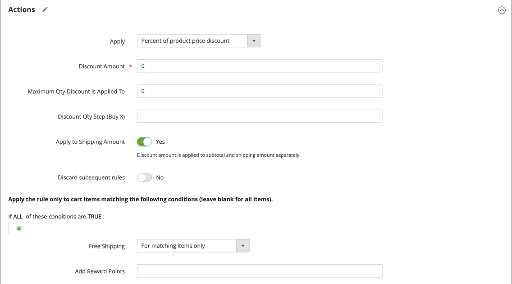
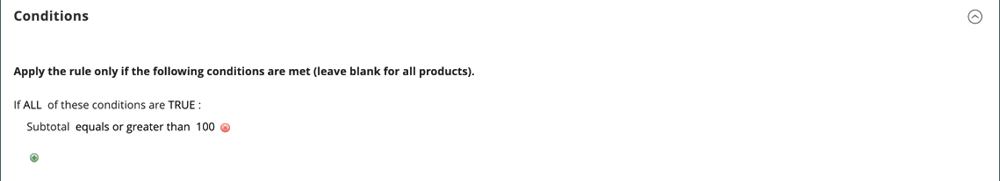

# 장바구니 가격 규칙 예 - 무료 배송 프로모션

무료 배송은 프로모션으로 제공될 수 있습니다. [쿠폰](price-rules-cart-coupon.md). 무료 배송 쿠폰이나 바우처는 고객 픽업 주문에도 적용될 수 있으므로 주문 송장이 발행되고 배송되어 주문을 완료할 수 있습니다 [워크플로우](../stores-purchase/order-processing.md#order-workflow-and-processing).

일부 운송 회사 구성은 최소 주문에 따라 무료 배송을 제공할 수 있는 기능을 제공합니다. 이 기본 기능을 확장하기 위해 장바구니 가격 규칙을 사용하여 여러 제품 속성, 장바구니 콘텐츠 및 고객 그룹을 기반으로 복잡한 조건을 만들 수 있습니다.

## 1단계. 무료 배송 사용

1. 사용 [무료 배송](../stores-purchase/shipping-free.md) 저장소 구성에서.

1. 다음에 대한 무료 배송 설정을 완료합니다. [통신사 서비스](../stores-purchase/carriers.md) 무료 배송에 사용하고 싶은 물건입니다.

## 2단계. 장바구니 가격 규칙 만들기

다음에서 _관리자_ 사이드바, 이동 **[!UICONTROL Marketing]** > _[!UICONTROL Promotions]_>**[!UICONTROL Cart Price Rules]**.

아래 단계에 따라 제공하려는 무료 배송 프로모션 유형을 설정하십시오.

### 예 1: 모든 주문에 대해 무료 배송

1. 다음을 완료합니다. **[!UICONTROL Rule Information]** 다음과 같이:

   - 입력 **[!UICONTROL Rule Name]** 내부 참조용.
   - 개요 입력 **[!UICONTROL Description]** 규칙을 설명합니다.
   - 설정 **[!UICONTROL Active]** 끝 `Yes`.
   - 다음에서 **[!UICONTROL Websites]** box, 무료 배송 쿠폰을 사용할 각 사이트를 선택합니다.
   - 다음 항목 선택 **[!UICONTROL Customer Groups]** 규칙이 적용되는 대상.
   - 설정 **[!UICONTROL Coupon]** 다음 중 하나를 수행합니다.
      - 쿠폰 없이 무료 배송 프로모션을 제공하려면, 기본값을 수락 (`No Coupon`) 설정.
      - 가격 규칙과 함께 쿠폰을 사용하려면 다음을 선택합니다. `Specific Coupon`. 필요한 경우 지침을 완료하여 [쿠폰](price-rules-cart-coupon.md).

1. 아래로 스크롤하고 확장합니다.  다음 **[!UICONTROL Actions]** 섹션을 참조하고 다음을 수행합니다.

   - 설정 **[!UICONTROL Apply]** 끝 `Percent of product price discount`.
   - 설정 **[!UICONTROL Apply to Shipping Amount]** 끝 `Yes`.
   - 설정 **[!UICONTROL Free Shipping]** 끝 `For matching items only`.

   {width="600" zoomable="yes"}

### 예 2: $ 금액 이상 주문에 대한 무료 배송

1. 다음을 완료합니다. **[!UICONTROL General Information]** 이전 예제에 설명된 대로 설정합니다.

1. 아래로 스크롤하고 확장합니다.  다음 **[!UICONTROL Conditions]** 섹션.

1. 클릭 _추가_ ()를 클릭하여 조건을 삽입하고 다음을 수행합니다.

   - 아래 목록에서 **[!UICONTROL Cart Attribute]**, 선택 `Subtotal`.
   - 클릭 **[!UICONTROL is]** 및 선택 `equals or greater than`.
   - 클릭 **...** 소계의 임계값을 입력합니다. 예: `100`를 클릭하여 조건을 완료합니다.

   {width="600" zoomable="yes"}

1. 필요한 경우 를 확장합니다.  다음 **[!UICONTROL Actions]** 섹션을 참조하고 다음을 수행합니다.

   - 설정 **[!UICONTROL Apply]** 끝 `Percent of product price discount`.
   - 설정 **[!UICONTROL Apply to Shipping Amount]** 끝 `Yes`.
   - 설정 **[!UICONTROL Free Shipping]** 끝 `For matching items only`.

## 3단계. 레이블 작성

완료 [4단계](price-rules-cart.md) 체크아웃하는 동안 표시되는 모든 레이블을 입력하는 장바구니 가격 규칙 지침

## 4단계. 규칙 저장 및 테스트

{{new-price-rule}}

1. 규칙이 완료되면 다음을 클릭하십시오. **[!UICONTROL Save Rule]**.

1. 규칙이 올바르게 작동하는지 테스트합니다.
