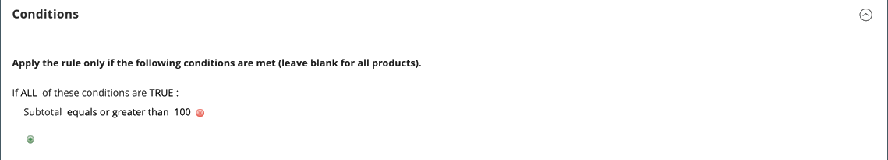

# 장바구니 가격 규칙 예 - 무료 배송 프로모션

무료 배송은 프로모션으로 제공될 수 있습니다([쿠폰](price-rules-cart-coupon.md) 포함 또는 제외). 무료 배송 쿠폰이나 바우처는 고객 픽업 주문에도 적용될 수 있으므로 주문 송장을 발행하고 배송하여 [워크플로](../stores-purchase/order-processing.md#order-workflow-and-processing)를 완료할 수 있습니다.

일부 운송 회사 구성은 최소 주문에 따라 무료 배송을 제공할 수 있는 기능을 제공합니다. 이 기본 기능을 확장하기 위해 장바구니 가격 규칙을 사용하여 여러 제품 속성, 장바구니 콘텐츠 및 고객 그룹을 기반으로 복잡한 조건을 만들 수 있습니다.

## 1단계. 무료 배송 사용

1. 스토어 구성에서 [무료 배송](../stores-purchase/shipping-free.md)을 사용하도록 설정하십시오.

1. 무료 배송에 사용할 [통신사 서비스](../stores-purchase/carriers.md)에 대한 무료 배송 설정을 완료하십시오.

## 2단계. 장바구니 가격 규칙 만들기

_관리자_ 사이드바에서 **[!UICONTROL Marketing]** > _[!UICONTROL Promotions]_>**[!UICONTROL Cart Price Rules]**(으)로 이동합니다.

아래 단계에 따라 제공하려는 무료 배송 프로모션 유형을 설정하십시오.

### 예 1: 모든 주문에 대해 무료 배송

1. 다음과 같이 **[!UICONTROL Rule Information]**&#x200B;을(를) 완료합니다.

   - 내부 참조를 위해 **[!UICONTROL Rule Name]**&#x200B;을(를) 입력하십시오.
   - 규칙을 설명하는 간단한 **[!UICONTROL Description]**&#x200B;을(를) 입력하십시오.
   - **[!UICONTROL Active]**&#x200B;을(를) `Yes`(으)로 설정합니다.
   - **[!UICONTROL Websites]** 상자에서 무료 배송 쿠폰을 사용할 수 있는 각 사이트를 선택합니다.
   - 규칙이 적용되는 **[!UICONTROL Customer Groups]**&#x200B;을(를) 선택하십시오.
   - **[!UICONTROL Coupon]**&#x200B;을(를) 다음 중 하나로 설정합니다.
      - 쿠폰 없이 무료 배송 프로모션을 제공하려면 기본(`No Coupon`) 설정을 수락하십시오.
      - 가격 규칙이 적용된 쿠폰을 사용하려면 `Specific Coupon`을(를) 선택하세요. 필요한 경우 지침을 완료하여 [쿠폰](price-rules-cart-coupon.md)을 설정합니다.

1. 아래로 스크롤하여 **[!UICONTROL Actions]** 섹션에서 를 확장하고 다음을 수행합니다.

   - **[!UICONTROL Apply]**&#x200B;을(를) `Percent of product price discount`(으)로 설정합니다.
   - **[!UICONTROL Apply to Shipping Amount]**&#x200B;을(를) `Yes`(으)로 설정합니다.
   - **[!UICONTROL Free Shipping]**&#x200B;을(를) `For matching items only`(으)로 설정합니다.

   {width="600" zoomable="yes"}

### 예 2: $ 금액 이상 주문에 대한 무료 배송

1. 이전 예제에 설명된 대로 **[!UICONTROL General Information]** 설정을 완료합니다.

1. 아래로 스크롤하여 **[!UICONTROL Conditions]** 섹션에서 를 확장합니다.

1. _추가_()을 클릭하여 조건을 삽입하고 다음을 수행합니다.

   - **[!UICONTROL Cart Attribute]** 아래 목록에서 `Subtotal`을(를) 선택합니다.
   - **[!UICONTROL is]**&#x200B;을(를) 클릭하고 `equals or greater than`을(를) 선택합니다.
   - **..**&#x200B;을(를) 클릭하고 `100`과(와) 같은 소계의 임계값을 입력하여 조건을 완료합니다.

   {width="600" zoomable="yes"}

1. 필요한 경우 **[!UICONTROL Actions]** 섹션에서 를 확장하고 다음을 수행합니다.

   - **[!UICONTROL Apply]**&#x200B;을(를) `Percent of product price discount`(으)로 설정합니다.
   - **[!UICONTROL Apply to Shipping Amount]**&#x200B;을(를) `Yes`(으)로 설정합니다.
   - **[!UICONTROL Free Shipping]**&#x200B;을(를) `For matching items only`(으)로 설정합니다.

## 3단계. 레이블 작성

장바구니 가격 규칙 지침의 [4](price-rules-cart.md)단계를 완료하여 체크아웃 중에 나타나는 모든 레이블을 입력합니다.

## 4단계. 규칙 저장 및 테스트

{{new-price-rule}}

1. 규칙이 완료되면 **[!UICONTROL Save Rule]**&#x200B;을(를) 클릭합니다.

1. 규칙이 올바르게 작동하는지 테스트합니다.
