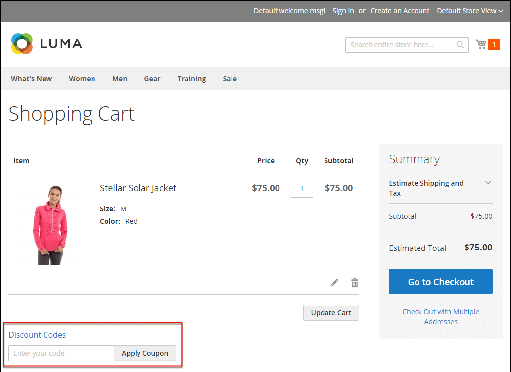

# 장바구니 가격 규칙

장바구니 가격 규칙은 조건 세트에 따라 장바구니의 항목에 할인을 적용합니다. 해당 조건이 충족되거나 고객이 유효한 쿠폰코드를 입력하면 자동으로 할인이 적용된다. 적용하면 소계 아래의 장바구니에 할인이 표시됩니다. 장바구니 가격 규칙은 상태 및 날짜 범위를 변경하여 시즌 또는 프로모션에 필요한 만큼 사용할 수 있습니다.

>[!NOTE]
>
>쿠폰 장바구니 규칙에 특정 배송 또는 결제 방법과 같이 체크아웃 옵션을 지정하는 조건이 있는 경우, 해당 조건은 특정 배송/결제 방법을 선택한 후 체크아웃 시에만 충족됩니다. 이 경우 마지막 단계에서 체크아웃 시 쿠폰이 적용될 수 있다.

{width="600" zoomable="yes"}

## 장바구니 가격 규칙 액세스

1. _관리자_ 사이드바에서 **[!UICONTROL Marketing]** > _[!UICONTROL Promotions]_>**[!UICONTROL Cart Price Rules]**(으)로 이동합니다.

   {width="700" zoomable="yes"}

1. 규칙이 많은 경우 각 열의 맨 위에 있는 필터 옵션을 사용하여 목록을 간소화하고 **[!UICONTROL Search]**&#x200B;을(를) 클릭하여 필터를 적용합니다.

1. 모든 필터 옵션을 지우고 전체 목록을 표시하려면 **[!UICONTROL Reset Filter]**&#x200B;을(를) 클릭합니다.

1. 규칙 속성 업데이트:

   - (Adobe Commerce만 해당) **[!UICONTROL Edit]**&#x200B;을(를) 클릭하여 규칙 정보 페이지를 표시합니다.

   - (Magento Open Source 전용) 목록에서 규칙을 클릭하여 규칙 정보 페이지를 표시합니다.

   여기에서 규칙 설정을 변경할 수 있습니다(규칙 생성과 유사).

## 열을 기준으로 옵션 필터링

| 열 | 설명 |
|--- |--- |
| [!UICONTROL ID] | 특정 규칙 ID 번호에 대한 목록을 필터링하려면 텍스트를 입력하십시오. |
| [!UICONTROL Rule] | 규칙을 만들 때 정의된 규칙 이름을 기준으로 목록을 필터링할 텍스트를 입력합니다. |
| [!UICONTROL Coupon Code] | 규칙을 만들 때 정의한 코드 이름을 기반으로 목록을 필터링할 텍스트를 입력합니다. |
| [!UICONTROL Priority] | 규칙에 대해 정의된 우선 순위를 기준으로 목록을 필터링하는 자유 텍스트 필드. |
| [!UICONTROL Status] | 이 옵션을 사용하여 규칙 상태(`Active` 또는 `Inactive`)를 기준으로 목록을 필터링합니다. |
| [!UICONTROL Web Site] | 이 옵션을 사용하여 규칙에 정의된 웹 사이트를 기준으로 목록을 필터링합니다. |
| [!UICONTROL Action] | (Adobe Commerce만 해당) **[!UICONTROL Edit]**&#x200B;을(를) 클릭하여 _[!UICONTROL Rule Information]_페이지를 표시하고 규칙 설정을 업데이트합니다(규칙을 만드는 것과 유사). |
| [!UICONTROL Start] | (Magento Open Source 전용) 규칙을 만들 때 정의된 규칙의 시작 날짜를 기준으로 목록을 필터링하려면 동적 일정 필드(_[!UICONTROL To:]_및_[!UICONTROL From:]_)를 사용합니다. |
| [!UICONTROL End] | (Magento Open Source 전용) 규칙을 만들 때 정의된 규칙의 종료 날짜를 기준으로 목록을 필터링하려면 동적 일정 필드(_[!UICONTROL To:]_및_[!UICONTROL From:]_)를 사용합니다. |

{style="table-layout:auto"}

## Real-Time CDP 대상자를 사용하여 장바구니 가격 규칙 알림

장바구니 가격 규칙을 알리기 위해 Adobe Commerce 인스턴스에 Real-Time CDP 대상을 [활성화](../customers/audience-activation.md)하는 방법을 알아봅니다.
