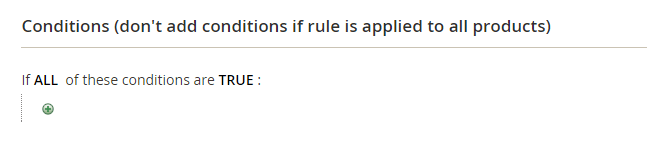
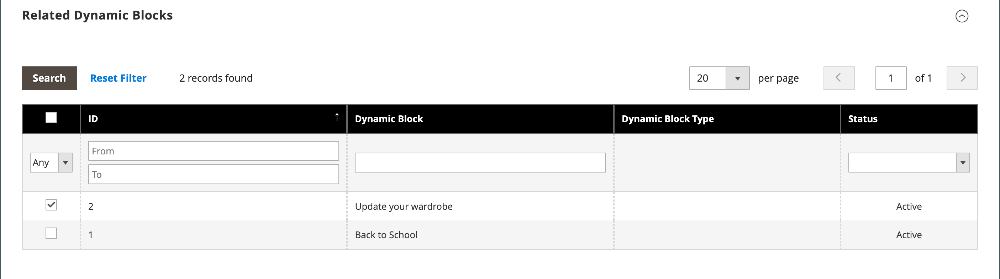

# 카탈로그 가격 규칙 만들기

일련의 조건이 충족될 때마다 특정 제품에 할인을 적용하려면 다음 지침을 따르십시오. 카탈로그 가격 규칙 할인은 제품을 장바구니에 담기 전에 적용됩니다.

## 1단계: 규칙 추가

1. _관리자_ 사이드바에서 **[!UICONTROL Marketing]** > _[!UICONTROL Promotions]_>**[!UICONTROL Catalog Price Rule]**(으)로 이동합니다.

1. 오른쪽 상단에서 **[!UICONTROL Add New Rule]**&#x200B;을(를) 클릭합니다.

   _[!UICONTROL Rule Information]_&#x200B;섹션에는&#x200B;**[!UICONTROL Conditions]**&#x200B;및&#x200B;**[!UICONTROL Actions]**&#x200B;에 대한 확장 가능한 섹션이 포함되어 있습니다.

   {width="700" zoomable="yes"}

1. **[!UICONTROL Rule Name]** 및 **[!UICONTROL Description]** 필드를 완료합니다.

   이 필드는 내부 참조용입니다.

1. 필요에 따라 가격 규칙의 **[!UICONTROL Status]**&#x200B;을(를) 설정합니다.

   기본적으로 상태는 `Inactive`입니다.

   >[!NOTE]
   >
   >규칙을 만든 후 필요에 따라 상태를 `Active` 또는 `Inactive`(으)로 변경하여 해당 상태를 업데이트할 수 있습니다.

1. 규칙을 사용할 수 있는 **[!UICONTROL Websites]**&#x200B;을(를) 선택하십시오.

1. 이 규칙이 적용되는 **[!UICONTROL Customer Groups]**&#x200B;을(를) 선택하십시오.

   여러 그룹을 선택하려면 Ctrl 키(PC) 또는 Command 키(Mac)를 누른 상태에서 각 옵션을 클릭합니다.

   >[!NOTE]
   >
   >이 목록의 옵션은 _고객_ > _고객 그룹_&#x200B;에서 만들고 관리하는 고객 그룹에 따라 다릅니다.

1. (Magento Open Source 전용) 가격 규칙이 적용되는 시기를 확인하려면 **[!UICONTROL From]** 및 **[!UICONTROL To]** 날짜를 입력하십시오.

   날짜를 입력하거나 **[!UICONTROL Calendar]**()을 사용하여 날짜를 선택할 수 있습니다. 날짜를 비워 두면 가격 규칙이 저장될 때 규칙이 활성화됩니다.

1. 다른 규칙과 관련하여 이 규칙의 **[!UICONTROL Priority]**&#x200B;을(를) 설정하려면 숫자를 입력하세요.

   >[!NOTE]
   >
   >동일한 카탈로그 제품이 두 개 이상의 가격 규칙에 설정된 조건을 충족하면 _[!UICONTROL Priority]_&#x200B;설정이 중요합니다. 우선 순위 설정이 가장 높은 규칙(가장 높은 우선 순위에서 가장 낮은 우선 순위는 0,1,2,3...)이 제품에 대해 활성화됩니다.

## 2단계: 조건 정의

사용 가능한 대부분의 조건은 기존 속성 값을 기반으로 합니다. 모든 제품에 규칙을 적용하려면 조건을 비워 둡니다.

>[!NOTE]
>
>하나 이상의 조건부 제품 속성에 빈 값이 있으면 카탈로그 가격 규칙이 제품에 적용되지 않습니다.

>[!NOTE]
>
>[번들](../catalog/product-create-bundle.md) 또는 [그룹화된](../catalog/product-create-grouped.md) 제품에 `Category` 제품 특성 조건을 적용하려면 모든 하위 제품을 동일한 범주에 할당해야 규칙이 올바르게 적용됩니다. 그렇지 않으면 대신 [장바구니 가격 규칙](price-rules-cart-create.md) 프로모션을 사용할 수 있습니다.

1. 아래로 스크롤하여 **[!UICONTROL Conditions]** 섹션에서 를 확장합니다.

   첫 번째 조건은 기본적으로 나타나고 다음과 같이 표시됩니다.

   `If **ALL** of these conditions are **TRUE**:`

   {width="400"}

   명령문에는 명령문의 해당 부분에 대한 선택 사항을 표시하기 위해 클릭할 수 있는 두 개의 굵은 링크가 있습니다. 이러한 값의 조합을 변경하여 다른 조건을 만들 수 있습니다.

1. 다음 방법 중 하나로 명령문을 변경합니다.

   - **[!UICONTROL ALL]**&#x200B;을(를) 클릭하고 `ALL` 또는 `ANY`을(를) 선택합니다.
   - **[!UICONTROL TRUE]**&#x200B;을(를) 클릭하고 `TRUE` 또는 `FALSE`을(를) 선택합니다.
   - 모든 제품에 규칙을 적용하려면 조건을 변경하지 마십시오.

   이러한 값의 조합을 변경하여 다른 조건을 만들 수 있습니다. 이 예에서는 기본 조건이 사용됩니다.

1. 다음 줄의 맨 앞에 있는 _추가_() 아이콘을 클릭하고 제품 특성이나 조합과 같은 조건에 대한 옵션을 선택합니다.

1. **[!UICONTROL Product Attribute]** 아래 목록에서 조건의 기준으로 사용할 특성을 선택합니다.

   이 예제의 경우 조건은 `Attribute Set`입니다.

   {width="400"}

   >[!NOTE]
   >
   >속성이 목록에 나타나도록 하려면 이관 규칙 조건에서 사용하도록 구성해야 합니다. 자세한 내용은 [제품 특성](../catalog/product-attributes.md)을 참조하세요.

   >[!NOTE]
   >
   >_SKU_ 제품 특성 및 구성 가능한 제품과 함께 `is not one of` 조건을 사용하는 경우 상위 및 하위 제품 SKU를 모두 선택해야 합니다. 규칙에 모든 하위 SKU가 나열되지 않도록 구성 가능한 제품 및 해당 하위 제품의 일반 SKU 부분과 함께 `does not contain` 조건을 사용할 수 있습니다.

   선택한 조건이 문에 나타나고 그 뒤에 굵은 링크가 두 개 더 나타납니다. 옵션은 선택하는 조건 속성에 따라 다릅니다. 성명은 이제 말합니다.

   `If **ALL** of these conditions are **TRUE**:  Attribute Set **is** …`

1. **[!UICONTROL is]**&#x200B;을(를) 클릭하고 충족할 조건을 설명하는 비교 연산자를 선택합니다.

   이러한 옵션에는 서로 다른 비교를 위한 옵션이 포함될 수 있습니다. 이 예제에서 옵션은 `is` 및 `is not`입니다.

1. 조건에 대한 값을 선택하거나 입력합니다.

   조건에 따라 격자선이나 목록에서 제품을 선택하고 숫자 값을 입력하는 등의 작업을 수행할 수 있습니다.

   {width="400"}

   선택한 항목이 문에 표시되어 조건을 완료합니다.

   `If **ALL** of these conditions are **TRUE**:   Attribute Set **is Default**`

1. 문에 다른 조건 줄을 추가하려면 _추가_() 아이콘을 클릭하고 다음 중 하나를 선택하십시오.

   - `Conditions Combination`
   - `Product Attribute`

   원하는 조건이 모두 완료될 때까지 이 프로세스를 반복합니다.

   언제든지 조건문의 일부를 삭제하려면 줄 끝에 있는 **[!UICONTROL Delete]**() 아이콘을 클릭합니다.

## 3단계: 작업 정의

1. **[!UICONTROL Actions]** 섹션을 확장하고 다음을 수행합니다.

   {width="600" zoomable="yes"}

1. **[!UICONTROL Pricing Structure Rules]**&#x200B;에서 **[!UICONTROL Apply]**&#x200B;을(를) 다음 중 하나로 설정합니다.

   - `Apply as percentage of original` - 정가의 백분율을 뺀 할인 항목. 예를 들어, 정규 가격에서 10% 인하된 최종 가격에 대해 할인 금액에 10을 입력합니다.
   - `Apply as fixed amount` - 정가에서 고정 금액을 빼서 항목을 할인합니다. 예를 들어, 일반 가격보다 $10만큼 낮은 최종 가격의 할인 금액에 10을 입력합니다.
   - `Adjust final price to this percentage` - 최종 가격을 정가의 백분율로 조정합니다. 예를 들어, 정규 가격에서 75% 인하된 최종 가격에 대해 할인 금액에 25를 입력합니다.
   - `Adjust final price to discount value` - 최종 가격을 고정 및 할인된 금액으로 설정합니다. 예를 들어 $20.00의 최종 가격에 대해 할인 금액에 20을 입력합니다.

   >[!NOTE]
   >
   >_일반 가격_&#x200B;은(는) 고급 가격(특별/계층/그룹) 또는 프로모션 할인이 없는 기본 제품 가격을 나타냅니다. _최종 가격_&#x200B;은(는) 장바구니에 표시되는 할인된 가격을 참조합니다.  다음 공식을 사용하여 **_최종_** 제품 가격이 **_최소_** 관련 가격으로 계산됩니다.  `Final Price=Min(Regular(Base) Price, Group(Tier) Price, Special Price, Catalog Price Rule) + Sum(Min Price per each required custom option)`

   >[!NOTE]
   >
   >**_고정 가격_** 제품 사용자 지정 가능 옵션은 그룹 가격, 계층 가격, 특별 가격 또는 카탈로그 가격 규칙의 영향을 받지 _않습니다_.

1. **[!UICONTROL Discount Amount]** 입력.

1. 이 규칙이 적용된 후 다른 규칙 처리를 중지하려면 **[!UICONTROL Discard Subsequent Rules]**&#x200B;을(를) `Yes`(으)로 설정하십시오.

   >[!NOTE]
   >
   >이 값을 `Yes`(으)로 설정하는 것은 시스템이 동일한 제품에 여러 할인(규칙)을 적용하지 못하도록 하는 안전 장치입니다.

## 4단계: 관련 동적 블록 추가

{{ee-feature}}

카탈로그 가격 규칙과 연결된 [동적 블록](../content-design/dynamic-blocks.md)은(는) 조건이 충족될 때마다 상점 앞에 나타납니다. 선택적 단계입니다.

1. **[!UICONTROL Related Dynamic Blocks]** 섹션을 확장합니다.

1. [검색 필터](../getting-started/admin-workspace.md)를 사용하여 규칙과 연결할 동적 블록을 찾습니다.

1. 첫 번째 열에서 확인란을 선택하여 동적 블록을 규칙과 연결합니다.

   {width="600" zoomable="yes"}

1. **[!UICONTROL Save and Continue Edit]**&#x200B;을(를) 클릭합니다.

## 5단계: 규칙 예약

{{ee-feature}}

>[!NOTE]
>
>규칙을 활성으로 설정하려면 예약된 업데이트로 추가해야 합니다. 자세한 내용은 [예약된 변경 내용](price-rule-catalog-scheduled-changes.md)을 참조하세요.

1. _예약된 변경 내용_ 상자에서 상단의 **[!UICONTROL Schedule New Update]**&#x200B;을(를) 클릭합니다.

   규칙에 예약된 업데이트가 있는 경우 나열된 변경 내용 오른쪽에 있는 **[!UICONTROL View/Edit]**&#x200B;을(를) 클릭할 수 있습니다.

   기존 업데이트를 편집하거나 카탈로그 가격 규칙을 다른 캠페인에 할당할 수 있습니다. 기본적으로 **기존 업데이트 편집** 옵션이 선택되어 있습니다.

1. 규칙을 예약하려면 가격 규칙을 활성화할 **[!UICONTROL Start Date]** 및 **[!UICONTROL End Date]**&#x200B;을(를) 입력하십시오.

   날짜를 입력하거나 _달력_()에서 날짜를 선택할 수 있습니다.

   {width="600" zoomable="yes"}

1. **[!UICONTROL Save]**&#x200B;을(를) 클릭합니다.

1. _규칙 정보_ 섹션에서 **[!UICONTROL Status]**&#x200B;을(를) `active`(으)로 설정합니다.

## 6단계: 규칙 저장 및 테스트

1. 완료되면 규칙을 저장합니다.

   - (Magento Open Source 전용) **[!UICONTROL Save and Apply]**&#x200B;을(를) 클릭합니다.

   - (Adobe Commerce만 해당) **[!UICONTROL Save]**&#x200B;을(를) 클릭합니다.

     규칙 정보 페이지에는 해당 규칙의 예약된 변경 사항에 업데이트된 타임라인이 표시됩니다.

     {width="600" zoomable="yes"}

1. 규칙 속성 업데이트:

   - (Adobe Commerce만 해당) **[!UICONTROL Edit]**&#x200B;을(를) 클릭하여 _[!UICONTROL Rule Information]_&#x200B;페이지를 표시합니다.

   - (Magento Open Source 전용) 목록에서 규칙을 클릭하여 _[!UICONTROL Rule Information]_&#x200B;페이지를 표시합니다.

1. 규칙이 올바르게 작동하는지 테스트합니다.

   가격 규칙은 매일 밤 다른 시스템 규칙과 함께 자동으로 처리됩니다. 가격 규칙을 만들 때 규칙을 테스트하기 전에 시스템에서 가격 규칙이 올바르게 작동하는지 확인할 수 있는 충분한 시간을 허용하십시오. 새로운 규칙이 추가되면 Commerce은 이에 따라 가격과 우선 순위를 다시 계산합니다.

## 카탈로그 가격 규칙 데모

이 비디오를 통해 카탈로그 가격 규칙 만들기에 대해 알아보십시오.

>[!VIDEO](https://video.tv.adobe.com/v/3410851?quality=12&learn=on&captions=kor)

## 필드 설명

### [!UICONTROL Rule Information]

| 필드 | 설명 |
|-----|-----------|
| [!UICONTROL Rule name] | (필수) 규칙 이름은 내부 참조용입니다. |
| [!UICONTROL Description] | 규칙에 대한 설명은 규칙의 목적을 포함하고 규칙의 사용 방법을 설명해야 합니다. |
| [!UICONTROL Websites] | (필수) 규칙을 사용할 수 있는 웹 사이트를 식별합니다. |
| [!UICONTROL Customer Groups] | (필수) 규칙이 적용되는 고객 그룹을 식별합니다. |
| [!UICONTROL Priority] | 다른 규칙과 관련한 이 규칙의 우선 순위를 나타내는 숫자입니다. 높은 우선 순위에서 낮은 우선 순위는 `0,1,2,3...`입니다. |
| [!UICONTROL Status] | (Magento Open Source 전용) 저장소에서 규칙이 활성화되어 있는지 여부를 결정합니다. 옵션: `Yes` / `No` |
| [!UICONTROL From] | (Magento Open Source 전용) 가격 규칙이 적용되는 첫 날을 지정합니다. 비워 두면 가격 규칙이 저장될 때 적용됩니다. |
| [!UICONTROL To] | (Magento Open Source 전용) 가격 규칙이 적용되는 마지막 날을 지정합니다. 비워 두면 가격 규칙은 무기한 계속됩니다. |

{style="table-layout:auto"}

### [!UICONTROL Conditions]

카탈로그 가격 규칙이 실행되기 전에 충족해야 하는 조건을 지정합니다. 비워 두면 규칙이 모든 제품에 적용됩니다.

### [!UICONTROL Actions]

| 필드 | 설명 |
|-----|-----------|
| [!UICONTROL Apply] | 구매에 적용되는 계산 유형을 결정합니다. 옵션:  **[!UICONTROL Apply as percentage of original]**- 일반 가격의 백분율을 뺀 할인 항목. **[!UICONTROL Apply as fixed amount]** - 정가에서 고정 금액을 빼서 항목을 할인합니다.  **[!UICONTROL Adjust final price to this percentage]**- 최종 가격을 정가의 백분율로 조정합니다. **[!UICONTROL Adjust final price to discount value]** - 최종 가격을 고정 및 할인된 금액으로 설정합니다.   **_참고:_**&#x200B;일반 가격은 고급 가격(특별/계층/그룹) 또는 프로모션 할인이 없는 기본 제품 가격을 나타냅니다. 최종가격은 장바구니에 나타나는 할인된 가격을 의미한다.  다음 공식을 사용하여&#x200B;**_최종&#x200B;_**&#x200B;제품 가격이&#x200B;**_최소&#x200B;_**&#x200B;관련 가격으로 계산됩니다.  `Final Price=Min(Regular(Base) Price, Group(Tier) Price, Special Price, Catalog Price Rule) + Sum(Min Price per each required custom option)` |
| [!UICONTROL Discount Amount] | (필수) 제공된 할인 금액. |
| [!UICONTROL Discard Subsequent Rules] | 이 구매에 추가 규칙을 적용할 수 있는지 여부를 결정합니다. 동일한 구매에 여러 할인을 적용하지 않으려면 `Yes`을(를) 선택하십시오. 옵션: `Yes` / `No` |

{style="table-layout:auto"}

### [!UICONTROL Related Dynamic Blocks]

{{ee-feature}}

규칙과 연결된 [동적 블록](../content-design/dynamic-blocks.md)을(를) 식별합니다.
