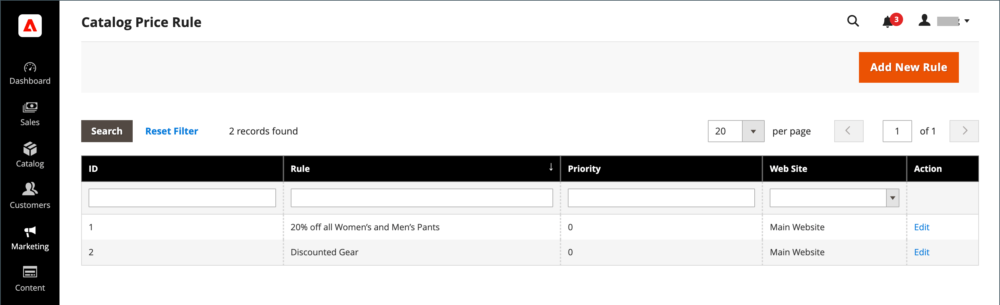

# 카탈로그 가격 규칙

카탈로그 가격 규칙은 정의된 조건 세트에 따라 할인된 가격으로 구매자에게 제품을 제공하는 데 사용할 수 있습니다. 카탈로그 가격 규칙이 다음을 사용하지 않음 [쿠폰 코드](price-rules-cart-coupon.md): 제품이 장바구니에 배치되기 전에 트리거되기 때문입니다.

예를 들어 충족될 때 특별 또는 판촉 가격이 있는 제품을 자동으로 표시하는 가격 규칙에 대한 조건을 정의하고 설정할 수 있습니다. 정의된 규칙 속성에는 고객 그룹, 제품 카테고리, 할인 금액 또는 백분율, 제품 색상, 제품 크기 또는 스토어에 설정된 제품 속성 정보가 포함될 수 있습니다. 규칙에 정의한 일자에 판촉을 자동으로 시작 및 정지하는 가격 규칙의 시작 및 종료 일자를 설정할 수 있습니다. 저장된 규칙의 속성은 필요에 따라 업데이트하거나 수정할 수 있습니다.

-  (Adobe Commerce만 해당) 정의된 규칙을 [동적 블록](../content-design/dynamic-blocks.md) 스토어에서 이벤트 또는 제품을 홍보하는 데 도움이 됩니다.

-  (Magento Open Source 전용) 반복 판촉의 경우 저장된 규칙을 수동으로 다음으로 설정할 수 있습니다. _활성_ 또는 _비활성_ 프로모션을 실행할 때마다 상태를 지정합니다.

## 카탈로그 가격 규칙 액세스

1. 다음에서 _관리자_ 사이드바, 이동 **[!UICONTROL Marketing]** > _[!UICONTROL Promotions]_>**[!UICONTROL Catalog Price Rules]**.

   {width="700" zoomable="yes"}

1. 규칙 속성 업데이트:

   -  (Adobe Commerce만 해당) **[!UICONTROL Edit]** 을(를) 표시하려면 _규칙 정보_ 페이지를 가리키도록 업데이트하는 중입니다.

   -  (Magento Open Source 전용) 목록에서 규칙을 클릭하여 규칙 정보 페이지를 표시합니다.

   여기에서 규칙에 대한 설정을 변경할 수 있습니다( 와 유사). [규칙 만들기](price-rules-catalog-create.md)).

## 필터 옵션

| 필드 | 설명 |
|--- |--- |
| [!UICONTROL ID] | 특정 규칙 ID 번호에 대한 목록을 필터링하려면 텍스트를 입력하십시오. |
| [!UICONTROL Rule] | 규칙을 만들 때 정의된 규칙 이름을 기준으로 목록을 필터링할 텍스트를 입력합니다. |
| [!UICONTROL Priority] |  (Adobe Commerce만 해당) 규칙에 대해 정의된 우선 순위를 기준으로 목록을 필터링하려면 이 필드에 텍스트를 입력합니다. |
| [!UICONTROL Web Site] |  (Adobe Commerce만 해당) 이 옵션을 사용하여 규칙에 정의된 웹 사이트를 기반으로 목록을 필터링합니다. |
| [!UICONTROL Action] |  (Adobe Commerce만 해당) **[!UICONTROL Edit]** 을 클릭하여 규칙 정보를 표시하고 규칙 설정을 업데이트합니다( 규칙 만들기와 유사). |
| [!UICONTROL Start] |  (Magento Open Source 전용) 동적 달력 필드(종료: 및 시작:)를 사용하여 규칙을 만들 때 정의된 규칙의 시작 날짜를 기준으로 목록을 필터링합니다. |
| [!UICONTROL End] |  (Magento Open Source 전용) 동적 달력 필드(종료: 및 시작:)를 사용하여 규칙을 만들 때 정의된 규칙의 종료 날짜를 기준으로 목록을 필터링합니다. |
| [!UICONTROL Status] |  (Magento Open Source 전용) 이 옵션을 사용하여 규칙 상태를 기반으로 목록을 필터링합니다(`Active` 또는 `Inactive`). |

{style="table-layout:auto"}

## 리소스 문제 해결

카탈로그 가격 규칙 문제를 해결하는 데 대한 도움말은 다음 Commerce 지원 기술 문서를 참조하십시오.

- [404 카탈로그 가격 규칙 일정 업데이트가 수행되면 스토어 프런트에 오류 발생](https://experienceleague.adobe.com/docs/commerce-knowledge-base/kb/troubleshooting/known-issues-patches-attached/404-error-on-store-front-once-catalog-price-rule-schedules-update-is-performed.html)
- [관련 제품 및 대상 규칙을 사용한 제품 페이지의 성능 개선](https://experienceleague.adobe.com/docs/commerce-knowledge-base/kb/support-tools/patches/v1-0-9/mdva-31791-magento-patch-improvement-for-product-page-with-related-products-and-target-rules.html)
- [카탈로그 가격 규칙이 작동하지 않음](https://experienceleague.adobe.com/docs/commerce-knowledge-base/kb/support-tools/patches/v1-0-14/mdva-24201-magento-patch-catalog-price-rules-don-t-work.html)
- [GraphQL 가격 계산](https://experienceleague.adobe.com/docs/commerce-knowledge-base/kb/support-tools/patches/v1-0-14/mdva-33975-magento-patch-graphql-price-calculations.html)
