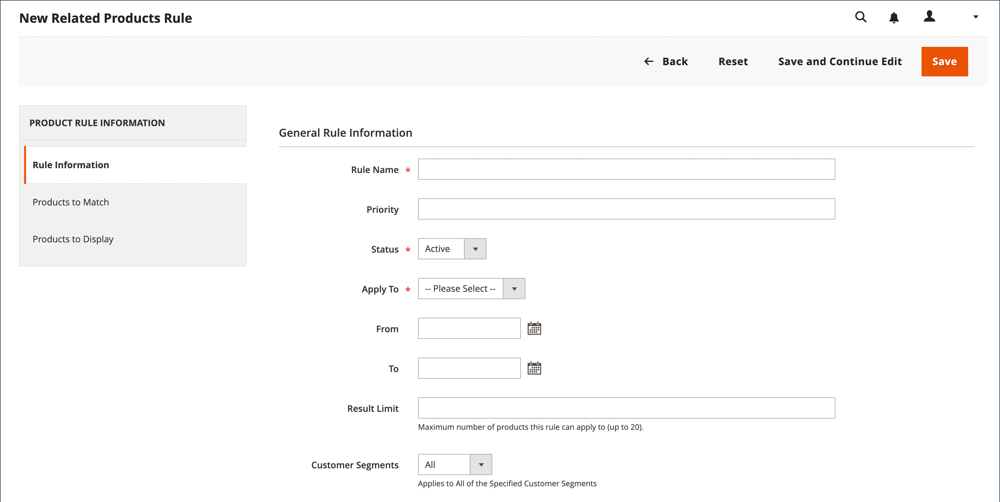

# 관련 제품 규칙 만들기

{{ee-feature}}

관련 제품 규칙을 만드는 프로세스는 가격 규칙을 설정하는 것과 유사합니다. 먼저 일치시킬 조건을 정의한 다음 표시할 제품을 선택합니다. 언제든지 관련 제품, 상향 판매 및 교차 판매를 표시하기 위해 트리거할 수 있는 몇 가지 활성 규칙이 있을 수 있습니다. 각 규칙의 우선 순위는 제품 블록이 페이지에 표시되는 순서를 결정합니다.

>[!NOTE]
>
>타깃팅된 규칙에서 사용할 속성의 경우 [_[!UICONTROL Use for Promo Rule Conditions]_](../catalog/product-attributes.md) 속성을 다음으로 설정해야 합니다. `Yes`.

>[!NOTE]
>
>다음 `All Store Views` 범위 값은 항상 다음 모두에 사용됩니다. [!UICONTROL Products to Match] 및 [!UICONTROL Products to Display] 모든 제품 속성에 대한 조건. 이는 제품 속성이 서로 다른 스토어 조회수 및 웹 사이트에 대해 서로 다른 값을 갖는 경우에도 적용됩니다.

## 관련 제품 규칙 만들기

1. 다음에서 _관리자_ 사이드바, 이동 **[!UICONTROL Marketing]** > _[!UICONTROL Promotions]_>**[!UICONTROL Related Product Rules]**.

1. 오른쪽 위 모서리에서 을(를) 클릭합니다. **[!UICONTROL Add Rule]**.

   {width="600" zoomable="yes"}

1. 다음을 완료합니다. **[!UICONTROL Rule Information]** 다음과 같이:

   - 입력 **[!UICONTROL Rule Name]** 관리자 작업 시 규칙을 식별합니다.

   - 대상 **[!UICONTROL Priority]**&#x200B;다른 규칙의 결과가 동일한 위치를 대상으로 할 때 페이지에 결과가 표시되는 순서를 결정하는 숫자를 입력합니다. 숫자 `1` 은(는) 최우선 순위입니다.

   - 규칙을 활성화하려면 다음을 설정하십시오. **[!UICONTROL Status]** 끝 `Active`.

   - 설정 **[!UICONTROL Apply To]** 다음 중 하나를 수행합니다.

      - `Related Products`
      - `Up-sells`
      - `Cross-sells`

   - 특정 시간 범위 동안 규칙을 활성화하려면 **[!UICONTROL From]** 및 **[!UICONTROL To]** 날짜.

   - 대상 **[!UICONTROL Result Limit]**&#x200B;결과 목록에 표시할 레코드 수를 입력합니다. 최대 숫자는 20입니다.

   - 규칙이 특정 [고객 세그먼트](../customers/customer-segments.md), 설정됨 **[!UICONTROL Customer Segments]** 끝 `Specified` 목록에서 고객 세그먼트를 선택합니다.

1. 왼쪽 패널에서 을 선택합니다 **[!UICONTROL Products to Match]** 에 대해 원하는 대로 조건을 빌드합니다. [카탈로그 가격 규칙](price-rules-catalog.md).

   {width="500"}

1. 왼쪽 패널에서 을 선택합니다 **[!UICONTROL Products to Display]** 에 대해 원하는 대로 결과 조건을 빌드합니다. [카탈로그 가격 규칙](price-rules-catalog.md).

   {width="500"}

   표시된 결과에 포함할 제품을 설명하는 조건을 완료합니다.

1. 완료되면 다음을 클릭하십시오. **[!UICONTROL Save]**.

## 관련 제품 규칙 삭제

1. 다음에서 _관리자_ 사이드바, 이동 **[!UICONTROL Marketing]** > _[!UICONTROL Promotions]_>**[!UICONTROL Related Product Rules]**.

1. 삭제할 관련 제품 규칙을 찾습니다.

1. 규칙을 클릭하여 세부 정보 페이지를 엽니다.

1. 오른쪽 위 모서리에서 **[!UICONTROL Delete]**.

1. 작업을 확인하려면 다음을 클릭합니다. **[!UICONTROL OK]**.

## 관련 제품 규칙 데모

관련 제품 규칙을 만드는 방법에 대해 알아보려면 이 비디오 를 시청하십시오.

>[!VIDEO](https://video.tv.adobe.com/v/343837?quality=12&learn=on)

## 필드 설명

| 필드 | 설명 |
|--- |--- |
| [!UICONTROL Rule Name] | 내부 사용을 위한 규칙을 식별하는 이름입니다. |
| [!UICONTROL Priority] | 페이지의 동일한 위치를 대상으로 하는 다른 결과 세트와 함께 표시될 때 규칙 결과가 표시되는 시퀀스를 결정합니다. 값은 우선 순위가 가장 높은 1인 정수로 설정할 수 있습니다. 예를 들어 적용되는 상향 판매 규칙이 여러 개 있는 경우 우선 순위가 가장 높은 규칙이 다른 규칙보다 먼저 표시됩니다. 각 결과 세트 내의 제품 정렬 순서는 임의입니다. 수동으로 구성한 모든 업셀, 크로스셀 및 관련 제품은 항상 규칙 기반 제품 프로모션 전에 페이지에 표시됩니다. |
| [!UICONTROL Status] | 규칙의 활성 상태를 제어합니다. 옵션: `Active` / `Inactive` |
| [!UICONTROL Apply To] | 규칙과 연결된 제품 관계의 유형을 식별합니다. 옵션: `Related Products` / `Up-sells` / `Cross-sells` |
| [!UICONTROL From Date] | 규칙이 일정 기간 동안 활성 상태인 경우, 이 설정은 규칙이 활성 상태인 첫 번째 날짜를 결정합니다. |
| [!UICONTROL To Date] | 규칙이 일정 기간 동안 활성 상태인 경우, 이 설정은 규칙이 활성 상태인 마지막 날짜를 결정합니다. |
| [!UICONTROL Result Limit] | 결과에 한 번에 표시되는 제품 수를 결정합니다. 최대 숫자는 20입니다. 일치하는 결과가 더 있으면 페이지가 새로 고쳐질 때마다 제품이 블록을 통해 회전합니다. |
| [!UICONTROL Customer Segments] | 규칙이 적용되는 고객 세그먼트를 식별합니다. 옵션: `All` / `Specified` |

{style="table-layout:auto"}
