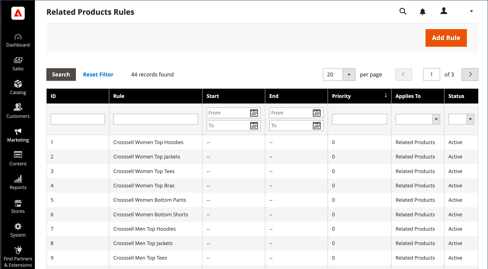

# 관련 제품 규칙(대상 규칙)

{{ee-feature}}

관련 제품 규칙을 사용하면 고객에게 관련 제품, 상향 판매 및 교차 판매로 표시되는 제품 선택을 타기팅할 수 있습니다. 각 제품 규칙을 [고객 세그먼트](../customers/customer-segments.md) 타겟팅된 머천다이징의 동적 디스플레이를 생성합니다.

여러 활성 규칙을 동시에 트리거할 수 있으므로 각 규칙에 대한 우선 순위를 설정할 수 있습니다. 규칙이 적용되고 제품이 페이지에 표시되는 순서를 정의합니다.

관련 제품 규칙에 액세스하려면 **[!UICONTROL Marketing]** > _[!UICONTROL Promotions]_>**[!UICONTROL Related Product Rules]**.

{width="700" zoomable="yes"}

## 열 설명

| 열 | 설명 |
|--- |--- |
| [!UICONTROL ID] | 관련된 각 제품 규칙에 할당된 고유 숫자 식별자입니다 |
| [!UICONTROL Rule] | 관련 제품 규칙의 이름 |
| [!UICONTROL Start] | 동적 캘린더 필드 사용(_[!UICONTROL To:]_및_[!UICONTROL From:]_) 규칙을 만들 때 정의된 규칙의 시작 날짜를 기준으로 목록을 필터링합니다. |
| [!UICONTROL End] | 동적 캘린더 필드 사용(_[!UICONTROL To:]_및_[!UICONTROL From:]_) 규칙을 만들 때 정의된 규칙의 종료 날짜를 기준으로 목록을 필터링합니다. |
| [!UICONTROL Priority] | 규칙에 대해 정의된 우선 순위를 기준으로 목록을 필터링하려면 이 필드에 텍스트를 입력합니다. |
| [!UICONTROL Applies To] | 이 옵션은 다음에 적용되는 규칙 목록을 필터링합니다. `Related Products`, `Up-sells`, 및 `Cross-sells`. |
| [!UICONTROL Status] | 이 옵션을 사용하여 규칙 상태를 기반으로 목록을 필터링합니다(`Active` 또는 `Inactive`). |

{style="table-layout:auto"}

## 규칙 우선 순위

언제든지 관련 제품, 상향 판매 및 교차 판매를 표시하기 위해 트리거할 수 있는 몇 가지 활성 규칙이 있을 수 있습니다. 각 규칙의 우선 순위는 제품이 페이지에 표시되는 순서를 결정합니다. 값은 를 사용하여 정수로 설정할 수 있습니다. `1` 가장 높은 우선 순위를 갖습니다.

제품 관계 규칙에 포함될 수 있는 제품 ID의 수는 `Result Limit` 값은 최대 20입니다. 다음 `Result Limit` 값, 와 결합 `Configurable Maximum` 특정 규칙 기반 제품 프로모션의 경우 `Real Limit`목록에 나타날 수 있는 일치하는 제품의 실제 수를 결정합니다.

[결과 제한] + [구성 가능한 최대값] = [실제 한계]

예를 들어 우선 순위가 인 규칙이 세 개 있다고 가정합니다. `1`, `2`, 및 `3`.

- 에 대해 반환된 일치하는 제품이 두 개 있습니다. _규칙 1_, 6개의 일치하는 제품 _규칙 2_&#x200B;및 20개의 일치하는 제품 _규칙 3_.
- 구성에서 _[!UICONTROL Maximum Number of Products for Related Products List]_이(가) (으)로 설정됨 `6`.

  | 규칙 | 우선 순위 | 일치하는 제품 |
  |---|---|-----|
  | 규칙 1 | `1` | `2` |
  | 규칙 2 | `2` | `6` |
  | 규칙 3 | `3` | `20` |

첫 번째 규칙이 허용하는 것보다 더 많은 일치하는 제품을 반환하는 경우 _구성 가능한 최대 한도_, 하지만 보다 작음 _실제 한계_, 다른 규칙의 일치하는 제품은 다음까지 (우선 순위 순서로) 사용됩니다. _실제 한계_ 에 도달했습니다.

우선 순위별로 일치하는 제품이에서 반환됨 _규칙 1_ 사용 가능한 26개의 슬롯을 모두 채우는 데 먼저 사용할 수 있습니다. Rule 1은 2개의 일치하는 제품만 반환했기 때문에 24개를 더 반환할 수 있는 여지가 있다. _규칙 2_ 는 다음으로 높은 우선 순위를 가지며 일치하는 6개의 제품을 더 반환합니다. 이제 18개의 슬롯을 채울 수 있습니다. _규칙 3_ 은(는) 나머지 18개의 슬롯을 채울 만큼 충분한 일치 제품과 함께 다음 수준의 우선 순위를 갖습니다. 사용 가능한 모든 슬롯이 채워지고 설정된 순환 모드에 따라 각 우선 순위 내에서 제품이 ID별로 섞이거나 순서가 지정된 다음 구성 가능한 최대 한계로 줄어들 수 있습니다. 이 경우 나머지 6개 제품이 매장에 등장한다.

>[!NOTE]
>
>선택한 제품은 회전 모드에 관계없이 항상 규칙 기반 제품 앞에 표시됩니다.

## 규칙 기반 제품 관계 구성

제품 관계 규칙의 동작과 일치하는 제품의 표시는 구성 설정에 의해 결정됩니다. 이러한 설정은 규칙과 일치하는 제품의 표시 수와 표시 순서를 결정합니다.

1. 다음에서 _관리자_ 사이드바, 이동 **[!UICONTROL Stores]** > _[!UICONTROL Settings]_>**[!UICONTROL Configuration]**.

1. 왼쪽의 패널에서 을 확장합니다. **[!UICONTROL Catalog]** 및 선택 **[!UICONTROL Catalog]** 밑에.

1. 확장  다음 **[!UICONTROL Rules-Based Product Relations]** 섹션.

   {width="600" zoomable="yes"}

1. 다음을 입력합니다. **[!UICONTROL Maximum Number of Products in the Related Products List]**.

1. 설정 **[!UICONTROL Show Related Products]** 다음 중 하나를 수행합니다.

   - `Both Selected and Rule Based`
   - `Selected Only`
   - `Rule-Based Only`

1. 설정 **[!UICONTROL Rotation Mode for Products in Related Product List]** 다음 중 하나를 수행합니다.

   - `By Priority, Then by ID`
   - `By Priority, Then Random`
   - `Weighted Random`

1. 크로스셀 제품 설정을 완료하려면 다음을 수행합니다.

   - 다음을 입력합니다. **[!UICONTROL Maximum Number of Products in the Cross-Sell Product List]**.

   - 설정 **[!UICONTROL Show Cross-Sell Products]** 다음 중 하나를 수행합니다.

      - `Both Selected and Rule Based`
      - `Selected Only`
      - `Rule-Based Only`

   - 설정 **[!UICONTROL Rotation Mode for Products in Cross-Sell Product List]** 다음 중 하나를 수행합니다.

      - `By Priority, Then by ID`
      - `By Priority, Then Random`
      - `Weighted Random`

1. 상향 판매 제품 설정을 완료하려면 다음을 수행하십시오.

   - 다음을 입력합니다. **[!UICONTROL Maximum Number of Products in the Upsell Product List]**.

   - 설정 **[!UICONTROL Show Upsell Products]** 다음 중 하나를 수행합니다.

      - `Both Selected and Rule Based`
      - `Selected Only`
      - `Rule-Based Only`

   - 설정 **[!UICONTROL Rotation Mode for Products in Upsell Product List]** 다음 중 하나를 수행합니다.

      - `By Priority, Then by ID`
      - `By Priority, Then Random`
      - `Weighted Random`

1. 완료되면 다음을 클릭하십시오. **[!UICONTROL Save Config]**.

### 회전 모드

| 모드 | 설명 |
|---|---|
| [!UICONTROL By Priority, Then by ID] | 제품은 우선 순위별로 정렬된 다음 각 우선 순위 내의 ID별로 재정렬됩니다. 낮은 우선 순위 규칙의 제품은 높은 우선 순위 규칙에서 사용 가능한 슬롯을 채우도록 남은 제품이 없는 경우에만 표시됩니다. |
| [!UICONTROL By Priority, Then Random] | 제품은 우선 순위별로 정렬된 다음 각 우선 순위 내에서 무작위적으로 정렬됩니다. 낮은 우선 순위 규칙의 제품은 높은 우선 순위 규칙에서 사용 가능한 슬롯을 채우도록 남은 제품이 없는 경우에만 표시됩니다. |
| [!UICONTROL Weighted Random] | 우선 순위가 높은 규칙에 속한 제품이 우선 순위가 낮은 규칙에 속한 제품보다 출현 확률이 높도록 제품을 무작위화한다. 그런 다음 구성 가능한 최대 한도로 제품이 축소되고 우선 순위별로 다시 그룹화됩니다. 이 모드에서는 남은 슬롯이 더 높은 우선 순위의 규칙의 제품으로 채워질 수 있더라도 낮은 우선 순위의 제품이 때때로 나타날 수 있습니다 |

{style="table-layout:auto"}
