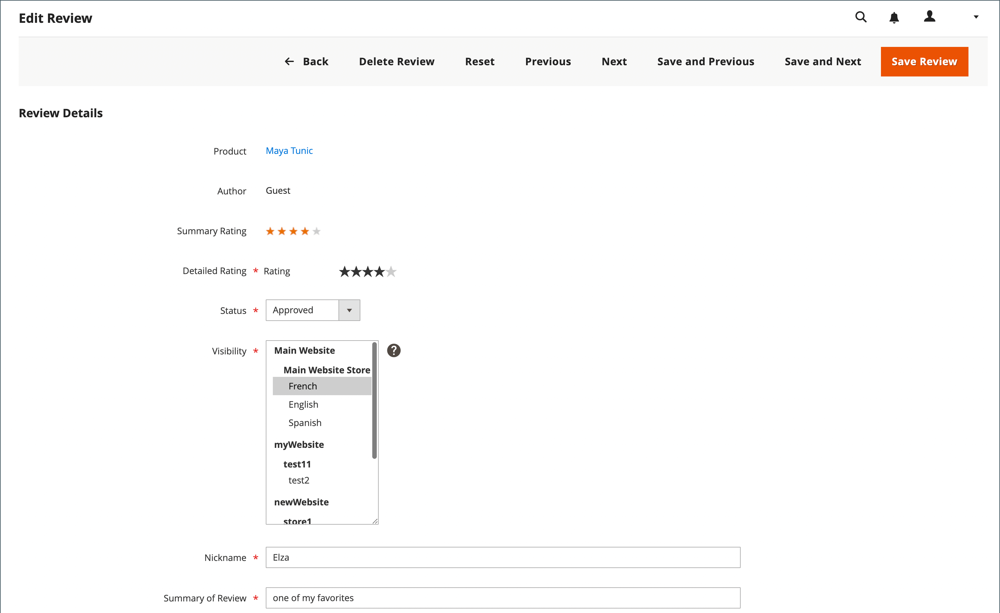

# 제품 리뷰 중재

Commerce 제품 검토의 경우 제출된 제품 검토를 승인해야 표시할 수 있습니다. 이렇게 하면 리뷰가 스토어를 공개적으로 표시하는 데 적절합니다. 제출된 검토는 승인 또는 거부될 때까지 `Pending` 상태입니다.

## 관리자에서 제품 리뷰 보기

관리자의 특정 제품에 대한 모든 리뷰를 보려면 다음을 수행하십시오.

1. _관리자_ 사이드바에서 **[!UICONTROL Catalog]** > **[!UICONTROL Products]**(으)로 이동합니다.

1. 보려는 제품을 찾은 다음 _[!UICONTROL Action]_열에서&#x200B;**[!UICONTROL Edit]**을(를) 클릭합니다.

1. 제품 페이지에서 아래로 스크롤하여 **[!UICONTROL Product Reviews]** 섹션에서 를 확장합니다.

   이 표에서 _[!UICONTROL Action]_열의&#x200B;**[!UICONTROL Edit]**링크를 클릭하여 특정 검토를 변경할 수도 있습니다.

## 리뷰 상태 업데이트

1. _관리자_ 사이드바에서 **[!UICONTROL Marketing]** > _[!UICONTROL User Content]_>**[!UICONTROL Pending Reviews]**또는&#x200B;**[!UICONTROL All Reviews]**(으)로 이동합니다.

1. 목록에서 보류 중인 검토를 클릭하여 세부 정보를 보고 필요한 경우 편집합니다.

1. 평가에 따라 **[!UICONTROL Status]**&#x200B;을(를) 변경합니다.

   - 보류 중인 검토를 승인하려면 `Approved`을(를) 선택하십시오.

   - 검토를 거부하려면 `Not Approved`을(를) 선택하십시오. 승인되지 않은 리뷰가 _[!UICONTROL Pending Reviews]_페이지 목록에서 사라집니다.

   >[!NOTE]
   >
   >`Pending` 및 `Not Approved` 상태의 리뷰는 상점 앞에 표시되지 않습니다.

1. 해당되는 경우 다른 스토어 보기에 표시할 제품 리뷰의 **[!UICONTROL Visibility]**&#x200B;을(를) 설정하십시오.

1. 필요한 경우 **[!UICONTROL Detailed Rating]**, **[!UICONTROL Nickname]** 및 **[!UICONTROL Summary of Review]**&#x200B;의 값을 변경합니다.

   검토를 사용할 수 있는 저장소 보기를 변경하려면 _[!UICONTROL Visibility]_열에서 필요한 저장소 보기를 선택하십시오.

   {width="600" zoomable="yes"}

1. 완료되면 **[!UICONTROL Save Review]**&#x200B;을(를) 클릭합니다.

## 일괄 업데이트

여러 검토를 동시에 업데이트하거나 삭제할 수 있습니다.

1. _관리자_ 사이드바에서 **[!UICONTROL Marketing]** > _[!UICONTROL User Content]_>**[!UICONTROL All Reviews]**(으)로 이동합니다.

1. 업데이트할 리뷰를 선택합니다.

1. 왼쪽 상단 모서리의 _[!UICONTROL Action]_선택기를 사용하여 작업을 적용하십시오.

1. **[!UICONTROL Submit]** 클릭

## 제품 리뷰 삭제

1. _관리자_ 사이드바에서 **[!UICONTROL Marketing]** > _[!UICONTROL User Content]_>**[!UICONTROL All Reviews]**(으)로 이동합니다.

1. 삭제할 제품 검토를 찾아 편집 모드로 엽니다.

1. 메뉴 모음에서 **[!UICONTROL Delete Review]** 단추를 클릭합니다.

1. 작업을 확인하려면 **[!UICONTROL OK]**&#x200B;을(를) 클릭합니다.

## 단추 막대

| 단추 | 설명 |
|----------|--------------|
| **[!UICONTROL Back]** | 변경 사항을 저장하지 않고 검토 페이지로 돌아갑니다. |
| **[!UICONTROL Delete Review]** | 리뷰를 삭제합니다. |
| **[!UICONTROL Reset]** | 검토 양식의 저장하지 않은 변경 사항을 이전 값으로 재설정합니다. |
| **[!UICONTROL Previous]** | 이전 리뷰를 엽니다. |
| **[!UICONTROL Next]** | 다음 검토 열기 |
| **[!UICONTROL Save and Previous]** | 현재 변경 사항을 저장하고 이전 검토를 엽니다. 다른 리뷰가 있는 경우 이 버튼이 표시됩니다. |
| **[!UICONTROL Save and Next]** | 현재 변경 내용을 저장하고 다음 보기를 엽니다. 다른 리뷰가 있는 경우 이 버튼이 표시됩니다. |
| **[!UICONTROL Save Review]** | 변경 사항을 저장하고 검토 편집 페이지를 닫습니다. |
