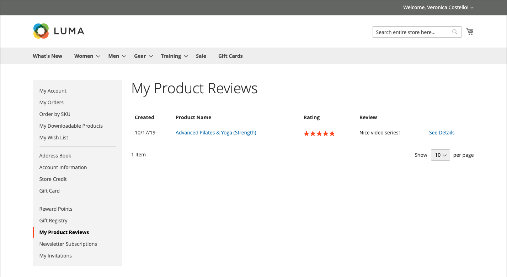
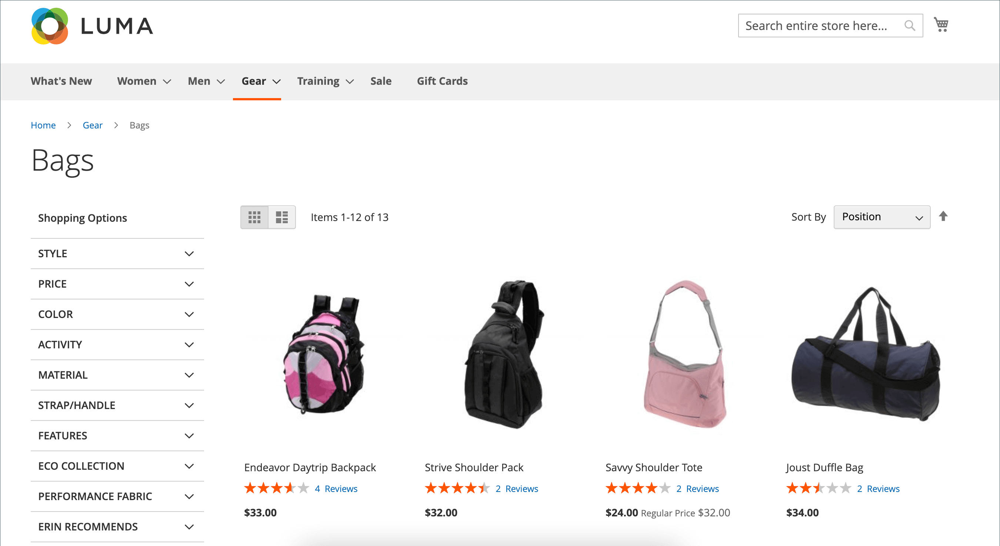

# 제품 리뷰

제품 리뷰는 공동체 의식을 구축하는 데 도움이 되며, 어떤 광고 자금도 구입할 수 있는 것보다 더 신뢰할 수 있는 것으로 간주됩니다. 실제로 일부 검색 엔진은 제품 리뷰가 있는 사이트가 없는 사이트보다 높은 순위를 제공합니다. 특정 제품을 검색하여 사이트를 찾는 사용자의 경우 제품 리뷰는 기본적으로 스토어의 랜딩 페이지입니다. 제품 리뷰는 사람들이 스토어를 찾고, 계속 참여하며, 종종 판매로 이어지는 데 도움이 됩니다.

Commerce에는 관리자로부터 관리할 수 있는 기본 제품 검토 기능이 포함되어 있습니다. [Commerce Marketplace](../getting-started/commerce-marketplace.md)에서 확장을 사용하여 호스팅된 검토 관리 시스템을 사용할 수도 있습니다.

>[!NOTE]
>
>Adobe Commerce 및 Magento Open Source 릴리스 2.4.0부터 2.4.3까지는 Yotpo 공급업체가 개발한 확장 프로그램이 포함되었습니다. 2.4.4 릴리스부터 이 확장은 더 이상 핵심 릴리스와 번들로 제공되지 않으며 Commerce Marketplace에서 설치하고 업데이트해야 합니다. Marketplace에서는 확장 개발자가 제공하는 현재 설명서에 대한 액세스도 제공합니다.
>  
>번들 확장을 활성화하고 구성한 경우 2.4.4 업그레이드 프로세스의 일부로 composer.json 파일을 업데이트하고 앞으로 확장 업데이트를 관리해야 합니다. 자세한 내용은 _업그레이드 안내서_&#x200B;의 [업그레이드 모듈](https://experienceleague.adobe.com/docs/commerce-operations/upgrade-guide/modules/upgrade.html?lang=ko)을 참조하십시오.

## 상점 첫 화면에서 제품 리뷰

기본 제품 검토 기능이 활성화되면 고객은 카탈로그에 있는 모든 제품에 대한 검토를 작성할 수 있습니다. 제품 페이지에서 다음을 클릭하여 검토를 작성할 수 있습니다.

- 기존 리뷰가 있는 제품에 대해 **리뷰를 추가**&#x200B;합니다.

- **이 제품을 처음 검토해 보세요** 기존 검토가 없는 제품에 대해.

[!UICONTROL Reviews] 탭에는 현재 리뷰와 리뷰를 제출하는 데 사용된 양식이 모두 나열됩니다.

구성은 고객이 제품 리뷰를 작성하기 전에 스토어에 계정을 개설해야 하는지 또는 게스트로 리뷰를 제출할 수 있는지를 결정합니다. 검토자가 계정을 열도록 하면 익명의 제출이 방지되고 검토 품질이 향상됩니다.

{width="700" zoomable="yes"}

별의 수는 제품의 만족도를 나타냅니다. 방문자는 링크를 클릭하여 리뷰를 읽고 직접 작성할 수 있습니다. 인센티브로 고객은 리뷰 제출 시 리워드 포인트를 받을 수 있다. 리뷰를 제출하면 관리자가 조정을 하도록 전송됩니다. 승인되면 리뷰가 스토어에 게시됩니다.

{width="700" zoomable="yes"}

### [!UICONTROL My Product Reviews]

고객 계정 대시보드의 _[!UICONTROL My Product Reviews]_&#x200B;섹션에는 고객이 제출하고 게시가 승인된 모든 검토가 나열됩니다. 각 검토 요약에는 검토가 제출된 날짜, 제품 페이지 링크 및 검토 세부 사항이 포함됩니다.

{width="700" zoomable="yes"}

1. 계정의 사이드바에서 고객이 **[!UICONTROL My Product Reviews]**&#x200B;을(를) 선택합니다.

1. 전체 검토를 보려면 **[!UICONTROL See Details]**&#x200B;을(를) 클릭합니다.

   {width="700" zoomable="yes"}

## 제품 리뷰 기능 활성화

Commerce 제품 검토 기능은 기본적으로 활성화되어 있습니다.

>[!NOTE]
>
>이러한 필드를 `No`(으)로 설정하고 Commerce 제품 검토를 비활성화하려면 **시스템 값 사용** 확인란을 지워야 합니다.

1. _관리자_ 사이드바에서 **[!UICONTROL Stores]** > _[!UICONTROL Settings]_>**[!UICONTROL Configuration]**(으)로 이동합니다.

1. 왼쪽 패널에서 **[!UICONTROL Catalog]**&#x200B;을(를) 확장하고 아래의 **[!UICONTROL Catalog]**&#x200B;을(를) 선택합니다.

1. **[!UICONTROL Product Reviews]** 섹션에서 를 확장합니다.

   {width="600" zoomable="yes"}

1. **[!UICONTROL Enabled]**&#x200B;을(를) `Yes`(으)로 설정합니다.

   제품 검토를 활성화하는 기본 설정입니다.

1. **[!UICONTROL Allow Guests to Write Reviews]**&#x200B;을(를) `Yes`(으)로 설정합니다.

   고객이 제품 리뷰를 작성할 수 있도록 스토어에 계정을 열어야 하는지 여부를 결정하는 기본 설정입니다.

1. 완료되면 **[!UICONTROL Save Config]**&#x200B;을(를) 클릭합니다.

## 사용자 지정 등급 만들기

Commerce 제품 검토를 사용하면 고객이 제품 검토를 제출할 때 등급을 지정할 수 있습니다. 기본 등급은 품질, 가격 및 값입니다. 이 외에도 사용자 지정 등급을 추가할 수 있습니다. 카탈로그 페이지에 나타나는 별 5개 등급은 각 제품에 대해 평균입니다.

{width="700" zoomable="yes"}

1. _관리자_ 사이드바에서 **[!UICONTROL Stores]** > _[!UICONTROL Attributes]_>**[!UICONTROL Rating]**(으)로 이동합니다.

1. 오른쪽 상단에서 **[!UICONTROL Add New Rating]**&#x200B;을(를) 클릭합니다.

   {width="700" zoomable="yes"}

1. _[!UICONTROL Rating Title]_&#x200B;섹션에서 새 등급에 대한&#x200B;**[!UICONTROL Default Value]**&#x200B;을(를) 입력합니다.

   해당하는 경우 각 스토어 보기에 대한 번역도 입력합니다.

   {width="600" zoomable="yes"}

1. _등급 가시성_ 섹션에서 등급을 사용할 스토어 보기로 **[!UICONTROL Visibility In]**&#x200B;을(를) 설정합니다.

   여러 저장소 보기를 선택하려면 Ctrl 키(PC) 또는 Command 키(Mac)를 누른 채 각 항목을 클릭합니다.

   >[!NOTE]
   >
   >스토어 보기에 할당되지 않으면 등급이 표시되지 않습니다.

1. **[!UICONTROL Sort Order]**&#x200B;의 경우 다른 항목과 함께 나열할 때 숫자를 입력하여 이 등급의 순서를 결정합니다.

1. 점포에 등급을 표시하려면 **[!UICONTROL Is Active]** 확인란을 선택하십시오.

   {width="600" zoomable="yes"}

1. 완료되면 **[!UICONTROL Save Rating]**&#x200B;을(를) 클릭합니다.

   모든 리뷰에 대한 평균 등급이 카탈로그 제품 격자 페이지에 각 제품에 대해 표시됩니다.

   {width="700" zoomable="yes"}
