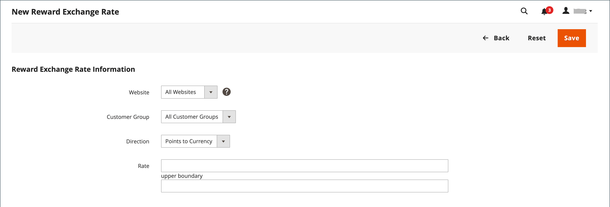

# 보상 환율

{{ee-feature}}

보상 환율은 주문 금액에 따라 적립되는 포인트 수 및 적립되는 포인트 값을 결정합니다. 다른 환율은 다른 웹 사이트 및 다른 고객 그룹에 적용될 수 있습니다. 서로 다른 웹 사이트 및 고객 그룹의 여러 환율이 동일한 고객에게 적용되는 경우 다음 우선 순위 규칙이 적용됩니다.

## 환율 우선 순위

**1**: 특정 웹 사이트 및 특정 고객 그룹에 적용됩니다.

**2**: 모든 웹 사이트 및 특정 고객 그룹에 적용됩니다.

**3**: 특정 웹 사이트 및 모든 고객 그룹에 적용됩니다.

**4**: 모든 웹 사이트 및 모든 고객 그룹에 적용됩니다.

통화를 포인트로 전환할 때 포인트 수를 나눌 수 없습니다. 모든 통화 나머지는 내림차순으로 계산됩니다. 예를 들어 $2.00가 10포인트로 전환되면 $2.00 그룹으로 포인트가 적립됩니다. 따라서 7.00달러 주문하면 30포인트가 적립되고 나머지 1.00달러는 반올림됩니다. 주문금액은 가맹점이 받은 금액 또는 총액에서 배송, 세금, 할인, 매장 신용, 기프트 카드 등을 뺀 금액으로 정의된다. 포인트는 주문서에 청구되지 않은 항목이 없는 즉시 획득됩니다(모든 항목은 지불 또는 취소됨). 관리자 사용자가 고객이 취소된 주문에 대한 보상 포인트를 적립하도록 허용하지 않으려는 경우 해당 포인트를 고객 관리 페이지에서 수동으로 공제할 수 있습니다.

## 환율 설정

{width="700" zoomable="yes"}

1. _관리자_ 사이드바에서 **[!UICONTROL Stores]** > _[!UICONTROL Other Settings]_>**[!UICONTROL Reward Exchange Rates]**(으)로 이동합니다.

1. 오른쪽 상단에서 **[!UICONTROL Add New Rate]**&#x200B;을(를) 클릭합니다.

1. **[!UICONTROL Reward Exchange Rate Information]** 섹션에서 다음을 수행합니다.

   {width="600" zoomable="yes"}

   - 보상 환율이 적용되는 사이트로 **[!UICONTROL Website]**&#x200B;을(를) 설정합니다.

   - 보상 환율이 적용되는 그룹에 **[!UICONTROL Customer Group]**&#x200B;을(를) 설정합니다.

   - **[!UICONTROL Direction]**&#x200B;을(를) 다음 중 하나로 설정합니다.

      - `Points to Currency`
      - `Currency to Points`

   어느 방향 설정이든 금액은 웹 사이트의 기본 통화로 표시됩니다.

1. _[!UICONTROL Direction]_설정에 따라&#x200B;**[!UICONTROL Rate]**값을 입력하십시오.

   | 방향 | 비율 설정 |
   |---------|-------------|
   | [!UICONTROL Points to Currency] | 첫 번째 _[!UICONTROL Rate]_필드에 포인트 수를 입력합니다. 두 번째_[!UICONTROL Rate]_ 필드에 포인트의 통화 값을 입력합니다. |
   | [!UICONTROL Currency to Points] | 첫 _[!UICONTROL Rate]_필드에 통화 값을 입력합니다. 두 번째_[!UICONTROL Rate]_ 필드에 통화 값으로 표현되는 포인트 수를 입력합니다. |

   포인트를 통화로 변환할 때 포인트 수를 나눌 수 없습니다. 예를 들어 10포인트가 $2.00로 변환되면 10씩 그룹으로 나누어 포인트를 상환해야 합니다. 따라서 25포인트는 4.00달러에 상환되며 고객의 잔액에는 5포인트가 남아 있습니다.

   `Points to Currency`과(와) `Currency to Points` 모두에 대해 변환을 설정하는 것이 좋습니다.

1. 완료되면 **[!UICONTROL Save]**&#x200B;을(를) 클릭합니다.

## 보상 환율 삭제

1. _관리자_ 사이드바에서 **[!UICONTROL Stores]** > _[!UICONTROL Other Settings]_>**[!UICONTROL Reward Exchange Rates]**(으)로 이동합니다.

1. 삭제할 보상 환율을 찾아 편집 모드로 엽니다.

1. 메뉴 모음에서 **[!UICONTROL Delete]**&#x200B;을(를) 클릭합니다.

1. 작업을 확인하려면 **[!UICONTROL OK]**&#x200B;을(를) 클릭합니다.

## 필드 설명

| 필드 | 설명 |
|--- |--- |
| [!UICONTROL Website] | 보상 비율이 적용되는 웹 사이트입니다. |
| [!UICONTROL Customer Group] | 보상 비율이 적용되는 고객 그룹입니다. |
| [!UICONTROL Direction] | 환율이 정의하는 거래 유형을 결정합니다. 옵션:  **[!UICONTROL Points to Currency]**- 주문 금액에 대한 크레딧으로 적용할 수 있는 포인트 수를 정의합니다. 첫 번째 _[!UICONTROL Rate]_필드에 포인트 수를 입력합니다. 두 번째_[!UICONTROL Rate]_ 필드에 포인트의 통화 값을 입력합니다. **[!UICONTROL Currency to Points]** - 고객 점수를 획득할 수 있는 주문 양을 정의합니다. 첫 _[!UICONTROL Rate]_필드에 통화 값을 입력합니다. 두 번째_[!UICONTROL Rate]_ 필드에 통화 값으로 표현되는 포인트 수를 입력합니다. |
