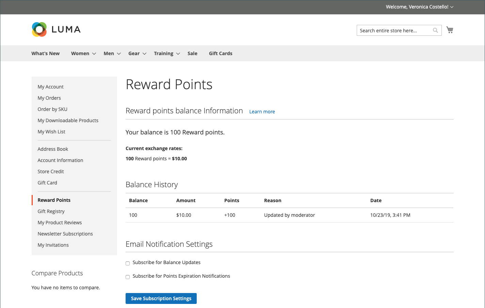

# 상점 첫 경험 보상

{{ee-feature}}

다음 [보상 점수](rewards-loyalty.md) 고객 계정의 섹션은 고객이 획득한 보상 포인트의 현재 잔액과 보상 포인트 잔액의 내역을 보여 줍니다.

{width="700" zoomable="yes"}

## 체크아웃 중 보상 포인트 사용

If [보상 환율](reward-exchange-rates.md) 포함 `Points to Currency` direction이 구성되면 고객은 체크아웃 중에 보상 포인트를 사용할 수 있습니다.

1. 필요한 모든 제품을 장바구니에 추가한 후 고객이 체크아웃으로 이동합니다.

1. 필요한 모든 배송 정보를 입력하고 다음으로 이동 _검토 및 결제_ 단계.

1. 다음에서 _[!UICONTROL Reward points]_섹션에서 사용 가능한 포인트의 수와 해당 통화 값을 확인합니다.

1. 클릭수 **[!UICONTROL Use reward points]**.

{width="700" zoomable="yes"}

사용 가능한 포인트 할인은 소계에 적용됩니다.

>[!NOTE]
>
>사용 가능한 잔액이 주문 총액보다 큰 경우 다른 결제 방법이 필요하지 않습니다.
